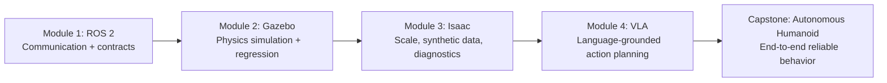

# Welcome to Physical AI & Humanoid Robotics

## 🌍 Real World Scenario

Yeh 2026 hai. Figure 02 robot ek hospital kitchen mein aata hai. Ek nurse kaha, "Room 4 mein medicine laao." Robot samajh jata hai, navigates karta hai, tray uthata hai aur use deliver karta hai — koi programming ki zaroorat nahin hai. Yeh yehi banana hai jo aap seekh rahe hain.

کوئی سچ مچ کہانی نہیں تھی، جس میں ربات نے صرف "کلمات" سن کر ایک ہارڈ کورڈ میکر کو چلا دیا۔ یہ ربات نے ہنگامے کی حالت میں بات چیت کی، انسانی حکم کے معنی کو حل کیا، اس معنی کو جسمانی ماحول سے منسلک کیا، محفوظ حرکات کو منتخب کیا، عدم یقین کے ساتھ سازگار ہوا، اور ایک انسان کے اعتماد کے مطابق کام کیا۔ یہ Physical AI کا حقیقی وعدہ ہے: نہ صرف وہ ذہانت جو دلیل دے سکتی

ایسے خوش آمدید کے باب میں، آپ اپنی پوری ٹیکسٹ بک کے سفر کے لیے ذہنی ماڈل بنائیں گے۔ آپ کو اس فیلڈ سے روایتی آئی ایس کے کیا فرق ہے، humanoid شکل کا کیا اہمیت ہے اور آپ کی سیکوئنس کو سسٹم کی بنیاد سے ہائی لیول اتھارٹی تک کیوں منظم کیا گیا ہے۔

## What You Will Learn

- Why Physical AI is fundamentally different from traditional digital AI in failure modes, design constraints, and engineering discipline.
- Why humanoid robots are not just “cool demos,” but a serious response to human-shaped infrastructure and human-generated data.
- Why your 14-week sequence follows ROS 2 → Gazebo → Isaac → VLA, and how each layer enables the next.
- How to reason about the gap between ChatGPT-style language intelligence and safe, real-world robot behavior.
- What Figure AI, Boston Dynamics, and Tesla Optimus have achieved—and why their progress changes your career timing right now.

## From Digital to Physical: The Great Leap

شروع کرنے کے لئے فزیکل ای آئی کا سمجھنا، ایک سادہ تضاد سے شروع کریں۔

ایک روایتی ایم آئی ماڈل بہت ہی بہتر ہو سکتا ہے جبکہ یہ مکمل طور پر ڈیجیٹل رہتا ہے۔ یہ چیس کھیل سکتا ہے، قانونی دستاویزات کو خلاصہ کر سکتا ہے، یا سافٹ ویئر آرکٹیکچر کی تجاویز لکھ سکتا ہے۔ اس کی غلطیاں عام طور پر واپس لینے کے قابل ہوتی ہیں: ایک بری سند، ایک غلط پیش گوئی، ایک تصوراتی حوالہ۔

Aik chess AI vs ek robot jo aapke ghar ke living room mein aap ke khilaf chess khelta hai.

ایک چیس انجن کو صرف بہترین حرکت کو ایک متبادل بورڈ سٹیٹ پر فیصلہ کرنے کی ضرورت ہے۔ ایک فزیکل چیس پلیئنگ ربات کو بہت زیادہ کرنا پڑتا ہے۔ اسے بورڈ کو بصری طور پر محسوس کرنا ہوتا ہے، اگر ایک پीस بھی اپنی ہاتھ کی وجہ سے مکمل طور پر چھپا ہوا ہے تو پوسیشن کو استنباط کرنا ہوتا ہے، 3D اسپیس میں ہاتھ کو مووم کرنا ہوتا ہے تاکہ

وہ اہم گھاٹا یہ ہے: سمبولک استدلال سے جسمانی ذہانت تک.

Yehi hai woh jagah jahan se logon ko ChatGPT aur robotics ke beech ki rishtedaari samajhne mein mushkil hoti hai. ChatGPT jaisi systems bahut hi majboot language engines hain. Ve plan kar sakte hain, explain kar sakte hain, aur intent ko samjh sakte hain. Lekin ve abhi bhi digital brains hain. Ek robot ko digital brain *plus* physical body *plus* ek continuous perception-control loop ki zaroorat hoti hai.

جب آپ کا ربات کوئی حکم پاتا ہے تو آپ کا نظام وقت پر عملی سوالات کا جواب دے گا:

- Is the camera feed fresh enough to trust?
- Is the action physically feasible for this joint state?
- Is the path safe around humans and obstacles?
- What fallback should execute if uncertainty spikes?

Software-only products mein ashaat aur nateeja qabool ho sakte hain. Fiziki AI mein ashaat karyon ko raksha railon ki zaroorat hoti hai.

فزیکی نتیجے حقیقی نتیجے ہیں
Web apps میں bugs بہت ناگوار ہو سکتے ہیں۔  ربوٹکس میں bugs ہارڈویئر کو ٹوٹنے، آپریشنز کو روکنے، یا لوگوں کو خطرے میں ڈالنے کا باعث بن سکتے ہیں۔ آپ صرف خصوصیات شپ کرنے کے بجائے، خطرے کے تحت سلوک کو انجینئر کر رہے ہیں۔
:::

kyonkہ اس کے لیے فزیکل ای آئی کے لیے مضبوط نظام کے سوچنے کی ضرورت ہے جس سے عام ایپ ڈویلپمنٹ کے مقابلے میں۔ آپ کو نتیجہ خیز انٹرفیس کی ضرورت ہے، ہدایت شدہ لٹنسی، ظاہری سلامتی کے حدود، اور واضح فیلر ری کوویری پیتھز۔ یہ کتاب اس ذہنیت کو تربیت دینے کے لیے ڈیزائن کی گئی ہے۔

## Why Humanoid Robots, Specifically?

یہ قدرتی سوال ہے: اگر ہنر مند ربوٹکس موجود ہیں تو، humanoid کی موجودہ لہر میں کیا وجہ ہے؟

جواب یہ نہیں ہے کہ ہائیپ ہے۔ یہ Compatibility ہے۔

مردوں کے ماحول انسان کی جسمانی ساخت کے گرد ڈیزائن کیا گیا ہے۔ دروازوں کے ہینڈلز، اسٹائرس، شیلف کی اونچائی، ٹول گریپس، کچن کاؤنٹرز، ہسپتال کی گاڑیاں، اور وارہاؤس کی Workflow سبھی ایک دو بازو والا، اٹھا ہوا اداکار سمجھتے ہیں جو ہاتھ کی طرح کے اندرونی اثرات کے ساتھ ہے۔ ایک ربات جو اس شکل کا حصہ ہے وہ موجودہ انفر

ایک مشین لرننگ کی وجہ بھی ہے۔ زیادہ تر مہیا کردہ براہ راست ہیومن ڈیٹا ہے: ویڈیوز، ڈیمونسٹریشنز، پروسیجرل انسٹرکشنز، اور ٹیلی اوپریشن ٹریسز۔ اگر آپ کا ربات کا جسم تقریباً ہیومن کائنیمیکس کے مطابق ہے، تو ڈیٹا کو منتقل کرنا آسان ہو جاتا ہے۔ آپ ہیومن کی حرکت سے سیکھ سکتے ہیں، صرف سائنیتھک کنٹ

مردانہ ہیومینز کو انجینئر کرنا مشکل ہے—بلنس، پاور مینجمنٹ، ڈیکسٹرس مینیپولیٹن، اور سافٹی ہر ایک مشکل مسئلہ ہے۔ لیکن اگر آپ کا مقصد وسیع، متعدد ڈومین کی صلاحیت ہے، تو مردانہ ہیومینز ایک حقیقی راستہ فراہم کرتے ہیں۔

شروعاتی ٹیپ
Jab robot ke form factors ko muzzakkar kar rahe hain, do sawal poochhein: "Yeh kya hai ki yeh insaanon ke aas-paas kaam kar sakta hai bina koi badi modifikashan ke?" aur "Yeh kya hai ki yeh insaanon ki adat ki data se kafi effectively seekh sakta hai?"
:::

یہی وجہ ہے کہ ٹیموں کے سربراہ humanoid نظاموں کو ترجیح دیتے ہیں حالانکہ ان کی پیچیدگی ہے۔ وہ مختصر مدت میں Mechanic Simplcity کے بجائے طویل مدت میں Deployment Flexibility کے لیے آپٹمائز کر رہے ہیں۔

## Your 14-Week Journey

آپ کا نصاب ROS 2 → Gazebo → Isaac → VLA کے لیے ہے: انٹگرٹی ڈیپنڈنسی کے لیے ایک وجہ.

آپ ROS 2 سے شروع کرتے ہیں کیونکہ تعاون پہلے آتا ہے۔ اپنے ربات کو "سوچنا" سے پہلے، اس کے ذیلی نظاموں کو قابل اعتماد طریقے سے بات چیت کرنا ہوتی ہے۔ کیمرے، IMUs، پلانرز، کنٹرولرز، اور سیکیورٹی مونٹرز کو ڈیٹا کے تبادلے کے لیے قابل پیشانی کے وقت کے ساتھ ڈیٹا کا تبادلہ کرنا ہوتا ہے۔ ROS 2 آپ کو اس تقسیم شدہ اعصابی

Aap phir **Gazebo** mein chale jate hain kyunki surakshit iteration ki zaroorat hardware exposure se pehle hoti hai. Gazebo aapko controlled physics ke under test karna, deterministic scenarios chalana, aur mahango real-world mistakes se bachne ka mauka deta hai. Acha simulation ka adab aapko mahango real-world mistakes se bachne ka mauka deta hai.

Aagay **Isaac** aata hai kyunki aakar aur waqiaiyat bottlenecks ban jaati hain. Isaac ecosystems aapko badi synthetic datasets generate karne, perception stacks par stress daalne, aur policies ko broader variation ke tahaan train karne mein madad karte hain. Yeh woh jagah hai jahan aap sim-to-real transfer ko production-relevant scale par address karne lagte hain.

Aakhirkar aap **VLA (Vision-Language-Action)** seekhne lagte hain kyunki semantic reasoning ko apne control substrate ko stable karne ke baad add karna chahiye. VLA aapke robot ko language aur visual context ko grounded actions tak map karne ki kshamta deti hai - lekin yeh sirf tab hi kaam karta hai jab middleware, sensing, aur safety layers alag-alag trustworthy hote hain.

یہ حکم ہے جیسا کہ سرجری سیکھنا: اناٹومی پہلے، کنٹرولڈ پریکٹس دوسرا، پیش رفتہ ٹولز تیسرا، جاندار مہارتوں کے بعد.



پرو انسائٹ
جوکے زیادہ تر ربوٹکس پروجیکٹز کی ناکامی انٹیگریشن ڈیٹ سے ہوتی ہے، نہ ہی ماڈل کی پیچیدگی کی کمی سے۔ اس ماڈیول کی ترتیب ایک اینٹی-کہو سٹریٹیج ہے: استحکام انٹرفیسز کو پہلے، پھر اسکیل، پھر سمجھ کے ساتھ اضافہ کریں۔
:::

آپ کو ایک عام غلطی ہو سکتی ہے
Jamp kar ke LLM-driven demos mein jana bina strong middleware aur simulation discipline ke beech, kamjor system banata hai jo ek baar impressive dikhta hai aur repeat testing ke dauran fail hota hai.
:::

## The Industry Is Moving Fast: Why Timing Matters

آپ اس وقت اس علم کو سیکھ رہے ہیں جب یہ انتہائی اہم ہے۔

Figure AI نے بہت زیادہ قابل humanoid حرکات کو زبان سے متعلقہ ہدایات کی تعمیل اور عملی مینوفیکچرنگ سے متعلقہ سہولتیں دکھائی ہیں۔ یہ معاملہ اہم ہے کیونکہ یہ ثابت کر رہا ہے کہ سماجی استدلال اور جسم کی کنٹرول اب حقیقی ورک فلو میں متحد ہو رہے ہیں، نہ کہ جزوی تحقیقاتی ماڈلز۔

Boston Dynamics ہمیشہ بھی ڈائنامک موبلٹی، بیلنس ری کووری، اور پریسیژن کنٹرول میں چیلنجنگ موشن ٹاسک کے لیے معیار قائم کر رہا ہے۔ یہ معاملہ اہم ہے کیونکہ ہائی لیول انٹیلی جنس بے کار ہے اگر لَو لیول کنٹرول نہیں کر سکتا کہ وہ فزیکل بہاو کو سیکیور بنائے۔

ٹیسلا اپٹیمس اس کی جانب بڑھ رہا ہے کہ ہارڈویئر مینوفیکچرنگ اسٹریٹیجی کو ای آئی سافٹ ویئر انٹیگریشن کے ساتھ جوڑ کر۔ یہ معاملہ اہم ہے کیونکہ فزیکل ای آئی نہیں ہی چھوٹے پیمانے پر انڈسٹریز کو بدل سکتی ہے، یہ انڈسٹریز کو بدلتی ہے جب نظاموں کو واپس آؤٹ، برقرار رکھنے میں آسان، اور معاشی طور پر واپس

ایک ساتھ، یہ کمپنیاں ایک پتہ لگائی ہوئی پیمائش کی طرف اشارہ کرتی ہیں جو آپ کو اپنائی چاہئے: کامیاب اسٹیک کی وجہ نہ صرف "سرفہرست ماڈل ہی ہے۔" یہ ہے سسٹم آرکٹیکچر + سافٹی + ڈپلومنٹ ڈسسیپلن.

Aapki faida yeh hai ki aap is base ko zaroorat se pehle ban sakte hain, jab kayi teams embodied AI ko side project ke roop mein samajhte hain. Market mein engineers ki zaroorat hai jo language models ko actuators se safely connect kar sakte hain. Yehi yeh textbook aapko sikha raha hai.

## 💡 Key Concepts Summary

| Concept | Meaning | Real example |
|---|---|---|
| Physical AI | Intelligence that must act under real-world physics and safety constraints | Robot adjusts grip force while carrying a medicine tray |
| Embodiment gap | Difference between digital reasoning and physical execution | LLM suggests “pick up cup,” controller computes feasible joint trajectory |
| Humanoid interoperability | Human-like body works in human-designed spaces | Robot uses hallway door and standard-height counter |
| Layered learning path | Build communication, then simulation, then scale, then cognition | ROS 2 stability enables reliable VLA execution later |

## 🧪 Practice Exercises

### Exercise 1 (Beginner)
Kya ek smart language model hi kafi hai robot ko surakshit banane ke liye?

Ek smart language model robot ko kuchh mahatvapurn karyon mein madad kar sakta hai, jaise ki sensor data ka analysis, decision making, aur action planning. Lekin, yeh koi bhi robot ko surakshit banane ke liye kafi nahin hai.

Robot ko surakshit banane ke liye kai sharton ka palan karna hota hai. Pehla, robot ko apne aas-paas ki duniya ko samajhne ke liye sensoron ki aavashyakta hoti hai. LiDAR, camera, aur microphone jaise sensor robot ko apne aas-paas ki duniya ko samajhne mein madad karte hain.

Dusra, robot ko apne aas-paas ke logon

```python
# Starter skeleton: structure your reflection points first.
constraints = [
    "constraint_1",
    "constraint_2",
    "constraint_3",
]
for c in constraints:
    print("Explain with a real robot example:", c)
```

### Exercise 2 (Intermediate)
**Module 1: ROS2 Fundamentals (Weeks 1-2)**

- **Week 1: ROS2 Installation and Setup**
  - Measurable Output: Successfully install ROS2 on a local machine and create a ROS2 workspace.

- **Week 2: ROS2 Nodes and Topics**
  - Measurable Output: Create and run a ROS2 node that publishes and subscribes to a topic.

**Module 2: SLAM and Localization (Weeks 3-4)**

- **Week 3: SLAM Introduction and LiDAR**
  - Measurable Output: Understand the basics of SLAM and LiDAR sensor data processing.

- **Week 4: SLAM Implementation with ROS2**
  - Measurable Output: Implement a basic SLAM system using ROS2 and a LiDAR sensor.

**Module 3: Gazebo Simulation (Weeks 5-6)**

- **Week 5: Gazebo Installation

```python
# Starter skeleton: replace placeholders with your own milestones.
roadmap = {
    "weeks_1_4_ros2": "",
    "weeks_5_7_gazebo": "",
    "weeks_8_10_isaac": "",
    "weeks_11_14_vla_capstone": "",
}
for phase, milestone in roadmap.items():
    print(phase, "->", milestone)
```

### Exercise 3 (Advanced)
ایک کپستون ریڈی نسی گیٹ کو تعریف کرنے کے لئے مقاصد کی حد (کامیابی کی شرح، سلامتی کی واقعات، تاخیر) کے ذریعے.

```python
# Starter skeleton: tune thresholds and evaluate current metrics.
thresholds = {
    "task_success_rate": 0.95,
    "safety_incidents": 0,
    "avg_decision_latency_ms": 250,
}

current = {
    "task_success_rate": 0.0,
    "safety_incidents": 0,
    "avg_decision_latency_ms": 0,
}

ready = (
    current["task_success_rate"] >= thresholds["task_success_rate"]
    and current["safety_incidents"] <= thresholds["safety_incidents"]
    and current["avg_decision_latency_ms"] <= thresholds["avg_decision_latency_ms"]
)

print("capstone_ready:", ready)
```

## ✅ Key Takeaways

- Physical AI is not just smarter software; it is intelligence with physical accountability.
- Humanoid robots matter because they align with human environments and human behavior data.
- The learning order ROS 2 → Gazebo → Isaac → VLA is dependency-driven and prevents integration chaos.
- A digital brain alone is insufficient; reliable robotics requires body-aware control, sensing, and safety loops.
- Industry progress shows this field is already operational—and your systems engineering depth will be your biggest advantage.

## 🔗 Next Up

آگے چل کر آپ Module 1 میں داخل ہوں گے اور ROS 2 کی بنیاد بنائیں گے تاکہ آپ کے ربات کے ذیلی نظاموں کے درمیان واضح، وقت کے مطابق، اور اعتماد کے ساتھ بات چیت ہو سکے۔

## 📚 Resources

- [ROS 2 Documentation](https://docs.ros.org/en/humble/index.html)
- [Figure AI](https://www.figure.ai/)
- [Boston Dynamics](https://bostondynamics.com/)