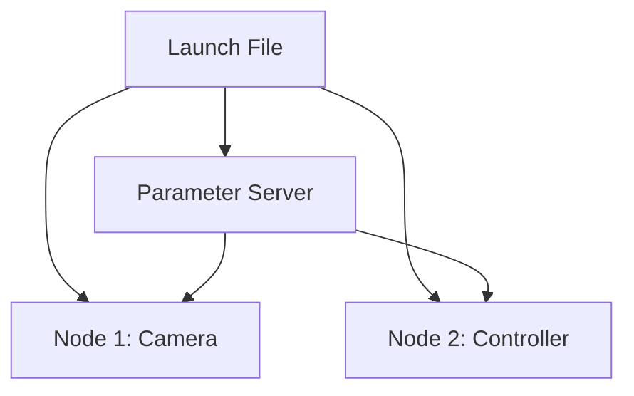

# Launch Files, Parameters, and Debugging in ROS 2

## 🌍 Real World Scenario

Your humanoid robot system has 12 nodes: camera, LiDAR, joint controller, navigation, speech recognition, arm planner, leg planner, safety monitor... Starting each one manually in 12 terminal windows is not a robotics workflow. It's chaos. Launch files are how real robots start.

And here is what usually happens to every serious robotics student: one day, everything worked in simulation, then suddenly it stops. RViz shows nothing moving. Navigation says “waiting for transform.” One sensor node is alive but silent. Another node crashes with “no route to host.” You stare at logs for two hours and feel like maybe you are bad at robotics.

You are not bad at robotics.

You are at the exact point where robotics becomes real engineering.

This chapter is built for that moment. Launch files give structure to startup. Parameters let you configure behavior without rewriting code. Debugging tools turn panic into a repeatable diagnosis process. The emotional core of production robotics is not avoiding bugs. It is learning to stay calm, inspect the system, and narrow uncertainty one step at a time.

## What You Will Learn

- Why launch files are the backbone of real robot startup orchestration.
- Python launch files vs XML launch files, with practical pros/cons.
- Why `ComposableNode` containers improve performance and reduce IPC overhead.
- How ROS 2 parameter files (YAML) let you switch between simulation and real robot configs.
- How to live-tune systems with `ros2 param get/set/dump` without restarting nodes.
- A mentor-style debugging flow using `ros2 topic echo`, `ros2 node info`, `rqt_graph`, and `rqt_console`.
- How to interpret common beginner errors: `waiting for transform`, `no route to host`, QoS mismatch.
- How to load URDF correctly from launch files.

## Why Launch Files Are the Startup Contract

A launch file is not just convenience. It is the startup contract of your robot system.

When teams run nodes manually, startup order becomes tribal knowledge:
- “Run this first, wait 3 seconds, then run that.”
- “If TF fails, restart navigation twice.”
- “Sometimes LiDAR doesn’t connect, just try again.”

That is operational debt.

A robust launch file defines:
1. Which nodes start.
2. With which parameters.
3. Under which namespace.
4. With which remappings.
5. In which process model (separate vs composable).
6. With which environment assumptions.

In production, this means reproducibility. If an on-call engineer starts the robot at 3 AM, it should behave exactly like it did in daytime lab tests.

## Python Launch Files vs XML Launch Files

ROS 2 supports multiple launch frontends. The most common are Python (`.launch.py`) and XML (`.launch.xml`). Both can launch the same runtime graph, but they differ in flexibility.

| Aspect | Python Launch Files | XML Launch Files |
|---|---|---|
| Expressiveness | Full Python logic (conditions, loops, substitutions) | Declarative structure, less dynamic logic |
| Readability for beginners | Can feel complex if too much code is embedded | Often easier to skim at first glance |
| Reusability patterns | Strong via Python functions and composable generation | Good for simple static setups |
| Complex conditions | Excellent | Limited / verbose |
| Tooling ecosystem | Most modern ROS 2 examples use Python launch | Still supported, useful in simpler stacks |
| Best use case | Real robot systems with variants and runtime decisions | Small demos or highly static launch trees |

Practical guidance: for a humanoid robot with simulation/real modes, optional subsystems, and configurable namespaces, Python launch is usually the right choice.

## ComposableNodes: Why same-process execution matters

In classic deployment, each node runs in a separate OS process. This gives isolation, but cross-process communication requires serialization/deserialization and context switches. For high-bandwidth topics (camera frames, point clouds), that overhead is expensive.

`ComposableNode` allows multiple components to run in a single process container. Benefits:

- Lower latency for data paths.
- Reduced CPU overhead from fewer copies.
- Better throughput in perception pipelines.

Tradeoff:

- Process crash blast radius can be larger if multiple components share one container.

Think in terms of subsystem boundaries:
- Put tightly coupled high-rate perception components together.
- Keep safety-critical controllers isolated if fault containment is more important than microseconds of latency.

## Parameter Server and YAML Config Profiles

Hardcoding constants inside node code is one of the fastest ways to create brittle systems. Parameters solve this.

Typical examples:
- Simulation LiDAR range: 20.0 m
- Real sensor range: 32.0 m
- Navigation max speed in sim: 0.8 m/s
- Navigation max speed in crowded warehouse: 0.5 m/s

Instead of editing code, you load a YAML profile. This gives traceability and allows controlled configuration changes.

A mature team usually keeps separate parameter sets:
- `humanoid_sim.yaml`
- `humanoid_real.yaml`

Then launch chooses one based on an argument (`use_sim:=true/false`). This is safer, faster, and reviewable in code review.

## 💻 Code Example 1: Complete Python launch file (humanoid simulation)

```python
# file: launch/humanoid_bringup.launch.py
from launch import LaunchDescription
from launch.actions import DeclareLaunchArgument
from launch.conditions import IfCondition
from launch.substitutions import LaunchConfiguration, Command, PathJoinSubstitution
from launch_ros.actions import Node, ComposableNodeContainer
from launch_ros.descriptions import ComposableNode
from launch_ros.parameter_descriptions import ParameterValue
from launch_ros.substitutions import FindPackageShare


def generate_launch_description():
    use_sim = LaunchConfiguration('use_sim')
    robot_ns = LaunchConfiguration('robot_ns')
    params_file = LaunchConfiguration('params_file')

    pkg_share = FindPackageShare('humanoid_bringup')

    default_urdf = PathJoinSubstitution([
        pkg_share,
        'urdf',
        'humanoid.urdf.xacro'
    ])

    robot_description = ParameterValue(
        Command(['xacro ', default_urdf, ' use_sim:=', use_sim]),
        value_type=str
    )

    # High-bandwidth perception nodes in one process for performance
    perception_container = ComposableNodeContainer(
        name='perception_container',
        namespace=robot_ns,
        package='rclcpp_components',
        executable='component_container_mt',
        output='screen',
        composable_node_descriptions=[
            ComposableNode(
                package='humanoid_perception',
                plugin='humanoid_perception::CameraComponent',
                name='camera_component',
                parameters=[params_file],
            ),
            ComposableNode(
                package='humanoid_perception',
                plugin='humanoid_perception::LidarComponent',
                name='lidar_component',
                parameters=[params_file],
            ),
        ],
    )

    robot_state_publisher = Node(
        package='robot_state_publisher',
        executable='robot_state_publisher',
        namespace=robot_ns,
        name='robot_state_publisher',
        output='screen',
        parameters=[
            params_file,
            {'robot_description': robot_description}
        ]
    )

    joint_controller = Node(
        package='humanoid_control',
        executable='joint_controller_node',
        namespace=robot_ns,
        name='joint_controller',
        output='screen',
        parameters=[params_file],
    )

    navigation = Node(
        package='humanoid_nav',
        executable='navigation_node',
        namespace=robot_ns,
        name='navigation',
        output='screen',
        parameters=[params_file],
    )

    safety_monitor = Node(
        package='humanoid_safety',
        executable='safety_monitor_node',
        namespace=robot_ns,
        name='safety_monitor',
        output='screen',
        parameters=[params_file],
    )

    # Optional RViz only in simulation sessions
    rviz = Node(
        package='rviz2',
        executable='rviz2',
        namespace=robot_ns,
        name='rviz2',
        output='screen',
        condition=IfCondition(use_sim),
    )

    return LaunchDescription([
        DeclareLaunchArgument('use_sim', default_value='true'),
        DeclareLaunchArgument('robot_ns', default_value='robot1'),
        DeclareLaunchArgument(
            'params_file',
            default_value=PathJoinSubstitution([
                pkg_share,
                'config',
                'humanoid_sim.yaml'
            ])
        ),
        perception_container,
        robot_state_publisher,
        joint_controller,
        navigation,
        safety_monitor,
        rviz,
    ])
```

What this demonstrates:
- Launch arguments for runtime configuration.
- Namespace isolation (`robot1`).
- URDF loading through `xacro` into `robot_description`.
- Shared parameter file for consistent behavior.
- Composable perception components for performance.

## 💻 Code Example 2: YAML parameter file for sim vs real configuration

```yaml
# file: config/humanoid_sim.yaml
robot_state_publisher:
  ros__parameters:
    use_sim_time: true

joint_controller:
  ros__parameters:
    control_rate_hz: 200
    max_joint_velocity: 1.2
    max_joint_acceleration: 2.0

navigation:
  ros__parameters:
    planner_frequency: 10.0
    max_linear_speed: 0.8
    max_angular_speed: 1.0
    obstacle_inflation_radius: 0.35
    global_frame: map
    base_frame: base_link

safety_monitor:
  ros__parameters:
    estop_timeout_ms: 200
    lidar_stop_distance_m: 0.6
    watchdog_period_ms: 100

camera_component:
  ros__parameters:
    fps: 30
    image_width: 1280
    image_height: 720
    qos_reliability: best_effort

lidar_component:
  ros__parameters:
    scan_rate_hz: 15
    range_min: 0.1
    range_max: 20.0
    qos_reliability: best_effort
```

For a real robot file (`humanoid_real.yaml`), common differences include:
- `use_sim_time: false`
- reduced max speed for safety validation runs
- real sensor IP/port values
- stricter watchdog thresholds

## Live tuning with ros2 param (without restart)

When debugging behavior, restarting all nodes for every tiny adjustment is slow and destabilizing. ROS 2 parameter tools let you inspect and tune live systems.

Useful commands:

```bash
# read one parameter
ros2 param get /robot1/navigation max_linear_speed

# change one parameter live
ros2 param set /robot1/navigation max_linear_speed 0.55

# dump all parameters of a node
ros2 param dump /robot1/navigation
```

This supports fast iteration:
1. Observe oscillation in navigation.
2. Lower speed or adjust inflation radius.
3. Re-test instantly.
4. Persist validated values back into YAML.

## Debugging toolkit: mentor mode for silent bugs

This section is the “I am sitting next to you” part.

When a robot goes silent, your brain jumps to worst-case stories (“everything is broken”). Don’t debug with panic. Debug with a fixed loop.

### Step 1: Is the graph alive?

- `ros2 node list`
- `ros2 node info /robot1/navigation`

If the node is missing, this is launch/startup failure, not algorithm failure.

### Step 2: Is data actually flowing?

- `ros2 topic list`
- `ros2 topic echo /robot1/scan`
- `ros2 topic hz /robot1/scan`

If topic exists but echo is empty, investigate publisher state, QoS compatibility, or namespace mismatch.

### Step 3: Is topology correct?

- `rqt_graph`

Look for disconnected edges. If navigation subscribes to `/scan` but LiDAR publishes `/robot1/scan`, remapping/namespacing is wrong.

### Step 4: What are logs saying at runtime?

- `rqt_console`

Sort by warnings/errors. Look for repeating messages and timestamp patterns.

### Step 5: Identify known failure signatures

#### Error: "waiting for transform"
Meaning: TF chain is incomplete (`map -> odom -> base_link` often broken).

Checklist:
- Is `robot_state_publisher` running?
- Is URDF loaded into `robot_description`?
- Are frame names consistent (`base_link` vs `base_footprint` mismatches)?
- Is a localization node publishing `map -> odom`?

#### Error: "no route to host"
Meaning: network-level connectivity failure to sensor/service endpoint.

Checklist:
- Verify IP and port parameters.
- Check same subnet/VLAN.
- Ping host from robot compute unit.
- Validate firewall rules.
- Confirm hardware power and cable link.

#### Silent callbacks due to QoS mismatch
Meaning: nodes discovered but no data exchanged.

Checklist:
- Run `ros2 topic info /robot1/scan -v`.
- Compare reliability (`reliable` vs `best_effort`).
- Compare durability (`volatile` vs `transient_local`).
- Align profiles intentionally, then retest.

The emotional truth: these bugs are normal. Senior roboticists hit them too. Skill is not “never getting stuck.” Skill is shortening time-to-root-cause.

## URDF loading in launch files

URDF defines robot kinematics, joints, links, and frames. If URDF is not loaded properly, TF collapses and many systems fail downstream.

Best practice in launch:
1. Generate URDF from xacro at startup.
2. Inject as `robot_description` parameter into `robot_state_publisher`.
3. Ensure frame naming in planners/controllers matches URDF frames exactly.

In the launch code above, this line is the key:

```python
robot_description = ParameterValue(
    Command(['xacro ', default_urdf, ' use_sim:=', use_sim]),
    value_type=str
)
```

And then:

```python
parameters=[params_file, {'robot_description': robot_description}]
```

That is the bridge from model description to live TF publication.

## 💻 Code Example 3: debugging script to check node health

```python
#!/usr/bin/env python3
# file: scripts/check_node_health.py

import subprocess
import sys

REQUIRED_NODES = [
    '/robot1/robot_state_publisher',
    '/robot1/joint_controller',
    '/robot1/navigation',
    '/robot1/safety_monitor',
]

REQUIRED_TOPICS = [
    '/robot1/scan',
    '/robot1/cmd_vel',
    '/robot1/tf',
]


def run(cmd: list[str]) -> str:
    result = subprocess.run(cmd, capture_output=True, text=True)
    if result.returncode != 0:
        return ''
    return result.stdout


def main() -> int:
    node_output = run(['ros2', 'node', 'list'])
    topic_output = run(['ros2', 'topic', 'list'])

    if not node_output:
        print('ERROR: Unable to query ROS graph. Is ROS_DOMAIN_ID correct?')
        return 2

    node_lines = set(line.strip() for line in node_output.splitlines() if line.strip())
    topic_lines = set(line.strip() for line in topic_output.splitlines() if line.strip())

    missing_nodes = [n for n in REQUIRED_NODES if n not in node_lines]
    missing_topics = [t for t in REQUIRED_TOPICS if t not in topic_lines]

    print('=== Node Health Report ===')
    if missing_nodes:
        print('Missing nodes:')
        for n in missing_nodes:
            print(f' - {n}')
    else:
        print('All required nodes are present.')

    if missing_topics:
        print('Missing topics:')
        for t in missing_topics:
            print(f' - {t}')
    else:
        print('All required topics are present.')

    if missing_nodes or missing_topics:
        print('Status: UNHEALTHY')
        return 1

    print('Status: HEALTHY')
    return 0


if __name__ == '__main__':
    sys.exit(main())
```

This script is intentionally simple and practical for students. It gives immediate signal before deep debugging.

## Architecture Diagram



## 💡 Key Concepts Summary

- Launch files are your robot’s reproducible startup contract.
- Python launch is usually better for dynamic, production-grade humanoid setups.
- Composable nodes reduce overhead for high-bandwidth pipelines.
- Parameter YAML profiles separate environment-specific configuration from code.
- `ros2 param get/set/dump` enables live tuning and faster debugging cycles.
- Debugging should be a calm loop: graph → data flow → topology → logs → known signatures.
- URDF loading errors propagate into TF and navigation failures quickly.

## 🧪 Practice Exercises

### Exercise 1 (Beginner)
Create a launch file with namespace `robot2` and confirm all key nodes appear under `/robot2/*` with `ros2 node list`.

```bash
ros2 launch humanoid_bringup humanoid_bringup.launch.py robot_ns:=robot2
ros2 node list
```

### Exercise 2 (Intermediate)
Use `ros2 param set` to reduce navigation max speed live, run a short path, then `ros2 param dump` and persist the validated value to YAML.

```bash
ros2 param set /robot1/navigation max_linear_speed 0.45
ros2 param dump /robot1/navigation
```

### Exercise 3 (Advanced)
Intentionally break TF by changing a frame name in your config, observe `waiting for transform`, then restore correct frame mapping and verify recovery in `rqt_graph` and logs.

```bash
# verify transform-related topics and node logs during fault injection
ros2 topic echo /robot1/tf
```

## ✅ Key Takeaways

- Starting nodes manually is chaos; launch files are production orchestration.
- Parameters make systems adaptable across sim and hardware without code churn.
- Composable nodes can dramatically improve performance where throughput matters.
- Most painful bugs become tractable with structured debugging and the right tools.
- Being stuck is normal; methodical diagnosis is the professional superpower.

## 🔗 Next Up

Next chapter: Services and Actions in ROS 2—how to design request/response workflows and long-running goal-driven behaviors with feedback, cancellation, and robust failure handling.