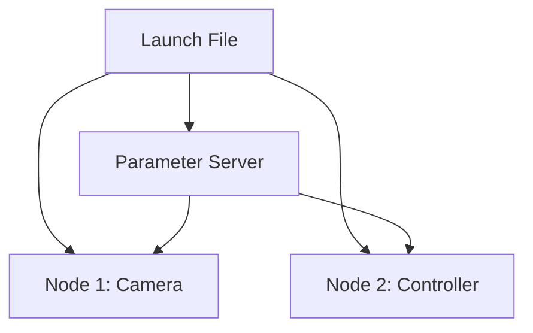

# Launch Files, Parameters, and Debugging in ROS 2

## 🌍 Real World Scenario

آپ کے ہیومینوائڈ ربوٹ سسٹم میں 12 نودز ہیں: کیمرا، LiDAR، جوائن کنٹرولر، ناوگیشن، اسپیکر شناخت، ہاتھ پلانر، پائے پلانر، سافٹی مونٹر... ایک ہی وقت میں 12 ٹیرمینل وینڈوز میں ہر ایک کو دستی طور پر شروع کرنا ربوٹکس ورک فلو نہیں ہے۔ یہ ہیومینوائڈ ربوٹ کا Chaos ہے۔ لانچ فائلز یہی ہیں جو حقیقی ربوٹس کو

اور یہ ہے جو ہر سنجیدہ ربوٹکس طالب علم کے ساتھ ہوتا ہے: ایک دن، سیمیولیشن میں ہر چیز کام کر رہی تھی، پھر اچانک یہ روک دی گئی۔ RViz میں کچھ بھی حرکت نہیں ہو رہی تھی۔ نेवیگیشن کہتا ہے "ٹرانسفارم کے لئے انتظار کر رہا ہے"۔ ایک سنسور نود زندہ تھا لیکن خاموش تھا۔ دوسرا نود "ہوسٹ تک راسٹ کے

Aap robotics mein acha hain.

آپ robotics کی exact point پر پہنچ گئے ہیں جہاں یہ real engineering بنتا ہے۔

یہ باب اس وقت کے لیے بنایا گیا ہے۔ لانچ فائلز شروع کے لیے ساختہ ہوتے ہیں۔ پیمائشیں آپ کو بے نیاز کوڈ کو دوبارہ لکھنے کے بغیر رویے کو کنٹرول کرنے کی اجازت دیتی ہیں۔ ڈیبگنگ ٹولز پینک میں ایک دہرائے جانے والا تشخیصی عمل میں تبدیل ہوتے ہیں۔ پیداواری رباتکس کا جذباتی مرکز بیکار Bugs سے بچنا نہیں ہے۔ ی

## What You Will Learn

- Why launch files are the backbone of real robot startup orchestration.
- Python launch files vs XML launch files, with practical pros/cons.
- Why `ComposableNode` containers improve performance and reduce IPC overhead.
- How ROS 2 parameter files (YAML) let you switch between simulation and real robot configs.
- How to live-tune systems with `ros2 param get/set/dump` without restarting nodes.
- A mentor-style debugging flow using `ros2 topic echo`, `ros2 node info`, `rqt_graph`, and `rqt_console`.
- How to interpret common beginner errors: `waiting for transform`, `no route to host`, QoS mismatch.
- How to load URDF correctly from launch files.

## Why Launch Files Are the Startup Contract

ایک لانچ فائل صرف ایک سہولت نہیں ہے۔ یہ آپ کے ربات کے نظام کا آغاز کا معاہدہ ہے۔

جب ٹیمز نودز منیالری کے ذریعے چلتی ہیں، شروع کا آرڈر قبائلی علم بن جاتا ہے:
- “Run this first, wait 3 seconds, then run that.”
- “If TF fails, restart navigation twice.”
- “Sometimes LiDAR doesn’t connect, just try again.”

وہ آپریشنل قرض ہے۔

ایک مضبوط لانچ فائل میں یہ تعینات ہوتا ہے:
1. Which nodes start.
Dusro ke parameters ke saath.
تھوڑے ہی Namespace میں ہے
چار۔ کس ریمپنگز کے ساتھ۔
5. جس عمل ماڈل میں ( الگ کرنا vs قابل ترکیب).
6. جس ماحول کی بنیادوں پر.

پیداواری صورتحال میں یہ مطلب ہے دوبارہ تخلیق ہونا۔ اگر ایک کال کیا انجینئر 3 بجے میں ربات کو شروع کرتا ہے، تو یہ دن کے لیب ٹیسٹوں میں براہ راست ہونا چاہیے۔

## Python Launch Files vs XML Launch Files

ROS 2 میں متعدد لانچ فرنٹ اینڈز کی حمایت کی جاتی ہے۔ سب سے عام Python (.launch.py) اور XML (.launch.xml) ہیں۔ دونوں ایک ہی رن ٹائم گراف کو لانچ کر سکتے ہیں، لیکن ان میں مختلف ہیں ان کی فلیکسبلٹی۔

| Aspect | Python Launch Files | XML Launch Files |
|---|---|---|
| Expressiveness | Full Python logic (conditions, loops, substitutions) | Declarative structure, less dynamic logic |
| Readability for beginners | Can feel complex if too much code is embedded | Often easier to skim at first glance |
| Reusability patterns | Strong via Python functions and composable generation | Good for simple static setups |
| Complex conditions | Excellent | Limited / verbose |
| Tooling ecosystem | Most modern ROS 2 examples use Python launch | Still supported, useful in simpler stacks |
| Best use case | Real robot systems with variants and runtime decisions | Small demos or highly static launch trees |

Practical guidance: ek humanoid robot ke liye jo simulation/real modes, optional subsystems, aur configurable namespaces ke saath kaam karta hai, Python launch aam taur par sahi chunauti hota hai.

## ComposableNodes: Why same-process execution matters

کلاسیکی ڈپلومنٹ میں ہر نود ایک الگ آپریٹنگ سسٹم پروسیس میں چلتا ہے۔ یہ ایزولیشن دیتا ہے، لیکن کراس پروسیس کمیونیکیشن کے لئے سیریلائزیشن/ڈی سیریلائزیشن اور کنٹیکسٹ سوییچز کی ضرورت ہوتی ہے۔ ہائی بینڈ وڈ ٹاپکس (کیمرا فریم، پوائنٹ کلاؤڈز) کے لئے یہ اوور ہیڈ مہنگا ہے۔

کام کرنے والا Node متعدد اجزاء کو ایک ہی پروسیس کنٹینر میں چلانے کی اجازت دیتا ہے۔ فوائد:

- Lower latency for data paths.
- Reduced CPU overhead from fewer copies.
- Better throughput in perception pipelines.

Tradeoff:

- Process crash blast radius can be larger if multiple components share one container.

Aik Subsystem ke boundaries mein sochna hai.
- Put tightly coupled high-rate perception components together.
- Keep safety-critical controllers isolated if fault containment is more important than microseconds of latency.

## Parameter Server and YAML Config Profiles

ہارڈ کوڈنگ کنسٹنٹس کو نود کوڈ کے اندر اندر رکھنا ایک سست ترین طریقہ ہے جس سے برٹل سسٹم بنایا جا سکتا ہے۔ پیمائشیں اس کا حل ہیں۔

آم نمونے
- Simulation LiDAR range: 20.0 m
- Real sensor range: 32.0 m
- Navigation max speed in sim: 0.8 m/s
- Navigation max speed in crowded warehouse: 0.5 m/s

ہم کوڈ کو ایڈٹ کرنے کے بجائے یہاں ایک YAML پروفائل لوڈ کرتے ہیں۔ یہ ٹریس ability اور کنٹرولڈ کنفیگریشن چیئنجز کو ممکن بناتا ہے۔

ایک تجربہ کار ٹیم عام طور پر الگ الگ پیمانوں کے مجموعے رکھتی ہے:
- `humanoid_sim.yaml`
- `humanoid_real.yaml`

فیر لانچ چنے کے لیے ایک آرگومنٹ (`use_sim:=true/false`) کے مطابق ایک چنے گا۔ یہ محفوظ، تیز، اور کوڈ ریویو میں جائزہ لینے میں آسان ہے۔

## 💻 Code Example 1: Complete Python launch file (humanoid simulation)

```python
# file: launch/humanoid_bringup.launch.py
from launch import LaunchDescription
from launch.actions import DeclareLaunchArgument
from launch.conditions import IfCondition
from launch.substitutions import LaunchConfiguration, Command, PathJoinSubstitution
from launch_ros.actions import Node, ComposableNodeContainer
from launch_ros.descriptions import ComposableNode
from launch_ros.parameter_descriptions import ParameterValue
from launch_ros.substitutions import FindPackageShare


def generate_launch_description():
    use_sim = LaunchConfiguration('use_sim')
    robot_ns = LaunchConfiguration('robot_ns')
    params_file = LaunchConfiguration('params_file')

    pkg_share = FindPackageShare('humanoid_bringup')

    default_urdf = PathJoinSubstitution([
        pkg_share,
        'urdf',
        'humanoid.urdf.xacro'
    ])

    robot_description = ParameterValue(
        Command(['xacro ', default_urdf, ' use_sim:=', use_sim]),
        value_type=str
    )

    # High-bandwidth perception nodes in one process for performance
    perception_container = ComposableNodeContainer(
        name='perception_container',
        namespace=robot_ns,
        package='rclcpp_components',
        executable='component_container_mt',
        output='screen',
        composable_node_descriptions=[
            ComposableNode(
                package='humanoid_perception',
                plugin='humanoid_perception::CameraComponent',
                name='camera_component',
                parameters=[params_file],
            ),
            ComposableNode(
                package='humanoid_perception',
                plugin='humanoid_perception::LidarComponent',
                name='lidar_component',
                parameters=[params_file],
            ),
        ],
    )

    robot_state_publisher = Node(
        package='robot_state_publisher',
        executable='robot_state_publisher',
        namespace=robot_ns,
        name='robot_state_publisher',
        output='screen',
        parameters=[
            params_file,
            {'robot_description': robot_description}
        ]
    )

    joint_controller = Node(
        package='humanoid_control',
        executable='joint_controller_node',
        namespace=robot_ns,
        name='joint_controller',
        output='screen',
        parameters=[params_file],
    )

    navigation = Node(
        package='humanoid_nav',
        executable='navigation_node',
        namespace=robot_ns,
        name='navigation',
        output='screen',
        parameters=[params_file],
    )

    safety_monitor = Node(
        package='humanoid_safety',
        executable='safety_monitor_node',
        namespace=robot_ns,
        name='safety_monitor',
        output='screen',
        parameters=[params_file],
    )

    # Optional RViz only in simulation sessions
    rviz = Node(
        package='rviz2',
        executable='rviz2',
        namespace=robot_ns,
        name='rviz2',
        output='screen',
        condition=IfCondition(use_sim),
    )

    return LaunchDescription([
        DeclareLaunchArgument('use_sim', default_value='true'),
        DeclareLaunchArgument('robot_ns', default_value='robot1'),
        DeclareLaunchArgument(
            'params_file',
            default_value=PathJoinSubstitution([
                pkg_share,
                'config',
                'humanoid_sim.yaml'
            ])
        ),
        perception_container,
        robot_state_publisher,
        joint_controller,
        navigation,
        safety_monitor,
        rviz,
    ])
```

یہ کیا دکھاتا ہے:
- Launch arguments for runtime configuration.
- Namespace isolation (`robot1`).
- URDF loading through `xacro` into `robot_description`.
- Shared parameter file for consistent behavior.
- Composable perception components for performance.

## 💻 Code Example 2: YAML parameter file for sim vs real configuration

```yaml
# file: config/humanoid_sim.yaml
robot_state_publisher:
  ros__parameters:
    use_sim_time: true

joint_controller:
  ros__parameters:
    control_rate_hz: 200
    max_joint_velocity: 1.2
    max_joint_acceleration: 2.0

navigation:
  ros__parameters:
    planner_frequency: 10.0
    max_linear_speed: 0.8
    max_angular_speed: 1.0
    obstacle_inflation_radius: 0.35
    global_frame: map
    base_frame: base_link

safety_monitor:
  ros__parameters:
    estop_timeout_ms: 200
    lidar_stop_distance_m: 0.6
    watchdog_period_ms: 100

camera_component:
  ros__parameters:
    fps: 30
    image_width: 1280
    image_height: 720
    qos_reliability: best_effort

lidar_component:
  ros__parameters:
    scan_rate_hz: 15
    range_min: 0.1
    range_max: 20.0
    qos_reliability: best_effort
```

کے لیے ایک حقیقی ربات فائل (`humanoid_real.yaml`) کے لیے، عام فرق میں شامل ہیں:
- `use_sim_time: false`
- reduced max speed for safety validation runs
- real sensor IP/port values
- stricter watchdog thresholds

## Live tuning with ros2 param (without restart)

جب بہاؤر کی جانچ کرنے کے لیے، ہر چھوٹے سے ترمیم کے لیے تمام نودز کو دوبارہ شروع کرنا تیز اور غیر مستحکم ہے۔ ROS 2 پیمائش کے ٹولز آپ کو جاندار نظاموں کو دیکھنے اور زندہ رکھنے کی اجازت دیتے ہیں۔

آسانی کے لیے کام کرنے والے کمانڈز:

```bash
# read one parameter
ros2 param get /robot1/navigation max_linear_speed

# change one parameter live
ros2 param set /robot1/navigation max_linear_speed 0.55

# dump all parameters of a node
ros2 param dump /robot1/navigation
```

یہ تیز رفتار تجربہ کرنے کی حمایت کرتا ہے:
1. Observe oscillation in navigation.
دوئےں رفتار کو کم کرنا یا دباؤ کے شعاع کو ایڈجسٹ کرنا۔
3. فوری طور پر دوبارہ جانچ لیں۔
چار. وैलڈیٹڈ ویلیوز کو وے ایل ایم میں واپس لے جانا.

## Debugging toolkit: mentor mode for silent bugs

Main aapke saamne baitha hoon.

جب ایک ربات خاموش ہو جاتا ہے، تو آپ کا دماغ بدترین حالات کی کہانیاں ("ہر چیز ٹوٹی ہوئی ہے") میں چلا جاتا ہے۔  دھماکے سے نہیں، ہمیشہ کی طرح، ہمیشہ کی طرح، ہمیشہ کی طرح، ہمیشہ کی طرح، ہمیشہ کی طرح، ہمیشہ کی طرح، ہمیشہ کی طرح، ہمیشہ کی طرح، ہمیشہ کی طرح، ہمیشہ کی طرح، ہمیشہ کی طرح،

### Step 1: Is the graph alive?

- `ros2 node list`
- `ros2 node info /robot1/navigation`

agar node ghayab hai, yeh launch/shuruat ka failure hai, na ki algorithm ka failure.

### Step 2: Is data actually flowing?

- `ros2 topic list`
- `ros2 topic echo /robot1/scan`
- `ros2 topic hz /robot1/scan`

agar topic mawjud hai lekin echo khali hai, publisher ke halat, QoS compatibility, ya namespace mismatch ko investigate karein.

### Step 3: Is topology correct?

- `rqt_graph`

ڈیٹا کی جانب سے منسلک نہ ہونے والے ایججز کی تلاش کریں۔ اگر ناوبری `/scan` کو سبسکرائب کرتی ہے لیکن LiDAR `/robot1/scan` کو پبلش کرتی ہے تو ریمپنگ/نام سپیسنگ غلط ہے۔

### Step 4: What are logs saying at runtime?

- `rqt_console`

آپ کے کمنڈز کو سارٹ کرنے کے لئے خطرات/خطاؤں کے مطابق دیکھیں۔ دہرائے گئے پیغامات اور ٹائم اسٹیمپ کے پتروں کو تلاش کریں۔

### Step 5: Identify known failure signatures

#### Error: "waiting for transform"
Chain TF incomplete (`map -> odom -> base_link` aam taur par tod jata hai).

فہرست:
- Is `robot_state_publisher` running?
- Is URDF loaded into `robot_description`?
- Are frame names consistent (`base_link` vs `base_footprint` mismatches)?
- Is a localization node publishing `map -> odom`?

#### Error: "no route to host"
نٹورک سطح پر कनेकٹیویٹی کی ناکامی سنسور/سروس اینڈ پوائنٹ تک۔

فہرست:
- Verify IP and port parameters.
- Check same subnet/VLAN.
- Ping host from robot compute unit.
- Validate firewall rules.
- Confirm hardware power and cable link.

#### Silent callbacks due to QoS mismatch
نوڈز دریافت ہوئے لیکن ڈیٹا تبادلہ نہیں ہوا۔

فہرست:
- Run `ros2 topic info /robot1/scan -v`.
- Compare reliability (`reliable` vs `best_effort`).
- Compare durability (`volatile` vs `transient_local`).
- Align profiles intentionally, then retest.

یہ احساسات کی حقیقت ہے: یہ بگز عام ہیں۔ سینئر ربوٹکسٹس بھی ان سے متاثر ہوتے ہیں۔ ہنر "کبھی بھی پھنسنے سے بچنا" نہیں ہے۔ ہنر وقت تک رooth-cause تک پہنچنا ہے۔

## URDF loading in launch files

یورڈی ایف ڈی (URDF) ربوٹ کی کینیمیکس، جوئنٹس، لنکس، اور فریمز کو بیان کرتا ہے۔ اگر یورڈی ایف ڈی صحیح طریقے سے لوڈ نہیں ہوتا ہے تو ٹی ایف (TF) کا خاتمہ ہوتا ہے اور بہت سے سسٹم کے نیچے کے نظام ناکام ہوجاتے ہیں۔

بہترین طریقہ کار لانچ میں
1. Generate URDF from xacro at startup.
2. ہرbot کی ڈیسکریپشن کو `robot_state_publisher` میں `robot_description` کے طور پر ڈال دیں۔
3. یہ یقینی بنائیں کہ پلاں/کنٹرولرز میں فریم نام ہیں جو URDF فریم کیexactی مطابق ہیں۔

اِس لانچ کوڈ میں یہ لائن کلیدی ہے:

```python
robot_description = ParameterValue(
    Command(['xacro ', default_urdf, ' use_sim:=', use_sim]),
    value_type=str
)
```

And then:

```python
parameters=[params_file, {'robot_description': robot_description}]
```

وہ پل ہے جو ماڈل کی وضاحت سے لائیو ٹی ایف شائع کرنے کے درمیان ہے۔

## 💻 Code Example 3: debugging script to check node health

```python
#!/usr/bin/env python3
# file: scripts/check_node_health.py

import subprocess
import sys

REQUIRED_NODES = [
    '/robot1/robot_state_publisher',
    '/robot1/joint_controller',
    '/robot1/navigation',
    '/robot1/safety_monitor',
]

REQUIRED_TOPICS = [
    '/robot1/scan',
    '/robot1/cmd_vel',
    '/robot1/tf',
]


def run(cmd: list[str]) -> str:
    result = subprocess.run(cmd, capture_output=True, text=True)
    if result.returncode != 0:
        return ''
    return result.stdout


def main() -> int:
    node_output = run(['ros2', 'node', 'list'])
    topic_output = run(['ros2', 'topic', 'list'])

    if not node_output:
        print('ERROR: Unable to query ROS graph. Is ROS_DOMAIN_ID correct?')
        return 2

    node_lines = set(line.strip() for line in node_output.splitlines() if line.strip())
    topic_lines = set(line.strip() for line in topic_output.splitlines() if line.strip())

    missing_nodes = [n for n in REQUIRED_NODES if n not in node_lines]
    missing_topics = [t for t in REQUIRED_TOPICS if t not in topic_lines]

    print('=== Node Health Report ===')
    if missing_nodes:
        print('Missing nodes:')
        for n in missing_nodes:
            print(f' - {n}')
    else:
        print('All required nodes are present.')

    if missing_topics:
        print('Missing topics:')
        for t in missing_topics:
            print(f' - {t}')
    else:
        print('All required topics are present.')

    if missing_nodes or missing_topics:
        print('Status: UNHEALTHY')
        return 1

    print('Status: HEALTHY')
    return 0


if __name__ == '__main__':
    sys.exit(main())
```

یہ اسکرپٹ عمدہ اور عملی ہے اور اسے طلباء کے لیے بنایا گیا ہے۔ یہ گہرے ڈیبگنگ سے پہلے تیزی سے اشارہ دیتا ہے۔

## Architecture Diagram



## 💡 Key Concepts Summary

- Launch files are your robot’s reproducible startup contract.
- Python launch is usually better for dynamic, production-grade humanoid setups.
- Composable nodes reduce overhead for high-bandwidth pipelines.
- Parameter YAML profiles separate environment-specific configuration from code.
- `ros2 param get/set/dump` enables live tuning and faster debugging cycles.
- Debugging should be a calm loop: graph → data flow → topology → logs → known signatures.
- URDF loading errors propagate into TF and navigation failures quickly.

## 🧪 Practice Exercises

### Exercise 1 (Beginner)
ایک لانچ فائل بنائیں جس کا نام سےپیس نام `robot2` ہو اور یہ بات یقینی بنائیں کہ تمام کلیدی نودز `/robot2/*` کے نیچے نظر آ رہے ہیں `ros2 node list` کے ذریعے۔

```bash
ros2 launch my_package my_launch_file.py robot2:=robot2
```

```bash
ros2 node list | grep robot2
```

یہ بات یقینی بنائیں کہ تمام کلیدی نودز `/robot2/*` کے نیچے نظر آ رہے ہیں۔

```bash
ros2 launch humanoid_bringup humanoid_bringup.launch.py robot_ns:=robot2
ros2 node list
```

### Exercise 2 (Intermediate)
روسی 2 پریمٹر استعمال کرکے ناوِگیشن کی سب سے زیادہ رفتار کو کم کرنے کے لئے `ros2 param set` استعمال کریں، ایک مختصر راستہ چلائیں، پھر `ros2 param dump` استعمال کریں اور یہ تصدیق شدہ قدر کو YAML میں محفوظ کریں۔

```bash
ros2 param set /robot1/navigation max_linear_speed 0.45
ros2 param dump /robot1/navigation
```

### Exercise 3 (Advanced)
Intentional tafriq TF karne ke liye ek frame naam ko apne config mein badalna, observe `waiting for transform`, phir sahi frame mapping ko wapas laana aur `rqt_graph` aur logs mein recovery ki verification karna.

```bash
# verify transform-related topics and node logs during fault injection
ros2 topic echo /robot1/tf
```

## ✅ Key Takeaways

- Starting nodes manually is chaos; launch files are production orchestration.
- Parameters make systems adaptable across sim and hardware without code churn.
- Composable nodes can dramatically improve performance where throughput matters.
- Most painful bugs become tractable with structured debugging and the right tools.
- Being stuck is normal; methodical diagnosis is the professional superpower.

## 🔗 Next Up

Aglay Chapter: Services aur Actions ROS2 mein—request/response workflows aur long-running goal-driven behaviors ke liye feedback, cancellation, aur robust failure handling ke saath design kaise karein.