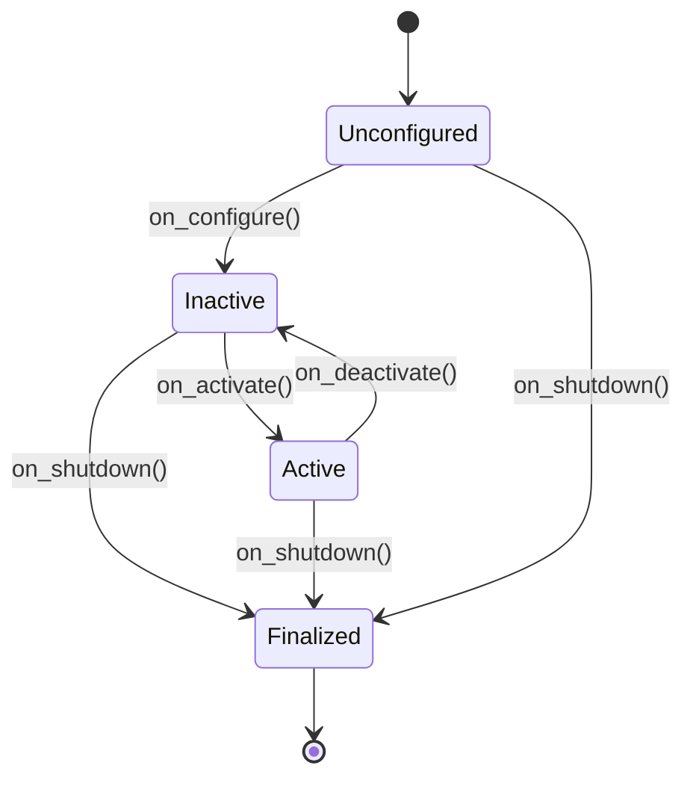

# Nodes, Topics, and QoS in ROS 2

## 🌍 Real World Scenario

Your humanoid robot is navigating a warehouse. Its camera node publishes 30 frames/second. Suddenly, the network gets congested. Does your navigation system crash, freeze, or gracefully drop old frames and continue? That decision is QoS.

That one sentence is the difference between a robot demo and a production robot. In a toy setup, developers often run everything on one laptop with almost perfect loopback networking. Messages look instant. No packet loss, no jitter spikes, no overloaded switches, no competing radios. In a real warehouse, your robot shares network space with scanners, forklifts, tablets, industrial gateways, metal racks that reflect RF signals, and occasional dead zones. Under these conditions, data delivery behavior is no longer “nice to have.” It becomes a safety and uptime requirement.

If your camera topic is configured poorly, the robot may process old frames after congestion clears and drive using stale perception. If command topics are configured poorly, a critical stop command can be delayed or dropped. If map or static transform topics are configured poorly, late-joining nodes can fail silently and you waste hours debugging what looks like a logic bug but is actually transport policy mismatch.

QoS is the contract that tells ROS 2 middleware what to do when reality gets messy. This chapter makes QoS the star because production robotics is mostly about handling messy reality safely.

## What You Will Learn

- How ROS 2 managed nodes move through lifecycle states: unconfigured → inactive → active → finalized.
- Why topic namespacing (`/robot1/camera/image` vs `/robot2/camera/image`) prevents multi-robot collisions.
- How `RELIABLE` and `BEST_EFFORT` differ, and when each is correct.
- How `VOLATILE` and `TRANSIENT_LOCAL` map to live stream vs message history behavior.
- The six QoS policies you must understand: history, depth, reliability, durability, deadline, liveliness.
- Why QoS mismatch causes silent communication failures and how to diagnose it.
- How to build matching publisher/subscriber QoS profiles in Python.
- How to verify compatibility with `ros2 topic info -v`.

## Node Lifecycle: from boot chaos to deterministic startup

ROS 2 supports managed lifecycles so nodes can be orchestrated like industrial systems instead of launched as uncontrolled scripts. This matters because robot software rarely starts in a perfect order. Cameras need warm-up, calibration may load late, navigation requires TF availability, and motion control should never activate before safety monitors.

Lifecycle states let you encode those constraints:

- **unconfigured**: node exists but resources are not fully initialized.
- **inactive**: node has initialized resources but is not processing live work.
- **active**: node is running its primary callbacks and participating in the graph.
- **finalized**: node has completed shutdown and released critical resources.

When teams skip lifecycle discipline, they get race conditions: planners starting before maps, control loops running before odometry, watchdogs not armed during bring-up. Lifecycle management reduces those failure modes by making transitions explicit and testable.



In production systems, an orchestrator or launch supervisor checks preconditions before transitions. Example: only transition motion control to `active` after safety lidar and emergency stop nodes confirm healthy liveliness.

## Topic Namespacing: why multi-robot systems need strict separation

In a single-robot tutorial, topic names are often short (`/camera/image`, `/cmd_vel`, `/scan`). That works until you deploy robot 2. Then both robots publish `/camera/image`, both subscribe `/cmd_vel`, and your observability tools become unreadable. Worse, cross-talk can occur if remapping is sloppy.

Namespacing fixes this by scoping topics per robot or per subsystem:

- `/robot1/camera/image`
- `/robot1/cmd_vel`
- `/robot2/camera/image`
- `/robot2/cmd_vel`

With namespaces, each robot keeps a clean communication boundary while still sharing one ROS domain. This is essential in fleets, warehouse pilots, and lab environments where multiple robots are tested together.

Practical rules:

1. Make base topic names relative in node code (`camera/image`, `cmd_vel`) and apply namespace at launch.
2. Reserve global topics only for truly shared infrastructure (e.g., fleet supervisor heartbeats).
3. Keep naming conventions consistent across teams to avoid hidden remap bugs.

Namespacing is not just style. It is a safety and operability control for scaling.

## QoS fundamentals: WhatsApp vs live stream analogy

QoS in ROS 2 defines transport expectations between publishers and subscribers. A useful intuition:

- **WhatsApp-like behavior**: you expect reliable delivery and possibly retained context for late readers.
- **Live stream behavior**: you prioritize being current; dropped moments are acceptable.

Map that to ROS 2:

- `RELIABLE` + often retained data patterns for control/state channels.
- `BEST_EFFORT` + fresh-only behavior for high-frequency sensor streams.

### RELIABLE vs BEST_EFFORT

- **RELIABLE**: middleware retries until delivery succeeds (within limits). Better for commands, state transitions, and anything safety-critical where missing a message is unacceptable.
- **BEST_EFFORT**: middleware does not retry; it sends what it can, and late/lost packets are dropped. Better for high-bandwidth sensors where stale data is worse than dropped data.

### VOLATILE vs TRANSIENT_LOCAL

- **VOLATILE**: only currently connected subscribers receive data. New subscribers do not get old messages.
- **TRANSIENT_LOCAL**: publisher retains recent samples so late subscribers can receive last known values.

Analogy:

- **VOLATILE** is like joining a live stream late: you only see what is happening now.
- **TRANSIENT_LOCAL** is like opening a chat and immediately seeing recent pinned context.

For example, static map metadata or robot configuration is often suited for retained behavior. High-rate camera frames are generally volatile.

## The 6 QoS policies you must tune intentionally

### 1) History
Controls whether middleware keeps only a bounded recent window (`KEEP_LAST`) or attempts to keep everything (`KEEP_ALL`).

### 2) Depth
Queue size used with `KEEP_LAST`. Depth too small can drop useful bursts; depth too large can increase latency and memory pressure.

### 3) Reliability
`RELIABLE` or `BEST_EFFORT`. Choose based on whether message loss or delay is more dangerous for that stream.

### 4) Durability
`VOLATILE` or `TRANSIENT_LOCAL`. Decide whether late-joining subscribers must receive prior samples.

### 5) Deadline
Maximum expected time between messages. Missing deadline can trigger callbacks and alerts for timing regressions.

### 6) Liveliness
How publishers assert they are still alive. Useful for watchdogs and failover behavior when nodes freeze without clean shutdown.

Production tip: treat QoS tuning as part of interface contract design, not as last-minute debugging.

## RELIABLE vs BEST_EFFORT comparison table

| Dimension | RELIABLE | BEST_EFFORT |
|---|---|---|
| Delivery guarantee | Retries to deliver | No retries; may drop |
| Typical latency profile | Can increase under congestion due to retransmissions | Lower and more stable under load |
| Bandwidth overhead | Higher | Lower |
| Backpressure behavior | More likely to build queues | More likely to shed load |
| Best robot use cases | `/cmd_vel`, mode changes, mission events, safety state | camera frames, lidar scans, high-rate IMU |
| Failure tradeoff | Risk: delay when link is poor | Risk: data loss when link is poor |
| Production philosophy | “Must arrive” | “Must stay current” |

## QoS mismatch: the silent failure every beginner hits

In ROS 2, publisher/subscriber endpoints must be compatible. If they are not, endpoints may discover each other but not exchange messages. This often appears as:

- `ros2 topic list` shows topic exists.
- Node logs show no callback errors.
- Subscriber callback never fires.

Classic mismatch example:

- Publisher uses `BEST_EFFORT` for sensor stream.
- Subscriber requests `RELIABLE`.

Depending on middleware and exact compatibility rules, communication may fail silently. Engineers then debug business logic while the real issue is QoS contract mismatch.

Always verify with verbose introspection before rewriting code.

```bash
ros2 topic info /scan -v
```

This prints endpoint QoS details (reliability, durability, history/depth, liveliness, deadlines) so you can compare profiles directly.

## 💻 Code Example 1: velocity command publisher with RELIABLE QoS

```python
#!/usr/bin/env python3
import rclpy
from rclpy.node import Node
from geometry_msgs.msg import Twist
from rclpy.qos import QoSProfile, ReliabilityPolicy, DurabilityPolicy, HistoryPolicy

class CmdVelPublisher(Node):
    def __init__(self):
        super().__init__('cmd_vel_publisher')

        qos = QoSProfile(
            history=HistoryPolicy.KEEP_LAST,
            depth=10,
            reliability=ReliabilityPolicy.RELIABLE,
            durability=DurabilityPolicy.VOLATILE,
        )

        self.pub = self.create_publisher(Twist, '/robot1/cmd_vel', qos)
        self.timer = self.create_timer(0.1, self.publish_cmd)  # 10 Hz

    def publish_cmd(self):
        msg = Twist()
        msg.linear.x = 0.4
        msg.angular.z = 0.0
        self.pub.publish(msg)


def main():
    rclpy.init()
    node = CmdVelPublisher()
    rclpy.spin(node)
    node.destroy_node()
    rclpy.shutdown()

if __name__ == '__main__':
    main()
```

Why RELIABLE here: command channels should not casually drop critical velocity updates, especially stop or deceleration commands.

## 💻 Code Example 2: sensor subscriber with BEST_EFFORT QoS

```python
#!/usr/bin/env python3
import rclpy
from rclpy.node import Node
from sensor_msgs.msg import LaserScan
from rclpy.qos import QoSProfile, ReliabilityPolicy, DurabilityPolicy, HistoryPolicy

class ScanSubscriber(Node):
    def __init__(self):
        super().__init__('scan_subscriber')

        qos = QoSProfile(
            history=HistoryPolicy.KEEP_LAST,
            depth=5,
            reliability=ReliabilityPolicy.BEST_EFFORT,
            durability=DurabilityPolicy.VOLATILE,
        )

        self.sub = self.create_subscription(
            LaserScan,
            '/robot1/scan',
            self.on_scan,
            qos
        )

    def on_scan(self, msg: LaserScan):
        if msg.ranges:
            front_index = len(msg.ranges) // 2
            front_distance = msg.ranges[front_index]
            self.get_logger().info(f'Front distance: {front_distance:.2f} m')


def main():
    rclpy.init()
    node = ScanSubscriber()
    rclpy.spin(node)
    node.destroy_node()
    rclpy.shutdown()

if __name__ == '__main__':
    main()
```

Why BEST_EFFORT here: losing a few scans is acceptable if the robot always reacts to freshest data instead of stale backlog.

## 💻 Code Example 3: check QoS compatibility with ros2 CLI

Use this during debugging and bring-up:

```bash
# Show publisher/subscriber endpoints and their QoS policies
ros2 topic info /robot1/scan -v

# Optional: inspect command channel too
ros2 topic info /robot1/cmd_vel -v
```

What to check:

1. Reliability alignment (`RELIABLE` vs `BEST_EFFORT`).
2. Durability expectations (`VOLATILE` vs `TRANSIENT_LOCAL`).
3. Depth/history mismatches that may create performance surprises.
4. Deadline/liveliness settings for watchdog-sensitive streams.

## Operational guidance: picking QoS by stream type

A simple production matrix:

- **Motion commands**: usually `RELIABLE`, modest depth, volatile durability.
- **Perception high-rate streams**: usually `BEST_EFFORT`, low depth, volatile durability.
- **State/config snapshots for late joiners**: often `TRANSIENT_LOCAL`.
- **Safety monitoring**: explicit deadline/liveliness so failure is detectable quickly.

Never copy one QoS profile everywhere. Different streams have different risk models.

## 💡 Key Concepts Summary

- QoS is the transport contract that determines behavior under packet loss, jitter, and congestion.
- Node lifecycle makes startup and shutdown deterministic, reducing race conditions.
- Namespacing prevents topic collisions in multi-robot deployments.
- `RELIABLE` is for must-arrive data; `BEST_EFFORT` is for stay-current data.
- `VOLATILE` serves only live subscribers; `TRANSIENT_LOCAL` helps late joiners.
- Deadline and liveliness transform hidden failures into observable events.
- Most “mystery subscriber bugs” are QoS mismatches diagnosed via `ros2 topic info -v`.

## 🧪 Practice Exercises

### Exercise 1 (Beginner)
Create two namespaces (`/robot1`, `/robot2`) for the same camera node and verify both publish independently without topic collision.

```python
# Hint: keep topic relative in code (camera/image)
# then apply namespace in launch parameters.
```

### Exercise 2 (Intermediate)
Set up a publisher with `BEST_EFFORT` and a subscriber with `RELIABLE` on the same sensor topic. Observe no callbacks, then fix subscriber reliability and verify recovery.

```bash
ros2 topic info /robot1/scan -v
```

### Exercise 3 (Advanced)
Add deadline and liveliness policies to a safety topic. Intentionally pause the publisher and log the deadline/liveliness event to trigger a controlled stop behavior.

```python
# Goal: convert hidden silence into explicit safety events.
```

## ✅ Key Takeaways

- QoS is what separates tutorial robots from production robots.
- Lifecycle and namespacing are foundational controls, not optional extras.
- Pick QoS per stream based on risk: “must arrive” vs “must stay current.”
- Mismatch can fail silently; always verify endpoint contracts with `ros2 topic info -v`.
- Production readiness comes from explicit communication contracts, not default settings.

## 🔗 Next Up

Next chapter: Services and Actions in ROS 2—how robots handle request/response operations and long-running goals with feedback and cancellation.