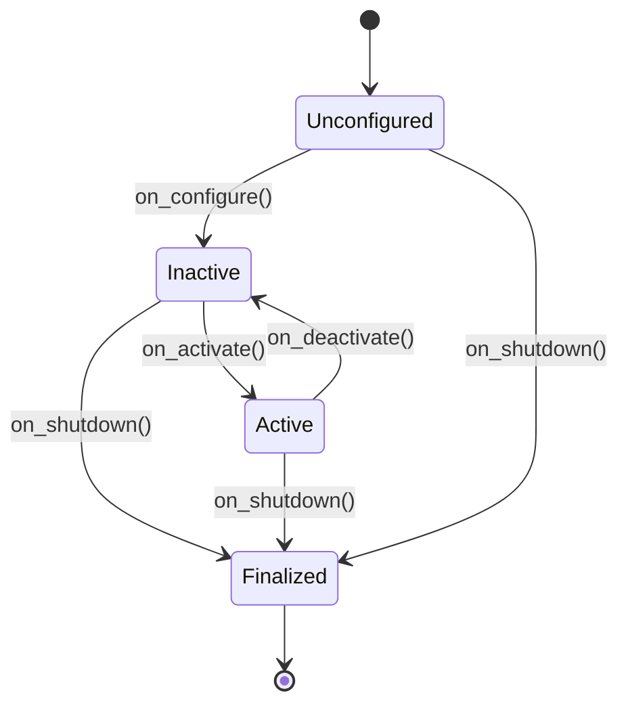

# Nodes, Topics, and QoS in ROS 2

## 🌍 Real World Scenario

Aapka humanoid robot ek warehouse mein navigating kar raha hai. Uska camera node 30 frames/second publish karta hai. Jb network congest ho jata hai, to aapka navigation system crash karta hai, freeze karta hai, ya gracefully old frames drop karta hai aur continue karta hai? Yeh decision QoS hai.

وہ ایک ربوٹ ڈیمو اور ایک پیداواری ربوٹ کے درمیان فرق ہے۔ ایک کھیل کے سٹیٹ اپ میں، ڈویلپرز اکثر ایک لپ ٹاپ پر تمام چیزوں کو چلانا پسند کرتے ہیں جس میں تقریباً پرفیکٹ لاپٹاپ نیٹ ورکنگ ہوتی ہے۔ پیغامات بے مثال نظر آتے ہیں۔ کوئی پیکیٹ لوس، کوئی جٹر سپائکس، کوئی اوور لوڈڈ سوییچز، کوئی مقابلہ کرنے والے ریڈیو

agar aapka camera topic theek se na configure kiya hai, toh robot congestion clear hone ke baad purane frames process kar sakta hai aur stale perception ke saath drive kar sakta hai. agar command topics theek se na configure kiye gaye hain, toh ek critical stop command delay ho sakta hai ya drop ho sakta hai. agar map ya static transform topics theek se na configure kiye gaye hain, toh late-joining nodes silently fail ho sakte hain aur aap ghantein guzarne ke baad debugging karte rahe hain jo ki logic bug lagta hai lekin asli mein transport policy mismatch hai.

کیوس (QoS) وہ معاہدہ ہے جو ROS 2 میڈیئٹ ویئر کو بتاتا ہے کہ جب حقیقت گھبراہٹ کا شکار ہو جاتی ہے تو اس کے ساتھ کیا کرنا ہے۔ یہ باب کیوس کو ستارہ بناتا ہے کیونکہ پروڈکشن رباتکس کا زیادہ تر حصہ گھبراہٹ سے نمٹنے کے بارے میں ہے۔

## What You Will Learn

- How ROS 2 managed nodes move through lifecycle states: unconfigured → inactive → active → finalized.
- Why topic namespacing (`/robot1/camera/image` vs `/robot2/camera/image`) prevents multi-robot collisions.
- How `RELIABLE` and `BEST_EFFORT` differ, and when each is correct.
- How `VOLATILE` and `TRANSIENT_LOCAL` map to live stream vs message history behavior.
- The six QoS policies you must understand: history, depth, reliability, durability, deadline, liveliness.
- Why QoS mismatch causes silent communication failures and how to diagnose it.
- How to build matching publisher/subscriber QoS profiles in Python.
- How to verify compatibility with `ros2 topic info -v`.

## Node Lifecycle: from boot chaos to deterministic startup

ROS 2 کا مدیرت شدہ زندگی کا سپورٹ ہوتا ہے اس لیے نودز کو انڈسٹریل سسٹم کی طرح منظم کیا جا سکتا ہے جبکہ انہیں غیر کنٹرول شدہ اسکرپٹ کے طور پر لانچ نہیں کیا جا سکتا ہے۔ یہ معاملہ اہم ہے کیونکہ ربات کی سافٹ ویئر نادراں ہی پرفیکٹ آرڈر میں شروع ہوتی ہے۔ کیمرے کو گرم کرنے کی ضرورت ہوتی ہے، کالیبر

زندگی کے حالات کی حالت آپ کو ان پابندیوں کو ایکڑ کرنے کی اجازت دیتی ہیں:

- **unconfigured**: node exists but resources are not fully initialized.
- **inactive**: node has initialized resources but is not processing live work.
- **active**: node is running its primary callbacks and participating in the graph.
- **finalized**: node has completed shutdown and released critical resources.

جب ٹیمز لائف سائیکل ڈسپلین سے گریز کرتے ہیں تو انہیں ریس کنڈیشنز مل جاتے ہیں: پلانرز کا آغاز قبل از وقت ہوتا ہے، کنٹرول لوز چلنے سے پہلے اودومیٹری، واٹچ ڈوگس نہیں ہوتے جب برونگ اپ ہوتا ہے۔ لائف سائیکل مینجمنٹ ان فیلچر مڈز کو کم کرنے میں مدد کرتا ہے جبکہ ٹرانزیشنز کو ظاہ



پیداواری نظاموں میں، ایک منظم یا لانچ سپروائزر ٹرانزیشنز سے پہلے شرائط کی جانچ کرتا ہے۔ مثال کے طور پر، صرف موشن کنٹرول کو `active` میں منتقل کریں جب سافٹی لیڈار اور ایمرجنسی اسٹاپ نودز صحت مند لائفلینس کی تصدیق کرتے ہیں۔

## Topic Namespacing: why multi-robot systems need strict separation

ایک ایک ہی ربوٹ کے ٹیوٹوریل میں، ٹاپک نام اکثر مختصر ہوتے ہیں (`/camera/image`, `/cmd_vel`, `/scan`). یہ کام کرے گا جب تک کہ آپ ربوٹ 2 کو نہیں لگاتے۔ پھر دونوں ربوٹ `/camera/image` شائع کرتے ہیں، دونوں `/cmd_vel` سبسکرائب کرتے ہیں، اور آپ کے مشاہدہ کے ٹول غیر پڑھے جاتے ہیں۔ Worse, Cross-talk ہو سکتا ہے اگر Remapping

نیم اسپیسنگ کی اصلاح اسے موضوعات کو ربوٹ یا سسٹم کے ذریعے سے محدود کرتی ہے:

- `/robot1/camera/image`
- `/robot1/cmd_vel`
- `/robot2/camera/image`
- `/robot2/cmd_vel`

ہر ربوٹ کے لیے نامسپیس کے ذریعے، ایک صاف رابطہ عامہ ہوتا ہے جبکہ ایک ہی ROS ڈومین میں کام کرتے ہیں۔ یہ فلیٹس، وارہاؤس پائلٹس اور لیب ماحول میں بہت اہم ہے جہاں متعدد ربوٹس ایک ساتھ ٹیسٹ کیے جاتے ہیں۔

نظامی قواعد:

1. Make base topic names relative in node code (`camera/image`, `cmd_vel`) and apply namespace at launch.
دوسرا: دنیا بھر میں صرف حقیقی طور پر شیئرڈ انفراسٹرکچر کے لئے گھریلو موضوعات کو محفوظ رکھیں (جیسے فلیٹ سپروائز ہارٹ بیٹس)۔
3. ٹیموں کے درمیان نام بندی کے اصولوں کو یکساں رکھیں تاکہ چھپے ہوئے ریمپ بھیوں سے بچا جا سکے۔

نیم اسپیسنگ صرف اسٹائل نہیں ہے بلکہ اسے سکیلینگ کے لیے سافٹیویر اور آپریٹبلٹی کا کنٹرول بھی کہا جاتا ہے۔

## QoS fundamentals: WhatsApp vs live stream analogy

کیو ایس (QoS) ROS 2 میں پبلشرز اور سبسکرائبرز کے درمیان ٹرانسپورٹ کی امیدوں کو ظاہر کرتا ہے۔ ایک مفید عقلانہ خیال:

- **WhatsApp-like behavior**: you expect reliable delivery and possibly retained context for late readers.
- **Live stream behavior**: you prioritize being current; dropped moments are acceptable.

مپ کے لیے ROS 2 کو استعمال کریں

- `RELIABLE` + often retained data patterns for control/state channels.
- `BEST_EFFORT` + fresh-only behavior for high-frequency sensor streams.

### RELIABLE vs BEST_EFFORT

- **RELIABLE**: middleware retries until delivery succeeds (within limits). Better for commands, state transitions, and anything safety-critical where missing a message is unacceptable.
- **BEST_EFFORT**: middleware does not retry; it sends what it can, and late/lost packets are dropped. Better for high-bandwidth sensors where stale data is worse than dropped data.

### VOLATILE vs TRANSIENT_LOCAL

- **VOLATILE**: only currently connected subscribers receive data. New subscribers do not get old messages.
- **TRANSIENT_LOCAL**: publisher retains recent samples so late subscribers can receive last known values.

Analogy:

- **VOLATILE** is like joining a live stream late: you only see what is happening now.
- **TRANSIENT_LOCAL** is like opening a chat and immediately seeing recent pinned context.

کام کرنے والی نقشہ کی معلومات یا ربات کی ترتیب عام طور پر برقرار رہنے والی خصوصیات کے لیے موزوں ہوتی ہے۔  اعلی درجہ کی کیمرے کی فریم عام طور پر بدستور تبدیلیوں کے لیے موزوں ہوتی ہے۔

## The 6 QoS policies you must tune intentionally

### 1) History
مڈل وئیر کیوں کہتے ہیں کہ وہ صرف ایک محدود حالیہ ونڈو (KEEP_LAST) کو برقرار رکھتا ہے یا ہر چیز کی کوشش کرتا ہے (KEEP_ALL)۔

### 2) Depth
Queue size ka istemal `KEEP_LAST` ke saath kiya jata hai. Gahraai kam ho to kuchh faydemand aawazon ko girta hai; gahraai zyada ho to vakt aur yaadgaar ki dabaav badh jati hai.

### 3) Reliability
مسلح ہونا یا تاخیر کے درمیان سے کون سا زیادہ خطرناک ہے وہ پہلو پر مبنی طور پر چنیں۔

### 4) Durability
ہمیشہ کیوں نہیں، لیکن ہمیشہ کیوں ہاں؟

### 5) Deadline
ٹائم آؤٹ کا زیادہ سے زیادہ انتظامی وقت ہے۔  موصول ہونے والے پیغامات کے درمیان وقت کا فاصلہ ہے۔ موصول ہونے والے پیغام کی موعدہ مقررہ تاریخ سے باہر ہونے پر کال بیک کے ساتھ ساتھ ٹائمنگ کی کمیوں کے لئے ایلارٹس کا باعث بن سکتا ہے۔

### 6) Liveliness
آپریڈیٹرز کہتے ہیں کہ وہ اب بھی زندہ ہیں۔ واٹچ ڈاگز اور فیل اوور بہاؤر کے لیے نودز کی ٹھیک shutdown کے بغیر جم جاتے ہیں۔

پیداواری ٹپس: QoS کی ترمیم کو انٹرفیس معاہدے کی ڈیزائن کے طور پر دیکھیں، نہ کہ آخری منٹ کی ڈیبگنگ کے طور پر۔

## RELIABLE vs BEST_EFFORT comparison table

| Dimension | RELIABLE | BEST_EFFORT |
|---|---|---|
| Delivery guarantee | Retries to deliver | No retries; may drop |
| Typical latency profile | Can increase under congestion due to retransmissions | Lower and more stable under load |
| Bandwidth overhead | Higher | Lower |
| Backpressure behavior | More likely to build queues | More likely to shed load |
| Best robot use cases | `/cmd_vel`, mode changes, mission events, safety state | camera frames, lidar scans, high-rate IMU |
| Failure tradeoff | Risk: delay when link is poor | Risk: data loss when link is poor |
| Production philosophy | “Must arrive” | “Must stay current” |

## QoS mismatch: the silent failure every beginner hits

ROS 2 میں، پبلش/سبسکرائب اینڈ پوائنٹس کو متوازی ہونا چاہیے۔ اگر وہ متوازی نہیں ہیں، تو اینڈ پوائنٹس ایک دوسرے کو دریافت کر سکتے ہیں لیکن پیغامات تبادلہ نہیں کر سکتے ہیں۔ یہ اکثر اس طرح دکھائی دیتا ہے:

- `ros2 topic list` shows topic exists.
- Node logs show no callback errors.
- Subscriber callback never fires.

Mishmatch ka kala namuna:

- Publisher uses `BEST_EFFORT` for sensor stream.
- Subscriber requests `RELIABLE`.

مڈیئر وائر اور اہم مطابقت کے قوانین کے مطابق، مواصلات کی ناکامی ساکت ہو سکتی ہے۔ انجینئرز پھر کاروباری منطق کو ڈیبگ کرتے ہیں جبکہ حقیقی مسئلہ QoS معاہدہ میچ میچ نہیں ہوتا ہے۔

Hamesha code ko phir se likhne se pehle verbose introspection ke saath verify karein.

```bash
ros2 topic info /scan -v
```

Yeh endpoint QoS details (reliability, durability, history/depth, liveliness, deadlines) ko print karta hai taaki aap profiles ko direkt compare kar sakte hain.

## 💻 Code Example 1: velocity command publisher with RELIABLE QoS

```python
#!/usr/bin/env python3
import rclpy
from rclpy.node import Node
from geometry_msgs.msg import Twist
from rclpy.qos import QoSProfile, ReliabilityPolicy, DurabilityPolicy, HistoryPolicy

class CmdVelPublisher(Node):
    def __init__(self):
        super().__init__('cmd_vel_publisher')

        qos = QoSProfile(
            history=HistoryPolicy.KEEP_LAST,
            depth=10,
            reliability=ReliabilityPolicy.RELIABLE,
            durability=DurabilityPolicy.VOLATILE,
        )

        self.pub = self.create_publisher(Twist, '/robot1/cmd_vel', qos)
        self.timer = self.create_timer(0.1, self.publish_cmd)  # 10 Hz

    def publish_cmd(self):
        msg = Twist()
        msg.linear.x = 0.4
        msg.angular.z = 0.0
        self.pub.publish(msg)


def main():
    rclpy.init()
    node = CmdVelPublisher()
    rclpy.spin(node)
    node.destroy_node()
    rclpy.shutdown()

if __name__ == '__main__':
    main()
```

Reliable یہاں RELIABLE کے لیے: کمانڈ چینلز کو کچھ بھی نہیں کرنا چاہیے کہ وہ اہم رفتار کی اپ ڈیٹس کو بے قاعدگی سے ڈراپ کریں، خاص طور پر رکاوٹ یا تیزاب کمانڈز۔

## 💻 Code Example 2: sensor subscriber with BEST_EFFORT QoS

```python
#!/usr/bin/env python3
import rclpy
from rclpy.node import Node
from sensor_msgs.msg import LaserScan
from rclpy.qos import QoSProfile, ReliabilityPolicy, DurabilityPolicy, HistoryPolicy

class ScanSubscriber(Node):
    def __init__(self):
        super().__init__('scan_subscriber')

        qos = QoSProfile(
            history=HistoryPolicy.KEEP_LAST,
            depth=5,
            reliability=ReliabilityPolicy.BEST_EFFORT,
            durability=DurabilityPolicy.VOLATILE,
        )

        self.sub = self.create_subscription(
            LaserScan,
            '/robot1/scan',
            self.on_scan,
            qos
        )

    def on_scan(self, msg: LaserScan):
        if msg.ranges:
            front_index = len(msg.ranges) // 2
            front_distance = msg.ranges[front_index]
            self.get_logger().info(f'Front distance: {front_distance:.2f} m')


def main():
    rclpy.init()
    node = ScanSubscriber()
    rclpy.spin(node)
    node.destroy_node()
    rclpy.shutdown()

if __name__ == '__main__':
    main()
```

کیوں BEST_EFFORT یہاں: کچھ سکنز کھونے کے لیے قابل قبول ہے اگر ہمیشہ ربات نئے ڈیٹا پر ردعمل دیتا ہے جبکہ اس کے پاس پرانی کھڑی لائن ہوتی ہے۔

## 💻 Code Example 3: check QoS compatibility with ros2 CLI

استعمال کرنے کے لیے یہ دوران ڈیبگنگ اور براہ راست شروع میں

```bash
# Show publisher/subscriber endpoints and their QoS policies
ros2 topic info /robot1/scan -v

# Optional: inspect command channel too
ros2 topic info /robot1/cmd_vel -v
```

کی چیک کرنا ہے

1. Reliability alignment (`RELIABLE` vs `BEST_EFFORT`).
2. Durability ki Umeedain (VOLATILE vs TRANSIENT_LOCAL)
3. گہرائی/تاریخ کے مطابقت کے مسائل جو پرفارمنس کی Surprise پیدا کر سکتے ہیں۔
4. Deadlin/liveliness settings ke liye watchdog-sensitive streams ke liye.

## Operational guidance: picking QoS by stream type

ایک سادہ پیداواری منٹیکس

- **Motion commands**: usually `RELIABLE`, modest depth, volatile durability.
- **Perception high-rate streams**: usually `BEST_EFFORT`, low depth, volatile durability.
- **State/config snapshots for late joiners**: often `TRANSIENT_LOCAL`.
- **Safety monitoring**: explicit deadline/liveliness so failure is detectable quickly.

کبھی بھی ایک QoS پروفائل کو ہر جگہ کاپی نہ کریں۔ مختلف سٹریمز مختلف خطرہ کے ماڈلز ہوتے ہیں۔

## 💡 Key Concepts Summary

- QoS is the transport contract that determines behavior under packet loss, jitter, and congestion.
- Node lifecycle makes startup and shutdown deterministic, reducing race conditions.
- Namespacing prevents topic collisions in multi-robot deployments.
- `RELIABLE` is for must-arrive data; `BEST_EFFORT` is for stay-current data.
- `VOLATILE` serves only live subscribers; `TRANSIENT_LOCAL` helps late joiners.
- Deadline and liveliness transform hidden failures into observable events.
- Most “mystery subscriber bugs” are QoS mismatches diagnosed via `ros2 topic info -v`.

## 🧪 Practice Exercises

### Exercise 1 (Beginner)
ایک ہی کیمرہ نود کے لیے دو نامسپیس (`/robot1`, `/robot2`) بنائیں اور دونوں کو الگ الگ طور پر ٹاپک کولیشن کے بغیر پبلش کریں۔

```python
# Hint: keep topic relative in code (camera/image)
# then apply namespace in launch parameters.
```

### Exercise 2 (Intermediate)
ایک پبلشَر کو BEST_EFFORT اور ایک سبسکرایبر کو RELIABLE پر ایک ہی سنسر ٹاپک پر سٹ اپ کریں۔ کوئی کال بیک کی طرف سے مشاہدہ کریں، پھر سبسکرایبر کی قابل اعتمادیت کو درست کریں اور Recovery کو وریفائی کریں۔

```bash
ros2 topic info /robot1/scan -v
```

### Exercise 3 (Advanced)
اِک سافٹی ٹاپک میں ڈیڈ لائن اور لائیولنس پالیسیاں شامل کریں۔ منصوبہ بند کرنے کے لئے پبلش کرنے والے کو رکاوٹ دیں اور ڈیڈ لائن/لائیولنس ایونٹ کو لوگ کریں تاکہ کنٹرولڈ اسٹاپ بہاو کو ٹرگ کیا جا سکے۔

```python
# Goal: convert hidden silence into explicit safety events.
```

## ✅ Key Takeaways

- QoS is what separates tutorial robots from production robots.
- Lifecycle and namespacing are foundational controls, not optional extras.
- Pick QoS per stream based on risk: “must arrive” vs “must stay current.”
- Mismatch can fail silently; always verify endpoint contracts with `ros2 topic info -v`.
- Production readiness comes from explicit communication contracts, not default settings.

## 🔗 Next Up

Aglay Chapter: Services aur Actions ROS2 mein—robot kaise request/response kaam aur long-running goals ke saath feedback aur cancellation karte hain.