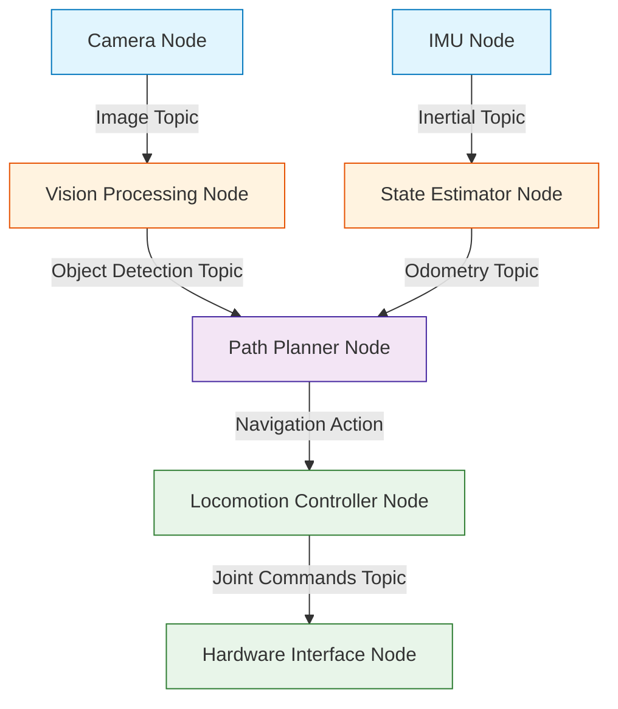

# ROS 2: The Robotic Nervous System

## 🌍 Real World Scenario

ایک ہیومینوائڈ ربوٹ کو 30 جسٹس، 5 سنسور، 3 کیمرے، اور ایک اسپیکر کے ساتھ کنٹرول کرنا ہے، جس کے لیے الگ الگ کوڈ فائلز ہیں جو ایک دوسرے سے بات نہیں کرتے ہیں۔ یہ سونے والا خواب ROS 2 کے لیے بنایا گیا تھا۔

Aap apni computer par baithte hain, apne robot ko chalne ke liye tayar hain. Aap ek brilliant Python script likhte hain jo camera ko padh sakta hai. Aap ek fast C++ program likhte hain jo balance ka hisaab karta hai. Aap ek aur script likhte hain jo motors ko chalne ke liye hota hai. Phir aapko lagta hai: kaise C++ balance program Python camera script se data padhta hai kam se kam panch millisecond mein? Aap apne khud ka custom TCP socket server likhna chahte hain? Aap data ko text file mein save karte hain aur phir padhte hain? Aap apne khud ka networking protocol banate hain? Jab aap yeh code ko jodne wala glue likhne ka kaam khatam karte hain,

## What You Will Learn

- The historical story of Willow Garage, why ROS 1 was created, and why it ultimately failed for production robotics.
- How ROS 2 replaced the fragile "master node" with a decentralized Data Distribution Service (DDS).
- The four core communication patterns: Nodes, Topics, Services, and Actions, using simple everyday analogies.
- How to architect a computational graph that routes data securely and predictably.
- When to use Python (`rclpy`) for rapid prototyping versus C++ (`rclcpp`) for hard real-time control.
- How to write a complete, working publisher node that broadcasts authentic humanoid joint states.

## The Problem ROS 2 Solves

ROS 2 کو غیر مساوی انڈسٹری اسٹینڈرڈ کہا جاتا ہے کیوں کہ اس کے لیے ربوٹکس کی تاریک دور کی سمجھ ہوتی ہے۔

پہلے 2007 سے پہلے، ہر یونیورسٹی لاب اور ربوٹکس کمپنی نے اپنی اپنی خصوصی سافٹ ویئر بنانے کے لیے پوری طرح سے شروع کی۔ اگر اسٹینفورڈ نے ایک ربوٹک بازو بنایا اور MIT اسے استعمال کرنا چاہتا تھا، تو MIT کو نیٹ ورکنگ، ڈرائیور، اور کنٹرول کوڈ کو پھر سے لکھنا پڑتا تھا۔ یہ ایک عرصہ تھا جس میں الگ تھلگ سیلوں کا دور تھا۔

فیر ایک ریسرچ لیب کا نام Willow Garage تھا جو ہر چیز کو بدل دیا۔ وہ یہ سمجھ گئے کہ 80 فیصد ربوٹکس پائپ لائننگ ہے: سنسور ڈیٹا کو کنٹرولرز تک پہنچانا، 3D پوائنٹس کو دیکھنا، اور ہارڈ ویئر ڈرائیورز کو منیج کرنا۔ 2007 میں، انہوں نے ربوٹ آپریٹنگ سسٹم (ROS) جاری کیا۔ یہ وندوز یا لینکس جیسا آپریٹنگ سسٹم نہیں تھا؛ ی

لیکن ROS 1 میں ایک موت کا نقص تھا۔ یہ تعلیمی تحقیق کے لیے ڈیزائن کیا گیا تھا، نہیں کہ پیداواری فیکٹریوں یا خود کار گاڑیوں کے لیے۔

ROS 1 mein har ek communication par ek hi, centralized "Master Node" par depend karta tha. Agar Master Node crash ho jata, toh puri robot ko communication blackout ka saamna karna padta. Iske alawa, ROS 1 mein security ka koi concept nahin tha, real-time guarantees nahin the, aur unstable Wi-Fi networks par performance bahut buri thi. ROS 1 ko kisi bhi commercial self-driving car ya factory floor humanoid mein lagana bahut hi riski hai.

:::danger ماسٹر نود بٹنھولٹ
ROS 1 mein ek bahut hi gharib darsan hai, jahan har ek pilot ko ek vishesh air traffic controller se baat karna hoga, phir hi kisi aur se baat karne ka adhikar milega. Agar us controller ko kuch bhi ho jata hai aur ve ghumne lagte hain, toh udaan ka plane crash ho jata hai.
:::

اِس طرح سے کمیونٹی نے اسے نیا بنیاد پر دوبارہ بنایا۔ ROS 2 کی پیدائش ہوئی۔

ROS 2 پر بھیڑ بھاڑ کے بجائے، ڈیٹا ڈسٹری بیوشن سروس (DDS) کے نام سے ایک صنعتی نیٹ ورکنگ معیار پر انحصار کیا جاتا ہے۔ DDS میں کوئی بھی ماسٹر نود نہیں ہوتا ہے۔ نود ایک دوسرے کو خود بخود دریافت کرتے ہیں اور سہی سہی طور پر ایک دوسرے سے رابطہ کرتے ہیں۔ اگر ایک نود کا کھاتا ہو جائے تو باقی نظام صاف چلتی ر

## How ROS 2 Works: The Nervous System Analogy

ایک ربات ایک تقسیم شدہ نظام ہے۔ ROS 2 کو مرکزی عصبی نظام کے طور پر سمجھیں جو دماغ کو عضلات اور آنکھوں کے درمیان جوڑتا ہے۔ ROS 2 کو ماسٹر کرنے کے لیے، آپ کو اس کی چار بنیادی تصورات کو سمجھنا ہوگا۔

### Nodes: Your Smartphone Apps
ایک **Node** ایک ایک ہی ایک قابل اجرا پروگرام ہے جو ایک مخصوص کام کرتا ہے۔ بجائے ایک بڑے، ملینوں لائنوں کے کوڈ والے پروگرام لکھنے کے جو پوری ربوٹ کو چلائے، آپ بہت سے چھوٹے نود لکھتے ہیں۔ ایک نود کیمرے کو پڑھتا ہے۔ ایک نود راستہ کا منصوبہ بناتا ہے۔ ایک نود بائیں پاؤں کو چلاتا ہے۔

*Analogy:* ہمارے موبائل فون کی طرح ہم نے ڈیوائس کو Nodes کہا ہے۔ ہمارا موسمی اپلیکیشن صرف موسمی حالات کے بارے میں ہے۔ ہمارا کیمرا اپلیکیشن صرف تصاویر لینے کے لیے ہے۔ اگر ہمارا موسمی اپلیکیشن کھنڈر ہو جائے تو ہمارا کیمرا اپلیکیشن اچھی طرح کام کرے گا۔ ایک ہیومینوائڈ میں، اگر بولنے والا Node کھنڈر ہو جائے

### Topics: The TV Channel
ایک **Topic** ایک نامیں بےسے ہے جہاں نودز مسلسل ڈیٹا کی بہت بڑی بہت بہت بہت بہت بہت بہت بہت بہت بہت بہت بہت بہت بہت بہت بہت بہت بہت بہت بہت بہت بہت بہت بہت بہت بہت بہت بہت بہت بہت بہت بہت بہت بہت بہت بہت بہت بہت بہت

*Analogy:* ایک ٹاپک ہمارے لیے ٹی وی چینل جیسا ہے۔ ایک ٹیلی ویژن اسٹیشن (پبلشر) چینل 5 (ٹاپک) پر خبروں کو نشر کرتا ہے۔ وہ یہ نہیں جانتے کہ ایک شخص دیکھ رہا ہے یا ملین افراد دیکھ رہے ہیں۔ آپ (سابسکرائب) چینل 5 میں دیکھنے کے لیے ٹیون۔ اگر آپ اپنا ٹی وی بند کر دیتے ہیں، اسٹیشن براڈکاسٹ جاری رکھتا

### Services: The Phone Call
ایک **Service** کا استعمال سینکروناس، درخواست-جواب کی تلاش کے لیے کیا جاتا ہے۔ آپ ایک درخواست بھیجتے ہیں، نود اسے عمل میں لاتا ہے، اور وہ ایک جواب واپس کرتا ہے۔ کالر رک جاتا ہے اور جواب پہنچنے تک انتظار کرتا ہے۔

*Analogy:* ایک سروس جیسے ہے کہ آپ کے پاس ایک ریسٹورنٹ کا فون ہے۔ آپ فون کرتے ہیں (Request)، کہتے ہیں کہ وہ کھلے ہیں یا نہیں، لائن پر انتظار کرتے ہیں جب تک کہ وہ چیک نہ کریں، اور وہ جواب دیتے ہیں "ہاں" (Response)۔ ہم سروسز کو تیز، قطعی سوالوں کے لیے استعمال کرتے ہیں، جیسے ک

### Actions: The Food Delivery
ایک **Action** کو لمبی مدت کے کام کے لیے استعمال کیا جاتا ہے۔ ایک سروس کی طرح، آپ ایک درخواست بھیجتے ہیں۔ لیکن ایک سروس کی طرح، ایک ایکشن آپ کو بے پناہ انتظار نہیں کرنے دیتا ہے۔ یہ آپ کو کام کرتے ہوئے مستقل فیدبیک بھیجتا ہے، اور آپ اسے کسی بھی وقت پہلے کہ وہ مکمل ہو جائے اسے منسوخ کر سکتے ہیں۔

*Analogy:* ایک عمل کی طرح کھانے کی ڈلیوری کا آرڈر ہے۔ آپ آرڈر کرتے ہیں (گول)۔ ایپ آپ کو بتاتی ہے "کھانا تیار کر رہا ہے... ڈرائیور کا راستہ ہے... 5 منٹ دور" (فیڈ بیک)۔ آخر میں کھانا پہنچتا ہے (ریسالت)۔ اگر وہ زیادہ دیر سے آتا ہے تو آپ آرڈر کو منسوخ کر سکتے ہیں۔ ہم رباتیاتی میں ایکشن کے لی

شروعاتی ٹیپ
جب اپنے ربات کو ڈیزائن کر رہے ہیں تو اپنے آپ سے پوچھیں: یہ ڈیٹا ongoing ہے؟ استعمال کریں: Topic. یہ ایک تیز سوال ہے؟ استعمال کریں: Service. یہ پانچ سیکنڈ لے گا اور میں اسے منسوخ کرنا چاہوں گا؟ استعمال کریں: Action.
:::

## The Computational Graph

جب آپ ایک ربات پر دہائیوں کے Nodes کو لانچ کرتے ہیں تو وہ ایک رابطہ کار کے جال کو تشکیل دیتے ہیں جو **Computational Graph** کہلاتا ہے۔ یہ گراف مکمل طور پر غیر مرکزی ہے۔

ہم ایک حقیقی دنیا کے نظام کا مطالعہ کرتے ہیں۔ بوسٹن ڈائنامکس کے Spot ربوٹ کے کتے میں یہ آرکٹیکچر بہت مشابہ ہے۔ اس میں بصیرت (سٹائرز کو دیکھنا)، حالت کا تخمینہ (اپنی اپنی پوزیشن کو جاننا) اور لوموشن (اپنے چار پاؤں کو چلانا) کے لیے الگ الگ ماڈیولز ہیں۔ یہ ماڈیولز تیزی سے ایک پب/سبسکرائب نیٹ ورک کے ذریع



## Setting Up Your First Workspace

پہلے کہ آپ نے Nodes بنانے کے لیے کچھ کرنا ہو، آپ کو یہ فیصلہ کرنا ہوگا کہ انہیں کس زبان میں لکھنا ہے۔ ROS 2 دو بنیادی کلائنٹ لائبریریز فراہم کرتا ہے: `rclpy` Python کے لیے اور `rclcpp` C++ کے لیے۔

پائٹھن (`rclpy`) بہت تیز رفتار پروٹو ٹائپنگ، کمپیوٹر ویژن انٹیگریشن، اور اعلیٰ سطح کی مصنوعی ذہانت کے فلو ورکس (جیسے ایل ایل ایم ای پی آئی کا کال کرنا) کے لیے بہت اچھا ہے۔ سی پلاس پلاس (`rclcpp`) ہارڈ ریال ٹائم کنٹرولرز کے لیے ضروری ہے— وہ کڑی جس میں ربات کو توازن دینا ہوتا ہے یا معکوس جینیات کا حساب لگانا ہوتا ہے،

ہم اس نصاب کے لیے پہلے پائتھن سے شروع کریں گے تاکہ آرکٹیکچر کو ماسٹر کیا جا سکے، پھر بعد میں آپ کرسٹیٹیکل لوز کو آپس میں اپ ڈیٹ کر سکتے ہیں۔

ایک مکمل کام کرنے والا پی تھن نود ہے جس میں ہلکی humanoid جسٹس کی حالت کو بھیجنا شامل ہے، جیسا کہ آپ ایک فزیکل ربوٹ پر انٹیگرٹ کرنے کے لیے کرینگے۔

```python
#!/usr/bin/env python3

# 1. Import the ROS 2 Python client library
import rclpy
from rclpy.node import Node

# 2. Import the standard JointState message type
# This is the industry standard for reporting motor positions
from sensor_msgs.msg import JointState

import math
import time

class HumanoidJointPublisher(Node):
    def __init__(self):
        # 3. Initialize the node with a unique name
        super().__init__('humanoid_joint_publisher')
        
        # 4. Create a publisher on the '/joint_states' topic
        # The '10' is the QoS history depth (queue size)
        self.publisher_ = self.create_publisher(JointState, '/joint_states', 10)
        
        # 5. Create a timer that fires 50 times a second (50 Hz)
        # High-frequency publishing is required for smooth robot motion
        timer_period = 0.02  # seconds
        self.timer = self.create_timer(timer_period, self.timer_callback)
        
        self.start_time = time.time()
        self.get_logger().info('Humanoid joint publisher started at 50Hz.')

    def timer_callback(self):
        # 6. Create the message object
        msg = JointState()
        
        # 7. Stamp the message with the exact current time
        # This is critical for synchronization in the computational graph
        msg.header.stamp = self.get_clock().now().to_msg()
        
        # 8. Define the joints we are controlling
        msg.name = ['left_knee_joint', 'right_knee_joint', 'torso_yaw']
        
        # 9. Calculate a smooth walking gait using sine waves
        elapsed = time.time() - self.start_time
        
        # Left and right knees operate completely out of phase (walking)
        left_knee = 0.5 * math.sin(elapsed * 2.0) + 0.5
        right_knee = 0.5 * math.sin(elapsed * 2.0 + math.pi) + 0.5
        
        # Torso twists slightly with the gait
        torso = 0.1 * math.sin(elapsed * 1.0)
        
        msg.position = [left_knee, right_knee, torso]
        
        # 10. Publish the message to the ROS 2 network
        self.publisher_.publish(msg)

def main(args=None):
    # Initialize the ROS 2 DDS communications
    rclpy.init(args=args)
    
    # Instantiate our node
    node = HumanoidJointPublisher()
    
    try:
        # Keep the node running indefinitely
        rclpy.spin(node)
    except KeyboardInterrupt:
        pass
    finally:
        # Clean up safely on exit
        node.destroy_node()
        rclpy.shutdown()

if __name__ == '__main__':
    main()
```

پرو انسائٹ
ہم Explicitly stamp کرتے ہیں کہ message میں `msg.header.stamp`۔ humanoid میں، sensor data کے بغیر timestamp کا مطلب ہے کہ data بے مقصد ہے۔ اگر balance controller کو نہیں پتہ چلتا کہ knee کب 0.5 رادیان پر تھا، تو وہ غلط torque کا حساب لگائے گا اور robot گر جائے گا۔
:::

## 💡 Key Concepts Summary

| Concept | Meaning | Real robot example |
|---|---|---|
| **Middleware** | Software that connects disparate hardware and software components. | A single framework allowing a Python AI script to move a C++ motor controller. |
| **DDS** | Data Distribution Service, the decentralized networking standard used by ROS 2. | A military-grade protocol ensuring the robot's emergency stop signal is never lost. |
| **Node** | A single, focused executable program in the ROS 2 graph. | A standalone Python script that only reads data from the left eye camera. |
| **Topic** | A continuous data stream where nodes publish or subscribe anonymously. | The `/cmd_vel` stream where the navigation brain sends speed commands to the wheels. |

## 🧪 Practice Exercises

### Exercise 1 (Beginner): Architecture Mapping
**Publisher-Subscriber Script**
================================

```python
import rospy

# Define publishers and subscribers
class DeskRobot:
    def __init__(self):
        self.publisher = rospy.Publisher('part1_topic', String, 10)
        self.publisher2 = rospy.Publisher('part2_topic', String, 10)
        self.subscriber = rospy.Subscriber('part3_topic', String, self.callback)

    def callback(self, data):
        print("Received data: ", data.data)

    def publish(self):
        self.publisher.publish("Part 1 data")
        self.publisher2.publish("Part 2 data")

if __name__ == '__main__':
    rospy.init_node('desk_robot')
    desk_robot = DeskRobot()
    desk_robot.publish()
    rospy.spin()
```

**Roman Urdu Translation**
---------------------------

**پبلش-سबسکرایبر سکرپٹ**
---------------------------

```python
import rospy

# پبلش کرنے

```python
# Starter skeleton: Map your real world to a ROS 2 graph
publishers = {
    "webcam": "publishes video frames",
    "microphone": "publishes audio chunks",
}

subscribers = {
    "speaker": "subscribes to audio commands",
    "monitor": "subscribes to display signals",
}

for item, role in publishers.items():
    print(f"Node '{item}' acts as a Publisher because it {role}.")
```

### Exercise 2 (Intermediate): The QoS Decision Matrix
Kuch data kiya jaana hai kiya reliable ho, kuch data kiya jaana hai kiya fast ho. Ek script likhna hai jo alag-alag robot scenarios ke liye sahi communication pattern aur speed priority assign karega.

```python
# Starter skeleton: Decide the architecture for these tasks
scenarios = {
    "streaming_4k_video": "Topic (Fast)",
    "asking_battery_level": "Service (Reliable)",
    "navigating_to_kitchen": "Action (Reliable + Feedback)",
}

for task, pattern in scenarios.items():
    print(f"To execute '{task}', I will use a {pattern}.")
```

### Exercise 3 (Advanced): Modifying the Publisher
**Adding a New Joint to HumanoidJointPublisher**
=====================================================

**Step 1: Define the New Joint**
-------------------------------

```c
// Define the new joint
Joint* left_shoulder_pitch_joint = new Joint("left_shoulder_pitch", 0.0, 0.0, 0.0, 0.0, 0.0, 0.0);
```

**Step 2: Add the New Joint to the Robot Model**
---------------------------------------------

```c
// Add the new joint to the robot model
robot_model->addJoint(left_shoulder_pitch_joint);
```

**Step 3: Define the Joint's Movement**
--------------------------------------

```c
// Define the joint's movement
left_shoulder_pitch_joint->setDof(1);
left_shoulder_pitch_joint->setLowerLimit(-1.57);
left_shoulder_pitch_joint->setUpperLimit(1.57);
left_shoulder_pitch_joint->setPivot(0

```python
# Hint: You will need to modify msg.name and msg.position
msg.name = ['left_knee_joint', 'right_knee_joint', 'torso_yaw', 'left_shoulder_pitch']

# The left shoulder should swing forward when the right knee moves forward
left_shoulder = 0.4 * math.sin(elapsed * 2.0 + math.pi)

# Don't forget to append it to the position array!
msg.position = [left_knee, right_knee, torso, left_shoulder]
```

## ✅ Key Takeaways

- ROS 1 proved that robotics needed standardized middleware, but its centralized Master Node architecture was too fragile for commercial production.
- ROS 2 adopted the decentralized, military-grade DDS protocol, making the robotic nervous system secure, reliable, and real-time capable.
- The Computational Graph is built of small, isolated Nodes that do one job perfectly—acting like apps on a smartphone.
- Topics are for continuous streaming, Services are for quick questions, and Actions are for long-running tasks with feedback.
- Python (`rclpy`) is excellent for AI and orchestration, while C++ (`rclcpp`) is required for high-frequency, real-time control loops.

## 🔗 Next Up

اب کہ آپ کو آرکٹیکچرل تھیوری کا سمجھ آ گیا ہے، اب وقت آ گیا ہے کہ اسے بنائیں۔  اگلے باب میں، ہم Nodes، Topics، اور ہماری ربوٹ سے پیغامات گم ہونے سے روکنے والی اہم QoS Settings کے لئے ڈپ کے لئے کڈ کے اندر جاتے ہیں۔

## 📚 Resources

- [ROS 2 Humble Documentation](https://docs.ros.org/en/humble/)
- [Understanding DDS in ROS 2](https://docs.ros.org/en/humble/Concepts/Intermediate/About-Internal-Interfaces.html)
- [Sensor Messages / JointState Specification](https://docs.ros2.org/latest/api/sensor_msgs/msg/JointState.html)
