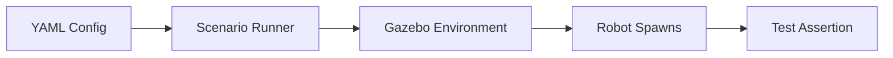

# Deterministic Testing Scenarios in Simulation

## 🌍 Real World Scenario

آپ کا ربات 50 نेवیگیشن ٹیسٹ پاس کر گیا۔ پھر اس نے ایک تھوڑی سے مختلف چیئر کا سامنا کیا — ایک ہی رنگ، مختلف پاوں کی مسافت — اور اس میں چل کر ٹک گیا۔  نہیں ہو سکتا کہ آپ کا ربات کیا نہیں جانتا ہے، اگر آپ نے نہیں کیا ہے وہ ٹیسٹ سے۔

یہ ہے ربوٹکس ڈویلپمنٹ میں چھپا ہوا دھوکہ: ہم Aggregate کامیابی ("50 ٹیسٹ پاس") کی خوشی مناتے ہیں جبکہ Tiny Environmental Variations میں چھپے Fragile Failure Modes کو نظر انداز کرتے ہیں۔ سافٹ ویئر انجینئرنگ میں، ہم نے یہ سبق سالوں پہلے Unit Tests، Regression Tests، اور Reproducible CI Pipelines کے ذریعے سیکھا ہے۔ ربوٹکس کو بھی اسی ذہنیت کی ضرورت ہے، لیکن Emb

Ek deterministik simulaashan scenario robotics ke liye ek unit test fixture ka barabar hai: yeh kafi variables ko freeze karta hai jisse aap run ke beech comparisons par trust kar sakte hain. Agar robot aaj fail karta hai aur kal pass tha, usi exact same scenario seed ke saath, to yeh regression ke strong signal hai. Agar yeh fail karta hai sirf tabhi jab aap ek parameter ko vary karte hain (chair leg spacing, glare intensity, corridor width), to yeh generalization boundaries ke strong signal hai.

یہ باب سیمیلیشن سے متعلق سہولت کے سہولت کے سہولت کے سہولت کے سہولت کے سہولت کے سہولت کے سہولت کے سہولت کے سہولت کے سہولت کے سہولت کے سہولت کے سہولت کے سہولت کے سہولت کے سہولت کے سہولت کے سہولت کے سہولت کے سہولت کے سہولت کے سہولت کے سہ

## What You Will Learn

- What makes a scenario deterministic and why determinism is foundational for robotics testing.
- How to classify scenarios into navigation, manipulation, social interaction, and emergency response suites.
- Which edge cases matter most for real deployments (narrow corridors, reflective floors, dynamic humans).
- How to express scenario configs in YAML in a way that is clear and automatable.
- How to define pass/fail criteria that are objective and machine-checkable.
- How to build parametric scenario sets to evaluate robustness and generalization.
- How and why to record simulation videos for post-run forensic review.
- How to implement a Python test runner that executes scenario files and outputs structured results.

## Why deterministic scenarios are the core of test-driven robotics

بے یقینی حالات کے بغیر، ڈیبگنگ کا عمل کہانی بن جاتا ہے:

- “It worked yesterday.”
- “Maybe Gazebo was slower.”
- “Maybe the robot started from a slightly different pose.”
- “Maybe LiDAR noise was random.”

کے ساتھ یقینی ہالٹیں، ڈیبگنگ انجینئرنگ بن جاتی ہے:

- Same seed, same world, same noise profile, same initial state.
- Any behavior change can be investigated as a software/config regression.

ٹیسٹ ڈرائیونڈ ربوٹکس میں، ایک سِناریو کو ایک سافٹ ویئر ٹیسٹ کی طرح کام کرنا چاہیے:
1. Setup is explicit.
2. ایکشن کو کنٹرول کیا جاتا ہے۔
Teesra. Tashahhud hain.
Chār. Nataijain uljhan karne mein sakht hai.

یہ یہاں ٹیموں کو ڈیمو سے قابل اعتماد خودمختاری تک پہنچنے کا طریقہ ہے۔

## What makes a scenario deterministic

ایک سِنہیوں کا سِنارو  وہ ہوتا ہے جب ہر ہلکا  سے  randomness کا  ماخذ  fixed  یا  explicit طور پر کنٹرول کیا  جاتا ہے۔

### 1) Fixed random seed
agar object placement, noise models, ya policy sampling random generators par aasaar karte hain, unhein seed karein.

### 2) Fixed spawn positions and poses
ماہول کا ابتدائی پوزیشن اور اشیا کی ترمفز کو بہت سے دقت سے درست ہونا چاہیے۔ چھوٹی سی پوزیشن کا ڈریفت غلط نتیجہ کی ورینس کو غلط بنا سکتا ہے۔

### 3) Fixed sensor noise profile
شَورُؤُں کو بنیادی ٹیسٹوں کے لئے نِصّی ہونا چاہیے (یا سےڈڈ سٹوچسٹک ماڈلز کا استعمال کریں)۔

### 4) Fixed world state and physics config
استعمال کرنے والے مستقل دنیا کے فائلز،摩ment کی قدر، اور سیمیولیشن اسٹیپ کی سٹیٹسٹک.

### 5) Fixed timing and timeout conditions
پاس/فیل  وندوزوں کو مبہم نہیں ہونا چاہیے۔  31 سیکنڈ میں حاصل کردہ مقصد 30 سیکنڈ کے ٹائم آؤٹ کے ساتھ فیل ہونا چاہیے۔

Deterministic khaas kar ke "hamesha asan" nahin kehta hai. Yeh kehata hai ki aapka benchmark stable hai aur regression ko detect kar sakte hain, phir aap controlled variation layer karke robustness evaluation karte hain.

## Scenario categories: build a complete test suite, not a single demo

### Navigation scenarios
- Goal reaching under static/dynamic obstacles.
- Corridor traversal and doorway passage.
- Recovery from blocked path segments.

### Manipulation scenarios
- Reach, grasp, lift, place tasks.
- Contact-sensitive interactions (mugs, boxes, deformable packaging).
- Regrasp and recovery after partial failures.

### Social interaction scenarios
- Human-aware navigation distance rules.
- Turn-taking in shared spaces.
- Response timing for voice or gesture cues.

### Emergency response scenarios
- Emergency stop latency.
- Safe halt on sensor blackout.
- Behavior under localization loss or dropped command channels.

ہر زمرے میں ڈٹرمنسٹک بنیادی کیسز اور پیمائشی واریانٹس ہونے چاہئیں۔

## Edge cases that expose true capability

ٹیموں کو اکثر "خوشگوار راستہ" کے نقشوں کو زیادہ سے زیادہ ٹیسٹ کرنے اور آپریشنل ایج کیسز کو کم سے کم ٹیسٹ کرنے کی وجہ سے نقصانات ہوتے ہیں:

### Narrow corridors
پلاننگ جو کھلے ہوئے علاقوں میں کام کرتا ہے وہ محدود جارجیومیٹری میں ہلچل یا موڑ میں پھنس جاتا ہے۔ سینٹی میٹر سطح کی کlearance margins کے ساتھ ٹیسٹ کریں۔

### Reflective floors (LiDAR confusion)
اچھے پرتوں سے بہت زیادہ روشنی کی واپتیت ہو سکتی ہے، جس سے غیر مستحکم واپتیت، Ghost Points، یا کم اعتماد ہو سکتا ہے۔ ہٹا ہوئی بصارت کو شبہہ کیا جائے اور احتیاطی رویہ کا دعویٰ کیا جائے۔

### Dynamic humans
ہم جنس افراد متحرک ہیں، ثابت نقطہ رکاوٹ نہیں ہیں۔ ٹیسٹ کراس ٹراجیکٹری، تیز رفتار رکاوٹ، اور گروپ موومنٹ پैटرنز۔

### Chair-like geometric ambiguity
جسمانی شکل میں مماثلت والے اشیاء لیکن مختلف حمایت جارجیومیٹری (جیسے کہ چیئر لگ کے فاصلے) والے اشیاء سیکھے ہوئے پالیسیوں کو توڑ سکتے ہیں۔ پیمائشی ٹیسٹوں میں یہ نازک پیمائشیں بدلنا چاہیے۔

### Occlusion and partial observability
ماہول میں موجود سنسور کی خالی جگہوں کو ہنڈیا کرنے اور تاخیر شدہ دوبارہ حاصل کرنے کی صلاحیت رکھنے والا ربوٹ ہونا چاہیے۔

Agar aapki suite mein in cheezain nahin hain, toh aapka pass rate badhaya hua hai.

## YAML scenario configs: make tests readable and automatable

ایک اچھی سِناریو کانفیگ کو جواب دینا چاہیے:
- What world?
- What robot start pose?
- What entities spawn where?
- Which deterministic controls are enabled?
- What success criteria define pass/fail?

آم لوگ کی پڑھی جانے والی YAML بہترین ہے کیونکہ یہ رباتک، QA، اور پیداواری ذمہ داروں کے ذریعے جائزہ لینے کے لیے ہے۔

## 💻 Code Example 1: YAML scenario definition for navigation

```yaml
# file: scenarios/nav_warehouse_chair_variation.yaml
scenario:
  id: nav_warehouse_chair_variation
  category: navigation
  description: "Reach loading bay while avoiding chair with altered leg spacing"

determinism:
  seed: 4242
  fixed_time_step: 0.001
  sensor_noise_mode: deterministic
  physics_engine: dart

world:
  file: worlds/warehouse_aisle.world
  lighting_profile: evening_shift
  floor_material: polished_reflective

robot:
  namespace: robot1
  initial_pose:
    x: 0.5
    y: -1.0
    z: 0.0
    yaw: 1.57

entities:
  - name: chair_variant_a
    model: chair
    pose: {x: 2.4, y: 0.2, z: 0.0, yaw: 0.0}
    params:
      leg_spacing_cm: 38
  - name: pallet_stack_1
    model: pallet_stack
    pose: {x: 4.0, y: -0.3, z: 0.0, yaw: 0.0}

goal:
  frame: map
  pose:
    x: 6.0
    y: 1.2
    yaw: 0.0

assertions:
  must_reach_goal: true
  collision_count_max: 0
  timeout_sec: 30
  min_clearance_m: 0.15

recording:
  enable_video: true
  output_path: artifacts/videos/nav_warehouse_chair_variation.mp4
  camera: overhead_observer
```

یہ تعریف منظم، جائزہ لی جانے والی، اور مشین چلانے والی ہے۔

## Automated pass/fail criteria: remove subjective grading

Simulashan ko "RViz mein dekha to theek lag raha tha" ke hisaab se na graad kiya jaye. Avasyak roop se niyamit karne ki zaroorat hai.

آم Assertion:

1. **Goal completion**: Did the robot reach goal pose within tolerance?
2. **Collision budget**: کیا کوئی تصادم ہوا؟ کتنی رابطے تھریشول سے اوپر تھیں؟
3. وقت کی حد: کیا یہ وقت سے پہلے مکمل ہو گیا؟
چار۔ **سفری حدود**: کیا ہموارہیں/انسانوں کے قریب کم از کم فاصلہ برقرار رکھا گیا تھا؟
5. **کمان کی ثبوت**: کمان کی تکان کی حد سے زیادہ ہو گئی ہے؟

لی مین یپٹیشن ٹیسٹس کے لیے اضافی دعوے شامل کریں
- Grasp success rate.
- Object drop events.
- Final placement pose error.

ایک سِنہریوں کا تجربہ ختم ہونا چاہیے `PASS` یا `FAIL` کے ساتھ ہیں، ساتھ ہی مشین قابل پڑھنے کی ناکامی کی وجوہات۔

## 💻 Code Example 2: Python test runner for scenario pass/fail

```python
#!/usr/bin/env python3
# file: tools/run_scenarios.py

import argparse
import dataclasses
import json
import subprocess
import time
from pathlib import Path

import yaml


@dataclasses.dataclass
class ScenarioResult:
    scenario_id: str
    passed: bool
    reason: str
    duration_sec: float
    collisions: int
    reached_goal: bool


def load_yaml(path: Path) -> dict:
    with path.open('r', encoding='utf-8') as f:
        return yaml.safe_load(f)


def launch_sim(world_file: str) -> subprocess.Popen:
    # Replace command with your project-specific launch entrypoint
    cmd = ['ros2', 'launch', 'humanoid_sim', 'sim_humanoid.launch.py', f'world:={world_file}']
    return subprocess.Popen(cmd, stdout=subprocess.PIPE, stderr=subprocess.PIPE, text=True)


def run_robot_task(scenario: dict, timeout_sec: int) -> tuple[bool, int, bool, str]:
    # Placeholder integration points for your stack:
    # - send goal
    # - monitor robot state
    # - monitor collision topic/log
    # - return objective metrics
    start = time.time()
    simulated_collision_count = 0
    simulated_reached_goal = True

    # Simulated deterministic loop (replace with actual telemetry checks)
    while time.time() - start < min(timeout_sec, 2):
        time.sleep(0.1)

    if not simulated_reached_goal:
        return False, simulated_collision_count, False, 'goal_not_reached'

    if simulated_collision_count > scenario['assertions']['collision_count_max']:
        return False, simulated_collision_count, True, 'collision_budget_exceeded'

    return True, simulated_collision_count, True, 'ok'


def execute_scenario(file_path: Path) -> ScenarioResult:
    cfg = load_yaml(file_path)
    scenario = cfg['scenario']

    scenario_id = scenario['id']
    timeout_sec = scenario['assertions']['timeout_sec']
    world_file = scenario['world']['file']

    t0 = time.time()
    proc = launch_sim(world_file)

    try:
        passed, collisions, reached_goal, reason = run_robot_task(scenario, timeout_sec)
        duration = time.time() - t0
        return ScenarioResult(
            scenario_id=scenario_id,
            passed=passed,
            reason=reason,
            duration_sec=duration,
            collisions=collisions,
            reached_goal=reached_goal,
        )
    finally:
        proc.terminate()
        try:
            proc.wait(timeout=5)
        except subprocess.TimeoutExpired:
            proc.kill()


def main() -> int:
    parser = argparse.ArgumentParser()
    parser.add_argument('--scenario', required=True, help='Path to YAML scenario file')
    parser.add_argument('--json-out', default='artifacts/results/latest_result.json')
    args = parser.parse_args()

    result = execute_scenario(Path(args.scenario))

    Path(args.json_out).parent.mkdir(parents=True, exist_ok=True)
    with open(args.json_out, 'w', encoding='utf-8') as f:
        json.dump(dataclasses.asdict(result), f, indent=2)

    print(f"[{result.scenario_id}] {'PASS' if result.passed else 'FAIL'}")
    print(f"reason={result.reason} duration={result.duration_sec:.2f}s collisions={result.collisions}")

    return 0 if result.passed else 1


if __name__ == '__main__':
    raise SystemExit(main())
```

یہ رنر منصوبہ بنایا گیا ہے جیسے ایک سافٹ ویئر ٹیسٹ ہارنیش: منظم داخلہ، صریح دعوے، منظم نتیجہ، سی آئی کے لیے خروج کوڈ سماتک۔

## Parametric scenarios: testing generalization, not memorization

Deterministic baseline scenarios catch regressions. Parametric scenarios test robustness.

ایک پیماںٹک سِناریو میں کوری ٹاسک انٹینٹ کو فکس رکھا جاتا ہے جبکہ ایک یا زیادہ کنٹرولڈ ڈائمنشنز کو بدل دیا جاتا ہے۔
- chair leg spacing (36–46 cm)
- corridor width (0.75–1.1 m)
- floor reflectivity coefficient
- human crossing speed and trajectory

Agar aapka model sirf ek aik sahi geometry par kaam karta hai, to yeh scenario yaad dilli ki overfit hai.

بہترین طریقہ کار
1. Keep baseline deterministic case as reference.
دو۔ 10-100 پیمائشی ورینٹس چلانے کے لیے۔
3. Report aggregate metrics (pass rate, median time, worst-case clearance).
چار. کمیٹس کے اوور پر ٹریک ڈریفت کرنے کے لئے.

## 💻 Code Example 3: Parametric scenario testing 10 variations

```python
#!/usr/bin/env python3
# file: tools/run_parametric_nav.py

import copy
import json
from pathlib import Path

import yaml

from run_scenarios import execute_scenario


def generate_variants(base_cfg: dict) -> list[dict]:
    variants = []
    for i, leg_spacing in enumerate(range(34, 44)):  # 10 values: 34..43
        cfg = copy.deepcopy(base_cfg)
        cfg['scenario']['id'] = f"nav_chair_spacing_{leg_spacing}cm"
        cfg['scenario']['entities'][0]['params']['leg_spacing_cm'] = leg_spacing
        cfg['scenario']['recording']['output_path'] = (
            f"artifacts/videos/nav_chair_spacing_{leg_spacing}cm.mp4"
        )
        variants.append(cfg)
    return variants


def write_variant(cfg: dict, out_path: Path):
    out_path.parent.mkdir(parents=True, exist_ok=True)
    with out_path.open('w', encoding='utf-8') as f:
        yaml.safe_dump(cfg, f, sort_keys=False)


def main() -> int:
    base_file = Path('scenarios/nav_warehouse_chair_variation.yaml')
    with base_file.open('r', encoding='utf-8') as f:
        base_cfg = yaml.safe_load(f)

    variants = generate_variants(base_cfg)
    results = []

    for cfg in variants:
        sid = cfg['scenario']['id']
        scenario_file = Path(f"artifacts/generated_scenarios/{sid}.yaml")
        write_variant(cfg, scenario_file)
        result = execute_scenario(scenario_file)
        results.append({
            'scenario_id': result.scenario_id,
            'passed': result.passed,
            'reason': result.reason,
            'duration_sec': result.duration_sec,
        })

    Path('artifacts/results').mkdir(parents=True, exist_ok=True)
    with Path('artifacts/results/parametric_nav_results.json').open('w', encoding='utf-8') as f:
        json.dump(results, f, indent=2)

    pass_count = sum(1 for r in results if r['passed'])
    print(f"Parametric pass rate: {pass_count}/{len(results)}")

    # Require at least 9/10 to pass for this gate
    return 0 if pass_count >= 9 else 1


if __name__ == '__main__':
    raise SystemExit(main())
```

یہ ایک قطعی سِناریو کو کنٹرولڈ جنرلائزیشن سٹیٹس میں تبدیل کرنے اور سی آئی فرینڈلی آرٹیفیکٹس پیدا کرنے کے لیے استعمال ہوتا ہے۔

## Video recording simulation runs for review

Metrics aapko batate hain ki koi failure hua hai. Video aapko batata hai ki woh kyun hua.

آپ کو اہم سِناریوں کے لئے ریکارڈ کرنا چاہیے:
- Regression triage.
- Postmortem review with cross-functional teams.
- Labeling failure taxonomy (perception miss, planner deadlock, controller overshoot).

دیکھ بھال کرنے والے گائیڈ لائنز:
1. Use fixed observer camera pose for comparability.
2. ٹائم سٹیمپ اور سکینری آئی ڈی کو اوور لے۔
3. Structured artifact paths mein bachao (`artifacts/videos/<scenario_id>.mp4`).
چار. ڈیفالٹ میں فیل ہونے والے رن کے کلیپس کو برقرار رکھیں، کامیاب رن کے نمونے لیں۔

جب طالب علم پاس اور فیل ہونے والے ورژنوں کے سائڈ بائی سائڈ ویڈیوز کو ریویو کرتے ہیں، ڈیبگنگ کی رفتار بہت تیزی سے بہتر ہوجاتی ہے۔

## Test-driven workflow for robotics teams

ایک عملی چکر جو آپ اسی وقت اپنائیں گے:

1. Write or update one deterministic scenario YAML.
چلائیں 2. مقامی سِناریو کے ساتھ پاس/فیل پاس کا تصدیق.
تین. کم از کم ایک ایجیکے کے ورژن کو شامل کریں۔
چار. صرف جب deterministic baseline pass ho to commit karein.
5. پیمائشی سٹیٹس کا چلاوں میں رن کرائیں۔
چھ: ویدئوز کو کسی بھی ناکامی کے لئے جائزہ لینے سے پہلے ملاپ کریں۔

یہ ربوٹکس کا ایک ایسا متبادل ہے جس کا مطلب ہے کہ یہ ریڈ-گرین-ریفریکٹر کا ربوٹکس ورژن ہے۔
- **Red**: scenario fails.
- **Green**: minimum fix to pass deterministically.
- **Refactor**: improve robustness, then validate parametric suite.

## Architecture Diagram



## 💡 Key Concepts Summary

- Deterministic scenarios are the reproducible test fixtures of robotics.
- Fixed seeds, fixed spawn poses, and fixed noise profiles are essential for regression confidence.
- Scenario suites should cover navigation, manipulation, social behavior, and emergency response.
- Edge cases reveal true capability; happy-path-only testing gives false confidence.
- YAML configs make scenarios readable, reviewable, and automation-friendly.
- Pass/fail criteria must be objective and machine-evaluable.
- Parametric variants measure generalization boundaries.
- Video artifacts accelerate root-cause analysis and team learning.

## 🧪 Practice Exercises

### Exercise 1 (Beginner)
ایک منظم توجہ کے سےں سِناریو بنائیں جس میں ایک فکسڈ سیڈ اور ایک سٹیٹک بارڈر ہو۔ تین دعوے بنائیں: منزل پہنچ گئی، صفر تصادم، 20 سیکنڈ سے کم ٹائم آؤٹ.

```yaml
# Hint: model it after nav_warehouse_chair_variation.yaml
```

### Exercise 2 (Intermediate)
آپ کے سkenریو رانر کو ایک بار پھر بڑھایا جائے گا تاکہ ہر چلنے کے دوران کم از کم رکاوٹ کی چھوٹ کو جمع کریں اور اگر چھوٹ 0.12 میٹر سے کم ہو جائے تو فیل ہو جائیں۔

```python
# Hint: subscribe to nearest-obstacle telemetry and track min value across run.
```

### Exercise 3 (Advanced)
Banaenay kay liye 20-variation parametric suite kiya jata hai jo corridor width aur reflective floor coefficient ko ek saath vary karta hai. Iske baad navigation tuning change ke pehle aur baad ki pass rate ka comparison kiya jata hai.

```bash
# Goal: prove improved generalization, not just single-case success.
```

## ✅ Key Takeaways

- Deterministic scenarios let you detect regressions with confidence.
- Test-driven robotics treats scenarios as executable quality contracts.
- Edge cases and parametric sweeps reveal what your robot truly understands.
- Objective pass/fail assertions and CI integration are mandatory for scaling.
- Video + metrics together form the fastest path to robust debugging.

## 🔗 Next Up

اگلے باب: ڈومین رینڈومائزیشن اور کوریکولم ڈیزائن— کیسے سسٹماتک طور پر سکیینو ڈویورسیٹی کو بڑھائیں جبکہ میٹریبل پروگریس کو محفوظ رکھیں جو ریال ورلڈ ٹرانسفر کی طرف ہو۔