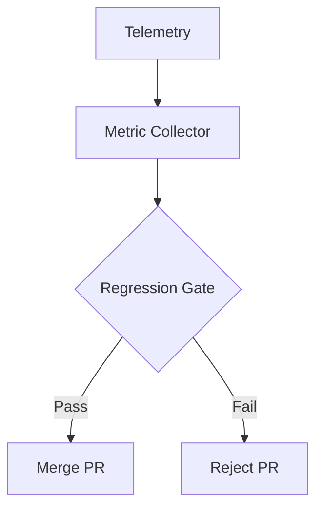

# Metrics and Regression Gates

## 🌍 Real World Scenario

آپ نے اپنے ربات کے ہاتھوں کی چپٹی کی کامیابی کی شرح 70% سے 85% تک بڑھا دی۔ آپ نے کوڈ کو پوسٹ کیا۔ اگلے دن، کوئی رپورٹ کرتا ہے کہ ربات اب دیواروں میں چلا جاتا ہے۔ آپ نے ایک چیز کو بہتر کیا اور دوسری کو ٹوٹا دیا۔ ریگریشن گیٹس نے اسے پکڑا ہوتا۔

یہ ربوٹکس ٹیموں میں سب سے عام پہلے قدموں میں سے ایک ہے۔ شروع کرنے والے عام طور پر ایک KPI کو ایک وقت میں اپ گریڈ کرتے ہیں اور مقامی جیتوں کو مناتے ہیں۔ پیشہ ور ٹیمز سسٹم سطح کی رفتار کو **ریگریشن گیٹس** سے محفوظ رکھتی ہیں: ہر پال ری کویسٹ کو ثابت کرنا ہوتا ہے کہ کوئی بھی اہم میٹرک پالیسی کی حد سے نیچے

Software engineering mein CI/CD pipelines quality ko PR par har test se enforce karte hain. Robotics ko bhi isi discipline ki zaroorat hai, lekin physical behavior metrics ke saath. Aapka robot ek static web page nahin hai. Yeh ek probabilistic control system hai jo noisy environments mein kaam karta hai. Yehi wajah hai ki metrics, automation, aur statistical confidence ki zaroorat hai.

## What You Will Learn

- Which core robotics metrics matter most in simulation and why.
- How to instrument Gazebo runs to collect metrics automatically.
- How regression gates prevent “fix one thing, break another” failure modes.
- How to run simulation quality checks in GitHub Actions on every PR.
- How to generate simple trend dashboards from simulation logs.
- How Bayesian reasoning helps determine enough runs for confidence.
- How to turn metrics from optional reporting into enforced release policy.

## Why regression gates are the missing beginner skill

آپسی شروعاتی رباتکس ورک فلو کا یہی ہوتا ہے:
1. Change planner/controller/perception code.
چلائیں ایک سkenریو ہاتھ سے.
3. agar "acha lagta hai" to mila lo.

یہ بہت ہی کمزور ہے کیونکہ:
- Visual inspection is subjective.
- Single-run outcomes are noisy.
- Improvements in one subsystem can silently degrade another.

ایک میٹرکس اور گیٹس ورک فلو اسے تبدیل کرتا ہے۔
1. Run a fixed suite of deterministic scenarios.
2. مقاصد کی مقامی معیاروں کو جمع کریں۔
Tareeqa-e- Baseline aur Threshold ke khilaaf Muqabla Karen.
چار. PR کو خودکار طور پر جب تک کہ کسی بھی ضروری میٹرک کی واپسی نہ ہو۔

یہ یہاں ہے کہ سافٹ ویئر گریڈ کی معیار کی ضمانت robotics engineering میں داخل ہوتی ہے۔

## Key robotics metrics you should track

آپ کچھ نہیں بہتر بناسکتے ہیں جسے آپ نہیں پیمائش کرتے ہیں۔ پیداواری سِمولیٹک سٹوڈیوز کے لیے، یہ میٹرکس عام طور پر کم سے کم ساتھ ہوتے ہیں۔

### 1) Task success rate
Percentage of runs jo ki primary objective (goal reached, object grasped, etc.) ko poora karte hain.

### 2) Path efficiency
ڈیٹورز کی تعداد کو آپٹیمل/ریفرنس پتھ کی لمبائی سے تقسیم کرکے حاصل ہونے والی تعداد کو کم کرنا بہتر ناواقفیت کی گुणवत्तہ کا اشارہ ہے۔

### 3) Collision rate
اوسط ٹکراؤں کا اوسط (یا ٹکراؤ کی امکانات)۔ محفوظ؛ اکثر سخت ترین گیت۔

### 4) Manipulation accuracy
Pose error at grasp/place completion (position/orientation deltas) - Pose error at grasp/place completion (position/orientation deltas)

### 5) Time-to-completion
زمرہ بندی کی وقت کی حد

Mila kar, yeh ek system-level dekhbhal pradan karte hain: sirf "kya poora hua" balki "kya poora hua sahi se, kamyabi se, aur sahi tarah se".

## Metrics table with threshold examples

| Metric | Definition | Example Threshold (Gate) | Why it matters |
|---|---|---|---|
| Task success rate | % runs meeting objective | **&gt;= 0.90** | Reliability of behavior under test suite |
| Path efficiency | Optimal/actual or normalized route ratio | **&gt;= 0.80** | Prevents regressions that wander or oscillate |
| Collision rate | Collisions per run | **&lt;= 0.05** | Core safety signal |
| Manipulation accuracy | Final pose error (m) | **&lt;= 0.03 m** | Determines useful grasp/place performance |
| Time-to-completion | Seconds to complete task | **&lt;= 25 s** | Protects latency and throughput budgets |

اہم: حد بندی کے معیار فیصلوں کی پالیسی ہیں، نہ کہ عام آئندہ. ہر ہر مہم کے خطرے کے پروفائل اور تعینات ہونے کے متناسب متناسب معیار کے مطابق ہونا چاہیے.

## Instrumenting Gazebo to record metrics automatically

ایک مضبوط انسٹرومنٹیشن لूप میں تین لےائرز ہوتے ہیں:

1. **Telemetry capture**
Subskrib karein relevant ROS topics (`/odom`, `/tf`, `/scan`, contact/collision topics, task event topics).

2. ہوے جانے والی واقعات کی تفصیل
ٹیلی میٹری ڈیٹا کو سماجی واقعات میں تبدیل کریں
   - `goal_reached`
   - `collision_detected`
   - `grasp_success`
   - `timeout`

3. ہمہ جہتی مجموعہ
کام کرنے والے سے منسلک میٹرکس کی گنتی کریں اور مشین پڑھنے والے فائل فارمیٹ (`json/csv`) میں مواد لکھیں۔

agar yeh manual hai, to yeh skip ho jayega. agar yeh automatic aur tez hai, to yeh aadaat ban jata hai.

## 💻 Code Example 1: Python metrics collector hooked to simulation

```python
#!/usr/bin/env python3
# file: tools/metrics_collector.py

import argparse
import json
import math
import time
from dataclasses import dataclass, asdict

import rclpy
from rclpy.node import Node
from nav_msgs.msg import Odometry
from std_msgs.msg import Bool
from geometry_msgs.msg import PoseStamped


@dataclass
class RunMetrics:
    scenario_id: str
    success: bool
    collisions: int
    path_length_m: float
    direct_distance_m: float
    path_efficiency: float
    completion_time_s: float
    manipulation_error_m: float


class MetricsCollector(Node):
    def __init__(self, scenario_id: str, timeout_s: float):
        super().__init__('metrics_collector')
        self.scenario_id = scenario_id
        self.timeout_s = timeout_s

        self.start_time = time.time()
        self.last_pos = None
        self.path_length = 0.0
        self.goal_pos = None
        self.start_pos = None

        self.collisions = 0
        self.goal_reached = False
        self.manipulation_error_m = 0.0

        self.create_subscription(Odometry, '/robot1/odom', self.on_odom, 20)
        self.create_subscription(Bool, '/robot1/events/collision', self.on_collision, 20)
        self.create_subscription(Bool, '/robot1/events/goal_reached', self.on_goal_reached, 20)
        self.create_subscription(PoseStamped, '/robot1/goal_pose', self.on_goal_pose, 20)

    def on_goal_pose(self, msg: PoseStamped):
        self.goal_pos = (msg.pose.position.x, msg.pose.position.y)

    def on_odom(self, msg: Odometry):
        x = msg.pose.pose.position.x
        y = msg.pose.pose.position.y
        current = (x, y)

        if self.start_pos is None:
            self.start_pos = current

        if self.last_pos is not None:
            dx = current[0] - self.last_pos[0]
            dy = current[1] - self.last_pos[1]
            self.path_length += math.hypot(dx, dy)

        self.last_pos = current

    def on_collision(self, msg: Bool):
        if msg.data:
            self.collisions += 1

    def on_goal_reached(self, msg: Bool):
        if msg.data:
            self.goal_reached = True

    def build_result(self) -> RunMetrics:
        completion_time = time.time() - self.start_time

        direct_distance = 0.0
        if self.start_pos and self.goal_pos:
            direct_distance = math.hypot(
                self.goal_pos[0] - self.start_pos[0],
                self.goal_pos[1] - self.start_pos[1]
            )

        if self.path_length <= 1e-6:
            efficiency = 0.0
        else:
            efficiency = min(1.0, direct_distance / self.path_length)

        # Placeholder manipulation error source for mixed-task suites
        # In real setup, compute from grasp target vs achieved pose topics.
        manipulation_error = self.manipulation_error_m

        return RunMetrics(
            scenario_id=self.scenario_id,
            success=self.goal_reached,
            collisions=self.collisions,
            path_length_m=round(self.path_length, 3),
            direct_distance_m=round(direct_distance, 3),
            path_efficiency=round(efficiency, 3),
            completion_time_s=round(completion_time, 3),
            manipulation_error_m=round(manipulation_error, 4),
        )


def main() -> int:
    parser = argparse.ArgumentParser()
    parser.add_argument('--scenario-id', required=True)
    parser.add_argument('--timeout-s', type=float, default=30.0)
    parser.add_argument('--out', default='artifacts/metrics/latest_run.json')
    args = parser.parse_args()

    rclpy.init()
    node = MetricsCollector(args.scenario_id, args.timeout_s)

    end_time = time.time() + args.timeout_s
    while rclpy.ok() and time.time() < end_time and not node.goal_reached:
        rclpy.spin_once(node, timeout_sec=0.1)

    result = node.build_result()
    node.destroy_node()
    rclpy.shutdown()

    with open(args.out, 'w', encoding='utf-8') as f:
        json.dump(asdict(result), f, indent=2)

    print(f"Saved metrics to {args.out}")
    return 0


if __name__ == '__main__':
    raise SystemExit(main())
```

Yeh collector deterministic artifacts deta hai CI gates ke liye, subjective "looked fine" judgments ke bajay.

## Regression gates: policy that blocks risky merges

ایک ریگریشن گیٹ سادہ ہے:

> A PR must not decrease critical metrics below threshold.

مثال گیت پالیسی:
- Success rate must remain &gt;= 0.90.
- Collision rate must remain &lt;= 0.05.
- Path efficiency must remain &gt;= 0.80.
- Completion time must not increase by >10% vs baseline.

ڈھانچے کی ڈیزائن کے ٹپس:
1. Separate **hard safety gates** (always fail) from **advisory quality gates** (warn).
دو: بےسٹ لائن کی اسنپ شاٹس کو ریپازٹری یا آرٹیفیکٹس اسٹوریج میں ورژن کیا جائے۔
3. Document Threshold Ownership (Kis ne Threshold ke Badlo ko Approve karta hai).

Bina malikiat ke, teams sasti si cheezen kar ke pipelines ko green banate hain. Isse puri baat ka matlab hi khatam ho jata hai.

## GitHub Actions for simulation regression on every PR

آپ ہیڈلس سیمیولیشن ٹیسٹس کو سی آئی میں چلانے کے لئے گیٹس کو میرج سے پہلے فورس کر سکتے ہیں۔

چلنے کا منہج:
1. Build workspace.
2. Simulation ko headless mein launch karein.
3. Deterministic Scenario Suite Chalayein.
چار. میٹرکس JSON اکٹھا کریں۔
5. گیت کی منزلت Evaluate کریں.
چھ: آرٹिफیکٹس اپلوڈ کریں (میتRICS + لوگ + آپشنل ویڈیو)

## 💻 Code Example 2: GitHub Actions workflow

```yaml
# file: .github/workflows/robot-regression.yml
name: Robot Regression Gates

on:
  pull_request:
    branches: [master]
  workflow_dispatch:

jobs:
  simulation-regression:
    runs-on: ubuntu-latest
    timeout-minutes: 45

    steps:
      - name: Checkout repository
        uses: actions/checkout@v4

      - name: Setup Python
        uses: actions/setup-python@v5
        with:
          python-version: '3.11'

      - name: Install dependencies
        run: |
          python -m pip install --upgrade pip
          pip install -r requirements.txt

      - name: Build ROS workspace
        run: |
          source /opt/ros/humble/setup.bash
          colcon build --event-handlers console_direct+

      - name: Run deterministic simulation suite
        run: |
          source /opt/ros/humble/setup.bash
          source install/setup.bash
          python tools/run_scenarios.py --suite scenarios/suites/regression.yaml --out artifacts/metrics/runs.json

      - name: Evaluate regression gates
        run: |
          python tools/evaluate_gates.py \
            --metrics artifacts/metrics/runs.json \
            --baseline artifacts/baseline/latest_baseline.json \
            --thresholds config/regression_thresholds.yaml

      - name: Generate metric dashboard plots
        run: |
          python tools/plot_metrics_dashboard.py \
            --metrics artifacts/metrics/runs.json \
            --out artifacts/plots

      - name: Upload artifacts
        if: always()
        uses: actions/upload-artifact@v4
        with:
          name: robot-regression-artifacts
          path: |
            artifacts/metrics
            artifacts/plots
            artifacts/logs
```

یہ شروعاتی افراد کو ایک اہم سبق دیتا ہے: اگر آپ اسے ہر PR پر چلائی نہیں سکتے، تو یہ قابل اعتماد معیار کی چیک نہیں ہے۔

## Visualization: trend dashboards from logs

ایک ہی PR گیٹ اب پاس/فیل ہو جاتا ہے۔ ٹرینڈ ڈیش بورڈز بتاتے ہیں کہ کوالٹی وقت کے ساتھ ہل رہی ہے۔

موصیہ دیکھنے والی جگہیں:
- Success rate over commits.
- Collision rate over commits.
- Completion time distribution per scenario.
- Manipulation error percentile bands.

ڈیش بورڈز آپ کو آہستہ آہستہ نقصان کا پتہ لگانے میں مدد کرتے ہیں جب یہ پروڈکشن انسیڈنٹ بن جاتا ہے۔

## 💻 Code Example 3: Matplotlib metric trend dashboard

```python
#!/usr/bin/env python3
# file: tools/plot_metrics_dashboard.py

import argparse
import json
from pathlib import Path

import matplotlib.pyplot as plt


def load_metrics(path: Path) -> list[dict]:
    with path.open('r', encoding='utf-8') as f:
        data = json.load(f)
    if isinstance(data, dict) and 'runs' in data:
        return data['runs']
    if isinstance(data, list):
        return data
    raise ValueError('Unsupported metrics format')


def plot_series(x, y, title, ylabel, out_file: Path):
    plt.figure(figsize=(8, 4))
    plt.plot(x, y, marker='o')
    plt.title(title)
    plt.xlabel('Run index')
    plt.ylabel(ylabel)
    plt.grid(True, alpha=0.3)
    plt.tight_layout()
    plt.savefig(out_file)
    plt.close()


def main() -> int:
    parser = argparse.ArgumentParser()
    parser.add_argument('--metrics', required=True)
    parser.add_argument('--out', required=True)
    args = parser.parse_args()

    runs = load_metrics(Path(args.metrics))
    out_dir = Path(args.out)
    out_dir.mkdir(parents=True, exist_ok=True)

    x = list(range(1, len(runs) + 1))
    success = [1 if r.get('success', False) else 0 for r in runs]
    collisions = [r.get('collisions', 0) for r in runs]
    efficiency = [r.get('path_efficiency', 0.0) for r in runs]
    completion = [r.get('completion_time_s', 0.0) for r in runs]

    plot_series(x, success, 'Task Success (1=Pass,0=Fail)', 'Success', out_dir / 'success_trend.png')
    plot_series(x, collisions, 'Collision Count Trend', 'Collisions', out_dir / 'collision_trend.png')
    plot_series(x, efficiency, 'Path Efficiency Trend', 'Efficiency', out_dir / 'efficiency_trend.png')
    plot_series(x, completion, 'Completion Time Trend', 'Seconds', out_dir / 'completion_time_trend.png')

    print(f'Dashboard plots saved to {out_dir}')
    return 0


if __name__ == '__main__':
    raise SystemExit(main())
```

Plots ko shuru karne ke liye simple plots hi kafi hain, baad mein Grafana/Plotly-based dashboards par badh sakte hain.

## Bayesian significance: how many runs are enough?

Robotics ke nataeej stochastic hain. Ek pass/fail run bahut kam batata hai. Aapko statistical confidence ki zaroorat hai.

ایک بے بیسیئن فرمیں ہلپز نئے شروعاتیوں کو صحیح طور پر سوچنے میں مدد دیتی ہے:

- Model success probability `p` as a random variable.
- Use Beta prior (e.g., Beta(1,1) uniform if no prior belief).
- After `s` successes and `f` failures, posterior is Beta(1+s, 1+f).
- Compute credible interval for `p`.

یہ کیوں اہم ہے:
- If you run only 5 tests and get 5/5 success, confidence is still wide.
- If you run 100 tests and get 90/100 success, confidence is tighter.
- Gates should consider uncertainty, not just point estimate.

Mulaqat ke liye madad beginners ke liye.
1. For quick PR checks, run a small deterministic subset (fast fail).
دو۔ میرج ٹو میئن یا نائٹلی کے لیے بڑے نمونے کی تعداد چلانے کے لیے۔
3. ہائی ریسک میٹرکس کے لیے تھریشول سے اوپر کی قابل اعتماد انٹیول کا نیچے سے حد ضروری ہے۔

Mishran si naitij:
- Success-rate threshold = 0.90.
- Accept only if 95% credible interval lower bound &gt;= 0.90.

یہ چھوٹے نمونے کی شانس سے غلط اعتماد سے بچاتا ہے۔

## Putting it together: CI/CD discipline for robotics

ایک پُرے ڈیولپڈ ربوٹکس گیت اسٹیک عام طور پر تین سطحوں پر مشتمل ہوتا ہے:

### Level 1: Fast PR gates (minutes)
- Deterministic smoke scenarios.
- Hard safety checks (collisions/timeouts).

### Level 2: Extended regression (hourly/nightly)
- Broader deterministic suite.
- Parametric variants.
- Trend update + dashboard artifacts.

### Level 3: Release candidate validation
- Large-run statistical confidence checks.
- Strict credible-interval policies.
- Human review of failure videos/logs.

یہ جدید سافٹ ویئر پائپ لائنز کی طرف اشارہ کرتا ہے: تیز فید بیک کی پہلی، گہری وैलڈیشن قبل ریلیز.

## Common beginner mistakes (and exact fixes)

1. **Mistake:** Tracking only success rate.
**Safai:** Track safai + kamyabi + latancy + manipulation galti ek saath.

Dusra Galti: Ek random chalne ke sath mulyankan karna.
Fix: استعمال کریں deterministic fixtures کے ساتھ repeated runs.

3. **Mistake:** Statistical uncertainty ko bhulana.
اِس لئے: Fix: اہم دروازوں کے لئے بے بیسیئن یقین کے معیار کو شامل کریں۔

Chorah: Manual local-only checks.
**Fix:** Automated GitHub Actions gates ko har PR par lagana zaroori hai.

5. **Galti:** Kisi bhi artifact ko bachaane ka faisla nahin kiya gaya.
Fix: ہر سی آئی رن کے لیے میٹرکس، لوگ، اور پوٹس اپ لوڈ کریں۔

## Architecture Diagram



## 💡 Key Concepts Summary

- Regression gates prevent local improvements from causing global regressions.
- Metrics must be objective, automated, and tied to threshold policy.
- Gazebo instrumentation should emit machine-readable artifacts every run.
- GitHub Actions turns robotics quality checks into enforceable CI/CD discipline.
- Dashboards reveal long-term drift that single-run checks miss.
- Bayesian significance prevents overconfidence from tiny sample sizes.

## 🧪 Practice Exercises

### Exercise 1 (Beginner)
ڈیفائن کرےں گے ایک پالیسی فائل کے لیے ایک ناوِگیشن سٹیوٹ کے ساتھ پانچ میٹرکس اور ہارڈ فیل والیوں کے ساتھ۔

```yaml
# include success_rate, collision_rate, path_efficiency, completion_time_s, manipulation_error_m
```

### Exercise 2 (Intermediate)
متروکہ میٹرکس کولیکٹر کو ایک ہی چلائیں میں سب سے کم بارڈر کے درمیان فاصلہ کی گणनہ کرنے کے لئے ترمیم کریں اور اسے گیٹ ایویوےشن میں شامل کریں۔

```python
# hint: derive from nearest obstacle topic over time and track min value
```

### Exercise 3 (Advanced)
بے بیسن گیت لاجک میں ایک میرج کو بلک کرنا ہے جب تک کہ 95 فیصد قابل اعتماد نیچے کی حد پر کامیابی کی شرح کا معیار برقرار نہ ہو۔

```python
# hint: posterior Beta(alpha+successes, beta+failures)
```

## ✅ Key Takeaways

- Robotics should adopt software engineering CI/CD rigor, not ad-hoc demo validation.
- A regression gate means “no important metric gets worse beyond policy.”
- Metrics collection and gate evaluation must be fully automated.
- Statistical confidence is part of quality, not an academic extra.
- Teams that institutionalize metrics gates ship safer, more reliable robot behavior.

## 🔗 Next Up

Aglay Chapter: Failure Taxonomy aur Incident Replay—Regression Failures Ko Kaise Shreni Banayein, Unhein Nirnayatmak Roop Se Dohraein, aur Scenario aur Gate Design Mein Sikkon Ko Wapas Dain.