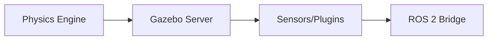

# Gazebo Simulation — The Digital Twin

## 🌍 Real World Scenario

آپ ایک 150,000 ڈالر کے ہیومینوائڈ ربات کو ٹیسٹ کرنے کے لیے گرنے نہیں دے سکتے کہ آپ کا ناویکیشن کوڈ کام کر رہا ہے۔ آپ اپنے ربات کے ناکام گریپنگ کوششوں سے ایک حقیقی کچن کو بھرنے نہیں دے سکتے۔ سیمیولیشن موجود ہے تاکہ آپ اپنے ربات کو حقیقی دنیا میں پہنچنے سے پہلے ہزار بار سافلی سے فیل

وہ جملہ صرف فلسفہ نہیں ہے بلکہ ایک لائن میں بجٹ کی حفاظت، سافٹ ویئر انجینئرنگ، اور ٹیم کی رفتار ہے۔

ایک حقیقی رباتکس پروگرام میں ہر ہارڈویئر ٹیسٹ کی ایک لاگت ہوتی ہے: بٹری سائیکلز، موٹر کی چپٹی، تباہ شدہ گریپرز، مائل جوئنٹس، ٹیکنیشن کا وقت، اور آپریشنل ڈاؤن ٹائم۔ اگر آپ کا سافٹ ویئر 200 انٹریشنز میں کلبڑ کے اشیاء کو پکڑنے کے لیے stablize کرنے کی ضرورت ہے، تو اسے ہارڈویئر پر ہی کرنا بہت تیز اور ج

لیکن سیمولیشن کیوں نہیں جادو ہے۔ یہ صرف ایک ماڈل ہے۔ اور تمام ماڈل تقریبات ہیں۔ مقصد "ریالٹی کو بدلنا" نہیں ہے۔ مقصد یہ ہے کہ سیمولیشن کو **ڈیجیٹل ٹوئن ورک فلو" کے طور پر استعمال کریں:** سافٹ ویئر کی رفتار میں اعتماد بنائیں، انٹیگریشن کے Bugs کو جلد سے ظاہر کریں، پھر ڈسسیپلڈ سائم-ٹو-ریال ورلڈ ویلڈی

## What You Will Learn

- Why Gazebo is central to modern ROS 2 simulation workflows.
- The important differences between Gazebo Classic and Gazebo Harmonic.
- What the sim-to-real gap is and why it breaks otherwise “great” simulation results.
- How to choose physics engines (ODE, Bullet, DART) based on task characteristics.
- Key differences between SDF and URDF, and why both matter.
- How to design world files for realistic kitchens and warehouses.
- How to configure simulated RGB, depth, LiDAR, and IMU sensors.
- How ROS 2 integrates with Gazebo via `gz_ros2_control`.
- How to run headless simulation in CI/CD pipelines.
- Practical code examples for world creation, launch orchestration, and runtime object spawning.

## Why this chapter matters now

جے کے بہت سے ربوٹکس کے طلباء ایک ڈیفالٹ خالی دنیا میں ایک ربوٹ لانچ کر سکتے ہیں۔ لیکن حقیقی ترقی کا گھٹنہ وہ وقت ہے جب آپ پوچھتے ہیں:

- Does this behavior still work when friction changes?
- Does navigation still pass when camera noise increases?
- Does manipulation still succeed when object pose is slightly off?
- Can this run unattended in CI so regressions are caught before hardware tests?

Simulation hai jahan aap un sawalon ka jawab sasti aur baar baar kar sakte hain. Khass taur par humanoid ke liye, jahan puri sharir ki dynamics aur jatil environment ke interactions hardware par mahang aur khatarnaak hain, yeh koi bhi chunauti nahin hai.

## Gazebo Classic vs Gazebo Harmonic: what changed and why it matters

کئی آن لائن ٹیوٹوریلز ابھی بھی گیزبو کلاسیک (`gazebo_ros_pkgs`, `gazebo` کمانڈ پیمرن) کی طرف ہیں۔ نئے ROS 2 ایکوسسٹمز میں زیادہ تر جدید گیزبو (پہلے Ignition، اب گیزبو) تقسیمات جیسے Harmonic کی طرف ہجرت کر رہے ہیں۔

مہاجرت کی وجہ یہ ہے کہ ای پی آئی، پلاگن ماڈلز، ٹولنگ نام، اور لمبے عرصے کی حمایت کی امیدوں مختلف ہیں۔ اگر آپ پرانے گائیڈز کی پیروی بے پرواہی سے کرتے ہیں، تو آپ پیکیج میچز کی وجہ سے دنوں کو کھو سکتے ہیں۔

### Gazebo Classic vs Gazebo Harmonic

| Dimension | Gazebo Classic | Gazebo Harmonic (new Gazebo) |
|---|---|---|
| Era | Older generation simulator | Modern actively evolving Gazebo line |
| CLI/tooling style | Classic `gazebo` workflows | `gz` ecosystem tools and services |
| Architecture direction | Legacy stack, many tutorials still reference it | Newer architecture with improved modularity |
| ROS 2 integration patterns | `gazebo_ros_*` plugins common | New bridge/control integrations (e.g., `gz_ros2_control`) |
| Long-term adoption | Still seen in old course material | Increasingly preferred for forward-looking ROS 2 projects |
| Learning risk | Easy to find tutorials, but often outdated | Fewer old blog posts, but better alignment with current stack |
| Best use case today | Maintaining legacy projects | New development targeting modern ROS 2 workflows |

ٹیکٹیکل اسٹریٹیجی
1. If your project is greenfield, start with Harmonic-era tooling and docs.
2. agar aapka project purana/classic hai, to migration tasks aur interfaces ko kadam-b-kadam test karte hue alag karein.
3. Kisi bhi tutorial se random snippets nahi milaana chahiye, Classic aur Harmonic dono ke tutorials se, package ki compatibility verify karne se pehle.

## The sim-to-real gap: why perfect simulation still fails on hardware

شماہنہ سے حقیقی دنیا کا فرق وہ فرق ہے جو سماجی خیالات اور حقیقی حقیقت کے درمیان ہوتا ہے۔ یہ نازک لیکن اہم طریقوں میں نظر آتا ہے:

- Friction in simulation is too clean; real floors vary by patch.
- Motor response in simulation is idealized; real actuators have backlash and delay.
- Sensor models are too clean; real cameras have motion blur, exposure shifts, and rolling shutter artifacts.
- Contact dynamics are simplified; real grasps involve micro-slip and compliance.

نتیجہ: ایک الگوریتم جو 95 فیصد کامیابی کے ساتھ سیمیولیشن میں کام کرتا ہے وہ ہارڈویئر پر 40 فیصد تک گر جاتا ہے۔

آمریکی شعبہ کاروں میں اس فرق کو کم کرنے کے طریقے

1. **Domain randomization**
ٹیکسچر، لائٹنگ، فرشکشن کوئیفیشینٹس، میس، سنسور نوس، اور اوبجیکٹ پلیسمنٹس کو乱برسٹر
سیسٹم شناخت
مذہبی حقیقی ربات کی ڈائنامکس کو پیمائے اور تجرباتی رویے کو مطابقت بخش کرنے کے لئے سیمیولیشن پیمائش کو ایڈجسٹ کریں۔
Tareeqi Tahqeeq Darwaze
Sim stress tests → limited hardware sandbox tests → supervised production trials.
چار۔ **خطا کی بجٹ بندی**
ٹریک کرنا چاہئے کہ ٹرانسفر کے دوران پرفارمنس میں کمی کی امید ہے؛ اس کے ارد گرد سافٹی بونڈریز کی ڈیزائن کریں۔

Simulashan sab se zyada takatwar hota hai jab use ek anumaniya vishwas banane ka saaz hota hai, na ke ek puri tarah ka aakar.

## Physics engines in Gazebo: ODE, Bullet, DART

فزکس انجین کا چयन ثبوت، حقیقت، اور کمپیوٹنگ کے خسارے پر اثر انداز ہوتا ہے۔

### ODE
- Mature and historically common in robotics simulation.
- Good default for many rigid-body scenarios.
- Can be less accurate in complex contact-rich dynamics compared to specialized alternatives.

### Bullet
- Strong rigid-body dynamics and popular in broader simulation/gaming ecosystems.
- Good for collision handling and many manipulation tasks.
- Tuning details can still significantly affect stability.

### DART
- Strong articulated body dynamics, often attractive for humanoids and legged systems.
- Useful where joint-level realism and whole-body kinematics/dynamics fidelity are key.
- Can require careful parameter tuning and may be heavier in certain scenarios.

Rule of thumb ke liye learners:
- Start with engine defaults that match your stack recommendations.
- Benchmark your target task, not generic FPS.
- For humanoid locomotion/manipulation, evaluate DART seriously.
- For simple warehouse navigation prototypes, ODE/Bullet with proper tuning may be sufficient.

## SDF vs URDF: both are essential, but not interchangeable

ایک سوال ہے کہ اگر میں یہاں تک URDF ہی رکھتا ہوں تو میں کہاں سے SDF کی ضرورت ہے؟

kyonki ve overlapping lekin alag-alag purposes karte hain.

### URDF
- Robot-centric description format.
- Excellent for links, joints, inertial/visual/collision basics.
- Commonly used with `robot_state_publisher`, TF, and ROS tooling.

### SDF
- Simulation-centric description format.
- Describes worlds, models, sensors, plugins, lights, physics properties, and richer simulation constructs.
- Better suited for complete environment and simulator behavior specification.

ہمیشہ کے لیے
- URDF/xacro defines robot structure.
- SDF defines world and can include models/sensors/plugins at simulation level.
- Bridge them through launch orchestration and simulator plugins.

## Building world files: kitchen and warehouse as digital twins

ایک حقیقی دنیا کے لیے گھر کے ساتھ ساتھ دیواروں سے زیادہ ہے۔  انسانی شکل کے کاموں کے لیے ماحول کی ڈیزائن میں آپریشنل پابندیوں کو شامل کرنا چاہیے:

دھانے کی دنیا کے لحاظ سے
- Counter height and reachability zones.
- Reflective surfaces affecting depth cameras.
- Cabinet handles and graspable geometry.
- Obstacle density in narrow passages.

ڈھانچے کی دنیا کے لحاظ سے ذمہ داریاں
- Aisle widths and turn radius constraints.
- Pallet and rack geometry.
- Dynamic obstacles (forklifts, workers).
- Varying floor friction and lighting zones.

ایک اچھا ورلڈ فائل حقیقت اور قابل عملیت کے درمیان توازن برقرار رکھتا ہے: کافی تفصیل کے ساتھ ناکامیوں کو ظاہر کرنا، لیکن اتنا بھاری نہ ہو کہ سیمیولیشن غیر قابل استعمال طور پر تیز ہو جائے۔

## Sensor configuration in simulation

آپ کو سنسورز کو اس طرح کنفیگریٹ کرنا چاہیے جیسے آپ کو ڈاؤن سٹریم فیلچر انالیز کے بارے میں فکر ہو، نہ کہ صرف پریٹی ویژوئلز کے لیے۔

### RGB camera
- Configure image resolution and frame rate realistically.
- Add noise profiles where available.
- Validate topic throughput under expected compute constraints.

### Depth camera
- Watch clipping ranges and quantization artifacts.
- Test under reflective/low-texture conditions.

### LiDAR
- Tune scan rate, horizontal resolution, and range.
- Inject noise and dropouts to approximate real returns.

### IMU
- Include drift/noise models.
- Ensure frame alignment and covariance values are meaningful for filters.

agar sensor settings too saaf hain, to aapki perception stack overconfident aur brittle ho jati hai.

## ROS 2 ↔ Gazebo bridge with gz_ros2_control

گیزبو سیمولیٹیشن انٹرفیسز کو ROS 2 کنٹرول ابستریشنز سے جوڑتا ہے۔ عملی طور پر، یہ controllers میں ROS 2 کو simulated جانتس کو command کرنے اور simulated states کو پڑھنے کی اجازت دیتا ہے جیسے وہ ہارڈویئر انٹرفیسز ہوں۔

یہ کیوں مهم ہے:
- You can use similar controller architecture in sim and hardware pipelines.
- It reduces divergence between testing and deployment stacks.
- It enables controller tuning before touching expensive actuators.

ہومنوائڈز کے لیے یہ اہم ہے کیونکہ جائن لیول کنٹرولر کی پہچان (دیلیٹی، گینز، سٹریچنگ) کو مختلف سِناریوز کے تحت متعدد بار ٹیسٹ کیا جانا چاہیے۔

## Headless simulation for CI/CD

گرافیکی شبڈی بہت اچھی ہے لیکن سی آئی کے لیے غیر متحرک، پھر سے دہرائے جانے والے ایکشن کی ضرورت ہے۔

ہیڈلس سیمیولیشن کے فوائد:
- Run regression suites on every commit.
- Validate behavior in standardized worlds.
- Catch integration breakages early (topics, transforms, controllers, startup).
- Generate metrics artifacts (success rates, timing, collisions).

ایک گریجویٹ رباتکس پائپلائن میں عام طور پر شامل ہوتے ہیں:
1. Launch sim headless.
2. ربات اور سِن سے متعلق اشیا کو جنم دیں۔
چلائیں ٹیسٹ سkenریو اسکرپٹس.
چار. قبولیت معیار کی تصدیق کریں۔
پانچ۔ ریگریشن کے پابندیوں کو توڑنے پر پائپ لائن کو ناکام قرار دیں۔

یہ یہاں ٹیموں کو "میرے کمپیوٹر پر کام کرتا ہے" ربوٹ کوڈ کو شپنگ کرنے سے روکتی ہے۔

## 💻 Code Example 1: Complete SDF world file (room, table, objects)

```xml
<?xml version="1.0" ?>
<sdf version="1.9">
  <world name="humanoid_kitchen_world">
    <gravity>0 0 -9.81</gravity>

    <physics name="default_physics" type="dart">
      <max_step_size>0.001</max_step_size>
      <real_time_factor>1.0</real_time_factor>
      <real_time_update_rate>1000</real_time_update_rate>
    </physics>

    <light name="sun" type="directional">
      <cast_shadows>true</cast_shadows>
      <pose>0 0 10 0 0 0</pose>
      <diffuse>0.8 0.8 0.8 1</diffuse>
      <specular>0.2 0.2 0.2 1</specular>
      <direction>-0.5 0.1 -0.9</direction>
    </light>

    <model name="room_floor">
      <static>true</static>
      <link name="floor_link">
        <collision name="floor_collision">
          <geometry>
            <box>
              <size>8 8 0.1</size>
            </box>
          </geometry>
        </collision>
        <visual name="floor_visual">
          <geometry>
            <box>
              <size>8 8 0.1</size>
            </box>
          </geometry>
          <material>
            <ambient>0.7 0.7 0.7 1</ambient>
          </material>
        </visual>
      </link>
    </model>

    <model name="kitchen_table">
      <static>true</static>
      <pose>1.0 0.0 0.75 0 0 0</pose>
      <link name="table_link">
        <collision name="table_collision">
          <geometry>
            <box>
              <size>1.2 0.8 0.05</size>
            </box>
          </geometry>
        </collision>
        <visual name="table_visual">
          <geometry>
            <box>
              <size>1.2 0.8 0.05</size>
            </box>
          </geometry>
          <material>
            <ambient>0.5 0.3 0.2 1</ambient>
          </material>
        </visual>
      </link>
    </model>

    <model name="cereal_box">
      <pose>1.1 0.1 0.83 0 0 0</pose>
      <link name="box_link">
        <inertial><mass>0.4</mass></inertial>
        <collision name="box_collision">
          <geometry>
            <box><size>0.08 0.05 0.22</size></box>
          </geometry>
        </collision>
        <visual name="box_visual">
          <geometry>
            <box><size>0.08 0.05 0.22</size></box>
          </geometry>
        </visual>
      </link>
    </model>

    <model name="mug">
      <pose>0.9 -0.15 0.82 0 0 0</pose>
      <link name="mug_link">
        <inertial><mass>0.25</mass></inertial>
        <collision name="mug_collision">
          <geometry>
            <cylinder><radius>0.04</radius><length>0.1</length></cylinder>
          </geometry>
        </collision>
        <visual name="mug_visual">
          <geometry>
            <cylinder><radius>0.04</radius><length>0.1</length></cylinder>
          </geometry>
        </visual>
      </link>
    </model>
  </world>
</sdf>
```

## 💻 Code Example 2: ROS 2 launch file to start Gazebo + humanoid

```python
# file: launch/sim_humanoid.launch.py
from launch import LaunchDescription
from launch.actions import DeclareLaunchArgument
from launch.substitutions import LaunchConfiguration, PathJoinSubstitution, Command
from launch_ros.actions import Node
from launch_ros.substitutions import FindPackageShare
from launch_ros.parameter_descriptions import ParameterValue


def generate_launch_description():
    world = LaunchConfiguration('world')
    use_sim_time = LaunchConfiguration('use_sim_time')

    pkg_share = FindPackageShare('humanoid_sim')
    world_default = PathJoinSubstitution([pkg_share, 'worlds', 'humanoid_kitchen.world'])
    xacro_file = PathJoinSubstitution([pkg_share, 'urdf', 'humanoid.urdf.xacro'])

    robot_description = ParameterValue(
        Command(['xacro ', xacro_file, ' use_sim:=true']),
        value_type=str
    )

    gazebo = Node(
        package='ros_gz_sim',
        executable='gz_sim',
        arguments=['-r', world],
        output='screen'
    )

    rsp = Node(
        package='robot_state_publisher',
        executable='robot_state_publisher',
        output='screen',
        parameters=[
            {'robot_description': robot_description},
            {'use_sim_time': use_sim_time}
        ]
    )

    controller_manager = Node(
        package='controller_manager',
        executable='ros2_control_node',
        output='screen',
        parameters=[
            {'robot_description': robot_description},
            {'use_sim_time': use_sim_time}
        ]
    )

    gz_control_bridge = Node(
        package='gz_ros2_control',
        executable='gz_ros2_control',
        output='screen',
        parameters=[{'use_sim_time': use_sim_time}]
    )

    return LaunchDescription([
        DeclareLaunchArgument('world', default_value=world_default),
        DeclareLaunchArgument('use_sim_time', default_value='true'),
        gazebo,
        rsp,
        controller_manager,
        gz_control_bridge,
    ])
```

## 💻 Code Example 3: Python script to spawn objects in running simulation

```python
#!/usr/bin/env python3
# file: scripts/spawn_objects.py

import argparse
import subprocess
import textwrap


def make_box_sdf(name: str, x: float, y: float, z: float) -> str:
    return textwrap.dedent(f"""
    <sdf version='1.9'>
      <model name='{name}'>
        <pose>{x} {y} {z} 0 0 0</pose>
        <link name='link'>
          <inertial><mass>0.3</mass></inertial>
          <collision name='collision'>
            <geometry><box><size>0.06 0.06 0.12</size></box></geometry>
          </collision>
          <visual name='visual'>
            <geometry><box><size>0.06 0.06 0.12</size></box></geometry>
          </visual>
        </link>
      </model>
    </sdf>
    """).strip()


def spawn(name: str, x: float, y: float, z: float):
    sdf = make_box_sdf(name, x, y, z)
    cmd = [
        'gz', 'service', '-s', '/world/humanoid_kitchen_world/create',
        '--reqtype', 'gz.msgs.EntityFactory',
        '--reptype', 'gz.msgs.Boolean',
        '--timeout', '3000',
        '--req', f'sdf: "{sdf}"'
    ]
    result = subprocess.run(cmd, capture_output=True, text=True)
    if result.returncode != 0:
        raise RuntimeError(result.stderr.strip() or 'Failed to spawn object')
    print(f'Spawned {name} at ({x}, {y}, {z})')


def main():
    parser = argparse.ArgumentParser()
    parser.add_argument('--count', type=int, default=3)
    args = parser.parse_args()

    for i in range(args.count):
        spawn(name=f'box_{i}', x=0.8 + i * 0.1, y=0.2, z=0.85)


if __name__ == '__main__':
    main()
```

## Practical debugging mindset for simulation work

جب Simulation بہت ہی غیر معمولی طور پر کام کرتا ہے، تو زیادہ تر ٹیموں کو ہمیشہ کوڈ کو دوبارہ لکھنے کی طرف بڑھنا ہوتا ہے۔ یہ عام طور پر سب سے تیز ترین راستہ نہیں ہوتا ہے۔

اِس آرٹیکل میں ROS2، SLAM، LiDAR، Node، Topic، QoS، Gazebo، Isaac، VLA، Python، اور C++ کے بارے میں معلومات دی گئی ہیں۔
1. Confirm world and robot launched with expected files.
2. Sensors ki aapni ummeedon ke mutabiq data publish kar rahi hain.
3. TF tree ko sahi hai.
چار۔ کنٹرولر انٹرفیسز کو لود ہونے کی تصدیق کریں۔
پانچ: پُل موضوعات اور کمانڈ پتہوں کا یقین حاصل کرنا ہے کہ وہ منسلک ہیں۔
چھ: پھر تو الگوریتم کو تبدیل کریں۔

ایک بڑی تعداد میں "ایس آئی کیسیٹر بھیڑ" کے مسائل کا اصل سبب ان کے کنفیگریشن میں غلطی ہوتی ہے۔

## Architecture Diagram



## 💡 Key Concepts Summary

- Gazebo is your digital twin environment for safe, repeated failure before hardware risk.
- Gazebo Harmonic represents modern simulator workflows; many old tutorials target Classic and can mislead.
- Sim-to-real gap is unavoidable; reduce it with randomization, system ID, and staged validation.
- Physics engine choice should match task needs, especially for humanoid articulated dynamics.
- URDF and SDF are complementary: robot model vs simulation/world modeling.
- Sensor realism and controller bridging (`gz_ros2_control`) are essential for transferable results.
- Headless simulation in CI/CD transforms simulation from demo tool to engineering quality gate.

## 🧪 Practice Exercises

### Exercise 1 (Beginner)
Clone karna hai jo SDF world aur ek addhitional obstacle (box ya cylinder) addh karna hai. Verify karna hai ki humanoid navigation stack replans karta hai isse collision ke bina.

```bash
# Run simulation and inspect obstacle topic/visual behavior
ros2 launch humanoid_sim sim_humanoid.launch.py
```

### Exercise 2 (Intermediate)
دو Noise Parameter Sets کے لیے LiDAR Noise کی تشکیل کریں (نیچے اور اوپر)۔ ایک ہی ناوبری بENCHMARK چلانے کے لیے اور کامیابی کی شرح اور راستہ کی سہولت کا موازنہ کریں۔

```python
# Hint: keep algorithm unchanged; vary only sensor noise profile.
```

### Exercise 3 (Advanced)
ایک سر فرستہ CI کام ترتیب کریں جو گیزبو کو چلاے، غیر منظم اشیاء کو جنم دے، ایک منسوب پک اور پلاس سkenریو چلاے، اور اگر کامیابی کی شرح کم سے کم اپنی حد سے نیچے جاتی ہے تو فیل ہو جائے۔

```bash
# Example direction: run headless + scripted scenario + parse metrics artifact
```

## ✅ Key Takeaways

- Simulation is not optional for humanoid development; it is the safe failure engine.
- Gazebo Harmonic is the forward-looking path for modern ROS 2 stacks.
- The sim-to-real gap is managed, not eliminated.
- Strong world modeling, sensor realism, and control bridging improve transfer quality.
- CI-driven headless simulation is the difference between fragile demos and reliable robotics engineering.

## 🔗 Next Up

اگلے باب: پیچیدہ سنسور سیمولیشن اور ڈومین رینڈومائزیشن پائپ لائنز—ناقابل پیشانی کے حقیقی دنیا کے ماحول میں منتقل کرنے کے لیے سمجھوتہ اور کنٹرول سسٹم کو نظامیت سے تیار کرنے کے طریقے۔