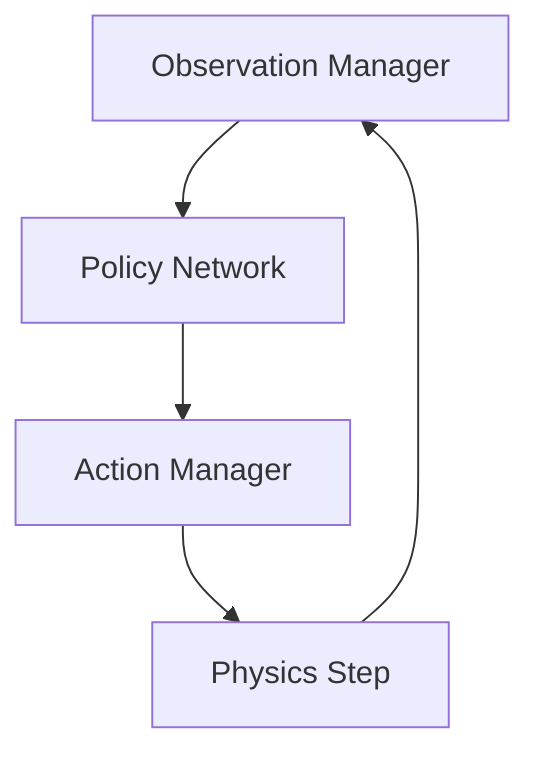

# Isaac Observation and Action Interfaces

## 🌍 Real World Scenario

Your robot's AI brain receives 10,000 numbers per second: joint angles, camera pixels, force readings, IMU data. It must output 30 joint torques every 10 milliseconds. How you package these numbers — the observation and action interface — determines whether your AI can learn at all.

That is not an implementation detail. That is the learning bottleneck.

Most beginners assume reinforcement learning success is mostly about model architecture (“bigger network, better policy”). In real robot learning, interface design often matters more at first. If your observations are noisy, inconsistent, unnormalized, or overloaded with irrelevant features, policy learning becomes unstable. If your action space is poorly matched to control dynamics, the policy either learns unsafe behavior or never converges.

This chapter makes observation/action interfaces the center of attention because they are the contract between physics and intelligence. When this contract is well designed, training accelerates and transfer improves. When it is poorly designed, you can waste weeks tuning PPO hyperparameters while the real issue is interface structure.

## What You Will Learn

- How to frame humanoid control as a Markov Decision Process (MDP).
- How to design observation spaces: what to include, normalize, and exclude.
- How to choose action spaces: position vs velocity vs torque control.
- How Isaac Lab uses `TaskCfg`, observation managers, and action managers.
- How vectorized environments enable 1000+ parallel training instances.
- How curriculum learning stabilizes early-stage humanoid training.
- How to design a practical locomotion reward combining speed, efficiency, and safety penalties.
- How to implement config and code patterns that are trainable and debuggable.

## Why this interface is the real AI-hardware boundary

In robotics learning stacks, the policy network does not “see the world directly.” It only sees the observation vector/tensor you provide. It does not move joints directly either; it emits action commands in a format you define.

So every training run is mediated by two design choices:

1. **Observation interface**: what state is exposed to the policy at each step.
2. **Action interface**: what control command type the policy is allowed to output.

These choices encode your assumptions about controllability, noise tolerance, and physical realism. They also define the effective difficulty of the learning problem.

## MDP framing for robot control

Humanoid locomotion in Isaac Lab is typically framed as an MDP:

- **State/Observation (`o_t`)**: normalized joint states, base orientation, velocities, contact flags, task commands.
- **Action (`a_t`)**: desired joint targets/velocities/torques.
- **Transition (`P`)**: simulator dynamics + controller response.
- **Reward (`r_t`)**: scalar signal combining forward progress, stability, energy terms, and penalties.
- **Policy (`π(a|o)`)**: neural network mapping observations to actions.

Why this framing matters:
- It forces explicit definition of what the policy knows and controls.
- It separates objective design (reward) from dynamics (simulator/controller).
- It supports reproducible benchmarking and ablation studies.

If your MDP specification is vague, training outcomes become hard to interpret and compare.

## Observation space design: include enough, not everything

A common beginner failure mode is “sensor dumping”: concatenating every available signal into one giant vector and hoping the network figures it out. This often hurts training.

### What to include (core)

**Proprioception** (internal robot state):
- Joint positions and velocities.
- Base linear/angular velocity.
- Base orientation (often represented as projected gravity or quaternion-derived features).
- Contact states (feet/hands where relevant).

**Exteroception** (external environment/task context):
- Commanded velocity targets.
- Terrain features (if locomotion over varied terrain).
- Selected perception embeddings (if vision-conditioned policy).

### What to normalize

Normalization is non-optional for stable learning.

- Joint positions: scale to joint limit ranges.
- Joint velocities: divide by expected max velocity.
- Base rates: normalize to physically meaningful range.
- IMU and force values: clamp and normalize to avoid extreme outliers dominating gradients.

Without consistent scaling, one feature family can numerically overpower all others, slowing or destabilizing learning.

### What to exclude initially

- Redundant correlated features that add noise without information gain.
- High-dimensional raw observations (e.g., full images) before baseline locomotion converges.
- Non-stationary debug counters or unstable signals.

Start minimal, then add complexity based on evidence.

## Action space design: control authority and learnability

Action design determines how hard the control problem is and how physically realistic the policy behavior can become.

### Observation and action design table

| Design Choice | Option | Advantage | Risk/Tradeoff | Typical Use |
|---|---|---|---|---|
| Observation | Proprioception-only | Fast training, low dimensionality | Limited environmental awareness | Baseline locomotion |
| Observation | Proprio + command inputs | Better task conditioning | Slightly higher complexity | Goal-conditioned walking |
| Observation | Proprio + exteroceptive embeddings | Handles richer environments | Harder debugging and tuning | Uneven terrain / obstacle tasks |
| Action | Joint position targets | Stable with PD controllers | Can hide dynamics limitations | Early locomotion training |
| Action | Joint velocity targets | Smoother motion shaping | Requires careful gain tuning | Tracking-oriented tasks |
| Action | Joint torque commands | Highest control fidelity | Hardest to train, less forgiving | Advanced dynamic behaviors |

### Joint position control
- Policy outputs desired joint angles.
- Low-level controller handles torque realization.
- Usually easiest for early humanoid locomotion experiments.

### Joint velocity control
- Policy outputs target joint velocities.
- Useful where motion smoothness and temporal shaping are important.
- Needs careful coupling with control gains and timestep.

### Joint torque control
- Policy outputs torques directly.
- Maximum expressiveness and dynamic realism.
- Training is often less stable; requires robust reward and constraints.

Practical strategy:
1. Start with position targets for baseline gait emergence.
2. Move toward velocity/torque once stability and reward shaping are mature.

## Isaac Lab architecture: TaskCfg + managers

Isaac Lab structures tasks around configuration and manager abstractions.

### `TaskCfg`
Defines task-level settings such as:
- Scene and robot asset parameters.
- Physics dt/control decimation.
- Number of environments.
- Observation/action definitions.
- Reward terms and curriculum schedule.

### Observation manager
Builds observation tensors from simulator state in a consistent, batched format. It is where normalization, clipping, and feature ordering are enforced.

### Action manager
Transforms policy actions into actuator commands (position/velocity/torque targets), including scaling and clipping.

Why this separation is powerful:
- Clear boundaries between policy learning and simulator plumbing.
- Easier ablations (change observation terms without rewriting whole task).
- Better reproducibility via explicit config.

## Vectorized environments: why 1000 robots train simultaneously

Isaac Lab accelerates learning by running many environment instances in parallel on GPU-backed simulation workflows.

Instead of one robot episode at a time, you can run 256, 512, or 1000+ robot copies concurrently, each with slightly varied initial states/randomization. This massively increases sample throughput.

Benefits:
- Faster policy iteration.
- Better exploration diversity per wall-clock hour.
- More robust gradient estimates.

Design implications:
- Observation and action pipelines must be batch-friendly.
- Reset logic must be vectorized and deterministic.
- Reward computation must be efficient tensor math, not Python loops where avoidable.

When people say “Isaac Lab trains fast,” this vectorization architecture is a major reason.

## Curriculum learning for humanoids

If you start humanoid training on full task difficulty, early learning often collapses:
- Robot falls immediately.
- Reward dominated by penalties.
- Policy never discovers stable gait primitives.

Curriculum learning addresses this by staging difficulty.

Example progression:
1. Flat terrain, low target velocity, mild disturbances.
2. Higher speed targets and turn commands.
3. Terrain unevenness and randomized friction.
4. External pushes and partial observation noise.

Curriculum schedules can be time-based or performance-based (advance when success threshold reached). For beginners, performance-triggered progression is often more stable.

## Reward function design for humanoid locomotion

A locomotion reward should combine multiple objectives, not one scalar goal blindly.

Common terms:
- **Forward velocity tracking reward**: encourages commanded movement.
- **Energy penalty**: discourages wasteful actuation.
- **Fall penalty/termination**: strongly penalizes instability.
- **Posture/orientation penalty**: discourages extreme tilt.
- **Foot slip/contact quality terms**: improves gait realism.

Reward engineering principles:
1. Keep terms interpretable.
2. Scale terms to comparable magnitudes.
3. Log each term separately during training.
4. Avoid sparse-only reward at early stages.

If your reward only says “go forward fast,” policy may learn unsafe hopping, foot dragging, or unstable limit cycles.

## 💻 Code Example 1: Complete Isaac Lab task config (humanoid walking)

```python
# file: tasks/humanoid_walk_task_cfg.py
from dataclasses import dataclass, field


@dataclass
class SimCfg:
    dt: float = 1.0 / 120.0
    substeps: int = 2
    gravity: tuple = (0.0, 0.0, -9.81)


@dataclass
class SceneCfg:
    num_envs: int = 1024
    env_spacing: float = 3.0
    terrain_type: str = "flat"
    robot_usd_path: str = "/Isaac/Robots/Humanoid/humanoid_instanceable.usd"


@dataclass
class ObservationCfg:
    include_joint_pos: bool = True
    include_joint_vel: bool = True
    include_base_lin_vel: bool = True
    include_base_ang_vel: bool = True
    include_projected_gravity: bool = True
    include_command: bool = True
    clip_obs: float = 10.0


@dataclass
class ActionCfg:
    control_mode: str = "joint_position"  # joint_position | joint_velocity | joint_torque
    action_scale: float = 0.25
    clip_actions: float = 1.0


@dataclass
class CurriculumCfg:
    enabled: bool = True
    start_command_range: float = 0.3
    max_command_range: float = 1.5
    promote_success_threshold: float = 0.85
    promote_window_steps: int = 20000


@dataclass
class RewardCfg:
    w_forward_vel: float = 2.0
    w_energy: float = -0.002
    w_fall: float = -5.0
    w_upright: float = 0.5
    w_action_smoothness: float = -0.01


@dataclass
class TaskCfg:
    task_name: str = "humanoid_walk"
    sim: SimCfg = field(default_factory=SimCfg)
    scene: SceneCfg = field(default_factory=SceneCfg)
    observations: ObservationCfg = field(default_factory=ObservationCfg)
    actions: ActionCfg = field(default_factory=ActionCfg)
    curriculum: CurriculumCfg = field(default_factory=CurriculumCfg)
    rewards: RewardCfg = field(default_factory=RewardCfg)
    max_episode_steps: int = 1200


CFG = TaskCfg()
```

This config captures key interface decisions explicitly and is easy to version/control.

## 💻 Code Example 2: Custom observation manager with normalized joint states

```python
# file: tasks/obs_manager.py
import torch


class ObservationManager:
    def __init__(self, joint_pos_limits, joint_vel_scale=20.0, clip_obs=10.0, device="cuda"):
        self.device = device
        self.clip_obs = clip_obs
        self.joint_low = torch.tensor(joint_pos_limits[0], device=device)
        self.joint_high = torch.tensor(joint_pos_limits[1], device=device)
        self.joint_vel_scale = joint_vel_scale

    def normalize_joint_pos(self, joint_pos: torch.Tensor) -> torch.Tensor:
        # map [low, high] -> [-1, 1]
        denom = torch.clamp(self.joint_high - self.joint_low, min=1e-6)
        x = 2.0 * (joint_pos - self.joint_low) / denom - 1.0
        return torch.clamp(x, -1.0, 1.0)

    def normalize_joint_vel(self, joint_vel: torch.Tensor) -> torch.Tensor:
        x = joint_vel / self.joint_vel_scale
        return torch.clamp(x, -1.0, 1.0)

    def build(self, state: dict) -> torch.Tensor:
        joint_pos_n = self.normalize_joint_pos(state["joint_pos"])
        joint_vel_n = self.normalize_joint_vel(state["joint_vel"])

        base_lin_vel = torch.clamp(state["base_lin_vel"], -5.0, 5.0) / 5.0
        base_ang_vel = torch.clamp(state["base_ang_vel"], -10.0, 10.0) / 10.0
        gravity_proj = torch.clamp(state["projected_gravity"], -1.0, 1.0)
        command = torch.clamp(state["command"], -2.0, 2.0) / 2.0

        obs = torch.cat(
            [joint_pos_n, joint_vel_n, base_lin_vel, base_ang_vel, gravity_proj, command],
            dim=-1,
        )

        return torch.clamp(obs, -self.clip_obs, self.clip_obs)
```

This manager keeps feature scales controlled and consistent across large vectorized batches.

## 💻 Code Example 3: Multi-objective locomotion reward function

```python
# file: tasks/reward_terms.py
import torch


def compute_locomotion_reward(
    command_vel_x: torch.Tensor,
    base_vel_x: torch.Tensor,
    joint_torques: torch.Tensor,
    base_height: torch.Tensor,
    projected_gravity_z: torch.Tensor,
    prev_actions: torch.Tensor,
    actions: torch.Tensor,
):
    # 1) forward velocity tracking (Gaussian around command)
    vel_error = command_vel_x - base_vel_x
    r_forward = torch.exp(-2.0 * vel_error * vel_error)

    # 2) energy penalty
    p_energy = torch.sum(joint_torques * joint_torques, dim=-1)

    # 3) uprightness reward
    r_upright = torch.clamp(projected_gravity_z, min=0.0, max=1.0)

    # 4) smooth action penalty
    p_smooth = torch.sum((actions - prev_actions) ** 2, dim=-1)

    # 5) fall penalty / termination mask
    fell = base_height < 0.6
    p_fall = torch.where(fell, torch.ones_like(base_height) * 1.0, torch.zeros_like(base_height))

    reward = (
        2.0 * r_forward
        + 0.5 * r_upright
        - 0.002 * p_energy
        - 0.01 * p_smooth
        - 5.0 * p_fall
    )

    return reward, {
        "r_forward": r_forward.mean(),
        "r_upright": r_upright.mean(),
        "p_energy": p_energy.mean(),
        "p_smooth": p_smooth.mean(),
        "p_fall": p_fall.mean(),
    }
```

This reward balances speed, stability, and efficiency while strongly discouraging falls.

## Training workflow blueprint (practical)

A practical loop for this chapter’s concepts:

1. Define minimal observation/action interfaces in `TaskCfg`.
2. Validate normalization/clipping with random rollout probes.
3. Train with moderate vectorization (e.g., 256 envs), verify reward term trends.
4. Scale to 1000+ envs after stability.
5. Introduce curriculum stages gradually.
6. Evaluate ablations:
   - with/without specific observation terms,
   - position vs velocity control,
   - reward term weight sensitivity.

This workflow helps isolate root causes when learning diverges.

## Common beginner mistakes and exact corrections

1. **Mistake:** Feeding raw unnormalized states.
   **Correction:** Normalize every continuous observation channel with explicit bounds.

2. **Mistake:** Starting with torque control immediately.
   **Correction:** Start with joint position targets, then progress to harder action modes.

3. **Mistake:** Using one giant opaque reward.
   **Correction:** Use decomposed reward terms and log each separately.

4. **Mistake:** No curriculum for humanoid tasks.
   **Correction:** Stage difficulty to avoid early collapse.

5. **Mistake:** Single-environment debugging mindset.
   **Correction:** Build batched, vectorized interfaces from day one.

## Architecture Diagram



## 💡 Key Concepts Summary

- Observation/action interfaces are the critical boundary between robot physics and policy learning.
- Observation design should be informative, normalized, and minimal enough to stay trainable.
- Action mode selection controls both learning difficulty and behavior realism.
- Isaac Lab’s `TaskCfg` + managers enable modular, reproducible task engineering.
- Massive vectorization (1000 envs) accelerates sample collection and robustness.
- Curriculum learning and multi-term rewards are essential for stable humanoid locomotion training.
- MDP framing keeps control problems explicit and testable.

## 🧪 Practice Exercises

### Exercise 1 (Beginner)
Implement a reduced observation space with only joint positions, velocities, and command velocity. Compare training stability against a larger observation variant.

```python
# Measure sample efficiency: reward vs training steps in both versions.
```

### Exercise 2 (Intermediate)
Train three short experiments with action modes `joint_position`, `joint_velocity`, and `joint_torque` under the same reward. Compare fall rate and convergence speed.

```python
# Keep seeds and curriculum identical for fair comparison.
```

### Exercise 3 (Advanced)
Build a curriculum schedule that promotes difficulty based on rolling success rate and evaluate whether final policy generalizes better than a fixed-difficulty baseline.

```python
# Track success, energy use, and recovery behavior under perturbations.
```

## Key Takeaways

- If learning fails, inspect interfaces before blaming model size or optimizer.
- Better observations are about relevance and scaling, not maximum sensor volume.
- Action-space choice is a strategic control design decision, not just an API flag.
- Isaac Lab abstractions help you iterate faster with cleaner experimental discipline.
- Reward/curriculum design determines whether humanoid policies become stable and transferable.

## 🔗 Next Up

Next chapter: Sim-to-real transfer for learned policies—how to validate trained locomotion controllers under domain shift and deploy safely onto physical humanoid hardware.