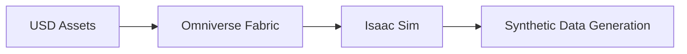

# NVIDIA Isaac — The AI-Robot Brain

## 🌍 Real World Scenario

نویڈیا نے 10 ارب ڈالر کے خطرے کے ساتھ یقین کیا ہے کہ ربوٹکس کا مستقبل تصویروں کی حقیقت پسندیم ہے۔ آئیکس سِم تصاویر کو حقیقت سے الگ نہیں کر سکتا ہے - لہذا آپ کے ربوٹ کی نظروں کی ایل ایس کی تربیت سائنٹھیٹک ڈیٹا پر ہوتی ہے جو حقیقت کے برابر دکھائی دیتی ہے تاکہ فزیکل ورلڈ میں منتقل ہو سکے۔

Woh bet zaroori hai kyunki modern robotics ab sirf control loops aur kinematics ke baare mein nahin hai. Yah perception-heavy autonomy ke baare mein hai. Ek humanoid robot warehouse, hospital, ya retail floor par chalna chahta hai jahan usko visually messy aur constantly changing environment mein detect, track, segment, localize, aur decide karna hoga. Real-world data ke liye har corner case ke liye data collect karna lamba, expensive, aur dangerous hai. Synthetic data aur simulation-first development hi rapid iteration ke liye practical path hain.

لیکن بہت سے شروعاتی افراد نے ایساک اسکیم کو غلط طریقے سے تقسیم کیا ہے: وہ ایساک سائم کو الگ الگ سیکھتے ہیں، پھر الگ الگ طور پر ایساک آر او ایس پیکیجز کو دریافت کرتے ہیں، پھر بہت بعد میں ایساک لیب کے بارے میں سنا جاتا ہے۔ حقیقت یہ ہے کہ انہیں ایک ہی ورک فلو کے متصل لےروں کے طور پر ڈیزائن کیا گیا ہے: س

یہ باب بتاتا ہے کہ کس طرح مختلف حصے ایک دوسرے سے مل کر کام کرتے ہیں تاکہ آپ سسٹم بناسکیں، نہ کہ الگ الگ ڈیمو۔

## What You Will Learn

- How Isaac Sim, Isaac ROS, and Isaac Lab differ and how they complement each other.
- Why Omniverse and USD are foundational to scalable robotics simulation pipelines.
- How synthetic RGB-D data accelerates vision model development.
- How domain randomization improves transfer from simulation to physical robots.
- How the Isaac ROS graph provides hardware-accelerated perception blocks.
- What the Isaac Perceptor stack provides out of the box for mobile robotics.
- How to deploy Isaac-enabled workloads to Jetson edge hardware.
- Practical code patterns for synthetic data generation, VSLAM launch setup, and randomization control.

## The Isaac ecosystem as one pipeline (not three separate tools)

نویڈیا آئزیک کو Robotics پلیٹ فارم کے Layers کے طور پر سمجھیں:

1. **Isaac Sim**: high-fidelity simulation and synthetic data generation.
2. **Isaac Lab**: ربات سیکھنے/تحقیقاتی ورک فلو کے ارد گرد پھیلے ہوئے سکیلेबل سیمیولیشن تجربات.
3. **Isaac ROS**: optimised ROS 2 packages (many GPU-accelerated) for deployment aur runtime perception.

شروعاتی غلطی یہ ہے کہ انہیں متبادل سمجھا جاتا ہے۔ وہ ایک دوسرے کے بعد اور ایک دوسرے کے ساتھ مکمل ہیں:

- Use Isaac Sim to create digital environments and collect synthetic sensor data.
- Use Isaac Lab to train/evaluate policies or learning-based components at scale.
- Use Isaac ROS on target hardware to run optimized perception and localization pipelines.

یہی وجہ ہے کہ اس ایکوسسٹم کام کرتا ہے: آپ Simulation سے Deployment تک Conceptual Continuity برقرار رکھتے ہیں۔

## Isaac Sim vs Isaac ROS vs Isaac Lab

| Component | Primary Purpose | Runs Where | Typical Output | Best Use Case |
|---|---|---|---|---|
| **Isaac Sim** | Photoreal simulation, digital twins, synthetic data | Workstation / GPU servers | Sim episodes, RGB-D data, annotations | Building environments and generating training/eval datasets |
| **Isaac ROS** | Hardware-accelerated ROS 2 perception/localization nodes | Jetson / ROS robots | Real-time inference, SLAM, depth, detection streams | Production runtime graph on real robot |
| **Isaac Lab** | Learning workflows (RL/imitation experiments) on top of simulation | Multi-GPU research/training setups | Trained policies, evaluation logs | Large-scale robot learning and benchmark loops |

ایک عام اصول
- If you are creating worlds and synthetic data: Isaac Sim.
- If you are optimizing perception graph on robot hardware: Isaac ROS.
- If you are training policies with many simulated rollouts: Isaac Lab.

## Omniverse and USD: why this foundation matters

ایساک سِم NVIDIA اومنِوِرس پر بنایا گیا ہے، اور اومنِوِرس یو ایس ڈی (یونیورسل سِن ڈیسکریپشن) کو ایک بنیادی سِن نمائش کے طور پر استعمال کرتا ہے۔

یہ تکنیکی طور پر کیوں اہم ہے:

- USD is designed for complex scene composition.
- Assets, materials, lighting, and transforms can be layered non-destructively.
- Teams can collaborate on different scene layers (robot, lighting, objects, annotations) without stomping each other’s work.

ہم ربوٹکس کے اصطلاحات میں، یو ایس ڈی آپ کا سیمیولیشن کا حقیقت کا ذریعہ بن جاتا ہے۔

فائدے برائے ربوٹکس پائپ لائنز:
1. **Reproducibility**: scene versions are explicit and shareable.
2. **ٹیکنالوجی کی پھیلاؤ کی صلاحیت**: ایک ہی بنیادی دنیا کو سِناریو لےئرز کے ساتھ بڑھایا جا سکتا ہے۔
3. **Interoperability**: آسان تبادلہ بین کंटینٹ اور سیمیولیشن ٹولنگ کے درمیان ہے۔
چار۔ **ڈیٹا نسل کا یکساں ہونا**: سائنٹھیٹک ڈیٹا سٹ ڈیٹا کی اصل قابل پیغام ہے اور اس سے صحیح سے صحیح سے سائن سے سائن سے سائن سے سائن سے سائن سے سائن سے سائن سے سائن سے سائن سے سائن سے سائن سے سائن سے سائن سے سائن سے سائن سے سائن سے سائن سے سائن سے سائن سے سائن سے سائن س

Agar aap hazaron scenario variants chalne ki yeh soch rahe hain, USD-style compositional workflows ad-hoc scene editing ke mukable se kai ghante bacha sakte hain.

## Synthetic data generation: why rendered images can train real models

کوئی فیکٹریال ایمیجز ریل ڈرونز کو تربیت دے سکتی ہیں؟

ہاں اگر صحیح طریقے سے کیا جائے۔

Synthetic data ka kaam hota hai kyunki kayi perception tasks visual structures (edges, depth cues, geometry, object context) par depend karte hain jo realistic tarah se simulate kiya ja sakta hai taaki robust feature representations seekh saken. Jab synthetic datasets ko randomization aur calibration ke saath pair kiya jaata hai, to real-data requirements bahut kam ho jaate hain.

ایساک سِم سے عام سائنٹھیٹک ڈیٹا آؤٹ پٹس ہیں:
- RGB images.
- Depth maps.
- Semantic segmentation masks.
- 2D/3D bounding boxes.
- Camera intrinsics/extrinsics metadata.

اہم استعمال کے معاملات:
- Rare failure conditions that are hard to collect physically.
- Label-heavy tasks where human annotation cost is prohibitive.
- Controlled ablation studies (e.g., lighting-only change).

خطرہ: مصنوعی ڈیٹا کو حقیقی دنیا کی تصدیق کے بجائے، دائمی طور پر بدلنے کے بجائے، مکمل کرنا چاہئے۔ مقصد بہتر منتقلی ہے، نہ کہ مصنوعی لیڈر بورڈ کامیابی۔

## Domain randomization: forcing generalization

ڈومین ریڈومائزیشن کا مقصد ایک سافٹ ویئر ڈومین میں ماڈل کو اوور فٹ نہ ہونے دیا ہے۔

کام کرنے والے تصادفی پیمائشیں:
- Texture maps and colors.
- Light intensity, direction, and color temperature.
- Object positions and orientations.
- Camera noise and slight calibration offsets.
- Surface roughness and reflectance properties.

کیوں یہ کام کرتا ہے:
- It broadens training distribution support.
- It encourages learning invariant features.
- It reduces brittle dependence on one world style.

ہومنائڈ پہچان نظاموں کے لیے، ڈھکے ہوئے اندرونی منظر میں، جہاں میبل، پیکیجنگ، ریفلکٹوں کی سطحیں، اور انسانی موجودگی مسلسل طور پر بدلتی ہیں، randomness خاص طور پر قیمتی ہے۔

## Isaac ROS graph: accelerated building blocks

ایساک آر او ایس میں ایک کٹالوگ ہے جو آر او ایس 2 کے پیکیجز کو آئی این وی ڈی ہارڈ ویئر کی تیز رفتار اور موثر کارکردگی کے لیے آپٹمائز کرتا ہے۔ شروع کرنے والوں کے لیے، کلیدی بصیرت یہ ہے:

Aapko har perception block ko nai se nai banaana nahi hai.

معمولی تیز رفتار گرافی اجزاء میں شامل ہیں:
- **AprilTag detection** for fiducial localization.
- **Visual SLAM (VSLAM)** for camera-based localization and mapping.
- **Depth processing** for disparity/depth pipelines.
- Image format transforms and pre/post-processing nodes.

یہ پیکیجز ڈیزائن کیے گئے ہیں کہ وہ ROS گرافوں میں شامل ہو کر لٹنسی کے خلاف لڑنے کے لیے اور نائیو CPU-ONLY پائپلائنز کے مقابلے میں تیز ہوں۔

جب ہوموائڈ پریزنسی اسٹیکس بنانے کے دوران، یہ فرق ہو سکتا ہے کہ "لاب میں 3 FPS میں کام کرتا ہے" اور "ایج ہارڈویئر پر ریل ٹائم میں کام کرتا ہے۔"

## Isaac Perceptor stack: ready-made perception pipeline

ایساک پریسپیکٹر (جہاں ممکن ہو) اپنی اسٹیک/ ورژن میں موٹر سائیکل ربوٹکس کے استعمال کے معاملات کے لیے ایک رائے دار پریسپیکٹر آرکٹیکچر پیش کرتا ہے۔ تصوراتی طور پر، یہ ریپٹنگ پیسز کو بھی شامل کرتا ہے جو ٹیمز نے دوبارہ بنانے کی ضرورت ہوتی ہے:

- Multi-sensor synchronization.
- Visual/depth processing pathways.
- Localization/perception integration patterns.
- Practical defaults for deployment.

یہ سیکھنے والوں کے لیے کیا مفید ہے:
- Faster time-to-first-results.
- Better baseline architecture than random custom node wiring.
- Easier benchmarking before custom modifications.

اپروچ پروفیشنل ہے
1. Start from a known-good reference stack.
2. Bench markon apne scenarios.
3. صرف وہ مقامات کو ہی کسٹمائز کریں جہاں ہماری تحقیقات سے پتہ چلتا ہے کہ وہاں بہت سارے مسائل ہیں۔

## Jetson integration: from dev workstation to robot edge

ٹریننگ اور سیمیولیشن اکثر ڈیسک ٹاپ جی پی یو یا سرورز پر ہوتے ہیں، لیکن حقیقی ربوٹس ایج ہی پر چلتی ہیں۔ جیتسن انٹیگریشن لूप کو بند کر دیتا ہے۔

Core Deployment Concerns:
- Power/thermal constraints.
- Latency budgets for perception-control loops.
- Memory footprint and model size.
- Throughput under sensor concurrency.

ایک مضبوط منتقلی ورک فلو:
1. Prototype perception graph in sim.
2. سنسٹھٹک + حقیقی ریپ्लے ڈیٹا سے وैलڈ کریں۔
Teesra, Jetson par optimized Isaac ROS stack ko deploy karein.
چار. پرفیلاٹ انڈ ٹو اینڈ لیٹنسی اور فریم ڈراپس کو پرفیلاٹ کریں۔
5. ماڈل/گراف سٹیٹس کو ہارڈویئر کے ساتھ ان لوب میں چلائیں۔

یہ وہ مقام ہے جہاں ایکسیوم کا یکجہتی ضروری ہے: آئزک سِم ایس ایم ہیلپز جینیٹر ٹیسٹ کرنے میں مدد کرتا ہے؛ آئزک ROS ایڈج کے ساتھ ایج کے ساتھ موثر طریقے سے ایکشن کرنے میں مدد کرتا ہے۔

## 💻 Code Example 1: Isaac Sim Python API for humanoid + synthetic RGB-D capture

```python
#!/usr/bin/env python3
# file: scripts/isaac_sim_collect_rgbd.py

from pathlib import Path
import numpy as np

from omni.isaac.kit import SimulationApp

simulation_app = SimulationApp({"headless": True})

from omni.isaac.core import World
from omni.isaac.core.utils.stage import add_reference_to_stage
from omni.isaac.sensor import Camera


def main():
    out_dir = Path("artifacts/synthetic/rgbd_run")
    out_dir.mkdir(parents=True, exist_ok=True)

    world = World(stage_units_in_meters=1.0)

    # Load humanoid USD asset into stage
    add_reference_to_stage(
        usd_path="/Isaac/Robots/Humanoid/humanoid_instanceable.usd",
        prim_path="/World/Humanoid"
    )

    # Add RGB-D camera
    cam = Camera(
        prim_path="/World/Humanoid/head_camera",
        frequency=30,
        resolution=(1280, 720),
        position=np.array([0.0, 0.0, 1.6]),
        orientation=np.array([1.0, 0.0, 0.0, 0.0])
    )
    cam.initialize()

    world.reset()

    frame_count = 120
    for i in range(frame_count):
        world.step(render=True)

        rgb = cam.get_rgba()[:, :, :3]
        depth = cam.get_depth()

        np.save(out_dir / f"rgb_{i:04d}.npy", rgb)
        np.save(out_dir / f"depth_{i:04d}.npy", depth)

    print(f"Saved {frame_count} RGB-D frames to {out_dir}")


if __name__ == "__main__":
    main()
    simulation_app.close()
```

یہ SDG کے بنیادی Flow کو ظاہر کرتا ہے: ربات کو جنم دینا، کیمرہ لگانا، سائمنیشن کو چلانے کے لئے Step، RGB اور Depth tensors کو تربیت/مطالعہ کے لئے بچانا۔

## 💻 Code Example 2: Isaac ROS launch file for visual SLAM

```python
# file: launch/isaac_ros_vslam.launch.py
from launch import LaunchDescription
from launch.actions import DeclareLaunchArgument
from launch.substitutions import LaunchConfiguration
from launch_ros.actions import Node


def generate_launch_description():
    use_sim_time = LaunchConfiguration('use_sim_time')
    left_cam_topic = LaunchConfiguration('left_cam_topic')
    right_cam_topic = LaunchConfiguration('right_cam_topic')

    visual_slam_node = Node(
        package='isaac_ros_visual_slam',
        executable='visual_slam_node',
        name='visual_slam',
        output='screen',
        parameters=[{
            'use_sim_time': use_sim_time,
            'enable_debug_mode': False,
            'rectified_images': True,
            'denoise_input_images': False,
            'base_frame': 'base_link',
            'odom_frame': 'odom',
            'map_frame': 'map'
        }],
        remappings=[
            ('stereo_camera/left/image', left_cam_topic),
            ('stereo_camera/right/image', right_cam_topic),
        ]
    )

    return LaunchDescription([
        DeclareLaunchArgument('use_sim_time', default_value='true'),
        DeclareLaunchArgument('left_cam_topic', default_value='/camera/left/image_rect'),
        DeclareLaunchArgument('right_cam_topic', default_value='/camera/right/image_rect'),
        visual_slam_node,
    ])
```

Yeh ek saaf launch baseline deta hai jisse aap apne ROS 2 graph mein tez VSLAM ko integrate kar sakte hain.

## 💻 Code Example 3: Domain randomization config in Python

```python
#!/usr/bin/env python3
# file: scripts/domain_randomization_config.py

import random

RANDOMIZATION_CONFIG = {
    "seed": 2026,
    "episodes": 200,
    "lighting": {
        "intensity_range": [250.0, 1200.0],
        "color_temperature_range": [3200, 6500],
        "direction_jitter_deg": 25,
    },
    "materials": {
        "albedo_jitter": 0.3,
        "roughness_range": [0.1, 0.9],
        "metallic_range": [0.0, 0.4],
    },
    "object_pose": {
        "xy_jitter_m": 0.35,
        "yaw_range_deg": [-180, 180],
    },
    "camera": {
        "exposure_jitter": 0.2,
        "gaussian_noise_std": 0.01,
        "motion_blur_probability": 0.15,
    },
}


def sample_episode_params(cfg: dict, episode_idx: int) -> dict:
    random.seed(cfg["seed"] + episode_idx)

    return {
        "light_intensity": random.uniform(*cfg["lighting"]["intensity_range"]),
        "light_temp": random.randint(*cfg["lighting"]["color_temperature_range"]),
        "albedo_jitter": random.uniform(-cfg["materials"]["albedo_jitter"], cfg["materials"]["albedo_jitter"]),
        "roughness": random.uniform(*cfg["materials"]["roughness_range"]),
        "metallic": random.uniform(*cfg["materials"]["metallic_range"]),
        "xy_offset_x": random.uniform(-cfg["object_pose"]["xy_jitter_m"], cfg["object_pose"]["xy_jitter_m"]),
        "xy_offset_y": random.uniform(-cfg["object_pose"]["xy_jitter_m"], cfg["object_pose"]["xy_jitter_m"]),
        "yaw_deg": random.uniform(*cfg["object_pose"]["yaw_range_deg"]),
        "exposure": 1.0 + random.uniform(-cfg["camera"]["exposure_jitter"], cfg["camera"]["exposure_jitter"]),
        "noise_std": cfg["camera"]["gaussian_noise_std"],
        "motion_blur": random.random() < cfg["camera"]["motion_blur_probability"],
    }


if __name__ == "__main__":
    for i in range(3):
        print(f"Episode {i}:", sample_episode_params(RANDOMIZATION_CONFIG, i))
```

یہ پैटرن کنٹرولڈ randomness کے ساتھ reproducibility کو یقینی بناتا ہے (`seed + episode_idx`)—یہ debugging اور ablation studies کے لیے ضروری ہے۔

## Architecture pattern: end-to-end Isaac workflow for humanoids

ایک عملی آرکٹیکچر لूप:

1. **Scene authoring in Isaac Sim (USD-based).**
دومین ریڈیو نائزرائزیشن کے ساتھ سنسٹھٹک ڈیٹا کی تخلیق.
3. ماڈل ٹریننگ/مطالعہ (آئیکس لاب یا متصل ٹریننگ اسٹیک)
چار۔ **آئزیک ROS پر جیتسن پر گراف ڈپلومنٹ**
5. فیلڈ ٹیلی میٹری کی جمع کرنے اور فیلڈ میں فALIURE کا رپورٹ کرنے کے لیے سیمیولیشن میں داخل کرنا۔
چھ: **گراف ٹیوننگ اور دوبارہ تربیت**.

یہ ایک بند ڈھانچے کی بہتری کا نظام ہے، نہ ہی ایک ایک طرف کا تربیت کا پائپ لائن.

## Common beginner pitfalls (and exact corrections)

1. **Pitfall:** Treating Isaac Sim visuals as “done” without transfer testing.
ہمیشہ حقیقی/ری پلے ڈیٹا پر وैलڈیٹ کریں اور ٹرانسفر گپ کو منٹر کریں۔

2. **Khatra:** Stabil Qamrī Simulashan Muhit ka Istimal Karnā.
ایکٹھرنیزیشن کو اچھی طرح سے اور نظامیت کے ساتھ پہلے ہی شامل کریں۔

3. **خطرہ:** انسائک ROS ریفرنسز کی جانچ پڑتال سے پہلے کسٹم ROS گراف بنانا۔
آئیڈیئے: تیز رفتار بنیادی نقطہ سے شروع کریں، پھر انتخابی طور پر آپٹمائز کریں۔

چوتھی ہدایت: تاخیر سے ایج ڈیپلومنٹ کی پابندیوں کو نظر انداز کرنا۔
پروفائل جتسن اُتے جلدی شامل کریں، جس میں تھرمل اور لٹنسی بہاوٗر شامل ہوں۔

## Architecture Diagram



## 💡 Key Concepts Summary

- NVIDIA Isaac is an ecosystem pipeline, not isolated tools.
- Isaac Sim handles photoreal simulation and synthetic data at scale.
- Omniverse + USD provide composable, versionable scene workflows.
- Domain randomization is essential for sim-to-real robustness.
- Isaac ROS provides accelerated perception blocks for production ROS 2 graphs.
- Isaac Perceptor offers practical baseline perception integration patterns.
- Jetson deployment closes the loop from simulation to real robot execution.

## 🧪 Practice Exercises

### Exercise 1 (Beginner)
ایک اندرونی منظر کے لیے آئزیک سِم میں 200 سائنٹھیٹک آر جی بی ڈی فریم کی کپچر کریں اور میٹا ڈیٹا کی مطابقت (ری졸وشن، فریم انڈیکسنگ، کیمرا پوز لوجنگ) کی وریفائی کریں۔

```python
# Extend the RGB-D script to include timestamp + intrinsics per frame.
```

### Exercise 2 (Intermediate)
لاگ ان کرے ہیں آئیکس ایس ایس ایس آر او ایس وی ایس ایل ایم گراف Stereo سٹریم پر اور ایک Fixed Closed-Loop Trajectory میں Simulation میں Drift کی میروں۔

```bash
# Compare estimated trajectory endpoint against known start pose.
```

### Exercise 3 (Advanced)
چلائیں ایک ڈومین randomness sweep 100 episodes کے اندر اور مقابلہ کیا جائے model robustness ایک non-randomized baseline کے خلاف. Report success deltas اور failure modes.

```python
# Keep policy architecture fixed; vary only randomization strategy.
```

## ✅ Key Takeaways

- The strongest Isaac workflows connect simulation, learning, and deployment in one continuous loop.
- Photoreal synthetic data can drastically accelerate vision development when paired with proper randomization.
- Isaac ROS and Jetson optimization are key for real-time edge execution.
- Beginners gain speed by using the ecosystem as intended instead of piecing disconnected tutorials.
- Treat every stage as measurable engineering: generate, train, deploy, validate, repeat.

## 🔗 Next Up

اگلے باب: ہائی تھروپوت سائنٹھیٹک ڈیٹا پائپ لائنز اور ماڈل ایویو ایشن ہارنیشز—ایک سینگل سائن ڈیمو سے انڈسٹریل اسکیل ڈیٹا سٹ ڈیٹا جنریشن اور کونٹیواس ماڈل امپروومنٹ تک کیسے چلے جائیں۔