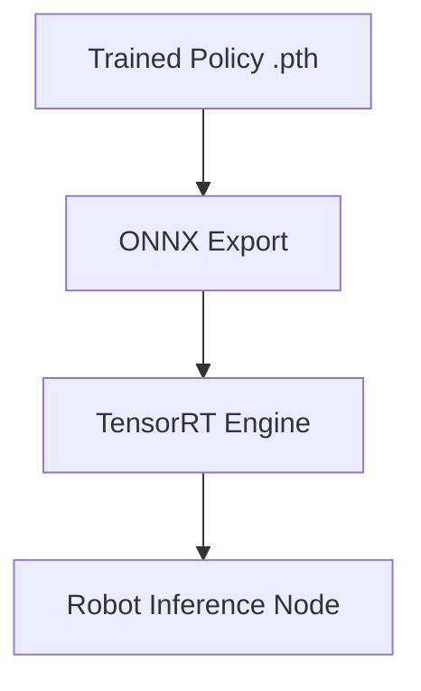

# Policy Deployment and Runtime Diagnostics

## 🌍 Real World Scenario

آپ کے ربات نے 10 GPU گھنٹوں کے لئے تربیت دی۔ پالیسی سیمولیٹیشن میں بہت اچھی دکھائی دے رہی ہے — 95 فیصد کامیابی کی شرح ہے۔ آپ اسے حقیقی ربات پر ڈپلوئی کرتے ہیں۔ یہ دو قدمیں لیتا ہے اور گر جاتا ہے۔ یہاں آپ کو سائم-ٹو-ریئل گپ کا استقبال ہوتا ہے۔ یہ چپٹر آپ کو اسے کیسے ٹھیک کر

یہ وہ مقام ہے جہاں زیادہ تر طلباء پھنس جاتے ہیں۔ ٹریننگ گرافی نے بہت اچھا دکھایا۔ ایپی سوڈ ریکارڈ میں اضافہ ہوا۔ سیمیولیشن میں ویڈیوز نے سہولت سے چلنے کا مظاہرہ کیا۔ پھر ہارڈ ویئر کی حقیقت پہنچی جس میں ایکٹیوٹر کا لگ، سنسور کی جھٹک، کالیبریشن ڈریفت، اور تھوڑے سے رابط

جے زیادہ تر ٹیوٹوریلز "سیاست متفقہ" پر رک جاتے ہیں۔ حقیقی ربوٹکس "سیاست محفوظ طور پر تعین کیا گیا" سے شروع ہوتا ہے۔ یہ باب تربیت کے بعد کی Runtime تشخیصی عمل پر مرکوز ہے: ایک्सپورٹ، انفرنسی پیپلائن کی سالمیت، ٹرانسفر ہارڈننگ، سیکیورٹی وریپرز، اورリアل ٹائم مونٹرنگ۔

## What You Will Learn

- How to export Isaac Lab policies from PyTorch to ONNX and then TensorRT.
- How runtime inference pipelines are structured end to end.
- How to reduce sim-to-real failure risk with actuator models, domain randomization audits, and system identification.
- What to log at runtime and how to visualize it quickly.
- How to diagnose frequent deployment failure modes with practical signals.
- How to apply safe deployment protocols with hard limits and emergency overrides.
- How to use ROS 2 diagnostics and `rqt` tools for live monitoring.

## Why deployment diagnostics are the real skill

ایک تربیت یافتہ پالیسی مکمل پیداوار نہیں ہے۔ یہ ایک امیدوار کنٹرولر ہے۔

تخصیص کی تیاری کی ضرورت ہے کہ:
1. Input tensors at runtime match training assumptions.
Doosri action ke outputs ki sainik hai aur vah shakhsiatik roop se maanee hai.
3. Latency budgets hain unke liye respect kiye jaate hain.
چار. ناکامی کی دیکھ بھال deterministic اور safe ہے۔

بے یقینی نتیجے
- Policy outputs saturate joints at startup.
- Sensor preprocessing mismatch causes observation drift.
- Control loop timing jitter destabilizes gait.
- Safety monitors trigger too late.

آپ کا مقصد تمام فیلڈر نہیں ہونا ہے۔ آپ کا مقصد فیلڈر کو پہلے ہی ہٹانا ہے جب وہ ناقابل اعتماد ہارڈ ویئر واقعات بن جائیں۔

## Exporting trained policies: PyTorch → ONNX → TensorRT

### Stage 1: PyTorch checkpoint
آپ کو عام طور پر آئزک لیب میں تربیت کے بعد ایک `.pt` چیک پوائنٹ ہوتا ہے جو ماڈل وزنٹس اور پالیسی آرکٹیکچر کے پیشگی خیالات کو شامل کرتا ہے۔

### Stage 2: ONNX export
ONNX prahat kartaa hai framework-agnostic prastutikaran ke liye deployment toolchains ke liye. Is stage mein, aap input/output tensor shapes aur graph behavior ko lock karte hain.

### Stage 3: TensorRT engine build
ٹینسر آر ٹی NVIDIA ہارڈویئر پر ماڈل انفرنسی کو کم کرنے اور بہتر پرفارمنس کے لئے آپٹمائز کرتی ہے، جو حقیقی وقت کے کنٹرول لूपز کے لئے اہم ہے۔

Practical checks har har stage par.
- Verify output parity between PyTorch and ONNX on identical inputs.
- Verify TensorRT output parity within tolerance.
- Profile inference time under target hardware load.

agar parity bahut badla hai, to deploy na karein. export graph ke assumptions ko pehle saaf karein.

## 💻 Code Example 1: ONNX export script for Isaac Lab policy

```python
#!/usr/bin/env python3
# file: tools/export_policy_onnx.py

import argparse
import torch


class PolicyWrapper(torch.nn.Module):
    def __init__(self, policy_net):
        super().__init__()
        self.policy_net = policy_net

    def forward(self, obs):
        # Assume policy outputs action tensor directly
        return self.policy_net(obs)


def load_policy(checkpoint_path: str):
    # Replace with your project-specific policy class/loader
    ckpt = torch.load(checkpoint_path, map_location='cpu')
    policy = ckpt['policy_model']
    policy.eval()
    return policy


def main():
    parser = argparse.ArgumentParser()
    parser.add_argument('--checkpoint', required=True)
    parser.add_argument('--out', default='artifacts/policy.onnx')
    parser.add_argument('--obs-dim', type=int, required=True)
    args = parser.parse_args()

    policy = load_policy(args.checkpoint)
    wrapped = PolicyWrapper(policy)

    dummy_obs = torch.randn(1, args.obs_dim, dtype=torch.float32)

    torch.onnx.export(
        wrapped,
        dummy_obs,
        args.out,
        input_names=['obs'],
        output_names=['action'],
        dynamic_axes={'obs': {0: 'batch'}, 'action': {0: 'batch'}},
        opset_version=17,
        do_constant_folding=True,
    )

    print(f"Exported ONNX policy to {args.out}")


if __name__ == '__main__':
    main()
```

ہم ONNX ایکسپورٹ کے بعد، اپنی ڈپلومنٹ پائپ لائن (مثلاً `trtexec` یا انٹیگریٹڈ رن ٹائم وریپرز) کا استعمال کرتے ہوئے ٹینسر آرٹ ایجنٹ بناتے ہیں اور نتیجے کو وैलڈیٹ کرتے ہیں۔

## Runtime inference pipeline: sensor → preprocess → policy → postprocess → actuator

ایک پالیسی ہمیشہ ہی ربوٹ ہارڈویئر پر ایک ہی وقت میں چلتی ہے۔

### 1) Sensor ingestion
- IMU, joint states, force sensors, optional vision streams.
- Timestamps must be coherent.

### 2) Preprocessing
- Frame alignment.
- Normalization with training-time scales.
- Feature ordering exactly matching policy expectation.

### 3) Policy inference
- ONNX/TensorRT forward pass.
- Deterministic batch size and timing.

### 4) Postprocessing
- Action scaling and clipping.
- Optional smoothing/filtering.
- Joint limit and rate limit enforcement.

### 5) Actuator command publish
- Send bounded commands to low-level controllers.
- Enforce safety interlocks before hardware write.

جوکے زیادہ تر سائم ٹو ریئل کی ناکامیاں اسٹیپ 2 یا اسٹیپ 4 میں میچ نہ ہونے سے ہوتی ہیں، نہ ہی "بہتر ماڈل انٹیلی جنس" سے۔

## 💻 Code Example 2: ROS 2 node for policy inference and joint command publish

```python
#!/usr/bin/env python3
# file: nodes/policy_inference_node.py

import numpy as np
import onnxruntime as ort
import rclpy
from rclpy.node import Node
from sensor_msgs.msg import JointState, Imu
from std_msgs.msg import Float64MultiArray


class PolicyInferenceNode(Node):
    def __init__(self):
        super().__init__('policy_inference_node')

        self.declare_parameter('onnx_path', 'artifacts/policy.onnx')
        self.declare_parameter('action_scale', 0.3)
        self.declare_parameter('max_action_abs', 1.0)

        onnx_path = self.get_parameter('onnx_path').get_parameter_value().string_value
        self.action_scale = self.get_parameter('action_scale').get_parameter_value().double_value
        self.max_action_abs = self.get_parameter('max_action_abs').get_parameter_value().double_value

        self.session = ort.InferenceSession(onnx_path, providers=['CPUExecutionProvider'])
        self.input_name = self.session.get_inputs()[0].name

        self.latest_joint = None
        self.latest_imu = None

        self.create_subscription(JointState, '/robot1/joint_states', self.on_joint, 50)
        self.create_subscription(Imu, '/robot1/imu', self.on_imu, 50)

        self.cmd_pub = self.create_publisher(Float64MultiArray, '/robot1/policy_joint_cmd', 20)

        self.timer = self.create_timer(0.01, self.control_step)  # 100 Hz

    def on_joint(self, msg: JointState):
        self.latest_joint = msg

    def on_imu(self, msg: Imu):
        self.latest_imu = msg

    def build_observation(self):
        if self.latest_joint is None or self.latest_imu is None:
            return None

        q = np.array(self.latest_joint.position, dtype=np.float32)
        dq = np.array(self.latest_joint.velocity, dtype=np.float32) if self.latest_joint.velocity else np.zeros_like(q)

        imu_vec = np.array([
            self.latest_imu.angular_velocity.x,
            self.latest_imu.angular_velocity.y,
            self.latest_imu.angular_velocity.z,
            self.latest_imu.linear_acceleration.x,
            self.latest_imu.linear_acceleration.y,
            self.latest_imu.linear_acceleration.z,
        ], dtype=np.float32)

        # Example normalization (must match training-time scaling)
        q_norm = np.clip(q / np.pi, -1.0, 1.0)
        dq_norm = np.clip(dq / 20.0, -1.0, 1.0)
        imu_norm = np.clip(imu_vec / 20.0, -1.0, 1.0)

        obs = np.concatenate([q_norm, dq_norm, imu_norm], axis=0)
        return obs[None, :].astype(np.float32)

    def control_step(self):
        obs = self.build_observation()
        if obs is None:
            return

        action = self.session.run(None, {self.input_name: obs})[0][0]

        action = np.clip(action * self.action_scale, -self.max_action_abs, self.max_action_abs)

        msg = Float64MultiArray()
        msg.data = action.tolist()
        self.cmd_pub.publish(msg)


def main(args=None):
    rclpy.init(args=args)
    node = PolicyInferenceNode()
    try:
        rclpy.spin(node)
    finally:
        node.destroy_node()
        rclpy.shutdown()


if __name__ == '__main__':
    main()
```

یہ نود ہے جو ہموار مشاہدہ کی تعمیر، معیار بندی کا پری پروسیسنگ، محدود ایکشن کے نتیجے، فیکس کنٹرول لूप کی شرح کو ظاہر کرتا ہے۔

## Sim-to-real transfer hardening techniques

### 1) Actuator network/model
اکریٹر کے حقیقی عمل میں تاخیر، روغن، موٹے زون، اور غیر خطی جواب ہوتے ہیں۔ ایک ایکٹیوٹر ماڈل پالیسی کے نتیجے کو حقیقی جوڑوں کی حرکات سے جوڑنے میں مدد کرتا ہے جو سیمیولیشن میں سیکھے جاتے ہیں۔

### 2) Domain randomization review
پہلے ڈپلومنٹ سے پہلے، تربیت میں استعمال ہونے والی randomness کی coverage کو جائزہ لینا۔
- friction ranges
- latency jitter
- sensor noise
- mass/inertia perturbations

agar randomization mein asli duniya ke bhinnataon ko shamil nahin kiya gaya tha, to ab aapko phir se training karna hoga.

### 3) System identification
مذہبی حقیقی ربوٹ ڈائنامکس کی پیمائش کریں اور اس کے مطابق سیمولیٹر پیمائش کو اپ ڈیٹ کریں۔ یہ اکثر پالیسی آرکٹیکچر کی تبدیلیوں سے تیز تر ہے۔

ڈپلومنٹ انسائٹ: ٹرانسفر کی گुणवत्तہ عام طور پر ایک سسٹم کا مسئلہ ہوتا ہے، نہ ہی ایک انفرادی ماڈل کا مسئلہ۔

## Runtime diagnostics: what to log and visualize

لوگ اٹھنے کی منصوبہ بندی کریں
1. Observation vector statistics (mean/std/min/max by channel).
2. Action ki statistics (clip kiya hua fraction, saturation ki giniyaat).
3. کنٹرول لूप کی ٹائمنگ (dt جٹر، انفرنسی لٹنسی)
چار۔ سلامتی واقعات (جوئنٹ لمیٹ نرمیس، استاپ ٹریگزر، گرنے کی تشخیص)۔
5. پالیسی انعام کیوں کہیں ہیں (اگر انٹرنیٹ پر دستیاب ہیں) اور ٹاسک ایونٹس۔

دیکھ بھال کی ترجیحات:
- Real-time plots for key channels.
- Rolling windows for latency and action saturation.
- Event timelines aligned with falls/failures.

agar aap sirf "policy output" ko log karte hain, to aap root cause ko miss karenge. sensors, actions, aur timing ko relate karein.

## Failure mode diagnosis table

| Failure Mode | Symptoms | Likely Cause | First Diagnostic Check | Immediate Mitigation |
|---|---|---|---|---|
| Policy drift after deployment | Stable start then degrading behavior over minutes | Sensor bias/temperature drift, state estimator drift | Compare observation channel baselines over time | Recalibrate sensors, reset estimator periodically |
| Joint limit violations | Sudden hard stops, controller warnings | Action scaling mismatch or missing postprocess clipping | Count clipped/near-limit commands per joint | Tighten action bounds, add joint-limit penalty/safety clamp |
| Unexpected sensor readings | Spikes or impossible values | Bad calibration, frame mismatch, electrical noise | Plot raw + normalized sensor channels live | Add sanity filters, fallback to safe mode on outliers |
| Inference timing overruns | Missed control ticks, unstable gait | Tensor runtime too slow on target hardware | Measure end-to-end inference latency percentile | Lower model size, optimize TensorRT engine, reduce frequency |
| Startup fall in first steps | Immediate collapse after enable | Observation mismatch vs training distribution | Compare sim startup observation snapshot to real | Add staged warm-up policy, zero-motion stabilization phase |

ٹیبل کو ڈپلومنٹ ڈیز کے دوران قریب رکھیں۔ یہ پینک لوز کو کمزور کرتی ہے۔

## Safe deployment protocol (non-negotiable)

پہلے ہارڈویئر پر خودکار پالیسی کنٹرول کو فعال کرنے سے قبل:

1. **Velocity limits**
ہموار حد کی لائنئر/انگریول/جوئنٹ رفتار کو مجروح کریں۔

2. **Torque/posishan ke boundaries**
Hard clamps azadi policy output.

3. ایمرجنسی سٹاپ انٹीगریشن
Fizikal aur software estop ko zaroorat ke anusaar nishkarsh policy ko jaldbazi se override karna chahiye.

چار۔ **انسانی اوور رائیڈ مڈ**
Superviser aik policy se safe controller tak instant mein badal sakta hai.

5. پروگریسیو رول آؤٹ
   - Tethered or support rig test.
   - Reduced-speed open area test.
   - Structured scenario test.
   - Supervised production-like test.

چھ: **منسوخ حالات**
ہمیشہ کی حالتوں کو پہلے سے طے کرکے تیزی سے غیر فعال کرنے کے لئے ایسے حالات طے کریں (تاخیر کی چوٹیاں، تکرار شدہ حد کی خلاف ورزیاں، غیر مستحکم COM کی رفتار)۔

Koi benchmark score bhi in suraksha kaatilon ko bypass karne ke liye zaroori nahin hai.

## Monitoring with ROS 2 diagnostics and rqt

ROS 2 ہمیشہ کے لیے عملی رن ٹائم انٹروسیکشن ٹولز فراہم کرتا ہے:

- `/diagnostics` style health reporting via diagnostic messages.
- `rqt_plot` for live channel trends.
- `rqt_console` for warning/error timeline.
- `rqt_graph` for graph integrity and topic connectivity.

ڈیپلوئیمنٹ ڈیش بورڈ کی تجویز کردہ ڈپلومنٹ:
- Inference latency (ms).
- Control loop frequency (Hz).
- Action saturation ratio.
- Joint limit proximity metric.
- Estop state + safety flags.

یہ آپریٹر کے لیے ابتدائی ڈپلومنٹ کے دوران حقیقی وقت میں دیکھے جانے چاہئیں۔

## 💻 Code Example 3: Runtime diagnostic monitor with threshold alerts

```python
#!/usr/bin/env python3
# file: nodes/runtime_diag_monitor.py

import rclpy
from rclpy.node import Node
from diagnostic_msgs.msg import DiagnosticArray, DiagnosticStatus, KeyValue
from std_msgs.msg import Float64MultiArray


class RuntimeDiagnosticMonitor(Node):
    def __init__(self):
        super().__init__('runtime_diagnostic_monitor')

        self.declare_parameter('max_inference_ms', 12.0)
        self.declare_parameter('max_saturation_ratio', 0.20)
        self.declare_parameter('max_joint_limit_ratio', 0.95)

        self.max_inference_ms = self.get_parameter('max_inference_ms').value
        self.max_saturation_ratio = self.get_parameter('max_saturation_ratio').value
        self.max_joint_limit_ratio = self.get_parameter('max_joint_limit_ratio').value

        self.latest_inference_ms = 0.0
        self.latest_saturation_ratio = 0.0
        self.latest_joint_limit_ratio = 0.0

        self.create_subscription(Float64MultiArray, '/robot1/runtime/inference_stats', self.on_inference_stats, 20)
        self.create_subscription(Float64MultiArray, '/robot1/runtime/action_stats', self.on_action_stats, 20)
        self.create_subscription(Float64MultiArray, '/robot1/runtime/joint_limit_stats', self.on_joint_limit_stats, 20)

        self.diag_pub = self.create_publisher(DiagnosticArray, '/diagnostics', 10)
        self.timer = self.create_timer(0.2, self.publish_diag)

    def on_inference_stats(self, msg: Float64MultiArray):
        # expected: [avg_ms, p95_ms]
        if len(msg.data) >= 2:
            self.latest_inference_ms = float(msg.data[1])

    def on_action_stats(self, msg: Float64MultiArray):
        # expected: [saturation_ratio]
        if msg.data:
            self.latest_saturation_ratio = float(msg.data[0])

    def on_joint_limit_stats(self, msg: Float64MultiArray):
        # expected: [max_limit_ratio]
        if msg.data:
            self.latest_joint_limit_ratio = float(msg.data[0])

    def publish_diag(self):
        status = DiagnosticStatus()
        status.name = 'policy_runtime_health'
        status.hardware_id = 'robot1_policy_stack'

        warn = (
            self.latest_inference_ms > self.max_inference_ms
            or self.latest_saturation_ratio > self.max_saturation_ratio
            or self.latest_joint_limit_ratio > self.max_joint_limit_ratio
        )

        status.level = DiagnosticStatus.WARN if warn else DiagnosticStatus.OK
        status.message = 'threshold exceeded' if warn else 'runtime healthy'

        status.values = [
            KeyValue(key='p95_inference_ms', value=f'{self.latest_inference_ms:.3f}'),
            KeyValue(key='saturation_ratio', value=f'{self.latest_saturation_ratio:.3f}'),
            KeyValue(key='joint_limit_ratio', value=f'{self.latest_joint_limit_ratio:.3f}'),
            KeyValue(key='max_inference_ms', value=f'{self.max_inference_ms:.3f}'),
            KeyValue(key='max_saturation_ratio', value=f'{self.max_saturation_ratio:.3f}'),
            KeyValue(key='max_joint_limit_ratio', value=f'{self.max_joint_limit_ratio:.3f}'),
        ]

        msg = DiagnosticArray()
        msg.status = [status]
        self.diag_pub.publish(msg)

        if warn:
            self.get_logger().warn(f"Runtime threshold alert: {status.values}")


def main(args=None):
    rclpy.init(args=args)
    node = RuntimeDiagnosticMonitor()
    try:
        rclpy.spin(node)
    finally:
        node.destroy_node()
        rclpy.shutdown()


if __name__ == '__main__':
    main()
```

یہ منیٹر تیزی سے تھرشول پر مبنی تذکرے فراہم کرتا ہے اور معیاری ROS ڈائیاگنوسٹک ورک فلو کے ساتھ انٹیگرٹ ہوتا ہے۔

## Deployment checklist (operator-ready)

پہلے پالیسی کنٹرول کو چالو کرنے سے پہلے ہر سیشن:
- Validate sensor calibration status.
- Run dry inference with actuators disabled.
- Verify observation normalization ranges in live feed.
- Verify action bounds and saturation ratios at idle.
- Verify estop and override switch behavior.
- Start with conservative velocity profile.
- Record diagnostics and video from first run.

ہر ایک چلا جانے کے بعد:
- Tag failures by mode from table.
- Save logs with model hash + config version.
- Decide: tune runtime wrapper, retrain policy, or update sim parameters.

یہ منظم حلہ وہ طریقہ ہے جس سے ٹیمز سیمیٹک سے ریالٹی میں تبدیلی کے بغیر ہارڈویئر کو نقصان پہنچانے سے بچتے ہیں۔

## Architecture Diagram



## 💡 Key Concepts Summary

- Training success is not deployment success.
- Export parity (PyTorch → ONNX → TensorRT) must be validated numerically and temporally.
- Runtime inference pipelines fail most often at preprocessing/postprocessing boundaries.
- Sim-to-real transfer improves via actuator modeling, randomization coverage, and system identification.
- Diagnostics must include sensor/action/timing/safety signals, not just reward curves.
- Safe deployment protocols with hard limits and human override are mandatory.
- ROS 2 diagnostics + `rqt` tooling provide practical real-time observability.

## 🧪 Practice Exercises

### Exercise 1 (Beginner)
چلائیں پالیسی انفرنسی نود کو ایکٹیوٹرز سے منسلک نہیں کیا ہوا ہے اور 5 منٹ کے لئے مشاہدہ/عمل کی تقسیمات کو ریکارڈ کریں۔ یقینی بنائیں کہ کوئی چین ایکٹیوٹرز سے منسلک نہیں ہونے کے باوجود بھی معیار کے معیار سے تجاوز کرنے والا نہیں ہے۔

```bash
# Plot per-channel min/max and identify outliers before hardware motion tests.
```

### Exercise 2 (Intermediate)
ایک 10 میلی سیکنڈ کی انفراںس ڈیلے کو مصنوعی طور پر شامل کریں اور ثبات کے زوال کی مشاہدہ کریں۔ کنٹرول فرائض یا ماڈل رن ٹائم آپٹیمائزیشن کو ایڈجسٹ کریں جب تک کہ پریشانی کی حدوں سے گزر نہ جائیں۔

```python
# Compare p95 latency and fall events before/after optimization.
```

### Exercise 3 (Advanced)
بنا Automated Deployment Gate بنائیں جو پالیسی کی Activation کو Block کرے گا جب تک Diagnostic Monitor 30 Continuous Seconds تک تمام Metrics Healthy نہیں رپورٹ کرتا۔

```python
# Include estop check and operator acknowledgment in activation flow.
```

## Key Takeaways

- The most important robotics debugging begins after training, not before it.
- Sim-to-real failures are diagnosable when you instrument interfaces and timing correctly.
- Safe wrappers and diagnostics are part of the controller, not optional extras.
- Students who master deployment diagnostics move from demo-level to production-level robotics engineering.

## 🔗 Next Up

Aagay ka Kapur: End-to-end humanoid deployment runbook—integrating policy packaging, diagnostics, safety review, aur staged rollout ko ek repeatable release process mein shamil karne ka tarika.