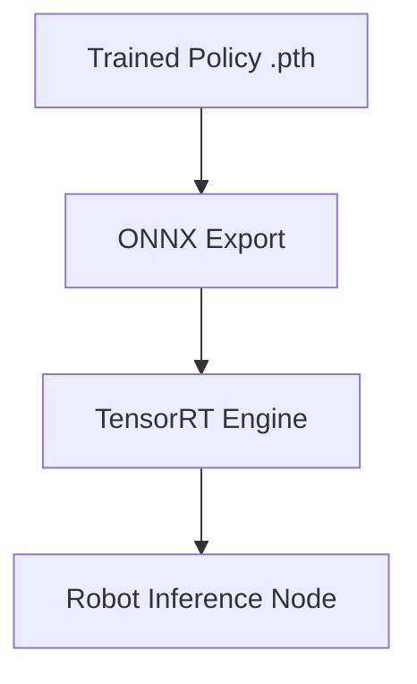

# Policy Deployment and Runtime Diagnostics

## 🌍 Real World Scenario

Your robot trained for 10 GPU-hours. The policy looks great in simulation — 95% success rate. You deploy it to the real robot. It takes two steps and falls over. Welcome to the sim-to-real gap. This chapter teaches you how to survive it.

This is where most students get stuck. Training curves looked amazing. Episode reward climbed. Videos in simulation looked smooth. Then hardware reality arrived with actuator lag, sensor jitter, calibration drift, and tiny contact dynamics mismatches. The policy did not fail because “AI is useless.” It failed because deployment is a different engineering phase than training.

Most tutorials stop at “policy converged.” Real robotics starts at “policy deployed safely.” This chapter focuses on the runtime diagnostic process you need after training: export, inference pipeline integrity, transfer hardening, safety wrappers, and real-time monitoring.

## What You Will Learn

- How to export Isaac Lab policies from PyTorch to ONNX and then TensorRT.
- How runtime inference pipelines are structured end to end.
- How to reduce sim-to-real failure risk with actuator models, domain randomization audits, and system identification.
- What to log at runtime and how to visualize it quickly.
- How to diagnose frequent deployment failure modes with practical signals.
- How to apply safe deployment protocols with hard limits and emergency overrides.
- How to use ROS 2 diagnostics and `rqt` tools for live monitoring.

## Why deployment diagnostics are the real skill

A trained policy is not a finished product. It is a candidate controller.

Deployment readiness requires evidence that:
1. Input tensors at runtime match training assumptions.
2. Action outputs are bounded and physically meaningful.
3. Latency budgets are respected.
4. Failure handling is deterministic and safe.

Without this, you get classic failures:
- Policy outputs saturate joints at startup.
- Sensor preprocessing mismatch causes observation drift.
- Control loop timing jitter destabilizes gait.
- Safety monitors trigger too late.

The goal is not to eliminate all failures. The goal is to detect and contain failures before they become unsafe hardware events.

## Exporting trained policies: PyTorch → ONNX → TensorRT

### Stage 1: PyTorch checkpoint
After training in Isaac Lab, you usually have a `.pt` checkpoint containing model weights and policy architecture assumptions.

### Stage 2: ONNX export
ONNX provides framework-agnostic representation for deployment toolchains. At this stage, you lock input/output tensor shapes and graph behavior.

### Stage 3: TensorRT engine build
TensorRT compiles/optimizes model inference for NVIDIA hardware, reducing latency and improving throughput—critical for real-time control loops.

Practical checks at each stage:
- Verify output parity between PyTorch and ONNX on identical inputs.
- Verify TensorRT output parity within tolerance.
- Profile inference time under target hardware load.

If parity drifts significantly, do not deploy. Fix export graph assumptions first.

## 💻 Code Example 1: ONNX export script for Isaac Lab policy

```python
#!/usr/bin/env python3
# file: tools/export_policy_onnx.py

import argparse
import torch


class PolicyWrapper(torch.nn.Module):
    def __init__(self, policy_net):
        super().__init__()
        self.policy_net = policy_net

    def forward(self, obs):
        # Assume policy outputs action tensor directly
        return self.policy_net(obs)


def load_policy(checkpoint_path: str):
    # Replace with your project-specific policy class/loader
    ckpt = torch.load(checkpoint_path, map_location='cpu')
    policy = ckpt['policy_model']
    policy.eval()
    return policy


def main():
    parser = argparse.ArgumentParser()
    parser.add_argument('--checkpoint', required=True)
    parser.add_argument('--out', default='artifacts/policy.onnx')
    parser.add_argument('--obs-dim', type=int, required=True)
    args = parser.parse_args()

    policy = load_policy(args.checkpoint)
    wrapped = PolicyWrapper(policy)

    dummy_obs = torch.randn(1, args.obs_dim, dtype=torch.float32)

    torch.onnx.export(
        wrapped,
        dummy_obs,
        args.out,
        input_names=['obs'],
        output_names=['action'],
        dynamic_axes={'obs': {0: 'batch'}, 'action': {0: 'batch'}},
        opset_version=17,
        do_constant_folding=True,
    )

    print(f"Exported ONNX policy to {args.out}")


if __name__ == '__main__':
    main()
```

After ONNX export, build TensorRT engine using your deployment pipeline (e.g., `trtexec` or integrated runtime wrappers) and validate outputs.

## Runtime inference pipeline: sensor → preprocess → policy → postprocess → actuator

A policy never runs in isolation on robot hardware. It sits inside a real-time pipeline.

### 1) Sensor ingestion
- IMU, joint states, force sensors, optional vision streams.
- Timestamps must be coherent.

### 2) Preprocessing
- Frame alignment.
- Normalization with training-time scales.
- Feature ordering exactly matching policy expectation.

### 3) Policy inference
- ONNX/TensorRT forward pass.
- Deterministic batch size and timing.

### 4) Postprocessing
- Action scaling and clipping.
- Optional smoothing/filtering.
- Joint limit and rate limit enforcement.

### 5) Actuator command publish
- Send bounded commands to low-level controllers.
- Enforce safety interlocks before hardware write.

Most sim-to-real failures originate from mismatch in step 2 or step 4, not from “bad model intelligence.”

## 💻 Code Example 2: ROS 2 node for policy inference and joint command publish

```python
#!/usr/bin/env python3
# file: nodes/policy_inference_node.py

import numpy as np
import onnxruntime as ort
import rclpy
from rclpy.node import Node
from sensor_msgs.msg import JointState, Imu
from std_msgs.msg import Float64MultiArray


class PolicyInferenceNode(Node):
    def __init__(self):
        super().__init__('policy_inference_node')

        self.declare_parameter('onnx_path', 'artifacts/policy.onnx')
        self.declare_parameter('action_scale', 0.3)
        self.declare_parameter('max_action_abs', 1.0)

        onnx_path = self.get_parameter('onnx_path').get_parameter_value().string_value
        self.action_scale = self.get_parameter('action_scale').get_parameter_value().double_value
        self.max_action_abs = self.get_parameter('max_action_abs').get_parameter_value().double_value

        self.session = ort.InferenceSession(onnx_path, providers=['CPUExecutionProvider'])
        self.input_name = self.session.get_inputs()[0].name

        self.latest_joint = None
        self.latest_imu = None

        self.create_subscription(JointState, '/robot1/joint_states', self.on_joint, 50)
        self.create_subscription(Imu, '/robot1/imu', self.on_imu, 50)

        self.cmd_pub = self.create_publisher(Float64MultiArray, '/robot1/policy_joint_cmd', 20)

        self.timer = self.create_timer(0.01, self.control_step)  # 100 Hz

    def on_joint(self, msg: JointState):
        self.latest_joint = msg

    def on_imu(self, msg: Imu):
        self.latest_imu = msg

    def build_observation(self):
        if self.latest_joint is None or self.latest_imu is None:
            return None

        q = np.array(self.latest_joint.position, dtype=np.float32)
        dq = np.array(self.latest_joint.velocity, dtype=np.float32) if self.latest_joint.velocity else np.zeros_like(q)

        imu_vec = np.array([
            self.latest_imu.angular_velocity.x,
            self.latest_imu.angular_velocity.y,
            self.latest_imu.angular_velocity.z,
            self.latest_imu.linear_acceleration.x,
            self.latest_imu.linear_acceleration.y,
            self.latest_imu.linear_acceleration.z,
        ], dtype=np.float32)

        # Example normalization (must match training-time scaling)
        q_norm = np.clip(q / np.pi, -1.0, 1.0)
        dq_norm = np.clip(dq / 20.0, -1.0, 1.0)
        imu_norm = np.clip(imu_vec / 20.0, -1.0, 1.0)

        obs = np.concatenate([q_norm, dq_norm, imu_norm], axis=0)
        return obs[None, :].astype(np.float32)

    def control_step(self):
        obs = self.build_observation()
        if obs is None:
            return

        action = self.session.run(None, {self.input_name: obs})[0][0]

        action = np.clip(action * self.action_scale, -self.max_action_abs, self.max_action_abs)

        msg = Float64MultiArray()
        msg.data = action.tolist()
        self.cmd_pub.publish(msg)


def main(args=None):
    rclpy.init(args=args)
    node = PolicyInferenceNode()
    try:
        rclpy.spin(node)
    finally:
        node.destroy_node()
        rclpy.shutdown()


if __name__ == '__main__':
    main()
```

This node demonstrates deployment essentials: synchronized observation construction, normalized preprocessing, bounded action output, fixed control loop rate.

## Sim-to-real transfer hardening techniques

### 1) Actuator network/model
Real actuators have latency, friction, dead zones, and nonlinear responses. An actuator model helps bridge policy outputs to realistic joint behavior learned in simulation.

### 2) Domain randomization review
Before deployment, audit randomization coverage used in training:
- friction ranges
- latency jitter
- sensor noise
- mass/inertia perturbations

If randomization did not include real-world variation you now observe, retraining is expected.

### 3) System identification
Measure real robot dynamics and update simulation parameters accordingly. This often closes major transfer gaps faster than policy architecture changes.

Deployment insight: transfer quality is usually a systems issue, not a single-model issue.

## Runtime diagnostics: what to log and visualize

Log at minimum:
1. Observation vector statistics (mean/std/min/max by channel).
2. Action statistics (clipped fraction, saturation counts).
3. Control loop timing (dt jitter, inference latency).
4. Safety events (joint limit near-miss, estop triggers, fall detections).
5. Policy reward surrogates (if available online) and task events.

Visualization priorities:
- Real-time plots for key channels.
- Rolling windows for latency and action saturation.
- Event timelines aligned with falls/failures.

If you only log “policy output,” you will miss the root cause. Correlate sensors, actions, and timing.

## Failure mode diagnosis table

| Failure Mode | Symptoms | Likely Cause | First Diagnostic Check | Immediate Mitigation |
|---|---|---|---|---|
| Policy drift after deployment | Stable start then degrading behavior over minutes | Sensor bias/temperature drift, state estimator drift | Compare observation channel baselines over time | Recalibrate sensors, reset estimator periodically |
| Joint limit violations | Sudden hard stops, controller warnings | Action scaling mismatch or missing postprocess clipping | Count clipped/near-limit commands per joint | Tighten action bounds, add joint-limit penalty/safety clamp |
| Unexpected sensor readings | Spikes or impossible values | Bad calibration, frame mismatch, electrical noise | Plot raw + normalized sensor channels live | Add sanity filters, fallback to safe mode on outliers |
| Inference timing overruns | Missed control ticks, unstable gait | Tensor runtime too slow on target hardware | Measure end-to-end inference latency percentile | Lower model size, optimize TensorRT engine, reduce frequency |
| Startup fall in first steps | Immediate collapse after enable | Observation mismatch vs training distribution | Compare sim startup observation snapshot to real | Add staged warm-up policy, zero-motion stabilization phase |

Keep this table close during deployment days. It shortens panic loops.

## Safe deployment protocol (non-negotiable)

Before enabling autonomous policy control on hardware:

1. **Velocity limits**
   Enforce conservative max linear/angular/joint velocities.

2. **Torque/position bounds**
   Hard clamps independent of policy output.

3. **Emergency stop integration**
   Physical and software estop must override policy immediately.

4. **Human override mode**
   Supervisor can switch from policy to safe controller instantly.

5. **Progressive rollout**
   - Tethered or support rig test.
   - Reduced-speed open area test.
   - Structured scenario test.
   - Supervised production-like test.

6. **Abort conditions**
   Predefine exact conditions that force immediate disable (latency spikes, repeated limit violations, unstable COM behavior).

No benchmark score is worth bypassing these safeguards.

## Monitoring with ROS 2 diagnostics and rqt

ROS 2 provides practical runtime introspection tools:

- `/diagnostics` style health reporting via diagnostic messages.
- `rqt_plot` for live channel trends.
- `rqt_console` for warning/error timeline.
- `rqt_graph` for graph integrity and topic connectivity.

Recommended deployment dashboard:
- Inference latency (ms).
- Control loop frequency (Hz).
- Action saturation ratio.
- Joint limit proximity metric.
- Estop state + safety flags.

These should be visible to the operator in real time during initial deployment.

## 💻 Code Example 3: Runtime diagnostic monitor with threshold alerts

```python
#!/usr/bin/env python3
# file: nodes/runtime_diag_monitor.py

import rclpy
from rclpy.node import Node
from diagnostic_msgs.msg import DiagnosticArray, DiagnosticStatus, KeyValue
from std_msgs.msg import Float64MultiArray


class RuntimeDiagnosticMonitor(Node):
    def __init__(self):
        super().__init__('runtime_diagnostic_monitor')

        self.declare_parameter('max_inference_ms', 12.0)
        self.declare_parameter('max_saturation_ratio', 0.20)
        self.declare_parameter('max_joint_limit_ratio', 0.95)

        self.max_inference_ms = self.get_parameter('max_inference_ms').value
        self.max_saturation_ratio = self.get_parameter('max_saturation_ratio').value
        self.max_joint_limit_ratio = self.get_parameter('max_joint_limit_ratio').value

        self.latest_inference_ms = 0.0
        self.latest_saturation_ratio = 0.0
        self.latest_joint_limit_ratio = 0.0

        self.create_subscription(Float64MultiArray, '/robot1/runtime/inference_stats', self.on_inference_stats, 20)
        self.create_subscription(Float64MultiArray, '/robot1/runtime/action_stats', self.on_action_stats, 20)
        self.create_subscription(Float64MultiArray, '/robot1/runtime/joint_limit_stats', self.on_joint_limit_stats, 20)

        self.diag_pub = self.create_publisher(DiagnosticArray, '/diagnostics', 10)
        self.timer = self.create_timer(0.2, self.publish_diag)

    def on_inference_stats(self, msg: Float64MultiArray):
        # expected: [avg_ms, p95_ms]
        if len(msg.data) >= 2:
            self.latest_inference_ms = float(msg.data[1])

    def on_action_stats(self, msg: Float64MultiArray):
        # expected: [saturation_ratio]
        if msg.data:
            self.latest_saturation_ratio = float(msg.data[0])

    def on_joint_limit_stats(self, msg: Float64MultiArray):
        # expected: [max_limit_ratio]
        if msg.data:
            self.latest_joint_limit_ratio = float(msg.data[0])

    def publish_diag(self):
        status = DiagnosticStatus()
        status.name = 'policy_runtime_health'
        status.hardware_id = 'robot1_policy_stack'

        warn = (
            self.latest_inference_ms > self.max_inference_ms
            or self.latest_saturation_ratio > self.max_saturation_ratio
            or self.latest_joint_limit_ratio > self.max_joint_limit_ratio
        )

        status.level = DiagnosticStatus.WARN if warn else DiagnosticStatus.OK
        status.message = 'threshold exceeded' if warn else 'runtime healthy'

        status.values = [
            KeyValue(key='p95_inference_ms', value=f'{self.latest_inference_ms:.3f}'),
            KeyValue(key='saturation_ratio', value=f'{self.latest_saturation_ratio:.3f}'),
            KeyValue(key='joint_limit_ratio', value=f'{self.latest_joint_limit_ratio:.3f}'),
            KeyValue(key='max_inference_ms', value=f'{self.max_inference_ms:.3f}'),
            KeyValue(key='max_saturation_ratio', value=f'{self.max_saturation_ratio:.3f}'),
            KeyValue(key='max_joint_limit_ratio', value=f'{self.max_joint_limit_ratio:.3f}'),
        ]

        msg = DiagnosticArray()
        msg.status = [status]
        self.diag_pub.publish(msg)

        if warn:
            self.get_logger().warn(f"Runtime threshold alert: {status.values}")


def main(args=None):
    rclpy.init(args=args)
    node = RuntimeDiagnosticMonitor()
    try:
        rclpy.spin(node)
    finally:
        node.destroy_node()
        rclpy.shutdown()


if __name__ == '__main__':
    main()
```

This monitor provides immediate threshold-based warnings and integrates with standard ROS diagnostics workflows.

## Deployment checklist (operator-ready)

Before enabling policy control each session:
- Validate sensor calibration status.
- Run dry inference with actuators disabled.
- Verify observation normalization ranges in live feed.
- Verify action bounds and saturation ratios at idle.
- Verify estop and override switch behavior.
- Start with conservative velocity profile.
- Record diagnostics and video from first run.

After each run:
- Tag failures by mode from table.
- Save logs with model hash + config version.
- Decide: tune runtime wrapper, retrain policy, or update sim parameters.

This disciplined loop is how teams survive sim-to-real iteration without damaging hardware.

## Architecture Diagram



## 💡 Key Concepts Summary

- Training success is not deployment success.
- Export parity (PyTorch → ONNX → TensorRT) must be validated numerically and temporally.
- Runtime inference pipelines fail most often at preprocessing/postprocessing boundaries.
- Sim-to-real transfer improves via actuator modeling, randomization coverage, and system identification.
- Diagnostics must include sensor/action/timing/safety signals, not just reward curves.
- Safe deployment protocols with hard limits and human override are mandatory.
- ROS 2 diagnostics + `rqt` tooling provide practical real-time observability.

## 🧪 Practice Exercises

### Exercise 1 (Beginner)
Run policy inference node with actuators disconnected and log observation/action distributions for 5 minutes. Verify no channel exceeds expected normalization bounds.

```bash
# Plot per-channel min/max and identify outliers before hardware motion tests.
```

### Exercise 2 (Intermediate)
Inject artificial 10 ms inference delay and observe stability degradation. Tune control frequency or model runtime optimization until thresholds pass.

```python
# Compare p95 latency and fall events before/after optimization.
```

### Exercise 3 (Advanced)
Build an automated deployment gate that blocks policy activation unless diagnostic monitor reports all metrics healthy for 30 continuous seconds.

```python
# Include estop check and operator acknowledgment in activation flow.
```

## Key Takeaways

- The most important robotics debugging begins after training, not before it.
- Sim-to-real failures are diagnosable when you instrument interfaces and timing correctly.
- Safe wrappers and diagnostics are part of the controller, not optional extras.
- Students who master deployment diagnostics move from demo-level to production-level robotics engineering.

## 🔗 Next Up

Next chapter: End-to-end humanoid deployment runbook—integrating policy packaging, diagnostics, safety review, and staged rollout into a repeatable release process.