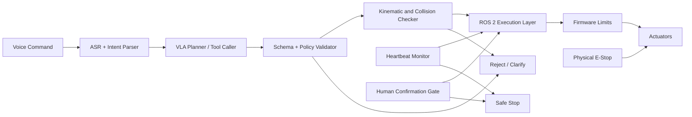

# Action Safety and Runtime Verification

## Real World Scenario

2015 میں، جرمنی میں ایک فیکٹری ربوٹ نے ایک مزدور کو ایک سٹیٹ اپ آپریشن کے دوران مار ڈالا۔ اس مشین نے اپنے کنٹرول سسٹم کی اجازت دی ہوئی بات کا بھی بھال کیا۔ اس نے کوئی سمجھ نہیں کی، کوئی مقصد نہیں، یا خطرہ۔ یہ صرف حرکت کی تعمیل کر رہا تھا۔

اب ہم جدید زبان کے ساتھ منصوبہ بندی شدہ ربوٹکس کو سمجھتے ہیں۔ ایک یوزر کہتا ہے، "وہ باکس کو طرف کی طرف لے جاؤ۔" ایک ویژن-لینگوئج- ایکشن (VLA) اسٹیک بول چال کو پہچانتا ہے، اشیاء کو زمین پر لگاتا ہے، ایک ایکشن کا منصوبہ بناتا ہے، اور کام کے نظاموں میں کمانڈیں بھیجتا ہے۔ یہ ڈیمو میں جادو جیسا دکھ

Software AI میں ایک خراب_OUTPUT کو دوبارہ کوشش سے درست کیا جا سکتا ہے۔ فزیکل AI میں ایک خراب_OUTPUT ہارڈویئر کو ٹوٹنے، ملکیت کو نقصان پہنچانے، یا لوگوں کو زخمی کرنے کا باعث بن سکتا ہے۔ اس لیے Runtime Verification غیر معاوضہ ہے۔

یہ باب آپ کو اس سافٹ ویئر کی سیکیورٹی آرکٹیکچر سکھاتا ہے جو آپ کو ضروری ہے کہ آپ کبھی بھی ایک LLM-derived ایکشن کو حقیقی موٹرز تک پہنچنے کی اجازت نہیں دیتے ہیں۔

## What You Will Learn

- Why physical AI requires stronger safeguards than pure software systems.
- A practical 6-layer safety architecture for VLA robots.
- How to combine hardware, firmware, ROS 2 runtime checks, and policy controls.
- How ISO 10218 and ISO/TS 15066 shape real deployment requirements.
- How to design software watchdogs and heartbeat-based failsafes.
- How to validate action commands with schema, kinematic, and policy constraints.
- How to structure human-in-the-loop confirmation for high-risk tasks.
- How to build graceful degradation paths for LLM uncertainty and timeout events.

## Why safety is the core problem in VLA systems

زبان کی ماڈلز احتمالی ہیں۔ وہ syntactically مکمل لیکن فزیکل طور پر خطرناک کارروائیوں کو واپس کر سکتے ہیں۔ ماڈل ایک اشیا کو درست طور پر شناخت کر سکتا ہے لیکن نا حاصل یا تصادم کے خطرے کے ساتھ ایک نا ممکن یا end پوزیشن کو پیدا کر سکتا ہے۔ وہ ایک ایسا ٹول کی صلاحیت کی تخیل کر سکتا ہے جو موجود نہیں ہے۔ وہ دنیا بدلنے کے بعد پرانے خیالات پیدا کر سکتا ہے۔

ایک عام غلط فہمی یہ ہے: "اگر زمین سے جڑنا درست ہے، تو عمل محفوظ ہے۔" یہ غلط ہے۔

اِن کہ پُرہُنی ہی دیکھ بھال ہو تو بھی ناقص سلوک کا باعث بن سکتا ہے اگر:

1. Action values exceed actuator constraints.
2. Frame references hain anjat (map vs base_link).
Tayyar hukumat kee cheezain khatam kar di gayee hain.
چار۔ انسانی قربت کے حدود کی خلاف ورزی کی جاتی ہے۔
5. کنٹرولر کی تاخیر کی وجہ سے تاخیر شدہ بریکنگ ہوتی ہے۔

VLA کی سَفَیَتِی ہے ایک فِلٹر نہیں ہے۔ یہ ایک لےئرڈ سسٹم ہے جس میں ایکٹیو پَٹھ کے کئی پوائنٹس پر آزاد چیکس ہیں۔

## The 6-layer safety architecture (defense in depth)

آپ کو ہمیشہ ایک گارڈ ریل کے پر انحصار نہیں کرنا چاہیے۔ آزاد لےئرز بنائیں تاکہ ایک حصے میں چیک کی غلطی کو دوسرے حصے کی جانب سے پتہ چل سکے۔

### Layer 1: Hardware safety boundary

یہ لेयर ہر حالات میں کام کرنا چاہیے جبکہ لینکس کراچ ہو۔

- Physical E-stop circuit that cuts actuator power.
- Safety relay and power contactor.
- Motor driver current limits.
- Mechanical stops and protected work envelope.

agar aapka software stack unresponsive ho jata hai, is layer nehin catastrophic motion rokta hai.

### Layer 2: Firmware and low-level controller limits

ایس لےائر نے موٹرز کے قریب ہارڈ کنسٹرینٹس کو نافذ کیا ہے۔

- Joint position limits.
- Velocity and acceleration limits.
- Torque/force bounds.
- Command timeout auto-stop (if new command not received).

Low-level controllers ko apne source ke bawjood khatarnaak values ko reject karna chahiye.

### Layer 3: ROS 2 runtime supervision

یہ لेयर نہیں ڈیٹیکس کرتی ہے کہ کیا نہیں، اس میں نہیں ڈیٹیکس کرتی ہے کہ کیا نہیں، اور کیا نہیں ڈیٹیکس کرتی ہے۔

- Heartbeat topics for critical nodes.
- Watchdog timers with auto-stop behavior.
- Lifecycle-managed nodes for controlled startup/shutdown.
- QoS profiles chosen by risk class (reliability over throughput for safety-critical channels).

یہاں سے بہت سے ٹیموں کو ناکامی ہوتی ہے۔ وہ منطقی منطق کو واضح کرتے ہیں لیکن Runtime لiveness کو نظر انداز کرتے ہیں۔

### Layer 4: Kinematic and geometric verification

یہ لेयर اسپیشل فیبیلٹی کو قبل از عمل کے عمل سے قبل وैलڈ کرتا ہے۔

- Workspace bounds checks.
- Self-collision checks.
- Obstacle collision prediction.
- Reachability and IK validity checks.
- Trajectory smoothness and jerk constraints.

agar ek LLM (-Large Language Model) output "reach z=-0.2" hai tabletop scene ke liye, toh yeh layer isey rokta hai.

### Layer 5: Semantic and policy validation

یہ لेयर انٹینٹ لول کی درستیت کو وैलڈیٹ کرتی ہے۔

- Strict schema validation for tool calls.
- Capability whitelists.
- Unit and frame validation.
- Task policy checks (forbidden zones, speed caps in human proximity, no autonomous hazardous actuation).
- Confidence thresholds and uncertainty escalation.

ہم LLM کے output کو بے اعتماد صارف کی طرف سے input کے طور پر استعمال کرتے ہیں۔

### Layer 6: Human-in-the-loop authority

یہ لेयर ہم آہنگی اور غیر واپس مند کارروائیوں کو حل کرتی ہے۔

- Confirmation prompts for risky actions.
- Teleoperation takeover.
- Operator override and stop authority.
- Audit logs for post-incident review.

آمریت کا اختیار ہمیشہ خودکار منصوبہ بندی پر فوقیت رکھنا چاہیے۔

## Safety architecture at runtime



کیے ڈیزائن اصول: **تمام خودکار کمانڈز کو ویلڈیٹرز سے گزرنے سے پہلے ایگزیکشن کے ذریعے پاس ہوتے ہیں، اور کسی بھی سپروائزنگ کے غلطی کو ایک ساف سٹاپ کے ذریعے فورس کر سکتا ہے۔**

## ISO safety standards overview for robotics deployments

### ISO 10218 (industrial robots)

ISO 10218 کی تعریف کے مطابق صنعتی ربات کی سسٹم اور انٹیگریشن کے لیے سافٹ ویئر ٹیموں کے لیے اہم پیغامات:

- Risk assessment is mandatory, not optional.
- Safety-rated monitored stop and emergency stop behavior must be defined.
- Operational modes (automatic, manual reduced speed, maintenance) need distinct controls.
- System integrator responsibility is explicit.

آپ کو صرف "سافٹ ویئر" کے ذریعے ہم آہنگی کا دعویٰ نہیں کر سکتے ہیں۔  سیکیورٹی ایک نظام کی خصوصیت ہے جس میں ہارڈ ویئر، سافٹ ویئر، عملے، اور ماحول کے کنٹرول شامل ہیں۔

### ISO/TS 15066 (collaborative robots)

آئی ایس او/ٹی ایس 15066 انسانی-رोबٹ تعاون کے لیے سلامتی کی رہنمائی کو وسعت دیتا ہے۔

معیار Concepts شامل ہیں:

- Speed and separation monitoring.
- Power and force limiting.
- Hand-guiding and monitored stop constraints.
- Body-region force/pressure thresholds for contact safety.

جسمانی زبان سے چلنے والے رباتوں کے لیے، یہ مطلب ہے کہ پالیسی کی پابندیاں متناسب ہونی چاہئیں۔ ایک کام جو خالی ہیڈ ورک پلیس میں محفوظ ہے وہ انسانوں کے قریب خطرناک ہو سکتا ہے۔

### Practical takeaway for VLA teams

آپ کو پہلے دن سے ہی ایک معیار کے معاہدے کے طور پر معیار کی زبان کے ساتھ آرکٹیکچر کو منسلک کرنا ہوگا، لیکن بعد میں سافٹی کی تبدیلی لگانا مہنگا اور اکثر ناکام ہوتا ہے۔

## Runtime verification pipeline: what to check before every action

پہلے کوشش کے عمل کے دوران ہر ایک ایکشن کینڈیڈیٹ کو اس چیک لسٹ سے گزرنا چاہیے:

1. **Syntax validity**: Is output valid JSON/tool schema?
2. **Kamyaabi ki sahiyat**: Kya maangaya hua kaushal manzoor hai?
3. **پارامीटर کی وैलڈیٹی**: ہیں یونٹس، رینجز، اور فریمز ویلڈ ہیں؟
چار۔ **سٹیٹ وैलڈیٹی**: کمانڈ موجودہ ربات کی حالت (گرپیر occupied، بٹری کم، لاکلائزیشن uncertain) سے مطابقت رکھتی ہے؟
5. **Spatial validity**: Khasus hai ki target k liye reach aur collision-free hai?
چھ: **زمانی معتبریت**: ڈیٹا کیا تازہ ہے (ٹائم اسٹیمپ اور ہارٹ بیٹ کا صحت مند ہے)?
7. پالیسی کی وحدت: یہ کارروائی موجودہ سلامتی مود میں جائز ہے؟
اہداف کی وضاحت: اگر خطرہ کی حد پر عبور ہوگیا ہے، تو صارف نے تصدیق کی ہے؟

agar koi check fail ho jata hai, to nahi hi kuch bhi karein. ek structurized rejection reason return karein aur clarify/replan/stop workflow ko trigger karein.

## Common runtime failure modes and diagnostics

| Failure mode | Typical symptom | Root cause | Runtime mitigation |
|---|---|---|---|
| Stale perception | Robot reaches old object location | Camera/TF lag | Reject if sensor timestamp too old; force re-detect |
| Frame mismatch | Motion in wrong direction | `map` vs `base_link` confusion | Enforce frame whitelist and transform check |
| Unsafe speed | Jerky or dangerous movement | Missing unit/range validation | Clamp and reject out-of-range commands |
| Looping replan | Endless retries without progress | No stop criteria in ReAct loop | Max-iteration cap + escalation |
| Node freeze | Robot keeps last command | Planner crash, no liveness supervision | Watchdog timeout to safe stop |
| Human proximity violation | Robot moves near operator | No proximity-aware policy | Dynamic speed/separation constraints |

## Code Example 1: Action schema + policy gate middleware

```python
#!/usr/bin/env python3
# file: safety/action_policy_gate.py

from pydantic import BaseModel, Field, ValidationError

ALLOWED_SKILLS = {"MOVE_BASE", "REACH", "GRASP", "PLACE", "STOP"}
ALLOWED_FRAMES = {"map", "base_link"}


class ActionCommand(BaseModel):
    skill: str = Field(description="One of MOVE_BASE, REACH, GRASP, PLACE, STOP")
    target_frame: str
    x: float = Field(ge=-2.0, le=2.0)
    y: float = Field(ge=-2.0, le=2.0)
    z: float = Field(ge=0.0, le=2.0)
    yaw: float = Field(ge=-3.2, le=3.2)
    speed_mps: float = Field(ge=0.0, le=0.20)


class PolicyContext(BaseModel):
    human_nearby: bool
    autonomy_mode: str  # e.g. "AUTO", "SUPERVISED"


def validate_and_authorize(raw: dict, ctx: PolicyContext) -> tuple[bool, str, ActionCommand | None]:
    try:
        cmd = ActionCommand(**raw)
    except ValidationError as e:
        return False, f"schema_reject: {e.errors()}", None

    if cmd.skill not in ALLOWED_SKILLS:
        return False, "policy_reject: unsupported_skill", None

    if cmd.target_frame not in ALLOWED_FRAMES:
        return False, "policy_reject: unsupported_frame", None

    # Context-aware policy constraint
    if ctx.human_nearby and cmd.speed_mps > 0.10:
        return False, "policy_reject: speed_too_high_for_human_proximity", None

    # High-risk skills require supervised mode
    if cmd.skill in {"GRASP", "PLACE"} and ctx.autonomy_mode != "SUPERVISED":
        return False, "policy_reject: skill_requires_supervision", None

    return True, "accepted", cmd
```

ایس گیت کو ROS 2 کی کوئی ایکشن کی درخواست بھیجے جانے سے پہلے چلنا چاہیے۔

## Code Example 2: ROS 2 heartbeat watchdog with safe-stop trigger

```python
#!/usr/bin/env python3
# file: safety/heartbeat_watchdog_node.py

import rclpy
from rclpy.node import Node
from std_msgs.msg import Empty, Bool


class HeartbeatWatchdog(Node):
    def __init__(self):
        super().__init__("heartbeat_watchdog")

        self.timeout_sec = 0.5
        self.last_heartbeat_ns = self.get_clock().now().nanoseconds
        self.estop_latched = False

        self.create_subscription(Empty, "/vla/heartbeat", self.on_heartbeat, 10)
        self.estop_pub = self.create_publisher(Bool, "/robot/safe_stop", 10)

        self.timer = self.create_timer(0.1, self.check_timeout)
        self.get_logger().info("watchdog_online")

    def on_heartbeat(self, _msg: Empty) -> None:
        self.last_heartbeat_ns = self.get_clock().now().nanoseconds

    def check_timeout(self) -> None:
        if self.estop_latched:
            return

        now_ns = self.get_clock().now().nanoseconds
        elapsed = (now_ns - self.last_heartbeat_ns) / 1e9

        if elapsed > self.timeout_sec:
            msg = Bool()
            msg.data = True
            self.estop_pub.publish(msg)
            self.estop_latched = True
            self.get_logger().error(f"watchdog_timeout elapsed={elapsed:.3f}s safe_stop=1")


def main(args=None):
    rclpy.init(args=args)
    node = HeartbeatWatchdog()
    rclpy.spin(node)
    node.destroy_node()
    rclpy.shutdown()


if __name__ == "__main__":
    main()
```

Watchdog ko planner process se alag hona chahiye jo use monitor karta hai.

## Code Example 3: Human confirmation gate for risky actions

```python
#!/usr/bin/env python3
# file: safety/human_confirmation_gate.py

RISKY_SKILLS = {"GRASP", "PLACE"}


def needs_confirmation(skill: str, confidence: float, distance_to_human_m: float) -> bool:
    if skill in RISKY_SKILLS:
        return True
    if confidence < 0.70:
        return True
    if distance_to_human_m < 1.0:
        return True
    return False


def gate_action(action: dict, operator_confirmed: bool) -> tuple[bool, str]:
    skill = action.get("skill", "STOP")
    confidence = float(action.get("confidence", 0.0))
    dist = float(action.get("distance_to_human_m", 999.0))

    if needs_confirmation(skill, confidence, dist) and not operator_confirmed:
        return False, "hold_for_operator_confirmation"

    return True, "approved"
```

Yeh pattern ambigous ya high-risk steps ko chupke se karna se bachata hai.

## Prompt engineering for safety-constrained planners

امنیت بھی اس پر نिर्भر ہے کہ آپ کس طرح پلانر کو کہاں کہتے ہیں۔ اچھے پرمپٹس ناچیز امیدواروں کی پیداواری شرح کو کم کرتے ہیں۔

Include:

- Allowed skills and forbidden skills.
- Numeric bounds with units.
- Required frame names.
- Explicit fallback behavior (`STOP` + clarification) when uncertain.
- Output format constraints (strict JSON/tool call only).

مثال پلیٹنگ رول بلاک:

```text
You are a robot planner. Output strict JSON only.
Rules:
- skill must be one of MOVE_BASE, REACH, GRASP, PLACE, STOP.
- speed_mps must be <= 0.20.
- target_frame must be map or base_link.
- If confidence < 0.70, output STOP and ask clarification in reason field.
- Never invent capabilities.
```

مہارت کی گुणवत्तہ صرف یو ایکس کی گुणवत्तہ نہیں ہے۔ یہ ایک محفوظی نظام ہے۔

## Graceful degradation strategy

Ek majboot system ek komponnt fail hone par na tootta hai, balki safalta se kamzor hota hai.

پیشہ ورانہ تباہی کی لڑی کی تجویز

1. **Normal autonomy**: all checks pass.
2. **قید شدہ خودمختاری:** رفتار/کامیابی کی حدوں کو تنگ کر دیا گیا ہے کیونکہ غیر یقینی ہے۔
3. **Clarification mode**: planner ask operator ke liye disambiguation ke liye puchta hai.
چار۔ **ساف اسٹاپ**: واٹچ ڈوائمر ٹائم آؤٹ، ٹکر کا خطرہ، یا پالیسی کی خلاف ورزی۔
5. **Manual Control Mode**: Operator Takkar Leta Hai.
چھ: **ایمرجنسی پاور کٹ**: ہارڈ ویئر ایسٹاپ.

ڈیٹا کی منتقلی کو Explicitly Define کریں اور ہر Transition Path کو Test کریں.

## Deployment checklist before real hardware tests

- [ ] Physical E-stop validated with power-cut test.
- [ ] Firmware limit values verified against robot datasheet.
- [ ] Heartbeat timeout test performed (planner intentionally killed).
- [ ] Schema rejection tested with malformed and out-of-range actions.
- [ ] Collision checker tested against known obstacle fixtures.
- [ ] Human confirmation gate tested for high-risk actions.
- [ ] Audit logs include command source, validation status, and stop reasons.
- [ ] Recovery procedure documented for operators.

agar koi box unchecked hai, to deployment incomplete hai.

## Key Concepts Summary

- In robotics, safety failures are physical failures, not just software bugs.
- VLA outputs must be treated as untrusted and continuously validated.
- Use layered defense: hardware, firmware, runtime supervision, geometric checks, policy checks, and human oversight.
- ISO 10218 and ISO/TS 15066 provide practical anchors for deployment-grade safety expectations.
- Watchdogs and heartbeat checks prevent silent failure modes.
- Runtime verification must happen on every action, not just at startup.

## Practice Exercises

### Exercise 1 (Beginner)
**Schema Validation for LLM Action Payloads**

### Introduction

LLM (Large Language Model) action payloads require strict schema validation to ensure that incoming requests conform to expected formats and constraints. In this example, we will implement schema validation for five sample LLM action payloads, including two invalid cases, and verify that they are rejected with structured reasons.

### Sample LLM Action Payloads

#### Valid Payload 1: Move Forward

```json
{
  "action": "move",
  "params": {
    "speed": 0.5,
    "duration": 2.0
  }
}
```

#### Valid Payload 2: Rotate Left

```json
{
  "action": "rotate",
  "params": {
    "angle": 45.0,
    "duration": 1.5
  }
}
```

#### Invalid Payload 3: Speed Out of Range

```json
{
  "action": "move",
  "params":

```python
# Goal: prove your semantic gate rejects malformed and unsafe actions.
```

### Exercise 2 (Intermediate)
ایک ROS 2 ڈیمو بنائیں جس میں دو نودز ہوں: ایک ہارٹ بیٹ پبلش کرنے والا اور ایک واٹچ ڈاگ نود۔ پبلش کرنے والا 5 سیکنڈ کے بعد روک دیں اور یقین کریں کہ واٹچ ڈاگ ایک ساف اسٹاپ کمانڈ جاری کرتا ہے جس کے اندر وقت کے اندر۔

```python
# Goal: prove runtime liveness monitoring works under planner failure.
```

### Exercise 3 (Advanced)
ایک ہی پائپ لائن میں Schema Gate + Kinematic Checker + Human Confirmation Gate کو شامل کریں۔ 20 مختلف کمانڈز چلانے کے بعد، قبولیت/متنازعہ گنتی کی رپورٹ کرنے کے لئے ریزن کی زمرہ بندی کریں۔

```bash
# Goal: generate evidence that your multi-layer safety stack is working as designed.
```

## Key Takeaways

- Smart planning is not enough; safe execution is the real bar for physical AI.
- Runtime verification is a continuous process, not a one-time validation step.
- The correct architecture assumes the planner can be wrong and still keeps humans safe.
- If your stack cannot fail safely, it is not production-ready.

## Next Up

Aagay ka kapur: puri tarah se shamil kiyaa hai, jahaan ground planning, safety gates, aur ROS 2 ki karyavaahi ek saath milakar ek poora deployment workflow banai jaati hai.
