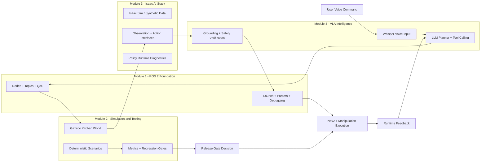

# Capstone Project — The Autonomous Humanoid

## 🌍 Real World Scenario

ہفتہ 1 میں، آپ نے پہلا ROS 2 نود نے لکھا اور یہ `Hello Robot.` کا پرنٹ کیا۔ ہفتہ 14 میں، آپ کا ہیومینوائڈ ہرے، “میں کوئلر سے پانی لے آؤ” کہتا ہے، چیئرز کے گرد گھومتا ہے، ایک بٹل کو ڈیٹیکٹ کر لیتا ہے، اسے محفوظ طریقے سے پکڑتا ہے، اور صارف کے پاس واپس آتا ہے۔

یہ نہیں شوق ہے، یہ نظام کی انجینئرنگ ہے۔ یہ باب آپ کا فائنل لائن اور آپ کا لانچ پوائنٹ ہے۔

## What You Will Learn

- How the full capstone pipeline works from voice command to physical action.
- How to integrate ROS 2, Gazebo, Isaac workflows, and VLA planning into one architecture.
- How to execute the capstone in four implementation phases with clear milestones.
- How to launch the full stack from a single integration launch file.
- How to run a high-impact 90-second demo judges understand immediately.
- How to self-evaluate project readiness before submission.
- How to debug top integration failures quickly under deadline pressure.
- How this capstone maps directly to career paths in Physical AI.

## Why this capstone matters

جے کے زیادہ تر طلباء ربوٹکس کورسز سے ٹکڑوں کے ساتھ ختم ہوتے ہیں: ایک ناوبری ڈیمو، ایک پریزنسی ڈیمو، شاید ایک چیٹ بیٹ ڈیمو۔ صنعت نہیں ٹکڑوں کے لیے ملازمت کرتا ہے۔ صنعت انٹیگریشن کے لیے ملازمت کرتا ہے۔

آپ کا کैपستون یہ ثابت کرنے کے لیے کہ آپ ایک پوری طرح سے خودمختار نظام بنانے میں सक्षम ہیں جہاں ہر سب سسٹم ایک کام اچھی طرح سے کرے اور درست طور پر اگلے کے لیے ہاتھ ہاتھی ہو۔

1. **Speech understanding** turns human intention into machine-readable task text.
دو۔ **ٹاسک کی وجوہات اور بنیاد** زبان کو اشیاء، مقاصد اور حدود سے جوڑتا ہے۔
3. **ناوبری اور مینیپولیٹیشن پلی닝** منصوبہ کو ایسا بناتا ہے جو مرضی کو محفوظ اور قابل عمل حرکت میں تبدیل کرے۔
چوتھے نمبر **Runtime verification and safety gates** کوئی بھی ربات محفوظ طریقے سے کامیاب ہو سکتا ہے۔
5. ہمیشہ حقیقی سنسور ڈیٹا سے فیڈ بیک لूप اپ ڈیٹ کرتی ہے۔

اِس کپسٹون کے ذریعے آپ اپنی ایمبیڈڈڈ آئی کا پیشہ ورانہ پورٹ فولیو آرٹیفیکٹ بناتے ہیں۔

## Complete system overview: voice input to robot action

جاری عمل کے دوران، آپ کا نظام یوں کام کرنا چاہیے:

- Human says: “Bring me water from the kitchen.”
- Whisper transcribes speech.
- Planner parses intent: `task=fetch_water`, `source=kitchen`, `target=human`.
- Perception subsystem identifies bottle candidates.
- Nav2 computes path to kitchen waypoint.
- Robot navigates, aligns, runs grasp behavior.
- Runtime validator checks motion and safety constraints.
- Robot returns to user waypoint.
- Robot confirms delivery with speech output.

جادو ایک ہی ماڈل میں نہیں ہے۔ جادو ماڈیولز کے درمیان رابطوں میں ہے۔

### Full architecture across all 4 modules



آپ نے نہ صرف بے ترتیب حصوں کو بنایا بلکہ ایک لےے لے کر ٹیسٹ کی جانے والی خودمختاری کا لےے لے کر ٹیسٹ کی جانے والی خودمختاری کا ایک لےے لے کر ٹیسٹ کی جانے والی خودمختاری کا ایک لےے لے کر ٹیسٹ کی جانے والی خودمختاری کا ایک لےے لے کر ٹیسٹ کی جانے والی خودمختاری کا ایک لےے لے کر ٹیسٹ کی جانے والی خودمختاری کا ایک لےے لے کر ٹ

## Phase-by-phase implementation guide

ہم اس Implementation کو Stage Integration کے طور پر سمجھیں، ایک بڑے Merge کے بجائے۔ ہر Phase میں Done کی تعریف ہوتی ہے۔

## PHASE 1: ROS 2 workspace with all nodes running and communicating

### Goal
ایک صاف ROS 2 ورک اسپیس قائم کریں جہاں تمام بنیادی نودز درست طور پر چلنے لگتے ہیں، ایک دوسرے کو دریافت کرتے ہیں اور متوقع QoS کے ساتھ پیغامات تبادلہ کرتے ہیں۔

### Required nodes (minimum)
- `voice_input_node`
- `task_planner_node`
- `perception_bridge_node`
- `nav_goal_router_node`
- `manipulation_executor_node`
- `safety_watchdog_node`
- `state_reporter_node`

### Verification checklist
- `ros2 node list` shows all expected nodes.
- `ros2 topic list` includes command, state, and heartbeat channels.
- `ros2 topic hz /robot/heartbeat` is stable.
- `ros2 topic echo /planner/action_json` outputs valid payloads.

شروعاتی ٹیپ
اگر discovery کھلے ہونے میں کامیابی نہیں ہو رہی ہے، پہلے DDS ڈومین آئی ڈی اور QoS کی compatibility کو چیک کریں پھر کوڈ کو چھونے سے پہلے۔
:::

### Common contract for action message

اِک سخت شَمہ ہونا جو ہر نُد کو معنا پر متفق ہونا ہے۔

```python
# file: interfaces/action_contract.py
# Defines a strict action contract exchanged between planner and executors.
from pydantic import BaseModel, Field


class RobotAction(BaseModel):
    skill: str = Field(description="MOVE_BASE, REACH, GRASP, PLACE, STOP")
    frame: str = Field(description="map or base_link")
    x_m: float
    y_m: float
    z_m: float
    yaw_rad: float
    speed_mps: float = Field(ge=0.0, le=0.2)
    reason: str
```

## PHASE 2: Gazebo simulation with kitchen environment and sensors streaming

### Goal
چلائیں ROS2 میں ایک کچن جیسے ورلڈ میں ربات، RGB-D کیمرے، LiDAR، اور اوڈومیٹری اسٹریمز جو حقیقی تعینات اشارات کی توقع کی جاتی ہے۔

### Environment requirements
- Distinct kitchen waypoint and delivery waypoint.
- At least two obstacle classes (static chairs + dynamic human proxy).
- Water bottle object with detectable visual features.

### Sensor checks
- RGB stream stable (`/camera/color/image_raw`).
- Depth aligned (`/camera/depth/image_raw`).
- LiDAR publishing (`/scan`).
- TF tree complete for `map -> odom -> base_link -> camera_link`.

آپ کو یہ بات یاد رکھنی چاہیے کہ ROS2، SLAM، LiDAR، Node، Topic، QoS، Gazebo، Isaac، VLA، Python، C++ کے نام انگریزی میں رہنے چاہیے۔
ٹیموں کو اکثر پلانر لاجک کو پہلے ڈھونڈھن اور ٹائم اسٹیمپ ایلیگمنٹ کی وैलڈیٹیشن کے بعد ڈھونڈھن کرتے ہیں۔  ٹرانسفارم میں غیر منسلک ڈھونڈھن بھیڑیے کی پلیئن کو ٹوٹا دیتی ہے۔
:::

### Scenario table for simulation validation

| Scenario | What to test | Pass criteria |
|---|---|---|
| Empty kitchen path | Basic nav to bottle zone | Goal reached without oscillation |
| Chair obstacle | Local planner avoidance | No collision, acceptable detour |
| Dynamic blocker | Replan behavior | Robot pauses/replans safely |
| False bottle candidate | Perception robustness | Correct object selected or clarification asked |

## PHASE 3: SLAM + Nav2 autonomous waypoint navigation

### Goal
ایک قابل اعتماد خودکار حرکت کو یوزر کی جگہ اور کچن کی جگہ کے درمیان فعال کریں۔

### Core Nav2 behaviors to demonstrate
- Global path generation.
- Local obstacle avoidance.
- Recovery behaviors (spin, clear costmap, replan).
- Goal tolerance handling.

### Why this phase is critical
agar navigation kamzor hai, to poora capstone bhi anjana dikhata hai, chaahe aapka VLA planner achha ho. Movement quality hi pehle dekha jata hai.

### Practical milestone tests
1. Start at user point, navigate to kitchen waypoint 10 times.
2. Obstacle variance ko shamil karein aur dubara karein.
تین۔ واپسی راستہ کی قابل اعتمادیت کی تصدیق کریں۔
چار. کامیابی کی شرح اور پانچ فیصد نینٹی نائن تکمیل کا وقت ریکارڈ کریں۔

پرو انسائٹ
عدالتاں ایک چمکتی ہوئی اچھی کارکردگی سے زیادہ استحکام کی وجہ سے زیادہ انعام دیتی ہیں۔ وہ متعین تغیرات کے تحت دہرائے جانے والے کامیابی کے پتے دکھائیں۔
:::

## PHASE 4: Whisper + GPT-4 + ROS 2 pipeline for voice-commanded tasks

### Goal
بند کرنے کے لئے انسانی بولنے سے ربوٹ کی ایگزیکشن تک کے چکر کو ساختہ پلیاننگ کے نتیجے سے بند کریں۔

### Pipeline requirements
- Speech transcription with Whisper.
- Task planning with constrained LLM output.
- Tool/function call mapping to robot skills.
- Runtime safety checks before execution.
- Spoken confirmation on task completion/failure.

### Minimum supported intents
- “Bring me water from the kitchen.”
- “Go to kitchen and wait.”
- “Stop now.”

### Safety requirement
ہمیشہ نتیجہ کو کنٹرولرز تک مستقیم طور پر نہیں بھیجنا چاہیے، ہمیشہ اسے ایک سکیما کے مطابق پارسہ اور وैलڈیٹ کریں۔

## Complete integration launch file

ایک کمانڈ میں اینڈ ٹو اینڈ کپسٹون اسٹیک شروع کرنے والا یہ لانچ فائل ہے۔

```python
#!/usr/bin/env python3
# file: launch/capstone_autonomous_humanoid.launch.py
# Launches full capstone stack: simulation, navigation, perception, planner, safety.

from launch import LaunchDescription
from launch.actions import DeclareLaunchArgument, IncludeLaunchDescription
from launch.substitutions import LaunchConfiguration
from launch.launch_description_sources import PythonLaunchDescriptionSource
from launch_ros.actions import Node
from ament_index_python.packages import get_package_share_directory
import os


def generate_launch_description():
    use_sim_time = LaunchConfiguration('use_sim_time')
    world = LaunchConfiguration('world')

    gazebo_pkg = get_package_share_directory('gazebo_ros')
    nav2_pkg = get_package_share_directory('nav2_bringup')
    capstone_pkg = get_package_share_directory('humanoid_capstone')

    gazebo_launch = IncludeLaunchDescription(
        PythonLaunchDescriptionSource(
            os.path.join(gazebo_pkg, 'launch', 'gazebo.launch.py')
        ),
        launch_arguments={
            'world': world,
            'verbose': 'false'
        }.items()
    )

    nav2_launch = IncludeLaunchDescription(
        PythonLaunchDescriptionSource(
            os.path.join(nav2_pkg, 'launch', 'navigation_launch.py')
        ),
        launch_arguments={
            'use_sim_time': use_sim_time,
            'params_file': os.path.join(capstone_pkg, 'config', 'nav2_params.yaml')
        }.items()
    )

    state_reporter = Node(
        package='humanoid_capstone',
        executable='state_reporter_node',
        name='state_reporter_node',
        parameters=[{'use_sim_time': use_sim_time}],
        output='screen'
    )

    voice_input = Node(
        package='humanoid_capstone',
        executable='voice_input_node',
        name='voice_input_node',
        parameters=[
            {'use_sim_time': use_sim_time},
            {'whisper_model': 'base'}
        ],
        output='screen'
    )

    planner = Node(
        package='humanoid_capstone',
        executable='task_planner_node',
        name='task_planner_node',
        parameters=[
            {'use_sim_time': use_sim_time},
            {'llm_model': 'gpt-4.1'},
            {'max_speed_mps': 0.20}
        ],
        output='screen'
    )

    perception = Node(
        package='humanoid_capstone',
        executable='perception_bridge_node',
        name='perception_bridge_node',
        parameters=[{'use_sim_time': use_sim_time}],
        output='screen'
    )

    nav_router = Node(
        package='humanoid_capstone',
        executable='nav_goal_router_node',
        name='nav_goal_router_node',
        parameters=[{'use_sim_time': use_sim_time}],
        output='screen'
    )

    manipulation = Node(
        package='humanoid_capstone',
        executable='manipulation_executor_node',
        name='manipulation_executor_node',
        parameters=[{'use_sim_time': use_sim_time}],
        output='screen'
    )

    safety_watchdog = Node(
        package='humanoid_capstone',
        executable='safety_watchdog_node',
        name='safety_watchdog_node',
        parameters=[
            {'use_sim_time': use_sim_time},
            {'heartbeat_timeout_sec': 0.5}
        ],
        output='screen'
    )

    return LaunchDescription([
        DeclareLaunchArgument('use_sim_time', default_value='true'),
        DeclareLaunchArgument(
            'world',
            default_value=os.path.join(capstone_pkg, 'worlds', 'kitchen.world')
        ),
        gazebo_launch,
        nav2_launch,
        state_reporter,
        voice_input,
        planner,
        perception,
        nav_router,
        manipulation,
        safety_watchdog,
    ])
```

## Working demo script (for operators and judges)

استعمال کریں یہ اسکرپٹ کو ایک کنٹرول شدہ، پتہ لگایا ہوا چلائیں جسے مانیٹرنگ کے دوران تجربہ کیا جائے۔

```python
#!/usr/bin/env python3
# file: scripts/demo_run.py
# Runs a scripted capstone demo sequence and prints checkpoint status.

import time
import rclpy
from rclpy.node import Node
from std_msgs.msg import String


class DemoRunner(Node):
    def __init__(self):
        super().__init__('demo_runner')
        self.voice_cmd_pub = self.create_publisher(String, '/voice/command_text', 10)
        self.status_sub = self.create_subscription(String, '/capstone/status', self.on_status, 10)
        self.last_status = ''

    def on_status(self, msg: String):
        self.last_status = msg.data
        self.get_logger().info(f"STATUS: {self.last_status}")

    def send_voice_command(self, text: str):
        msg = String()
        msg.data = text
        self.voice_cmd_pub.publish(msg)
        self.get_logger().info(f"VOICE_COMMAND_SENT: {text}")


def main(args=None):
    rclpy.init(args=args)
    node = DemoRunner()

    # Warm-up spins to ensure pub/sub graph is ready.
    for _ in range(20):
        rclpy.spin_once(node, timeout_sec=0.1)

    # Demo command expected by judges.
    node.send_voice_command('bring me water from the kitchen')

    start = time.time()
    timeout = 90.0

    # Monitor for completion state under 90 seconds.
    while time.time() - start < timeout:
        rclpy.spin_once(node, timeout_sec=0.1)
        if 'TASK_COMPLETED' in node.last_status:
            node.get_logger().info('DEMO_RESULT: SUCCESS')
            break
        if 'SAFE_STOP' in node.last_status:
            node.get_logger().warn('DEMO_RESULT: STOPPED_BY_SAFETY')
            break
    else:
        node.get_logger().error('DEMO_RESULT: TIMEOUT')

    node.destroy_node()
    rclpy.shutdown()


if __name__ == '__main__':
    main()
```

## 90-second demo guide: what judges want to see

آپ صرف کوشش کی دکھا رہے ہیں، بلکہ انجینئری کی پوری پختگی بھی دکھا رہے ہیں۔

### 0–15s: System context
- One sentence: “This is an end-to-end autonomous humanoid pipeline from voice to safe execution.”
- Show architecture slide/diagram.

### 15–30s: Bring-up
- Run one command to launch full stack.
- Show node graph health (`ros2 node list` quick snapshot).

### 30–60s: Voice command execution
- Speak command: “Bring me water from the kitchen.”
- Show live planner status updates.
- Robot navigates to kitchen waypoint and performs pick behavior.

### 60–80s: Return and delivery
- Robot returns to user zone.
- Delivery confirmation event shown in logs/UI.

### 80–90s: Safety proof
- Trigger a controlled safety condition (heartbeat timeout simulation).
- Show safe-stop behavior activates correctly.

agar samay kam hai, to safety evidence ko skip na karein. yeh serious teams ko toy demos se alag karta hai.

## Submission checklist: is your project ready?

ہم آپ کی مدد کے لیے تیار ہیں۔

| Category | Requirement | Pass/Fail |
|---|---|---|
| Architecture | Full pipeline diagram included and explained | ☐ |
| Integration | One-command launch for full system | ☐ |
| Functionality | Voice-to-task-to-action flow works end-to-end | ☐ |
| Navigation | Reliable waypoint travel with obstacle handling | ☐ |
| Manipulation | Bottle pickup behavior demonstrated | ☐ |
| Safety | Watchdog + safe-stop demonstrated live | ☐ |
| Validation | Logs/metrics collected for run evidence | ☐ |
| Presentation | 90-second demo scripted and rehearsed | ☐ |

ایک کپسٹون "تیار" ہے صرف جب تمام اہم کھربوں کو چیک کیا جاتا ہے۔

## Troubleshooting: top 10 problems and exact fixes

| Problem | Symptom | Likely cause | Fix |
|---|---|---|---|
| 1. Nodes not discovering each other | Empty topic graph | Wrong ROS domain/QoS mismatch | Align `ROS_DOMAIN_ID`, verify QoS profiles |
| 2. Planner outputs invalid actions | Executor rejects JSON | Missing schema constraints | Enforce strict schema + field bounds |
| 3. Robot drives wrong direction | Inverted nav behavior | Frame mismatch (`map`/`base_link`) | Validate frame names and TF transforms |
| 4. Perception sees bottle but grasp fails | Repeated miss | Poor camera-depth calibration | Recalibrate RGB-D alignment and grasp offset |
| 5. Nav2 oscillates near goal | Goal never completes | Costmap inflation/tolerance issues | Tune goal tolerances + local planner params |
| 6. Demo times out at 90s | Slow task completion | Over-conservative speed / excessive replans | Profile phase durations; tune safe speed envelope |
| 7. Voice command misunderstood | Wrong task intent | ASR noise, bad mic placement | Improve mic gain, denoise input, add command confirmations |
| 8. Safety watchdog triggers unexpectedly | Random safe-stop | Heartbeat jitter | Increase heartbeat publish rate; tune timeout cautiously |
| 9. Gazebo behaves unrealistically | Great sim, poor transfer | Weak domain randomization | Add variation in lighting, friction, mass, clutter |
| 10. System works once, fails later | Non-deterministic behavior | Hidden race/timing assumptions | Add deterministic scenario tests + startup sequencing |

## Safe-by-design vs safe-by-testing

آپ کو یہ فرق گہرا طور پر سمجھنا ہوگا۔

### Safe-by-testing
آپ بہت سے ٹیسٹ چلاتے ہیں اور امید ہے کہ خطرناک سلوک نا ممکن ہے۔
- Strength: easy to start.
- Weakness: cannot cover all real-world edge cases.

### Safe-by-design
Aap architect karte hain kuchh zaroori rekhakam so ki galat kaam na ho.
- Strength: higher baseline trust and predictability.
- Weakness: requires discipline and up-front design effort.

پیشہ ورانہ ربوٹکس ٹیمز دونوں کو ملا کر بناتے ہیں۔ وہ سافٹی کنٹرولز کو آرکٹیکچر میں پہلے شامل کرتے ہیں، پھر ٹیسٹنگ کے ذریعے شدید توثیق کرتے ہیں۔

## Career paths after this capstone

یہ منصوبہ متعدد اعلیٰ شرح ترقی والے کرداروں سے ہم آہنگ ہے۔

### 1) Robotics Engineer
آپ ROS 2، نेवیگیشن، مینिपولیٹیشن، اور رن ٹائم سافٹی کے ساتھ انٹیگریٹڈ ربات سسٹم بناتے ہیں۔

### 2) Embodied AI / VLA Research Engineer
آپ منصوبہ بندی، زمین سے منسلک، اور پالیسی سیکھنے کے نظام ڈیزائن کرتے ہیں جو زبان کو عمل میں منسلک کرتے ہیں۔

### 3) Simulation Engineer
آپ ہائی فائیڈیلٹی ڈیجیٹل ٹوئنز، سکیورینو پائپ لائنز، اور ریگریشن گیٹس بناتے ہیں جو سِم ٹو ریئل ایبلٹی کے لیے یقینی بناتے ہیں۔

### 4) AI Safety Engineer (Robotics)
Aapke kshetra mein aap runtime verification, guardrails, aur compliance-aligned deployment par mahir hain.

### 5) Startup Founder (Physical AI)
آپ ایک تنگ لیکن درد ناک دنیا کی پریشانی کو ایک قابل اعتماد خودکار پیداوار میں تبدیل کرتے ہیں۔

آپ کا کैपستون صرف کورس ورک نہیں ہے بلکہ یہ ثبوت ہے کہ آپ کمپلیکس اتھارٹی کو محدود حالات میں شپ کر سکتے ہیں۔

## 💡 Key Concepts Summary

| Concept | What it means | Real robot example |
|---|---|---|
| End-to-end integration | All subsystems connected with stable contracts | Voice instruction becomes safe executed fetch task |
| Layered architecture | Modules separated by responsibility | Planner cannot bypass safety watchdog |
| Deterministic validation | Repeatable tests before demos | Same kitchen scenario passes 10/10 runs |
| Runtime safety | Continuous verification before actuation | Unsafe speed command rejected pre-execution |
| Demo discipline | Scripted, measured presentation | 90-second run shows capability + safety proof |

## 🧪 Practice Exercises

### Exercise 1 (Beginner)
ایک منیجمل انٹیگریشن سموک ٹیسٹ تخلیق کریں: اپنی اسٹیک لانچ کریں اور 10 سیکنڈ کے اندر ہارٹ بیٹ + پلانر آؤٹ پٹ کی وریفی کیشن کریں۔

```python
# Goal: confirm baseline system liveness after launch.
import time

start = time.time()
heartbeat_seen = False
planner_seen = False

while time.time() - start < 10:
    # TODO: Replace with ROS topic checks in your environment
    if not heartbeat_seen:
        heartbeat_seen = True
    if not planner_seen:
        planner_seen = True

print("PASS" if heartbeat_seen and planner_seen else "FAIL")
```

### Exercise 2 (Intermediate)
ٹیسٹ "کچن فیش" کے لئے ایک نتیجہ پر منحصر سے ٹیسٹ کا ایک نافذ کردہ سے سکرینریو بنائیں۔ اس میں ایک فکسڈ سیڈ اور بارڈر لائٹ کے لئے ایک فکسڈ لائٹ لائٹ لائٹ لائٹ لائٹ لائٹ لائٹ لائٹ لائٹ لائٹ لائٹ لائٹ لائٹ لائٹ لائٹ لائٹ لائٹ لائٹ لائٹ لائٹ لائٹ لائٹ لائٹ لائٹ لائٹ لائٹ لائٹ لائٹ لائٹ لائٹ لائٹ لائٹ لائٹ لائٹ لائٹ ل

```python
# Goal: measure consistency, not just one successful run.
runs = 20
successes = 0
for i in range(runs):
    # TODO: trigger scenario and collect result
    simulated_result = True
    successes += 1 if simulated_result else 0

print({"runs": runs, "successes": successes, "success_rate": successes / runs})
```

### Exercise 3 (Advanced)
بنیں ایک ڈیمو کی تیاری کی گینٹ کے لیے جو فانکشنل کامیابی، سافٹی کامیابی، اور رن ٹائم بجٹ کی پابندی کی ضرورت ہے۔

```python
# Goal: block submissions that are flashy but unreliable.
def demo_ready(success_rate: float, safety_events: int, p95_duration_sec: float) -> bool:
    if success_rate < 0.90:
        return False
    if safety_events > 0:
        return False
    if p95_duration_sec > 90.0:
        return False
    return True

print(demo_ready(0.93, 0, 82.5))
```

## ✅ Key Takeaways

- You have moved from isolated robot scripts to full-stack embodied autonomy.
- Integration quality is defined by interfaces, observability, and safety—not model hype.
- A one-command launch and deterministic validation are professional-grade signals.
- Judges trust teams that demonstrate both capability and controlled failure behavior.
- This capstone is portfolio proof that you can design, build, test, and present real Physical AI systems.

## 🔗 Next Up

Aagay, aap is capstone ko ek deployment narrative mein pakate hain - technical demo, engineering evidence, aur product vision - taaki aapki kaam classroom achievement se real-world impact tak chali jaaye.

## 📚 Resources

- [ROS 2 Documentation (Humble)](https://docs.ros.org/en/humble/index.html)
- [Navigation2 Documentation](https://navigation.ros.org/)
- [Open Robotics](https://www.openrobotics.org/)

Aapne ek hi node aur ek hi print statement se shuru kiya tha, aap ab ek poora swatantra vritti stack banane ke liye aage badh rahe hain jo samajh sakta hai, vichar karta hai, karta hai, sudhar sakta hai, aur surakshit rah sakta hai. Yeh ek bada sa engineering hai. Is standard ko rakhein, aage badhne ke liye taiyar rahen, aur aapke aage ki sab kuch banane ke liye is gati ko le jayein.