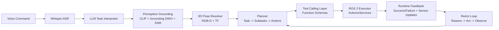

# Grounding, Planning, and LLM Tool Calling for Robots

## 🌍 Real World Scenario

LLM کہتا ہے "لال کپ کو اٹھا لیں" لیکن آپ کا ربات "لال کپ" نہیں دیکھتا۔ وہ 640×480 آر جی بی پکسلز کا ایک آرے اور پوائنٹ کلاؤڈ دیکھتا ہے۔ زمین کی بنیاد زبان اور حسیت کے درمیان پل ہے۔ اس کے بغیر، آپ کا ربات معنی سے بے سمجھ ہے۔

یہ VLA کی تحقیق کا سب سے مشکل اور دلچسپ محاذ ہے۔ زبان کے ماڈلز سمبولک استدلال میں بہت اچھے ہیں، لیکن ربات جسمانیات، غیر یقینی، اور رابطہ کے Dynamics میں رہتے ہیں۔ اگر آپ کا نظام کلمات جیسے "لال کپ کے ساتھ بائیں میں کھڑا" کو ایک واضح 3D پوزیشن کے ساتھ اعتماد کی حدوں کے ساتھ ایک صریح 3D پوزیشن سے جوڑنے میں ناکام ہے،

کئی ڈیموز اس کو چھپاتے ہیں جس کے لیے انہوں نے تیار کردہ مناظر اور منتخب کردہ اشارے استعمال کیے ہوتے ہیں۔ حقیقی رباتوں پر یہ ان کی منصوبہ بندی پر انحصار کرنا مشکل ہے۔ وہ اس بات پر انحصار کرتے ہیں کہ جب روشنی بدلت ہے، جب اشیا کی شکل بدلت ہے، اور جب انسان کی ہدایات مبہم ہوتی ہیں۔

## What You Will Learn

- Why semantic grounding is the core bridge between language and robot action.
- How CLIP builds a shared embedding space for image-text alignment.
- How open-vocabulary detection (Grounding DINO + SAM) upgrades robot perception flexibility.
- How to convert 2D detections into 3D robot coordinates using depth and camera intrinsics.
- How cognitive planning decomposes high-level tasks into executable ROS 2 steps.
- How to use LLM tool/function calling to expose robot capabilities safely.
- How the ReAct loop (Reason + Act) improves multi-step task robustness.
- How prompt engineering shapes safer, more reliable robot behavior.

## Why grounding is the central unsolved problem

ایک ایسا کمانڈ جیسا کہ "ریڈ کپ کو سینک کے قریب پکڑو" ہے وہ متعدد رہنمائی لے لینے والے لے لینے والے لے لینے والے لے لینے والے لے لینے والے لے لینے والے لے لینے والے لے لینے والے لے لینے والے لے لینے والے لے لینے والے لے لینے والے لے لینے والے لے لینے والے لے لینے والے ل

1. Parse language intent.
دوسرا زمین کے اشیاء کی زمرہ بندی اور خصوصیات وژن میں۔
3. رشتے کی عبارت ("Sink کے قریب") کو حل کریں۔
چار۔ اشیا کی 3D پوزیشن اور چھونے کی صلاحیت کا تخمینہ لگائیں۔
5. ایکشن سی کوئنسس چن لوں جس میں تصادم/سفائی کنسٹرینٹس ہوں۔

Hariyālī kī har kadam āzādī se kām kar saktī hai. Agar dhūlī kā nishkāsh nāzuk hai, to yojana kām karne mein koi galti nāhi hai, lekin vāstavik roop se galat ho sakta hai.

یہی وجہ ہے کہ لینگوئج گراونڈڈ رباتکس "سلیک لینگوئج مڈیئیشن" نہیں ہے۔ یہ ایک مکمل پہچان-اندازہ-عمل انسجام کا مسئلہ ہے۔

## Semantic grounding with CLIP: contrastive learning in one shared space

CLIP (Contrastive Language-Image Pretraining) learns aligned embeddings for text aur images. During training, yeh matching image-caption pairs ko embedding space mein aas paas rakhta hai aur mismatched pairs ko door rakhta hai.

یہ ربوٹکس کے لیے کیوں اہم ہے:
- You can query visual scenes with text prompts (“red mug”, “screwdriver”, “whiteboard marker”).
- You can rank candidate detections by language similarity without retraining fixed class heads.
- You get open-ended semantic matching beyond closed label sets.

مفہومی طور پر:
- Image encoder maps image crops to vectors.
- Text encoder maps phrases to vectors.
- Similarity score (e.g., cosine) estimates semantic match.

کلائپ (CLIP) میں اکثر سیمیٹک پریورز فراہم کیے جاتے ہیں جبکہ مخصوص ڈیٹیکٹرز لاکلائزیشن کی پریسیژن فراہم کرتے ہیں۔

## Open-vocabulary perception: Grounding DINO + SAM

بندہ Closed-set object detectors ہیں جو پہلے سے طے شدہ کلاس کی محدودیتوں کے ساتھ کام کرتے ہیں۔  Real environments میں رباتوں کو Long-tail objects کا سامنا ہوتا ہے۔  Open-vocabulary methods اس کا حل ہیں۔

### Grounding DINO
- Takes text queries plus image.
- Returns bounding boxes conditioned on language phrase.
- Useful for commands like “find the green bottle” even if bottle subtype wasn’t in fixed class list.

### SAM (Segment Anything Model)
- Produces high-quality masks from prompts (points/boxes).
- Refines object extent beyond coarse boxes.
- Helpful for grasp planning and clutter separation.

ملا ہوا پھلوں
1. Grounding DINO proposes phrase-conditioned box.
دو: SAM اشیاء کی ماسک کو سمجھتہے۔
تینڈیں پروجیکشن 3D ٹارگٹ پوائنٹ کمپیوٹ کرتی ہے۔

یہ کॉमبو طاقتور ہے کیونکہ یہ زبان کی چستی کو جارجیومٹری سے آگاہی کے ساتھ مینوفیکچرنگ سٹیٹ اپ کے ساتھ جوڑتا ہے۔

## 3D grounding: from 2D detection to robot coordinates

ایک باکس کی تصویر میں نہیں ہے کافی ہے ایک ربوٹ آرمی کے لئے۔ آرمی کو ربوٹ کی فریم میں ٹارگٹ پوز کی ضرورت ہے۔

پائیدار 3D زمین گرونڈنگ پائپ لائن:
1. Use detection/mask to select object pixels.
پہلے ڈپتھ کیوالیٹی کے مانیٹرڈ ڈپتھ فریم سے ڈپتھ کیوالیٹی کے مانیٹرڈ ڈپتھ کیوالیٹی کے مانیٹرڈ ڈپتھ کیوالیٹی کے مانیٹرڈ ڈپتھ کیوالیٹی کے مانیٹرڈ ڈپتھ کیوالیٹی کے مانیٹرڈ ڈپتھ کیوالیٹی کے مانیٹرڈ ڈپتھ کیوالیٹی کے مانیٹرڈ ڈپتھ کیوالیٹی کے مانیٹرڈ ڈ
3. کیمرے کی فریم میں انٹرنسک کے ذریعے پکسلز کو 3D نقطوں تک واپس کرنا۔
چار۔ کیمرہ کے فریم میں پوائنٹ کو ربوٹ/ورلڈ فریم میں تبدیل کرنا TF کا استعمال کرتے ہوئے۔
5. گرہن کے امیدوار پوزیشن اور اعتماد کا تخمینہ لگائیں۔

Core math (simplified): ہیڈ کور میتھ (سادہ)
- Given pixel `(u, v)` with depth `z`
- `x = (u - cx) * z / fx`
- `y = (v - cy) * z / fy`
- `z = z`

فیر بیس فریم کی کوئرڈینیٹس حاصل کرنے کے لیے بیس-کیمرا کے خارجہ ٹرانسفارم `T_base_camera` کو لگائیں۔

آم ناکامی کے نقطے:
- RGB-depth misalignment.
- Wrong camera intrinsics.
- Stale TF transform timestamps.
- Specular/transparent objects causing invalid depth.

زمین کی گھٹنہ کی گुणवत्तہ میں غیر یقینی اندازے شامل ہونے چاہئیں، صرف نقطہ پیش گوئیوں کے بجائے۔

## Cognitive planning architecture: Task → Subtasks → Actions → ROS 2

زمین کی پہنچ پہنچنے کے "کیوں" کا فیصلہ کرتا ہے۔

ایک مضبوط کائنسی پلی닝 اسٹیک کے لئے زبان کے شرط پر رباتکس کے لئے اکثر ہائرارکیال ڈیکمپوزیشن کا پیروں ہوتا ہے:

- **Task**: High-level instruction (e.g., “clean the whiteboard”).
- **Subtasks**: Semantic phases (find marker, approach board, erase region).
- **Actions**: Atomic executable intents (navigate pose, reach, grasp, wipe trajectory).
- **ROS 2 calls**: Concrete action/service/topic calls.

یہ تقسیم نظام کو قابل debug کرتی ہے اور ایک subtask ناکام ہونے پر partial recovery کو ممکن بناتی ہے۔



یہ آرکٹیکچر ایک ساتھ کیا جاتا ہے برائے ایک ساتھ کیا جاتا ہے بجائے ایک ساتھ کیا جاتا ہے کے برے ایک ساتھ کیا جاتا ہے کے برائے ایک ساتھ کیا جاتا ہے بجائے ایک ساتھ کیا جاتا ہے کے برائے ایک ساتھ کیا جاتا ہے کے برائے ایک ساتھ کیا جاتا ہے کے برائے ایک ساتھ کیا جاتا ہے کے برائے ایک س

## LLM tool calling for robotics control

فری فرمی زبان کو ساختہ صلاحیتوں کی پکار میں تبدیل کرنے والا LLM ٹول (فانکشن) بل دینے کی صلاحیت رکھتا ہے۔

مثال میں ربات کی صلاحیتوں:
- `detect_object(label: str)`
- `navigate_to(x, y, yaw)`
- `pick_object(object_id)`
- `place_object(target_zone)`
- `speak(message)`

کیوں ٹول کا نام ضروری ہے:
- It constrains model outputs to known safe interfaces.
- It improves parse reliability.
- It makes auditing and policy enforcement easier.

ڈیزائن کے اصول برائے ربوٹ ٹول سکیماں:
1. Use explicit units (`meters`, `radians`, `m/s`).
2. Bounds کو Schema Descriptions میں شامل کریں۔
3. Map, base link, camera link ke frame references ki zaroorat hai.
چار. غیرمستحکم اعتماد کے لئے قابل غیرمستحکم فیصلوں کے لئے قابل غیرمستحکم اعتماد کے کھلاں کا اضافہ کریں۔

یہ وہ مقام ہے جہاں پریس پورٹ انجینئرنگ سسٹم کی سیکیورٹی کا ملاقات ہوتی ہے۔

## ReAct pattern for multi-step robotic tasks

ReAct = **Tahreek + Tafahum** ہر ایک دوسرے کے ساتھ حل کرنے کے لئے ہر ایک دوسرے کے ساتھ حل کرنے کے لئے ہر ایک دوسرے کے ساتے ہر ایک دوسرے کے ساتے ہر ایک دوسرے کے ساتے ہر ایک دوسرے کے ساتے ہر ایک دوسرے کے ساتے ہر ایک دوسرے کے ساتے ہر ایک دوسرے کے ساتے ہ

جستجو کے بجائے ایک واحد منصوبہ بنانے اور بے پرواہی سے عمل درآمد کرنے کے بجائے، ماڈل بدلتی ہے:
1. Reason about current state.
چوائس ایکشن/ٹول کال کرے۔
3. نتیجہ دیکھیں۔
چار۔ منطق کو دوبارہ ترتیب دیں۔

کامروڈز کے لیے یہ بہت اہم ہے کیونکہ محیط کا حالت ہر ایک کارروائی کے بعد بدل جاتا ہے۔ ایک چپٹی کامیاب نہ ہو، ایک اشیا حرکت کرے، ایک انسان مداخلت کرے۔

ReAct کے فوائد:
- Better recovery from execution errors.
- Reduced hallucinated plan continuation.
- Improved transparency in decision traces.

ReAct Risks: Risayon Khatron
- Longer latency if loops are unbounded.
- Potential oscillation without stop criteria.

متعلقہ احتیاطی تدابیر
- Max iteration count.
- Timeout budgets.
- Explicit failure escalation path to human operator.

## Prompt engineering for grounded robotics

Robotics mein prompting chatbot ki tarah alag hai. Aapko deterministic structure, constraints, aur executable outputs ki zaroorat hoti hai.

### 1) Few-shot examples
مثال کے لئے، ہم کچھ مندرجہ ذیل سیکوئنس کو دیکھ سکتے ہیں:

1. **ہدایت**: "کھانا بنائیں"
2. **زمین پر عمل**: "کھانا بنانے کے لئے پہلے سبزیاں کاٹیں، پھر انہیں پکائیں، اور آخر میں انہیں پکانے کے لئے گیس سٹوور پر رکھیں"

اس سیکوئنس میں، ہدایت "کھانا بنائیں" کو زمین پر عمل "کھانا بنانے کے لئے پہل

### 2) Constraint injection
ہارڈ رولز Embed
- max speed
- no-go zones
- required confirmation for risky actions

### 3) Output formatting
Forse Jazn/tool-kal responz.

### 4) State injection
موجودہ ربات کی حالت کی تفصیل (باتری، مقام کی یقین، گریپر کی اشتہاری، محسوس شدہ اشیاء)

### 5) Failure instruction
جب ڈیٹا مبہم ہو تو ماڈل کو کیا کرنا چاہیے: وضاحت طلب کرنا یا `safe_stop` کا استعمال کرنا۔

مہارت کی سطح محض سہولت پر ہی اثر نہیں ڈالتا بلکہ محفوظی بھی متاثر کرتی ہے۔

## 💻 Code Example 1: Complete voice → Whisper → GPT-4 → ROS 2 pipeline

```python
#!/usr/bin/env python3
# file: pipelines/voice_to_ros2_pipeline.py

import json
import queue
import sounddevice as sd
import numpy as np
import whisper
from openai import OpenAI

import rclpy
from rclpy.node import Node
from std_msgs.msg import String


class VoiceToROS2Pipeline(Node):
    def __init__(self):
        super().__init__('voice_to_ros2_pipeline')
        self.pub = self.create_publisher(String, '/robot1/llm_action_json', 10)
        self.client = OpenAI()
        self.whisper_model = whisper.load_model('base')

    def record_audio(self, seconds=4, sr=16000):
        audio = sd.rec(int(seconds * sr), samplerate=sr, channels=1, dtype='float32')
        sd.wait()
        return audio.flatten(), sr

    def transcribe(self, audio_np, sr):
        result = self.whisper_model.transcribe(audio_np, fp16=False, language='en')
        return result['text'].strip()

    def llm_plan(self, text_cmd):
        prompt = (
            "You are a robot task planner. "
            "Return strict JSON with fields: skill,target_frame,x,y,z,yaw,speed,gripper. "
            "Speed must be <= 0.2 and skill must be one of MOVE_BASE,REACH,GRASP,PLACE,STOP. "
            f"Instruction: {text_cmd}"
        )

        response = self.client.responses.create(
            model='gpt-4.1',
            input=prompt,
            text={"format": {"type": "json_object"}},
        )
        return response.output_text

    def run_once(self):
        audio_np, sr = self.record_audio()
        text_cmd = self.transcribe(audio_np, sr)
        self.get_logger().info(f"Whisper: {text_cmd}")

        action_json = self.llm_plan(text_cmd)
        self.get_logger().info(f"LLM action: {action_json}")

        # publish to ROS2 bridge/executor
        msg = String()
        msg.data = action_json
        self.pub.publish(msg)


def main(args=None):
    rclpy.init(args=args)
    node = VoiceToROS2Pipeline()
    node.run_once()
    rclpy.spin_once(node, timeout_sec=0.5)
    node.destroy_node()
    rclpy.shutdown()


if __name__ == '__main__':
    main()
```

یہ پائپ لائن مکمل آواز سے تیار ہونے والے ROS- ایکشن کی تیار کردہ_OUTPUT کے پورا کمانڈ پتھ ظاہر کرتا ہے۔

## 💻 Code Example 2: Robot actions as OpenAI function schemas

```python
# file: planning/robot_function_schemas.py

ROBOT_FUNCTIONS = [
    {
        "type": "function",
        "name": "detect_object",
        "description": "Detect object in current scene by natural-language label.",
        "parameters": {
            "type": "object",
            "properties": {
                "label": {"type": "string"},
                "min_confidence": {"type": "number", "minimum": 0.0, "maximum": 1.0}
            },
            "required": ["label"]
        }
    },
    {
        "type": "function",
        "name": "navigate_to",
        "description": "Navigate robot base to target pose in map frame.",
        "parameters": {
            "type": "object",
            "properties": {
                "x_m": {"type": "number"},
                "y_m": {"type": "number"},
                "yaw_rad": {"type": "number"},
                "max_speed_mps": {"type": "number", "minimum": 0.0, "maximum": 0.3}
            },
            "required": ["x_m", "y_m", "yaw_rad"]
        }
    },
    {
        "type": "function",
        "name": "pick_object",
        "description": "Pick object using 3D grasp pose in base_link frame.",
        "parameters": {
            "type": "object",
            "properties": {
                "object_id": {"type": "string"},
                "x_m": {"type": "number"},
                "y_m": {"type": "number"},
                "z_m": {"type": "number"},
                "grasp_width_m": {"type": "number", "minimum": 0.0, "maximum": 0.12}
            },
            "required": ["object_id", "x_m", "y_m", "z_m"]
        }
    },
]
```

Ye schemaon ko planning outputs ko executable, unit-safe interfaces tak limit karte hain.

## 💻 Code Example 3: Grounding DINO integration with ROS 2

```python
#!/usr/bin/env python3
# file: perception/grounding_dino_ros2_node.py

import cv2
import numpy as np
import rclpy
from rclpy.node import Node
from sensor_msgs.msg import Image, CameraInfo
from geometry_msgs.msg import PointStamped
from cv_bridge import CvBridge

# Placeholder import path; adapt to your install
# from groundingdino.util.inference import load_model, predict


class GroundingDINONode(Node):
    def __init__(self):
        super().__init__('grounding_dino_node')
        self.bridge = CvBridge()

        self.latest_depth = None
        self.camera_info = None

        self.create_subscription(Image, '/robot1/camera/rgb/image_raw', self.on_rgb, 10)
        self.create_subscription(Image, '/robot1/camera/depth/image_raw', self.on_depth, 10)
        self.create_subscription(CameraInfo, '/robot1/camera/depth/camera_info', self.on_info, 10)

        self.point_pub = self.create_publisher(PointStamped, '/robot1/grounded_target_point', 10)

        # self.model = load_model("weights/groundingdino_swint_ogc.pth", "config/GroundingDINO_SwinT_OGC.py")
        self.query_text = "red cup"

    def on_info(self, msg: CameraInfo):
        self.camera_info = msg

    def on_depth(self, msg: Image):
        self.latest_depth = self.bridge.imgmsg_to_cv2(msg, desired_encoding='passthrough')

    def on_rgb(self, msg: Image):
        if self.latest_depth is None or self.camera_info is None:
            return

        rgb = self.bridge.imgmsg_to_cv2(msg, desired_encoding='bgr8')

        # Placeholder detector output (replace with Grounding DINO inference)
        # boxes, scores, labels = predict(self.model, rgb, self.query_text, box_threshold=0.35, text_threshold=0.25)
        h, w, _ = rgb.shape
        box = np.array([0.4*w, 0.4*h, 0.6*w, 0.7*h], dtype=np.int32)  # xmin,ymin,xmax,ymax

        u = int((box[0] + box[2]) / 2)
        v = int((box[1] + box[3]) / 2)

        z = float(self.latest_depth[v, u])
        if z <= 0.0 or np.isnan(z):
            return

        fx = self.camera_info.k[0]
        fy = self.camera_info.k[4]
        cx = self.camera_info.k[2]
        cy = self.camera_info.k[5]

        x = (u - cx) * z / fx
        y = (v - cy) * z / fy

        p = PointStamped()
        p.header = msg.header
        p.header.frame_id = 'camera_link'
        p.point.x = float(x)
        p.point.y = float(y)
        p.point.z = float(z)
        self.point_pub.publish(p)


def main(args=None):
    rclpy.init(args=args)
    node = GroundingDINONode()
    try:
        rclpy.spin(node)
    finally:
        node.destroy_node()
        rclpy.shutdown()


if __name__ == '__main__':
    main()
```

یہ فریسی کے مطابق ڈیٹیکشن کو ایکشنل 3D جارجمی میں تبدیل کرتا ہے۔

## Practical deployment guardrails for grounding + planning

1. **Confidence thresholds per stage**
agar perception ki taqat kam hai, to saaf karne ke bajay saaf karne ke liye puchhein.

2. **Spatial sanity checks**
Reject ground points ke bawal jo kisi bhi haath se pahunchne mein asambhav hain.

سیلاب کے پالیسی لेयर
ہر فانکشن کے آرگومنٹس کو پہلے ROS کے کالز سے قبل وैलڈ کرنے چاہئیں۔

چوتھی **ذاتی ہدف کا ذخیرہ**
ٹریک کرنا کہاں کام مکمل ہو چکے ہیں تاکہ لپ/مکرر کارروائیوں سے روکیا جا سکے۔

5. مین-این-द-لوپ اٹھائے جانے کی ترقی
کھلنے والی زمین کے لیے، مبہم ہونے والی زمین کے لیے، ڈس امبائیگیشن کا مطالبہ کریں ("کیا آپ کے مراد سینک کے قریب لال کپ ہے یا لپ ٹاپ کے قریب؟")۔

Zameen ke system fail karne ke liye hi safal hote hain, jab tak ki ashaudhikata ka saamna karna explicit roop se kiya jata hai.

## 💡 Key Concepts Summary

- Grounding is the core bridge from language symbols to physical world coordinates.
- CLIP provides semantic alignment; Grounding DINO + SAM improve open-vocabulary localization quality.
- 3D grounding requires depth projection + frame transforms; 2D boxes alone are insufficient.
- Cognitive planning should decompose tasks hierarchically before ROS execution.
- LLM tool calling turns language plans into structured, auditable robot capability invocations.
- ReAct loops improve robustness for multi-step tasks in dynamic environments.
- Prompt design is a safety and reliability lever, not just a UX detail.

## 🧪 Practice Exercises

### Exercise 1 (Beginner)
ایک ایک سولہ جسمانی زمین لگانے کا ٹیسٹ: کمانڈ "پک کرینڈ کپ"، اوپن وکٹری پریسپشن سے ڈیٹیکٹ کریں، اور 3D ٹارگٹ پوائنٹ شائع کریں۔ 20 رنوں پر پوزیشنل ری پیٹیبلٹی کی پیمائش کریں۔

```python
# Track mean and std of grounded (x,y,z) for the same static scene.
```

### Exercise 2 (Intermediate)
بنا کرے ہیں ReAct لूप کے ساتھ تین ٹولز (`detect_object`, `navigate_to`, `pick_object`) اور دو قدمی کمانڈ پر ٹیسٹ کریں: “ڈیسک پہ جاؤ اور مارکر کو پکڑو۔” Timeout اور max-iteration گارڈز کے ساتھ۔

```python
# Ensure tool outputs are validated before execution.
```

### Exercise 3 (Advanced)
امدادیہ حل کے لئے ترمیم کریں: اپنے منصوبے میں وضاحت کے حل کے پتے شامل کریں۔ اگر دو امیدوار اشیاء لہجہ کے مطابق ہوں، تو یوزر سے مزید سوال پوچھیں اور صرف تصدیق کے بعد منصوبہ جاری کریں۔

```bash
# Goal: reduce wrong-object picks without manual teleoperation.
```

## Key Takeaways

- Language grounding is the hardest and most critical bridge in VLA robotics.
- Robust grounding requires semantics + geometry + uncertainty-aware planning.
- Function-calling and ReAct patterns make LLM-driven robots more reliable and controllable.
- The best robot planners are not just smart—they are structured, constrained, and observable.

## 🔗 Next Up

Aagay ka kapur: Suraksha-samayojit autonmous karyanvayan—kaise samarthit bhoomi-sampann bhasha yojana ko runtime niti janch, prabandhan logik, aur operator vishvas mechanism se jodna hai.