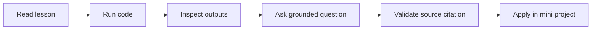

# Physical AI Textbook: Learning Roadmap

## System Context

In this chapter, the core focus is **curriculum navigation, study workflow, grounded assistant usage, and capstone preparation**. Section 1 explains how this focus appears in a real engineering setting such as a learner moving from ROS message flow basics to an end-to-end autonomous humanoid demo. Rather than presenting isolated theory, we connect architecture decisions to measurable runtime outcomes. You should pay attention to interfaces, assumptions, and instrumentation because most deployment failures come from weak contracts, not from missing algorithms. For hackathon-quality delivery, each design choice must answer three questions: what behavior is expected, what evidence proves it, and what fallback protects users when assumptions break. That discipline is also what makes RAG-backed explanations reliable, because precise content yields precise retrieval, and precise retrieval yields answers learners can verify directly against source material. As you implement or review this chapter topic, intentionally map concept to code, code to telemetry, and telemetry to decision-making so technical improvements remain reproducible instead of anecdotal.
## Technical Deep Dive

In this chapter, the core focus is **curriculum navigation, study workflow, grounded assistant usage, and capstone preparation**. Section 2 explains how this focus appears in a real engineering setting such as a learner moving from ROS message flow basics to an end-to-end autonomous humanoid demo. Rather than presenting isolated theory, we connect architecture decisions to measurable runtime outcomes. You should pay attention to interfaces, assumptions, and instrumentation because most deployment failures come from weak contracts, not from missing algorithms. For hackathon-quality delivery, each design choice must answer three questions: what behavior is expected, what evidence proves it, and what fallback protects users when assumptions break. That discipline is also what makes RAG-backed explanations reliable, because precise content yields precise retrieval, and precise retrieval yields answers learners can verify directly against source material. As you implement or review this chapter topic, intentionally map concept to code, code to telemetry, and telemetry to decision-making so technical improvements remain reproducible instead of anecdotal.
## Implementation Pattern

In this chapter, the core focus is **curriculum navigation, study workflow, grounded assistant usage, and capstone preparation**. Section 3 explains how this focus appears in a real engineering setting such as a learner moving from ROS message flow basics to an end-to-end autonomous humanoid demo. Rather than presenting isolated theory, we connect architecture decisions to measurable runtime outcomes. You should pay attention to interfaces, assumptions, and instrumentation because most deployment failures come from weak contracts, not from missing algorithms. For hackathon-quality delivery, each design choice must answer three questions: what behavior is expected, what evidence proves it, and what fallback protects users when assumptions break. That discipline is also what makes RAG-backed explanations reliable, because precise content yields precise retrieval, and precise retrieval yields answers learners can verify directly against source material. As you implement or review this chapter topic, intentionally map concept to code, code to telemetry, and telemetry to decision-making so technical improvements remain reproducible instead of anecdotal.
## Failure Modes

In this chapter, the core focus is **curriculum navigation, study workflow, grounded assistant usage, and capstone preparation**. Section 4 explains how this focus appears in a real engineering setting such as a learner moving from ROS message flow basics to an end-to-end autonomous humanoid demo. Rather than presenting isolated theory, we connect architecture decisions to measurable runtime outcomes. You should pay attention to interfaces, assumptions, and instrumentation because most deployment failures come from weak contracts, not from missing algorithms. For hackathon-quality delivery, each design choice must answer three questions: what behavior is expected, what evidence proves it, and what fallback protects users when assumptions break. That discipline is also what makes RAG-backed explanations reliable, because precise content yields precise retrieval, and precise retrieval yields answers learners can verify directly against source material. As you implement or review this chapter topic, intentionally map concept to code, code to telemetry, and telemetry to decision-making so technical improvements remain reproducible instead of anecdotal.
## Validation Strategy

In this chapter, the core focus is **curriculum navigation, study workflow, grounded assistant usage, and capstone preparation**. Section 5 explains how this focus appears in a real engineering setting such as a learner moving from ROS message flow basics to an end-to-end autonomous humanoid demo. Rather than presenting isolated theory, we connect architecture decisions to measurable runtime outcomes. You should pay attention to interfaces, assumptions, and instrumentation because most deployment failures come from weak contracts, not from missing algorithms. For hackathon-quality delivery, each design choice must answer three questions: what behavior is expected, what evidence proves it, and what fallback protects users when assumptions break. That discipline is also what makes RAG-backed explanations reliable, because precise content yields precise retrieval, and precise retrieval yields answers learners can verify directly against source material. As you implement or review this chapter topic, intentionally map concept to code, code to telemetry, and telemetry to decision-making so technical improvements remain reproducible instead of anecdotal.
## Operational Readiness

In this chapter, the core focus is **curriculum navigation, study workflow, grounded assistant usage, and capstone preparation**. Section 6 explains how this focus appears in a real engineering setting such as a learner moving from ROS message flow basics to an end-to-end autonomous humanoid demo. Rather than presenting isolated theory, we connect architecture decisions to measurable runtime outcomes. You should pay attention to interfaces, assumptions, and instrumentation because most deployment failures come from weak contracts, not from missing algorithms. For hackathon-quality delivery, each design choice must answer three questions: what behavior is expected, what evidence proves it, and what fallback protects users when assumptions break. That discipline is also what makes RAG-backed explanations reliable, because precise content yields precise retrieval, and precise retrieval yields answers learners can verify directly against source material. As you implement or review this chapter topic, intentionally map concept to code, code to telemetry, and telemetry to decision-making so technical improvements remain reproducible instead of anecdotal.
## Applied Exercise

In this chapter, the core focus is **curriculum navigation, study workflow, grounded assistant usage, and capstone preparation**. Section 7 explains how this focus appears in a real engineering setting such as a learner moving from ROS message flow basics to an end-to-end autonomous humanoid demo. Rather than presenting isolated theory, we connect architecture decisions to measurable runtime outcomes. You should pay attention to interfaces, assumptions, and instrumentation because most deployment failures come from weak contracts, not from missing algorithms. For hackathon-quality delivery, each design choice must answer three questions: what behavior is expected, what evidence proves it, and what fallback protects users when assumptions break. That discipline is also what makes RAG-backed explanations reliable, because precise content yields precise retrieval, and precise retrieval yields answers learners can verify directly against source material. As you implement or review this chapter topic, intentionally map concept to code, code to telemetry, and telemetry to decision-making so technical improvements remain reproducible instead of anecdotal.

```python
from dataclasses import dataclass

@dataclass
class StudyCheckpoint:
    chapter: str
    concept_clarity: float
    implementation_clarity: float
    validation_clarity: float


def ready_to_progress(c: StudyCheckpoint) -> bool:
    return c.concept_clarity >= 0.75 and c.implementation_clarity >= 0.7 and c.validation_clarity >= 0.7
```



## Key Takeaways

- Physical AI Textbook: Learning Roadmap should be implemented with explicit contracts and measurable checks.
- The scenario of a learner moving from ROS message flow basics to an end-to-end autonomous humanoid demo should be validated with repeatable evidence.
- Keep code examples executable and tied to practical debugging workflows.
- Use Mermaid diagrams to communicate data/control flow clearly for reviewers and learners.
