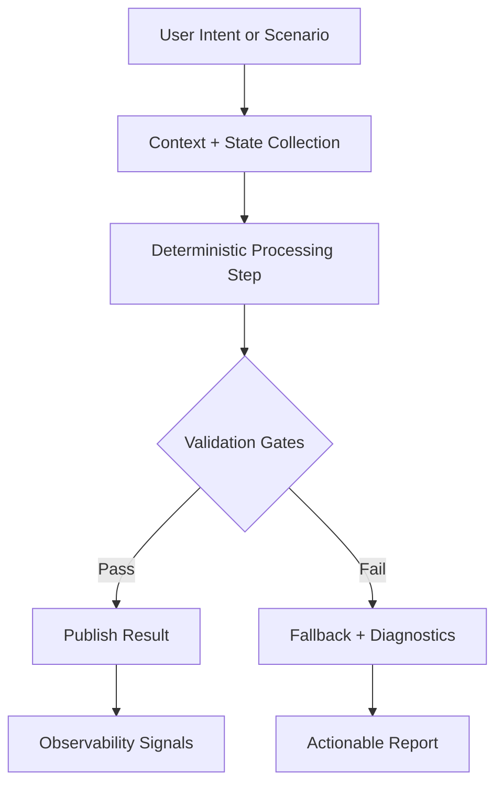
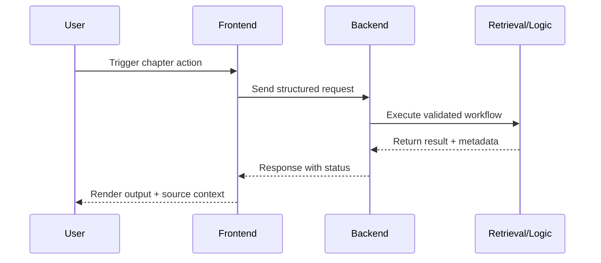

# Intro Deep Dive

This expanded chapter provides implementation-level explanations, richer examples, and operational guidance for real robotics and Physical AI workflows.

## System Context and Learning Goal

In this lesson we focus on the engineering decisions that make Physical AI systems dependable in production. Instead of treating robotics as a demo problem, we frame each concept around measurable constraints: latency budgets, safety envelopes, failure modes, and observability. A humanoid stack combines perception, control, planning, and actuation, so one weak interface can degrade the whole behavior. You should read this chapter as a design playbook. For every algorithmic idea, ask three questions: what assumption does it make, how can that assumption fail in real hardware, and what telemetry proves the system still satisfies task requirements. This habit separates experimental prototypes from robust systems that can run repeatably in classrooms, labs, and deployment pilots. Throughout the chapter, we connect theory to implementation detail so that you can directly map concepts to code and runtime diagnostics.

## Architecture Breakdown

A practical robotics architecture is layered but tightly coordinated. The sensing layer normalizes camera frames, IMU streams, force feedback, and joint encoders into timestamped messages. The estimation layer fuses these streams into a coherent world model and robot state estimate. The decision layer interprets goals and chooses near-term actions under safety constraints. The control layer converts actions into actuator-safe trajectories while respecting dynamics and limits. The runtime layer then enforces watchdog checks, heartbeat monitoring, and fallback policies. The most important principle is explicit contracts between layers: message schema, expected rate, timeout behavior, and error semantics. When these contracts are undefined, teams lose days debugging implicit assumptions. When they are explicit, integration becomes predictable. In this curriculum we repeatedly use diagrams, code snippets, and validation checklists to make those contracts concrete and testable.



## Implementation Pattern

Implementation quality improves when each component has one clear responsibility and one clear verification method. For example, a subscriber callback should parse and validate data, then forward normalized data to a deterministic processing function. It should not silently mutate global state or hide transient failures. Likewise, policy evaluation should run in isolated loops where random seeds, world state resets, and test scenarios are controlled. The same approach applies to chapter workflows in this textbook platform: API handlers remain thin, core logic stays in reusable modules, and UI components expose user intent without embedding backend assumptions. This makes debugging faster and changes safer. If a function fails, you can test it in isolation. If a user report appears, you can trace the path from UI event to API payload to data transformation output. Keep this style while implementing your own projects: small interfaces, explicit invariants, and aggressive instrumentation where uncertainty is highest.

```python
from dataclasses import dataclass
from typing import Iterable

@dataclass
class ValidationSample:
    stage: str
    latency_ms: float
    passed: bool


def summarize_quality(samples: Iterable[ValidationSample]) -> dict[str, float]:
    rows = list(samples)
    if not rows:
        return {"pass_rate": 0.0, "avg_latency_ms": 0.0}

    passed = sum(1 for row in rows if row.passed)
    avg_latency = sum(row.latency_ms for row in rows) / len(rows)
    return {
        "pass_rate": round(passed / len(rows), 3),
        "avg_latency_ms": round(avg_latency, 2),
    }
```

## Operational Considerations

Operational discipline is what turns a technically correct system into an educationally reliable one. You need startup checks, health endpoints, reproducible build scripts, and observability that helps future contributors understand behavior quickly. For model-based systems, that means tracking source documents, retrieval context, prompt shape, and output quality signals. For control systems, that means capturing rates, jitter, errors, and safety-trigger counts. Avoid hidden state and hidden dependencies. If an environment variable is required, surface it in templates. If a chapter action depends on authentication, make that condition visible in UI state so users understand why a control is disabled or hidden. The same discipline applies to simulation: deterministic seeds, scenario naming conventions, and regression reports allow teams to discuss behavior with evidence instead of intuition. As systems scale, this evidence-driven culture is the main defense against regressions and overconfidence.

## Failure Analysis and Debug Strategy

When behavior diverges from expectations, start with first principles: did the right input arrive, at the right time, in the right format? Then inspect transformation stages one by one. In ROS-style pipelines, inspect publisher rates and QoS compatibility first because transport mismatches often masquerade as algorithm bugs. In model-assisted workflows, verify retrieved context and prompt construction before assuming model quality issues. In web interfaces, inspect state transitions and payload shape before adjusting backend logic. The point is to eliminate ambiguity progressively. A robust debugging flow always records findings: reproduce conditions, observed outputs, hypothesis, and confirmation step. This avoids repeating failed experiments and helps teammates jump in effectively. By applying this method consistently, you build intuition grounded in evidence, and your delivery speed improves because fewer fixes are guesswork. Treat debugging as a design skill, not a reactive task, and your systems will mature much faster.

```python
from dataclasses import dataclass
from typing import Iterable

@dataclass
class ValidationSample:
    stage: str
    latency_ms: float
    passed: bool


def summarize_quality(samples: Iterable[ValidationSample]) -> dict[str, float]:
    rows = list(samples)
    if not rows:
        return {"pass_rate": 0.0, "avg_latency_ms": 0.0}

    passed = sum(1 for row in rows if row.passed)
    avg_latency = sum(row.latency_ms for row in rows) / len(rows)
    return {
        "pass_rate": round(passed / len(rows), 3),
        "avg_latency_ms": round(avg_latency, 2),
    }
```

## Deployment and Validation

Before shipping any robotics educational feature, validate across three dimensions: correctness, safety, and usability. Correctness means APIs return consistent schema, chapter actions map to intended content, and retrieval outputs expose transparent sources. Safety means commands and generated guidance stay within conservative bounds and communicate uncertainty clearly. Usability means users can discover capabilities quickly, complete flows without confusion, and recover from errors without dead ends. Build a release checklist that includes tests, build output, and one end-to-end manual run. Then document known warnings with ownership and mitigation path so teams can prioritize technical debt deliberately. This chapter encourages a release mindset: every feature is incomplete until it is observable, repeatable, and reviewable by another engineer. In hackathon settings this discipline also strengthens evaluation because reviewers can verify behavior quickly and trust your architecture decisions.


## Key Takeaways

Strong Physical AI systems emerge from deliberate interface contracts, measurable validation gates, and practical debugging discipline. Your implementation choices should make behavior understandable under normal operation and under failure. Favor deterministic building blocks, explicit configuration, and clear user feedback over clever but opaque abstractions. As you continue through the textbook, keep translating concepts into operational checks: what should happen, how will we know, and what fallback is acceptable when assumptions break. That loop is the core of reliable robotics engineering and the core of this curriculum's design philosophy.

## Practical Exercise

Implement a mini validation harness for your current module. Define one metric for correctness, one for stability, and one for user-facing clarity. Run the harness on a baseline branch and on your latest change. Document the comparison and explain whether the change should be promoted.

```python
def should_promote(pass_rate: float, avg_latency_ms: float, regression_count: int) -> bool:
    return pass_rate >= 0.95 and avg_latency_ms < 180 and regression_count == 0
```



## Key Takeaways

- Build systems with explicit contracts and measurable quality gates.
- Keep observability close to business and safety requirements.
- Prefer deterministic, testable workflows over implicit behavior.
- Treat debugging and deployment as first-class engineering activities.
