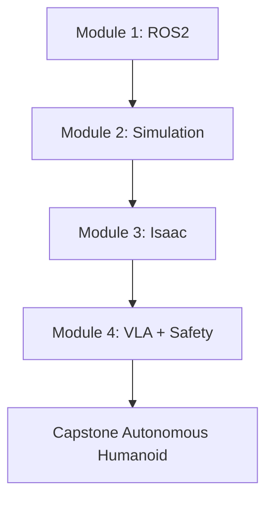

# Physical AI Textbook: Learning Roadmap

## 🌍 Real World Scenario

By 2030, humanoid robots will outnumber factory workers in many repetitive environments. A new engineer walks onto the floor, opens a laptop, and sees robots moving safely beside people. This course is that starting point from curiosity to capability.

---

## What You Will Learn

- Differentiate digital AI and Physical AI using real deployment constraints.
- Understand the humanoid landscape across Tesla Optimus, Figure 02, Atlas, and 1X NEO.
- Follow a structured 4-module roadmap with beginner and fast-track paths.
- Set up a practical development environment for ROS 2, simulation, and VLA experimentation.
- Prepare for an autonomous humanoid capstone with measurable checkpoints.

---

## Physical AI vs Digital AI

Digital AI can make mistakes and recover with another response. Physical AI can make a mistake and break hardware or hurt people. That single difference changes everything: architecture, testing, observability, and safety become primary engineering concerns, not optional add-ons.

Embodied systems live in the real world of inertia, latency, battery limits, and imperfect sensors. A plan that looks correct in text may fail when wheel slip, occlusion, or actuator delay appears. So this textbook teaches why constraints exist before how code is written.

You should think of Physical AI as “intelligence under accountability.” Every command has physical consequences. Every module in this curriculum is designed to build that accountability mindset into your habits.

## Humanoid Revolution Snapshot

Tesla Optimus demonstrates aggressive industrial ambition with scalable humanoid hardware goals. Figure 02 focuses on dexterity and language-conditioned task execution. Boston Dynamics Atlas remains a benchmark in dynamic locomotion and control. 1X NEO explores service-facing interactions and practical human environments.

Different companies optimize different layers, but all rely on the same software truths: robust middleware, simulation-first validation, and safety-governed execution. The tools may differ; the engineering principles do not.

## Course Map and Learning Paths

Module 1 builds ROS 2 fluency and communication architecture. Module 2 builds deterministic simulation and evaluation gates. Module 3 introduces Isaac-centric runtime interfaces and diagnostics. Module 4 integrates VLA planning and action safety for capstone-grade workflows.

If you are beginner-level, optimize for concept depth and command fluency. If you are fast-track, optimize for integration speed while preserving validation discipline. Both paths converge on one goal: explainable, testable autonomous behavior.

## What You Will Build

The capstone is an autonomous humanoid workflow: receive voice command, ground intent, plan action, navigate safely, manipulate target object, and return with observable logs. This is not a toy script. It is a miniature production architecture.

Throughout the book, we reinforce one loop: define intent, instrument behavior, evaluate outcomes, and improve based on evidence. This loop is the real skill recruiters value.

## Environment Setup and Prerequisites

Use consistent versions for Python, Node.js, ROS 2, and simulation tooling. Version drift causes silent failures that look like model problems. Reproducibility begins before the first line of robot logic.

Prerequisites are practical, not academic: Python comfort, CLI confidence, basic Linux workflow, and willingness to debug systematically. You do not need mastery on day one; you need discipline and iteration.

:::tip Beginner Tip
Do one complete mini-loop: read concept, run code, inspect outputs, ask one grounded question.
:::

:::info Pro Insight
Your long-term advantage is not tool familiarity alone, but your ability to justify decisions with evidence.
:::

:::warning Common Mistake
Beginners often jump to capstone integration too early; weak fundamentals cause exponential debugging later.
:::

| Dimension | Digital AI | Physical AI | Why it matters |
|---|---|---|---|
| Environment | Virtual | Real-world physics | Real errors have physical cost |
| Latency tolerance | Often high | Often low | Delays can destabilize control |
| Failure impact | Wrong answer | Safety/hardware risk | Requires layered safeguards |
| Validation | Benchmarks | Simulation + runtime checks | Must prove behavior under uncertainty |
| Platform | Known focus | Deployment flavor |
|---|---|---|
| Tesla Optimus | Industrial scale ambition | Factory workflows |
| Figure 02 | Dexterous language-conditioned tasks | Human-robot collaboration |
| Boston Dynamics Atlas | Dynamic mobility/control excellence | High-performance demos/research |
| 1X NEO | Service-facing interactions | Home/service pilots |
| Module | Theme | Output milestone |
|---|---|---|
| 1 | ROS 2 core | Stable node/topic architecture |
| 2 | Simulation | Deterministic test pipeline |
| 3 | Isaac runtime | Instrumented policy loop |
| 4 | VLA + safety | End-to-end capstone integration |
| Path | Best for | Weekly commitment |
|---|---|---|
| Beginner | New robotics engineers | 5-7 focused hours |
| Fast-track | Experienced coders | 8-12 integration-heavy hours |

```python
# This script checks whether you are ready to start capstone integration.
from dataclasses import dataclass

@dataclass
class Readiness:
    ros2_ready: bool
    sim_ready: bool
    isaac_ready: bool
    vla_ready: bool


def capstone_ready(r: Readiness) -> bool:
    # Capstone should start only when all foundation pillars are available.
    return r.ros2_ready and r.sim_ready and r.isaac_ready and r.vla_ready
```



---

## 💡 Key Concepts Summary

| Concept | What it means | Real robot example |
|---|---|---|
| Physical AI | Intelligence that must act in the physical world safely | Humanoid slows near a person while carrying an object |
| Closed loop | Continuous sensing and action updates | Navigation re-plans around new obstacle |
| Validation gate | Objective pass/fail criteria before promotion | Reject policy with any collision events |
| Grounded assistant | Answers linked to source lessons | Chat cites module filenames under response |

---

## 🧪 Practice Exercises

### Exercise 1 (Beginner)
Create your 4-module study plan with target week numbers.

```python
# TODO: Fill target weeks for each module.
plan = {
    "module_1_ros2": 0,
    "module_2_simulation": 0,
    "module_3_isaac": 0,
    "module_4_vla": 0,
}
print(plan)
```

### Exercise 2 (Intermediate)
Write a readiness checker for your current workstation.

```python
# TODO: Replace placeholders with actual system checks.
requirements = ["python3", "node", "ros2"]
for req in requirements:
    print(f"verify: {req}")
```

### Exercise 3 (Advanced)
Define capstone acceptance metrics before coding.

```python
# TODO: Tune thresholds with your mentor/team.
acceptance = {
    "navigation_success_rate": 0.0,
    "collision_events": 0,
    "voice_to_action_latency_s": 0.0,
}
print(acceptance)
```

---

## Key Takeaways

- Physical AI demands safety-first, evidence-driven engineering habits.
- Narrative understanding plus executable practice creates durable learning.
- Course structure is designed to reduce integration chaos at capstone stage.
- Environment reproducibility is a core skill, not setup overhead.
- The strongest learners explain both why systems exist and how they fail safely.

---

## 🔗 Next Up

Next up: Module 1 shows how ROS 2 coordinates many robot subsystems without turning your codebase into wiring chaos.

---

## 📚 Resources

- [ROS 2 Docs](https://docs.ros.org/en/humble/index.html)
- [NVIDIA Isaac](https://developer.nvidia.com/isaac)
- [Gazebo Docs](https://gazebosim.org/docs)
