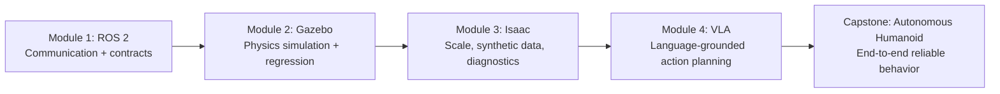

# Welcome to Physical AI & Humanoid Robotics

## 🌍 Real World Scenario

It's 2026. A Figure 02 robot walks into a hospital kitchen. A nurse says 'bring medication to Room 4.' The robot understands, navigates, picks up the tray, and delivers it — no programming required. This is what you are learning to build.

Picture what just happened in that scene. The robot did not simply “hear words” and execute a hardcoded macro. It interpreted speech in noisy surroundings, resolved the meaning of a human instruction, mapped that meaning to a physical environment, selected safe motions, adapted to uncertainty, and finished the task in a way a human could trust. That is the real promise of Physical AI: not only intelligence that can reason, but intelligence that can *act responsibly in the world you live in*.

In this welcome chapter, you will build your mental model for the entire textbook journey. You will understand why this field is different from traditional AI, why the humanoid form factor is becoming strategically important, and why your learning sequence is deliberately structured from systems foundation to high-level autonomy.

## What You Will Learn

- Why Physical AI is fundamentally different from traditional digital AI in failure modes, design constraints, and engineering discipline.
- Why humanoid robots are not just “cool demos,” but a serious response to human-shaped infrastructure and human-generated data.
- Why your 14-week sequence follows ROS 2 → Gazebo → Isaac → VLA, and how each layer enables the next.
- How to reason about the gap between ChatGPT-style language intelligence and safe, real-world robot behavior.
- What Figure AI, Boston Dynamics, and Tesla Optimus have achieved—and why their progress changes your career timing right now.

## From Digital to Physical: The Great Leap

To understand Physical AI, start with a simple contrast.

A traditional AI model can be brilliant while staying completely digital. It can play chess at superhuman level, summarize legal documents, or write software architecture suggestions without touching the physical world. Its mistakes are usually reversible: a bad sentence, a wrong prediction, a hallucinated citation.

Now compare that with this analogy: **a chess AI vs a robot that plays chess against you in your living room**.

A chess engine only needs to decide the best move on an abstract board state. A physical chess-playing robot needs to do much more. It must visually detect the board despite glare from your window, infer piece positions if one piece is partially occluded by your hand, move an arm through 3D space without hitting the table edge, apply just enough force to grasp a piece, and place it without knocking over nearby pieces. If your cat jumps on the table, it must recover. If a piece slips, it must replan.

That is the leap: from symbolic reasoning to embodied intelligence.

This is also where many people misunderstand the relationship between ChatGPT and robotics. ChatGPT-like systems are powerful language engines. They can plan, explain, and infer intent. But they are still digital brains. A robot needs a digital brain *plus* a physical body *plus* a continuous perception-control loop.

When your robot receives an instruction, your system must answer practical questions in real time:

- Is the camera feed fresh enough to trust?
- Is the action physically feasible for this joint state?
- Is the path safe around humans and obstacles?
- What fallback should execute if uncertainty spikes?

In software-only products, uncertain outputs may still be acceptable. In Physical AI, uncertain actions require guardrails.

:::danger Physical consequences are real consequences
In web apps, bugs can be annoying. In robotics, bugs can break hardware, halt operations, or endanger people. You are not just shipping features—you are engineering behavior under risk.
:::

Because of this, Physical AI demands stronger systems thinking than typical app development. You need deterministic interfaces, measured latencies, explicit safety constraints, and clear failure recovery paths. This textbook is designed to train exactly that mindset.

## Why Humanoid Robots, Specifically?

The natural question is: if robotics already exists, why the current surge in humanoids?

The answer is not hype. It is compatibility.

Human environments are designed around human geometry. Door handles, stairs, shelf heights, tool grips, kitchen counters, hospital carts, and warehouse workflows all assume a two-armed, upright actor with hand-like end effectors. A robot that shares this form can use existing infrastructure with fewer environment modifications. That matters economically.

There is also a machine learning reason. Most available behavior data is human data: videos, demonstrations, procedural instructions, and teleoperation traces. If your robot body roughly matches human kinematics, transferring that data becomes easier. You can learn from how humans move, not just from synthetic control objectives.

Humanoids are difficult to engineer—balancing, power management, dexterous manipulation, and safety are all hard problems. But if your goal is broad, multi-domain utility, humanoids offer a realistic route to generality.

:::tip Beginner Tip
When evaluating robot form factors, ask two questions: “Can it operate in human spaces without major retrofits?” and “Can it learn effectively from human behavior data?”
:::

This is why leading teams prioritize humanoid systems despite complexity. They are optimizing for long-term deployment flexibility, not short-term mechanical simplicity.

## Your 14-Week Journey

Your curriculum is ordered as **ROS 2 → Gazebo → Isaac → VLA** for one reason: dependency integrity.

You begin with **ROS 2** because coordination comes first. Before your robot can “think,” its subsystems must communicate reliably. Cameras, IMUs, planners, controllers, and safety monitors must exchange data with predictable timing. ROS 2 gives you that distributed nervous system.

You then move to **Gazebo** because safe iteration must happen before hardware exposure. Gazebo lets you test behavior under controlled physics, run deterministic scenarios, and catch regressions cheaply. A good simulation habit saves you from expensive real-world mistakes.

Next comes **Isaac** because scale and realism become bottlenecks. Isaac ecosystems help you generate large synthetic datasets, stress perception stacks, and train policies under broader variation. This is where you start addressing sim-to-real transfer at production-relevant scale.

Finally, you learn **VLA (Vision-Language-Action)** because semantic reasoning should be added after your control substrate is stable. VLA gives your robot the ability to map language and visual context to grounded actions—but that only works when middleware, sensing, and safety layers are already trustworthy.

This order is like learning surgery: anatomy first, controlled practice second, advanced tools third, live procedures last.



:::info Pro Insight
Most robotics projects fail from integration debt, not from lack of model sophistication. This module order is an anti-chaos strategy: stabilize interfaces, then scale, then add cognition.
:::

:::warning Common Mistake
Jumping directly into LLM-driven demos without strong middleware and simulation discipline creates fragile systems that look impressive once and fail under repeat testing.
:::

## The Industry Is Moving Fast: Why Timing Matters

You are learning this at a critical time.

**Figure AI** has demonstrated increasingly capable humanoid behavior tied to language-driven task execution and practical manipulation scenarios. This matters because it proves that semantic reasoning and embodied control are now being integrated in real workflows, not isolated research prototypes.

**Boston Dynamics** continues to set the benchmark for dynamic mobility, balance recovery, and precision control in difficult motion tasks. This matters because high-level intelligence is useless if low-level control cannot guarantee robust physical behavior.

**Tesla Optimus** is pushing toward scalable deployment by combining hardware manufacturing strategy with AI software integration. This matters because Physical AI will not change industries at small scale; it changes industries when systems become repeatable, maintainable, and economically deployable.

Together, these companies highlight a pattern you should internalize: the winning stack is not “best model only.” It is system architecture + safety + deployment discipline.

Your advantage as a learner is that you can build this foundation early, while many teams still treat embodied AI as a side project. The market needs engineers who can connect language models to actuators *safely*. That is exactly what this textbook is training you to do.

## 💡 Key Concepts Summary

| Concept | Meaning | Real example |
|---|---|---|
| Physical AI | Intelligence that must act under real-world physics and safety constraints | Robot adjusts grip force while carrying a medicine tray |
| Embodiment gap | Difference between digital reasoning and physical execution | LLM suggests “pick up cup,” controller computes feasible joint trajectory |
| Humanoid interoperability | Human-like body works in human-designed spaces | Robot uses hallway door and standard-height counter |
| Layered learning path | Build communication, then simulation, then scale, then cognition | ROS 2 stability enables reliable VLA execution later |

## 🧪 Practice Exercises

### Exercise 1 (Beginner)
Write a short reflection (250–300 words): “Why is a smart language model not enough to build a safe robot?” Include at least three physical constraints.

```python
# Starter skeleton: structure your reflection points first.
constraints = [
    "constraint_1",
    "constraint_2",
    "constraint_3",
]
for c in constraints:
    print("Explain with a real robot example:", c)
```

### Exercise 2 (Intermediate)
Create your personal 14-week plan with one measurable output per module.

```python
# Starter skeleton: replace placeholders with your own milestones.
roadmap = {
    "weeks_1_4_ros2": "",
    "weeks_5_7_gazebo": "",
    "weeks_8_10_isaac": "",
    "weeks_11_14_vla_capstone": "",
}
for phase, milestone in roadmap.items():
    print(phase, "->", milestone)
```

### Exercise 3 (Advanced)
Define a capstone readiness gate using objective thresholds (success rate, safety events, latency).

```python
# Starter skeleton: tune thresholds and evaluate current metrics.
thresholds = {
    "task_success_rate": 0.95,
    "safety_incidents": 0,
    "avg_decision_latency_ms": 250,
}

current = {
    "task_success_rate": 0.0,
    "safety_incidents": 0,
    "avg_decision_latency_ms": 0,
}

ready = (
    current["task_success_rate"] >= thresholds["task_success_rate"]
    and current["safety_incidents"] <= thresholds["safety_incidents"]
    and current["avg_decision_latency_ms"] <= thresholds["avg_decision_latency_ms"]
)

print("capstone_ready:", ready)
```

## ✅ Key Takeaways

- Physical AI is not just smarter software; it is intelligence with physical accountability.
- Humanoid robots matter because they align with human environments and human behavior data.
- The learning order ROS 2 → Gazebo → Isaac → VLA is dependency-driven and prevents integration chaos.
- A digital brain alone is insufficient; reliable robotics requires body-aware control, sensing, and safety loops.
- Industry progress shows this field is already operational—and your systems engineering depth will be your biggest advantage.

## 🔗 Next Up

Next up, you will enter Module 1 and build your ROS 2 foundation so your robot’s subsystems can communicate with clarity, timing discipline, and trust.

## 📚 Resources

- [ROS 2 Documentation](https://docs.ros.org/en/humble/index.html)
- [Figure AI](https://www.figure.ai/)
- [Boston Dynamics](https://bostondynamics.com/)