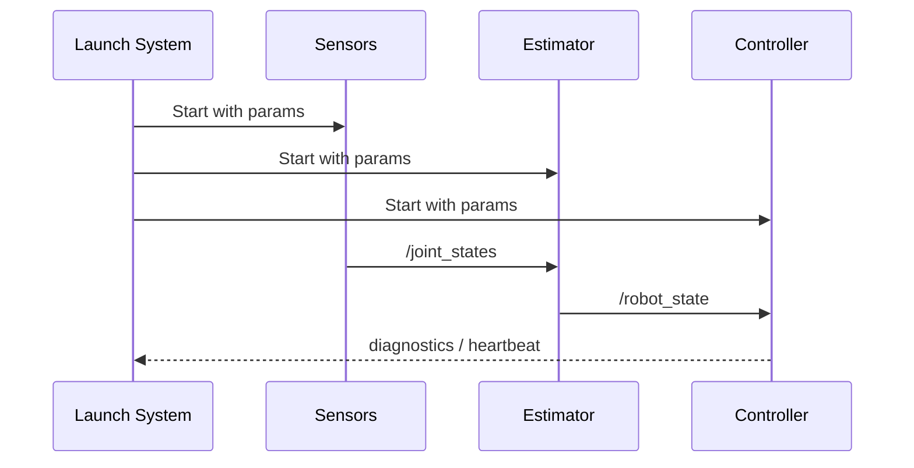

Strong robotics teams standardize startup and debugging workflows. If every engineer launches the stack differently, defects become impossible to reproduce. ROS 2 launch files and parameterized nodes solve this by making runtime configuration explicit and reviewable.

### Parameter discipline

A good parameter set has three layers:
- Safe defaults in code
- Environment-specific overrides (sim vs hardware)
- Mission-specific overrides (task variants)

```python
from dataclasses import dataclass

@dataclass
class ControllerConfig:
    kp: float
    kd: float
    command_rate_hz: int


def validate_config(cfg: ControllerConfig) -> list[str]:
    errors: list[str] = []
    if cfg.kp <= 0:
        errors.append("kp must be > 0")
    if cfg.kd < 0:
        errors.append("kd must be >= 0")
    if cfg.command_rate_hz < 20:
        errors.append("command_rate_hz too low for stable control")
    return errors
```



### Debug checklist

1. Verify node graph (`ros2 node list`) matches expected topology.
2. Inspect topic rate and delays before changing controller gains.
3. Log command and measured response together; never debug one in isolation.

## Key Takeaways

- Launch files are operational contracts, not optional tooling.
- Parameter validation catches dangerous settings before runtime.
- Most “control bugs” are actually data freshness or topology issues.
