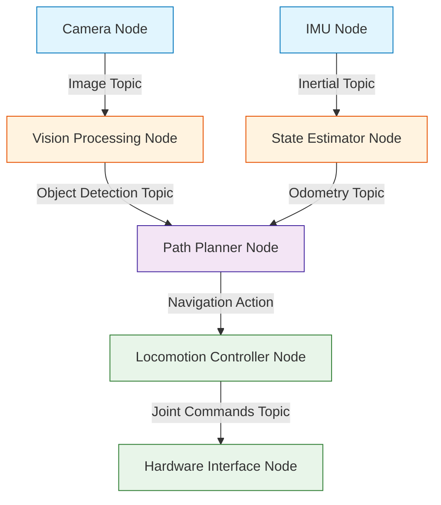

# ROS 2: The Robotic Nervous System

## 🌍 Real World Scenario

Imagine controlling a humanoid robot with 30 joints, 5 sensors, 3 cameras, and a speaker — all with separate code files that don't talk to each other. That nightmare is exactly what ROS 2 was built to solve. 

You sit down at your computer, eager to make your robot walk. You write a brilliant Python script to read the camera. You write a fast C++ program to calculate the balance. You write another script to move the motors. And then you realize: how does the C++ balance program get the data from the Python camera script in less than five milliseconds? Do you write your own custom TCP socket server? Do you save data to a text file and read it back? Do you invent your own networking protocol? By the time you finish writing the glue that holds these programs together, months have passed, your code is fragile, and your robot still hasn't taken a single step.

## What You Will Learn

- The historical story of Willow Garage, why ROS 1 was created, and why it ultimately failed for production robotics.
- How ROS 2 replaced the fragile "master node" with a decentralized Data Distribution Service (DDS).
- The four core communication patterns: Nodes, Topics, Services, and Actions, using simple everyday analogies.
- How to architect a computational graph that routes data securely and predictably.
- When to use Python (`rclpy`) for rapid prototyping versus C++ (`rclcpp`) for hard real-time control.
- How to write a complete, working publisher node that broadcasts authentic humanoid joint states.

## The Problem ROS 2 Solves

To understand why ROS 2 is the undisputed industry standard, you have to understand the dark ages of robotics. 

Before 2007, every university lab and robotics company built their own custom software from scratch. If Stanford built a robotic arm and MIT wanted to use the same arm, MIT had to rewrite all the networking, driver, and control code. It was an era of isolated silos. 

Then, a research lab called Willow Garage changed everything. They realized that 80% of robotics is plumbing: passing sensor data to controllers, visualizing 3D points, and managing hardware drivers. In 2007, they released the Robot Operating System (ROS). It was not an operating system like Windows or Linux; it was a middleware framework. It provided a standardized way for small, independent programs to talk to each other. Suddenly, if you wanted a navigation algorithm, you didn't have to invent it—you just downloaded the ROS package. The robotics community exploded. 

But ROS 1 had a fatal flaw. It was designed for academic research, not for production factories or autonomous cars. 

In ROS 1, every piece of communication relied on a single, centralized "Master Node." If the Master Node crashed, the entire robot suffered a catastrophic communication blackout. Furthermore, ROS 1 had no concept of security, no real-time guarantees, and terrible performance over unstable Wi-Fi networks. You could not put ROS 1 into a commercial self-driving car or a factory floor humanoid without taking massive safety risks.

:::danger The Master Node Bottleneck
Imagine a busy airport where every single pilot must talk to one specific air traffic controller before speaking to anyone else. If that controller faints, the planes crash. That was ROS 1.
:::

So, the community rebuilt it from the ground up. ROS 2 was born. 

Instead of a centralized master, ROS 2 relies on an industrial networking standard called the Data Distribution Service (DDS). DDS is the same protocol used by battleships, nuclear power plants, and aerospace systems. In DDS, there is no master node. Nodes discover each other automatically and communicate directly, peer-to-peer. If one node crashes, the rest of the system keeps running smoothly. It added security, Quality of Service (QoS) profiles, and real-time execution support. ROS 2 took the brilliant modularity of Willow Garage's original vision and hardened it for the physical world.

## How ROS 2 Works: The Nervous System Analogy

A robot is a distributed system. Think of ROS 2 as the central nervous system connecting the brain to the muscles and the eyes. To master ROS 2, you must understand its four core concepts.

### Nodes: Your Smartphone Apps
A **Node** is a single executable program that does one specific job. Instead of writing one massive, millions-of-lines-of-code program that runs the entire robot, you write many tiny nodes. One node reads the camera. One node plans the path. One node moves the left leg. 

*Analogy:* Think of nodes like apps on your smartphone. Your weather app only does weather. Your camera app only takes pictures. If your weather app crashes, your camera app still works perfectly. In a humanoid, if the speaker node crashes, the balance node keeps keeping the robot upright.

### Topics: The TV Channel
A **Topic** is a named bus where nodes exchange continuous streams of data. Nodes that send data are "Publishers." Nodes that receive data are "Subscribers." A publisher doesn't care who is listening, and a subscriber doesn't care who is talking.

*Analogy:* A topic is exactly like a TV channel. A television station (Publisher) broadcasts the news on Channel 5 (the Topic). They don't know if one person is watching or a million people are watching. You (Subscriber) tune into Channel 5 to watch. If you turn off your TV, the station keeps broadcasting. We use topics for continuous data streams like camera feeds, IMU sensor readings, or joint positions.

### Services: The Phone Call
A **Service** is used for synchronous, request-response communication. You send a request, the node processes it, and it returns a response. The caller pauses and waits until the response arrives.

*Analogy:* A service is like making a phone call to a restaurant. You call (Request), ask if they are open, wait on the line while they check, and they reply "Yes" (Response). We use services for quick, definitive queries, like asking the hardware node, "What is the current battery percentage?" or "Turn on the headlights."

### Actions: The Food Delivery
An **Action** is used for long-running tasks. Like a service, you send a request. But unlike a service, an action does not make you wait blindly. It sends you continuous feedback while it works, and you can cancel it at any time before it finishes.

*Analogy:* An action is like ordering food delivery. You place the order (Goal). The app tells you "Preparing food... Driver is on the way... 5 minutes away" (Feedback). Finally, the food arrives (Result). If it takes too long, you can cancel the order. In robotics, we use actions for complex behaviors like "Navigate to the kitchen" or "Pick up the red cup."

:::tip Beginner Tip
When designing your robot, ask yourself: Is this continuous data? Use a Topic. Is this a quick question? Use a Service. Will this take five seconds and I might need to cancel it? Use an Action.
:::

## The Computational Graph

When you launch dozens of nodes on a robot, they form a web of communication called the **Computational Graph**. This graph is fully decentralized. 

Let's look at how a real-world system operates. Boston Dynamics’ Spot robot dog uses an architecture very similar to this. It has separate modules for perception (looking at stairs), state estimation (knowing its own posture), and locomotion (moving its four legs). These modules communicate rapidly over a pub/sub network. If Spot slips on ice, the IMU publisher detects the sudden acceleration, the state estimator subscriber updates the robot's orientation, and the locomotion controller recalculates motor torques—all within milliseconds, routing through a secure computational graph.



## Setting Up Your First Workspace

Before you can create nodes, you must decide what language to write them in. ROS 2 provides two primary client libraries: `rclpy` for Python and `rclcpp` for C++. 

Python (`rclpy`) is fantastic for rapid prototyping, computer vision integration, and high-level artificial intelligence workflows (like calling an LLM API). C++ (`rclcpp`) is mandatory for hard real-time controllers—the code that balances the robot or calculates inverse kinematics, where a garbage-collection pause in Python would cause the robot to fall over.

For this curriculum, we will start with Python to master the architecture, then you can optimize critical loops in C++ later.

Below is a complete, working Python node. This is not a toy "Hello World." This node publishes actual humanoid joint states, exactly as you would implement on a physical robot.

```python
#!/usr/bin/env python3

# 1. Import the ROS 2 Python client library
import rclpy
from rclpy.node import Node

# 2. Import the standard JointState message type
# This is the industry standard for reporting motor positions
from sensor_msgs.msg import JointState

import math
import time

class HumanoidJointPublisher(Node):
    def __init__(self):
        # 3. Initialize the node with a unique name
        super().__init__('humanoid_joint_publisher')
        
        # 4. Create a publisher on the '/joint_states' topic
        # The '10' is the QoS history depth (queue size)
        self.publisher_ = self.create_publisher(JointState, '/joint_states', 10)
        
        # 5. Create a timer that fires 50 times a second (50 Hz)
        # High-frequency publishing is required for smooth robot motion
        timer_period = 0.02  # seconds
        self.timer = self.create_timer(timer_period, self.timer_callback)
        
        self.start_time = time.time()
        self.get_logger().info('Humanoid joint publisher started at 50Hz.')

    def timer_callback(self):
        # 6. Create the message object
        msg = JointState()
        
        # 7. Stamp the message with the exact current time
        # This is critical for synchronization in the computational graph
        msg.header.stamp = self.get_clock().now().to_msg()
        
        # 8. Define the joints we are controlling
        msg.name = ['left_knee_joint', 'right_knee_joint', 'torso_yaw']
        
        # 9. Calculate a smooth walking gait using sine waves
        elapsed = time.time() - self.start_time
        
        # Left and right knees operate completely out of phase (walking)
        left_knee = 0.5 * math.sin(elapsed * 2.0) + 0.5
        right_knee = 0.5 * math.sin(elapsed * 2.0 + math.pi) + 0.5
        
        # Torso twists slightly with the gait
        torso = 0.1 * math.sin(elapsed * 1.0)
        
        msg.position = [left_knee, right_knee, torso]
        
        # 10. Publish the message to the ROS 2 network
        self.publisher_.publish(msg)

def main(args=None):
    # Initialize the ROS 2 DDS communications
    rclpy.init(args=args)
    
    # Instantiate our node
    node = HumanoidJointPublisher()
    
    try:
        # Keep the node running indefinitely
        rclpy.spin(node)
    except KeyboardInterrupt:
        pass
    finally:
        # Clean up safely on exit
        node.destroy_node()
        rclpy.shutdown()

if __name__ == '__main__':
    main()
```

:::info Pro Insight
Notice that we explicitly stamp the message with `msg.header.stamp`. In a humanoid, sensor data without a timestamp is useless. If the balance controller doesn't know exactly *when* the knee was at 0.5 radians, it will calculate the wrong torque and the robot will fall.
:::

## 💡 Key Concepts Summary

| Concept | Meaning | Real robot example |
|---|---|---|
| **Middleware** | Software that connects disparate hardware and software components. | A single framework allowing a Python AI script to move a C++ motor controller. |
| **DDS** | Data Distribution Service, the decentralized networking standard used by ROS 2. | A military-grade protocol ensuring the robot's emergency stop signal is never lost. |
| **Node** | A single, focused executable program in the ROS 2 graph. | A standalone Python script that only reads data from the left eye camera. |
| **Topic** | A continuous data stream where nodes publish or subscribe anonymously. | The `/cmd_vel` stream where the navigation brain sends speed commands to the wheels. |

## 🧪 Practice Exercises

### Exercise 1 (Beginner): Architecture Mapping
Look at the physical items on your desk. Imagine they are parts of a robot. Write a simple Python script defining which parts would be Publishers and which would be Subscribers.

```python
# Starter skeleton: Map your real world to a ROS 2 graph
publishers = {
    "webcam": "publishes video frames",
    "microphone": "publishes audio chunks",
}

subscribers = {
    "speaker": "subscribes to audio commands",
    "monitor": "subscribes to display signals",
}

for item, role in publishers.items():
    print(f"Node '{item}' acts as a Publisher because it {role}.")
```

### Exercise 2 (Intermediate): The QoS Decision Matrix
Some data needs to be reliable. Some data needs to be fast. Write a script that assigns the correct communication pattern and speed priority to different robot scenarios.

```python
# Starter skeleton: Decide the architecture for these tasks
scenarios = {
    "streaming_4k_video": "Topic (Fast)",
    "asking_battery_level": "Service (Reliable)",
    "navigating_to_kitchen": "Action (Reliable + Feedback)",
}

for task, pattern in scenarios.items():
    print(f"To execute '{task}', I will use a {pattern}.")
```

### Exercise 3 (Advanced): Modifying the Publisher
Take the `HumanoidJointPublisher` code above. Add a new joint called `left_shoulder_pitch` that swings your robot's arm in sync with the opposite knee.

```python
# Hint: You will need to modify msg.name and msg.position
msg.name = ['left_knee_joint', 'right_knee_joint', 'torso_yaw', 'left_shoulder_pitch']

# The left shoulder should swing forward when the right knee moves forward
left_shoulder = 0.4 * math.sin(elapsed * 2.0 + math.pi)

# Don't forget to append it to the position array!
msg.position = [left_knee, right_knee, torso, left_shoulder]
```

## ✅ Key Takeaways

- ROS 1 proved that robotics needed standardized middleware, but its centralized Master Node architecture was too fragile for commercial production.
- ROS 2 adopted the decentralized, military-grade DDS protocol, making the robotic nervous system secure, reliable, and real-time capable.
- The Computational Graph is built of small, isolated Nodes that do one job perfectly—acting like apps on a smartphone.
- Topics are for continuous streaming, Services are for quick questions, and Actions are for long-running tasks with feedback.
- Python (`rclpy`) is excellent for AI and orchestration, while C++ (`rclcpp`) is required for high-frequency, real-time control loops.

## 🔗 Next Up

Now that you understand the architectural theory, it is time to build it. In the next chapter, we dive deep into the code for Nodes, Topics, and the critical QoS settings that prevent your robot from dropping messages.

## 📚 Resources

- [ROS 2 Humble Documentation](https://docs.ros.org/en/humble/)
- [Understanding DDS in ROS 2](https://docs.ros.org/en/humble/Concepts/Intermediate/About-Internal-Interfaces.html)
- [Sensor Messages / JointState Specification](https://docs.ros2.org/latest/api/sensor_msgs/msg/JointState.html)
