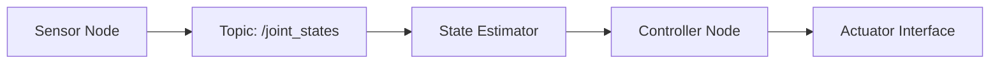

Module 1 builds a practical ROS 2 foundation for humanoid robotics projects. You will learn how nodes exchange information, how packages are structured, and how to reason about data flow before writing larger autonomy stacks. The goal is to make every experiment reproducible, observable, and easy to debug from the command line.

In this module, we treat ROS 2 as an integration backbone rather than a set of isolated tools. You should be able to launch a node, publish telemetry, subscribe to updates, and inspect timing behavior with confidence. This baseline is required before simulation, perception, and VLA workflows in later modules.

```bash
source /opt/ros/humble/setup.bash
ros2 run demo_nodes_cpp talker
# in another terminal
ros2 run demo_nodes_cpp listener
```



## Key Takeaways

- ROS 2 communication patterns (publish/subscribe) are the base of humanoid system coordination.
- Reproducible CLI workflows reduce debugging time in multi-node robotics systems.
- Observability from day one prevents hidden integration failures in later modules.
