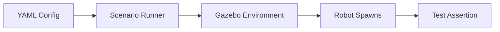

# Deterministic Testing Scenarios in Simulation

## 🌍 Real World Scenario

Your robot passed 50 navigation tests. Then it encountered a slightly different chair — same color, different leg spacing — and walked into it. Without deterministic test scenarios, you'll never know what your robot doesn't know.

That is the hidden trap in robotics development: we celebrate aggregate success (“50 tests passed”) while missing fragile failure modes hiding in tiny environmental variations. In software engineering, we learned this lesson years ago through unit tests, regression tests, and reproducible CI pipelines. Robotics needs the same mindset, but with embodied complexity.

A deterministic simulation scenario is the robotics equivalent of a unit test fixture: it freezes enough variables that you can trust comparisons across runs. If the robot fails today and passed yesterday under the exact same scenario seed, that is a strong signal of regression. If it fails only when you vary one parameter (chair leg spacing, glare intensity, corridor width), that is a strong signal about generalization boundaries.

This chapter reframes simulation scenarios as **test-driven robotics development**. You are not “playing in Gazebo.” You are building a measurable quality system for embodied intelligence.

## What You Will Learn

- What makes a scenario deterministic and why determinism is foundational for robotics testing.
- How to classify scenarios into navigation, manipulation, social interaction, and emergency response suites.
- Which edge cases matter most for real deployments (narrow corridors, reflective floors, dynamic humans).
- How to express scenario configs in YAML in a way that is clear and automatable.
- How to define pass/fail criteria that are objective and machine-checkable.
- How to build parametric scenario sets to evaluate robustness and generalization.
- How and why to record simulation videos for post-run forensic review.
- How to implement a Python test runner that executes scenario files and outputs structured results.

## Why deterministic scenarios are the core of test-driven robotics

Without deterministic scenarios, debugging becomes storytelling:

- “It worked yesterday.”
- “Maybe Gazebo was slower.”
- “Maybe the robot started from a slightly different pose.”
- “Maybe LiDAR noise was random.”

With deterministic scenarios, debugging becomes engineering:

- Same seed, same world, same noise profile, same initial state.
- Any behavior change can be investigated as a software/config regression.

In test-driven robotics, a scenario should behave like a software test:
1. Setup is explicit.
2. Execution is controlled.
3. Assertions are objective.
4. Results are reproducible.

This is how teams scale from demos to dependable autonomy.

## What makes a scenario deterministic

A scenario is deterministic when every major source of randomness is fixed or explicitly controlled.

### 1) Fixed random seed
If object placement, noise models, or policy sampling rely on random generators, seed them.

### 2) Fixed spawn positions and poses
Robot initial pose and object transforms must be exact. Small pose drift can create misleading outcome variance.

### 3) Fixed sensor noise profile
Noise should be deterministic for baseline tests (or use seeded stochastic models).

### 4) Fixed world state and physics config
Use consistent world files, friction values, and simulation step settings.

### 5) Fixed timing and timeout conditions
Pass/fail windows must not be ambiguous. A goal reached in 31 seconds should fail if timeout is 30.

Deterministic does **not** mean “always easy.” It means your baseline is stable enough to detect regressions, then you layer controlled variation for robustness evaluation.

## Scenario categories: build a complete test suite, not a single demo

### Navigation scenarios
- Goal reaching under static/dynamic obstacles.
- Corridor traversal and doorway passage.
- Recovery from blocked path segments.

### Manipulation scenarios
- Reach, grasp, lift, place tasks.
- Contact-sensitive interactions (mugs, boxes, deformable packaging).
- Regrasp and recovery after partial failures.

### Social interaction scenarios
- Human-aware navigation distance rules.
- Turn-taking in shared spaces.
- Response timing for voice or gesture cues.

### Emergency response scenarios
- Emergency stop latency.
- Safe halt on sensor blackout.
- Behavior under localization loss or dropped command channels.

Each category should have deterministic baseline cases and parametric variants.

## Edge cases that expose true capability

Teams often over-test “happy path” maps and under-test operational edge cases. The edge cases below are where many systems fail in production:

### Narrow corridors
Planning that works in open spaces often oscillates or deadlocks in constrained geometry. Test with centimeter-level clearance margins.

### Reflective floors (LiDAR confusion)
Highly reflective surfaces can produce unstable returns, ghost points, or reduced confidence. Simulate degraded perception and assert conservative behavior.

### Dynamic humans
Moving humans are not static obstacles. Test crossing trajectories, abrupt stops, and group movement patterns.

### Chair-like geometric ambiguity
Objects with similar bulk shape but different support geometry (e.g., chair leg spacing) can break learned policies. Parametric tests should vary these subtle dimensions.

### Occlusion and partial observability
Robot should handle temporary sensor blind spots and delayed reacquisition.

If your suite does not include these, your pass rate is inflated.

## YAML scenario configs: make tests readable and automatable

A good scenario config should answer:
- What world?
- What robot start pose?
- What entities spawn where?
- Which deterministic controls are enabled?
- What success criteria define pass/fail?

Human-readable YAML is ideal for this because it is reviewable by robotics, QA, and product stakeholders.

## 💻 Code Example 1: YAML scenario definition for navigation

```yaml
# file: scenarios/nav_warehouse_chair_variation.yaml
scenario:
  id: nav_warehouse_chair_variation
  category: navigation
  description: "Reach loading bay while avoiding chair with altered leg spacing"

determinism:
  seed: 4242
  fixed_time_step: 0.001
  sensor_noise_mode: deterministic
  physics_engine: dart

world:
  file: worlds/warehouse_aisle.world
  lighting_profile: evening_shift
  floor_material: polished_reflective

robot:
  namespace: robot1
  initial_pose:
    x: 0.5
    y: -1.0
    z: 0.0
    yaw: 1.57

entities:
  - name: chair_variant_a
    model: chair
    pose: {x: 2.4, y: 0.2, z: 0.0, yaw: 0.0}
    params:
      leg_spacing_cm: 38
  - name: pallet_stack_1
    model: pallet_stack
    pose: {x: 4.0, y: -0.3, z: 0.0, yaw: 0.0}

goal:
  frame: map
  pose:
    x: 6.0
    y: 1.2
    yaw: 0.0

assertions:
  must_reach_goal: true
  collision_count_max: 0
  timeout_sec: 30
  min_clearance_m: 0.15

recording:
  enable_video: true
  output_path: artifacts/videos/nav_warehouse_chair_variation.mp4
  camera: overhead_observer
```

This definition is deterministic, reviewable, and machine-runnable.

## Automated pass/fail criteria: remove subjective grading

Simulation should not be graded by “looked okay in RViz.” You need explicit assertions.

Common assertions:

1. **Goal completion**: Did the robot reach goal pose within tolerance?
2. **Collision budget**: Did any collision occur? How many contacts were above threshold?
3. **Time budget**: Did it complete before timeout?
4. **Safety margins**: Was minimum clearance maintained near obstacles/humans?
5. **Control stability**: Did command oscillation exceed thresholds?

For manipulation tests, include additional assertions:
- Grasp success rate.
- Object drop events.
- Final placement pose error.

A scenario run should end with `PASS` or `FAIL` plus machine-readable failure reasons.

## 💻 Code Example 2: Python test runner for scenario pass/fail

```python
#!/usr/bin/env python3
# file: tools/run_scenarios.py

import argparse
import dataclasses
import json
import subprocess
import time
from pathlib import Path

import yaml


@dataclasses.dataclass
class ScenarioResult:
    scenario_id: str
    passed: bool
    reason: str
    duration_sec: float
    collisions: int
    reached_goal: bool


def load_yaml(path: Path) -> dict:
    with path.open('r', encoding='utf-8') as f:
        return yaml.safe_load(f)


def launch_sim(world_file: str) -> subprocess.Popen:
    # Replace command with your project-specific launch entrypoint
    cmd = ['ros2', 'launch', 'humanoid_sim', 'sim_humanoid.launch.py', f'world:={world_file}']
    return subprocess.Popen(cmd, stdout=subprocess.PIPE, stderr=subprocess.PIPE, text=True)


def run_robot_task(scenario: dict, timeout_sec: int) -> tuple[bool, int, bool, str]:
    # Placeholder integration points for your stack:
    # - send goal
    # - monitor robot state
    # - monitor collision topic/log
    # - return objective metrics
    start = time.time()
    simulated_collision_count = 0
    simulated_reached_goal = True

    # Simulated deterministic loop (replace with actual telemetry checks)
    while time.time() - start < min(timeout_sec, 2):
        time.sleep(0.1)

    if not simulated_reached_goal:
        return False, simulated_collision_count, False, 'goal_not_reached'

    if simulated_collision_count > scenario['assertions']['collision_count_max']:
        return False, simulated_collision_count, True, 'collision_budget_exceeded'

    return True, simulated_collision_count, True, 'ok'


def execute_scenario(file_path: Path) -> ScenarioResult:
    cfg = load_yaml(file_path)
    scenario = cfg['scenario']

    scenario_id = scenario['id']
    timeout_sec = scenario['assertions']['timeout_sec']
    world_file = scenario['world']['file']

    t0 = time.time()
    proc = launch_sim(world_file)

    try:
        passed, collisions, reached_goal, reason = run_robot_task(scenario, timeout_sec)
        duration = time.time() - t0
        return ScenarioResult(
            scenario_id=scenario_id,
            passed=passed,
            reason=reason,
            duration_sec=duration,
            collisions=collisions,
            reached_goal=reached_goal,
        )
    finally:
        proc.terminate()
        try:
            proc.wait(timeout=5)
        except subprocess.TimeoutExpired:
            proc.kill()


def main() -> int:
    parser = argparse.ArgumentParser()
    parser.add_argument('--scenario', required=True, help='Path to YAML scenario file')
    parser.add_argument('--json-out', default='artifacts/results/latest_result.json')
    args = parser.parse_args()

    result = execute_scenario(Path(args.scenario))

    Path(args.json_out).parent.mkdir(parents=True, exist_ok=True)
    with open(args.json_out, 'w', encoding='utf-8') as f:
        json.dump(dataclasses.asdict(result), f, indent=2)

    print(f"[{result.scenario_id}] {'PASS' if result.passed else 'FAIL'}")
    print(f"reason={result.reason} duration={result.duration_sec:.2f}s collisions={result.collisions}")

    return 0 if result.passed else 1


if __name__ == '__main__':
    raise SystemExit(main())
```

This runner is intentionally structured like a software test harness: deterministic input, explicit assertions, structured output, exit code semantics for CI.

## Parametric scenarios: testing generalization, not memorization

Deterministic baseline scenarios catch regressions. Parametric scenarios test robustness.

A parametric scenario keeps core task intent fixed while varying one or more controlled dimensions:
- chair leg spacing (36–46 cm)
- corridor width (0.75–1.1 m)
- floor reflectivity coefficient
- human crossing speed and trajectory

If your model only works at one exact geometry, it is overfit to scenario memorization.

Best practice:
1. Keep baseline deterministic case as reference.
2. Run 10–100 parameter variants.
3. Report aggregate metrics (pass rate, median time, worst-case clearance).
4. Track drift over commits.

## 💻 Code Example 3: Parametric scenario testing 10 variations

```python
#!/usr/bin/env python3
# file: tools/run_parametric_nav.py

import copy
import json
from pathlib import Path

import yaml

from run_scenarios import execute_scenario


def generate_variants(base_cfg: dict) -> list[dict]:
    variants = []
    for i, leg_spacing in enumerate(range(34, 44)):  # 10 values: 34..43
        cfg = copy.deepcopy(base_cfg)
        cfg['scenario']['id'] = f"nav_chair_spacing_{leg_spacing}cm"
        cfg['scenario']['entities'][0]['params']['leg_spacing_cm'] = leg_spacing
        cfg['scenario']['recording']['output_path'] = (
            f"artifacts/videos/nav_chair_spacing_{leg_spacing}cm.mp4"
        )
        variants.append(cfg)
    return variants


def write_variant(cfg: dict, out_path: Path):
    out_path.parent.mkdir(parents=True, exist_ok=True)
    with out_path.open('w', encoding='utf-8') as f:
        yaml.safe_dump(cfg, f, sort_keys=False)


def main() -> int:
    base_file = Path('scenarios/nav_warehouse_chair_variation.yaml')
    with base_file.open('r', encoding='utf-8') as f:
        base_cfg = yaml.safe_load(f)

    variants = generate_variants(base_cfg)
    results = []

    for cfg in variants:
        sid = cfg['scenario']['id']
        scenario_file = Path(f"artifacts/generated_scenarios/{sid}.yaml")
        write_variant(cfg, scenario_file)
        result = execute_scenario(scenario_file)
        results.append({
            'scenario_id': result.scenario_id,
            'passed': result.passed,
            'reason': result.reason,
            'duration_sec': result.duration_sec,
        })

    Path('artifacts/results').mkdir(parents=True, exist_ok=True)
    with Path('artifacts/results/parametric_nav_results.json').open('w', encoding='utf-8') as f:
        json.dump(results, f, indent=2)

    pass_count = sum(1 for r in results if r['passed'])
    print(f"Parametric pass rate: {pass_count}/{len(results)}")

    # Require at least 9/10 to pass for this gate
    return 0 if pass_count >= 9 else 1


if __name__ == '__main__':
    raise SystemExit(main())
```

This converts one deterministic scenario into a controlled generalization suite and produces CI-friendly artifacts.

## Video recording simulation runs for review

Metrics tell you **that** a failure happened. Video helps explain **why**.

You should record key scenario runs for:
- Regression triage.
- Postmortem review with cross-functional teams.
- Labeling failure taxonomy (perception miss, planner deadlock, controller overshoot).

Video recording guidelines:
1. Use fixed observer camera pose for comparability.
2. Overlay timestamps and scenario ID.
3. Save to structured artifact paths (`artifacts/videos/<scenario_id>.mp4`).
4. Keep failed-run clips by default; sample successful runs.

When students review side-by-side videos of passing and failing variants, debugging speed improves dramatically.

## Test-driven workflow for robotics teams

A practical loop you can adopt immediately:

1. Write or update one deterministic scenario YAML.
2. Run scenario locally with pass/fail assertions.
3. Add at least one edge-case variant.
4. Commit only when deterministic baseline passes.
5. Run parametric suite in CI.
6. Review videos for any failures before merging.

This is the robotics analogue of red-green-refactor:
- **Red**: scenario fails.
- **Green**: minimum fix to pass deterministically.
- **Refactor**: improve robustness, then validate parametric suite.

## Architecture Diagram



## 💡 Key Concepts Summary

- Deterministic scenarios are the reproducible test fixtures of robotics.
- Fixed seeds, fixed spawn poses, and fixed noise profiles are essential for regression confidence.
- Scenario suites should cover navigation, manipulation, social behavior, and emergency response.
- Edge cases reveal true capability; happy-path-only testing gives false confidence.
- YAML configs make scenarios readable, reviewable, and automation-friendly.
- Pass/fail criteria must be objective and machine-evaluable.
- Parametric variants measure generalization boundaries.
- Video artifacts accelerate root-cause analysis and team learning.

## 🧪 Practice Exercises

### Exercise 1 (Beginner)
Create a deterministic navigation scenario with fixed seed and one static obstacle. Define three assertions: goal reached, zero collisions, timeout under 20 seconds.

```yaml
# Hint: model it after nav_warehouse_chair_variation.yaml
```

### Exercise 2 (Intermediate)
Extend your scenario runner to collect minimum obstacle clearance during each run and fail if clearance drops below 0.12 m.

```python
# Hint: subscribe to nearest-obstacle telemetry and track min value across run.
```

### Exercise 3 (Advanced)
Build a 20-variation parametric suite that varies corridor width and reflective floor coefficient together. Compare pass rate before and after a navigation tuning change.

```bash
# Goal: prove improved generalization, not just single-case success.
```

## ✅ Key Takeaways

- Deterministic scenarios let you detect regressions with confidence.
- Test-driven robotics treats scenarios as executable quality contracts.
- Edge cases and parametric sweeps reveal what your robot truly understands.
- Objective pass/fail assertions and CI integration are mandatory for scaling.
- Video + metrics together form the fastest path to robust debugging.

## 🔗 Next Up

Next chapter: Domain randomization and curriculum design—how to systematically increase scenario diversity while preserving measurable progress toward real-world transfer.