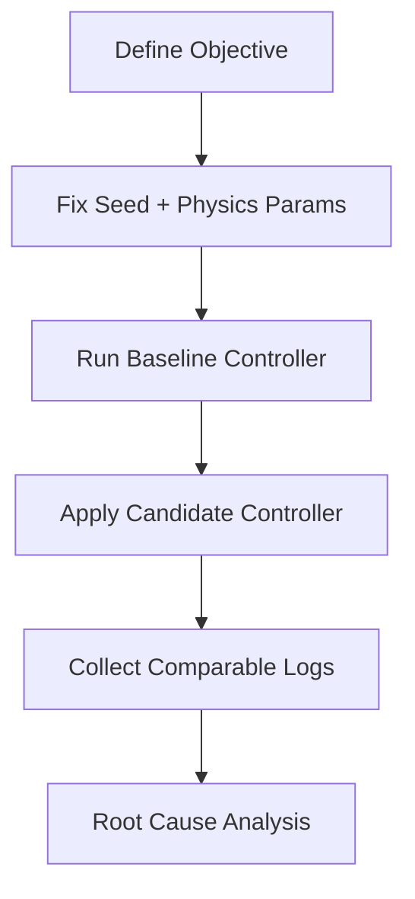

Determinism is the backbone of trustworthy simulation. If two runs with the same code and seed produce different outcomes, your debugging loop is broken. For humanoid systems, deterministic setup includes spawn pose, friction settings, sensor noise parameters, and fixed random seeds for disturbances.

### Scenario design pattern

A good scenario should isolate one competence at a time:
1. Balance recovery
2. Straight-line locomotion
3. Obstacle negotiation
4. Object approach and grasp alignment

This decomposition prevents “all-in-one” scenarios from hiding failure causes.

```python
from dataclasses import dataclass

@dataclass
class Scenario:
    name: str
    seed: int
    max_time_s: float
    terrain: str


def make_balance_recovery(seed: int = 42) -> Scenario:
    return Scenario(
        name="balance_recovery",
        seed=seed,
        max_time_s=12.0,
        terrain="flat",
    )
```



## Key Takeaways

- Deterministic configuration is non-negotiable for meaningful debugging.
- Scenario decomposition reveals exact capability gaps.
- Controlled seeds and physics parameters make regressions reproducible.
