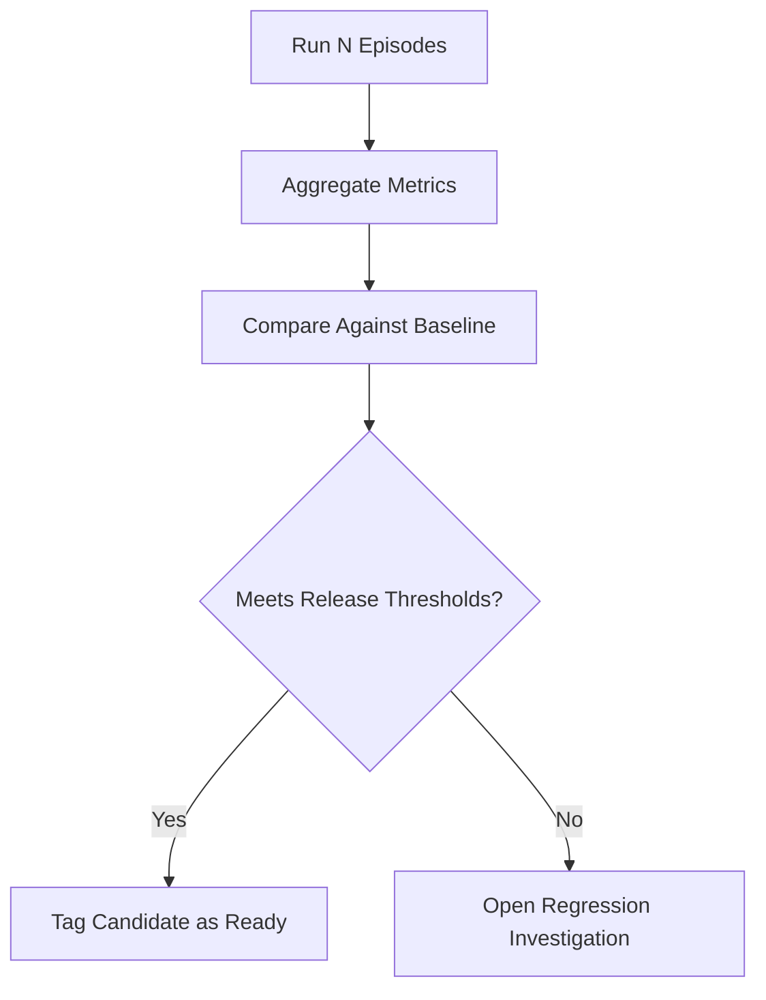

A mature simulation workflow converts behavior into numbers that drive release decisions. Visual inspection is useful, but insufficient for team-scale reliability. You need stable metrics, confidence intervals, and clear thresholds for promotion.

### Metric families

- **Task metrics**: success rate, completion latency
- **Safety metrics**: collisions, near-fall count, joint-limit violation count
- **Control quality metrics**: oscillation score, settle time, energy efficiency

Use per-scenario and aggregate reports so improvements in one scenario do not hide regressions elsewhere.

```python
from statistics import mean


def summarize_runs(successes: list[bool], collisions: list[int], settle_times: list[float]) -> dict[str, float]:
    return {
        "success_rate": sum(1 for s in successes if s) / max(len(successes), 1),
        "avg_collisions": mean(collisions) if collisions else 0.0,
        "avg_settle_time": mean(settle_times) if settle_times else 0.0,
    }


def passes_gate(summary: dict[str, float]) -> bool:
    return (
        summary["success_rate"] >= 0.9
        and summary["avg_collisions"] <= 0.1
        and summary["avg_settle_time"] <= 1.8
    )
```



## Key Takeaways

- Metrics must be explicit, versioned, and tied to release policy.
- Baseline comparison is as important as absolute thresholds.
- Promotion gates protect hardware cycles and team time.
