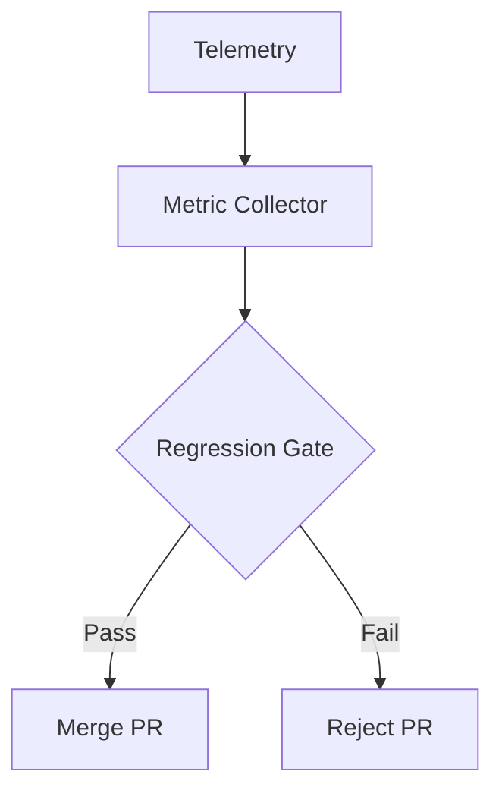

# Metrics and Regression Gates

## 🌍 Real World Scenario

You improved your robot's arm grasping success rate from 70% to 85%. You pushed the code. The next day, someone reports the robot is now walking into walls. You improved one thing and broke another. Regression gates would have caught this.

This is one of the most common maturity jumps in robotics teams. Beginners usually optimize one KPI at a time and celebrate local wins. Professional teams protect system-level behavior with **regression gates**: every pull request must prove that no critical metric fell below policy thresholds.

In software engineering, CI/CD pipelines enforce quality with tests on every PR. Robotics needs the same discipline, but with physical behavior metrics. Your robot is not a static web page. It is a probabilistic control system operating in noisy environments. That is exactly why metrics, automation, and statistical confidence are non-negotiable.

## What You Will Learn

- Which core robotics metrics matter most in simulation and why.
- How to instrument Gazebo runs to collect metrics automatically.
- How regression gates prevent “fix one thing, break another” failure modes.
- How to run simulation quality checks in GitHub Actions on every PR.
- How to generate simple trend dashboards from simulation logs.
- How Bayesian reasoning helps determine enough runs for confidence.
- How to turn metrics from optional reporting into enforced release policy.

## Why regression gates are the missing beginner skill

Most beginner robotics workflows look like this:
1. Change planner/controller/perception code.
2. Run one scenario manually.
3. If it “looks better,” merge.

This is fragile because:
- Visual inspection is subjective.
- Single-run outcomes are noisy.
- Improvements in one subsystem can silently degrade another.

A metrics-and-gates workflow changes this:
1. Run a fixed suite of deterministic scenarios.
2. Collect objective metrics.
3. Compare against baseline and threshold policy.
4. Fail PR automatically when any required metric regresses.

This is how software-grade quality assurance enters robotics engineering.

## Key robotics metrics you should track

You cannot improve what you do not measure. For production simulation suites, these metrics are typically the minimum set.

### 1) Task success rate
Percentage of runs that meet primary objective (goal reached, object grasped, etc.).

### 2) Path efficiency
Actual path length divided by optimal/reference path length. Lower detours mean better navigation quality.

### 3) Collision rate
Average collisions per run (or collision probability). Safety-critical; often strictest gate.

### 4) Manipulation accuracy
Pose error at grasp/place completion (position/orientation deltas).

### 5) Time-to-completion
Task completion time under defined constraints.

Together, these provide a system-level view: not just “did it finish,” but “did it finish safely, efficiently, and accurately.”

## Metrics table with threshold examples

| Metric | Definition | Example Threshold (Gate) | Why it matters |
|---|---|---|---|
| Task success rate | % runs meeting objective | **&gt;= 0.90** | Reliability of behavior under test suite |
| Path efficiency | Optimal/actual or normalized route ratio | **&gt;= 0.80** | Prevents regressions that wander or oscillate |
| Collision rate | Collisions per run | **&lt;= 0.05** | Core safety signal |
| Manipulation accuracy | Final pose error (m) | **&lt;= 0.03 m** | Determines useful grasp/place performance |
| Time-to-completion | Seconds to complete task | **&lt;= 25 s** | Protects latency and throughput budgets |

Important: thresholds are policy decisions, not universal constants. Tune by task risk profile and deployment context.

## Instrumenting Gazebo to record metrics automatically

A robust instrumentation loop has three layers:

1. **Telemetry capture**
   Subscribe to relevant ROS topics (`/odom`, `/tf`, `/scan`, contact/collision topics, task event topics).

2. **Event derivation**
   Convert raw telemetry into semantic events:
   - `goal_reached`
   - `collision_detected`
   - `grasp_success`
   - `timeout`

3. **Metric aggregation**
   Compute scenario-level metrics and write machine-readable artifacts (`json/csv`).

If this is manual, it will be skipped. If it is automatic and fast, it becomes habit.

## 💻 Code Example 1: Python metrics collector hooked to simulation

```python
#!/usr/bin/env python3
# file: tools/metrics_collector.py

import argparse
import json
import math
import time
from dataclasses import dataclass, asdict

import rclpy
from rclpy.node import Node
from nav_msgs.msg import Odometry
from std_msgs.msg import Bool
from geometry_msgs.msg import PoseStamped


@dataclass
class RunMetrics:
    scenario_id: str
    success: bool
    collisions: int
    path_length_m: float
    direct_distance_m: float
    path_efficiency: float
    completion_time_s: float
    manipulation_error_m: float


class MetricsCollector(Node):
    def __init__(self, scenario_id: str, timeout_s: float):
        super().__init__('metrics_collector')
        self.scenario_id = scenario_id
        self.timeout_s = timeout_s

        self.start_time = time.time()
        self.last_pos = None
        self.path_length = 0.0
        self.goal_pos = None
        self.start_pos = None

        self.collisions = 0
        self.goal_reached = False
        self.manipulation_error_m = 0.0

        self.create_subscription(Odometry, '/robot1/odom', self.on_odom, 20)
        self.create_subscription(Bool, '/robot1/events/collision', self.on_collision, 20)
        self.create_subscription(Bool, '/robot1/events/goal_reached', self.on_goal_reached, 20)
        self.create_subscription(PoseStamped, '/robot1/goal_pose', self.on_goal_pose, 20)

    def on_goal_pose(self, msg: PoseStamped):
        self.goal_pos = (msg.pose.position.x, msg.pose.position.y)

    def on_odom(self, msg: Odometry):
        x = msg.pose.pose.position.x
        y = msg.pose.pose.position.y
        current = (x, y)

        if self.start_pos is None:
            self.start_pos = current

        if self.last_pos is not None:
            dx = current[0] - self.last_pos[0]
            dy = current[1] - self.last_pos[1]
            self.path_length += math.hypot(dx, dy)

        self.last_pos = current

    def on_collision(self, msg: Bool):
        if msg.data:
            self.collisions += 1

    def on_goal_reached(self, msg: Bool):
        if msg.data:
            self.goal_reached = True

    def build_result(self) -> RunMetrics:
        completion_time = time.time() - self.start_time

        direct_distance = 0.0
        if self.start_pos and self.goal_pos:
            direct_distance = math.hypot(
                self.goal_pos[0] - self.start_pos[0],
                self.goal_pos[1] - self.start_pos[1]
            )

        if self.path_length <= 1e-6:
            efficiency = 0.0
        else:
            efficiency = min(1.0, direct_distance / self.path_length)

        # Placeholder manipulation error source for mixed-task suites
        # In real setup, compute from grasp target vs achieved pose topics.
        manipulation_error = self.manipulation_error_m

        return RunMetrics(
            scenario_id=self.scenario_id,
            success=self.goal_reached,
            collisions=self.collisions,
            path_length_m=round(self.path_length, 3),
            direct_distance_m=round(direct_distance, 3),
            path_efficiency=round(efficiency, 3),
            completion_time_s=round(completion_time, 3),
            manipulation_error_m=round(manipulation_error, 4),
        )


def main() -> int:
    parser = argparse.ArgumentParser()
    parser.add_argument('--scenario-id', required=True)
    parser.add_argument('--timeout-s', type=float, default=30.0)
    parser.add_argument('--out', default='artifacts/metrics/latest_run.json')
    args = parser.parse_args()

    rclpy.init()
    node = MetricsCollector(args.scenario_id, args.timeout_s)

    end_time = time.time() + args.timeout_s
    while rclpy.ok() and time.time() < end_time and not node.goal_reached:
        rclpy.spin_once(node, timeout_sec=0.1)

    result = node.build_result()
    node.destroy_node()
    rclpy.shutdown()

    with open(args.out, 'w', encoding='utf-8') as f:
        json.dump(asdict(result), f, indent=2)

    print(f"Saved metrics to {args.out}")
    return 0


if __name__ == '__main__':
    raise SystemExit(main())
```

This collector gives deterministic artifacts for CI gates instead of subjective “looked fine” judgments.

## Regression gates: policy that blocks risky merges

A regression gate is simple:

> A PR must not decrease critical metrics below threshold.

Example gate policy:
- Success rate must remain &gt;= 0.90.
- Collision rate must remain &lt;= 0.05.
- Path efficiency must remain &gt;= 0.80.
- Completion time must not increase by >10% vs baseline.

Gate design tips:
1. Separate **hard safety gates** (always fail) from **advisory quality gates** (warn).
2. Keep baseline snapshots versioned in repo or artifacts storage.
3. Document threshold ownership (who approves threshold changes).

Without ownership, teams quietly lower thresholds to make pipelines green. That defeats the entire point.

## GitHub Actions for simulation regression on every PR

You can run headless simulation tests in CI to enforce gates before merge.

Workflow pattern:
1. Build workspace.
2. Launch simulation headless.
3. Run deterministic scenario suite.
4. Collect metrics JSON.
5. Evaluate gate script.
6. Upload artifacts (metrics + logs + optional video).

## 💻 Code Example 2: GitHub Actions workflow

```yaml
# file: .github/workflows/robot-regression.yml
name: Robot Regression Gates

on:
  pull_request:
    branches: [master]
  workflow_dispatch:

jobs:
  simulation-regression:
    runs-on: ubuntu-latest
    timeout-minutes: 45

    steps:
      - name: Checkout repository
        uses: actions/checkout@v4

      - name: Setup Python
        uses: actions/setup-python@v5
        with:
          python-version: '3.11'

      - name: Install dependencies
        run: |
          python -m pip install --upgrade pip
          pip install -r requirements.txt

      - name: Build ROS workspace
        run: |
          source /opt/ros/humble/setup.bash
          colcon build --event-handlers console_direct+

      - name: Run deterministic simulation suite
        run: |
          source /opt/ros/humble/setup.bash
          source install/setup.bash
          python tools/run_scenarios.py --suite scenarios/suites/regression.yaml --out artifacts/metrics/runs.json

      - name: Evaluate regression gates
        run: |
          python tools/evaluate_gates.py \
            --metrics artifacts/metrics/runs.json \
            --baseline artifacts/baseline/latest_baseline.json \
            --thresholds config/regression_thresholds.yaml

      - name: Generate metric dashboard plots
        run: |
          python tools/plot_metrics_dashboard.py \
            --metrics artifacts/metrics/runs.json \
            --out artifacts/plots

      - name: Upload artifacts
        if: always()
        uses: actions/upload-artifact@v4
        with:
          name: robot-regression-artifacts
          path: |
            artifacts/metrics
            artifacts/plots
            artifacts/logs
```

This gives beginners a crucial lesson: if you can’t run it on every PR, it is not a dependable quality gate.

## Visualization: trend dashboards from logs

A single PR gate tells pass/fail now. Trend dashboards tell whether quality is drifting over time.

Recommended views:
- Success rate over commits.
- Collision rate over commits.
- Completion time distribution per scenario.
- Manipulation error percentile bands.

Dashboards help you catch slow degradation before it becomes a production incident.

## 💻 Code Example 3: Matplotlib metric trend dashboard

```python
#!/usr/bin/env python3
# file: tools/plot_metrics_dashboard.py

import argparse
import json
from pathlib import Path

import matplotlib.pyplot as plt


def load_metrics(path: Path) -> list[dict]:
    with path.open('r', encoding='utf-8') as f:
        data = json.load(f)
    if isinstance(data, dict) and 'runs' in data:
        return data['runs']
    if isinstance(data, list):
        return data
    raise ValueError('Unsupported metrics format')


def plot_series(x, y, title, ylabel, out_file: Path):
    plt.figure(figsize=(8, 4))
    plt.plot(x, y, marker='o')
    plt.title(title)
    plt.xlabel('Run index')
    plt.ylabel(ylabel)
    plt.grid(True, alpha=0.3)
    plt.tight_layout()
    plt.savefig(out_file)
    plt.close()


def main() -> int:
    parser = argparse.ArgumentParser()
    parser.add_argument('--metrics', required=True)
    parser.add_argument('--out', required=True)
    args = parser.parse_args()

    runs = load_metrics(Path(args.metrics))
    out_dir = Path(args.out)
    out_dir.mkdir(parents=True, exist_ok=True)

    x = list(range(1, len(runs) + 1))
    success = [1 if r.get('success', False) else 0 for r in runs]
    collisions = [r.get('collisions', 0) for r in runs]
    efficiency = [r.get('path_efficiency', 0.0) for r in runs]
    completion = [r.get('completion_time_s', 0.0) for r in runs]

    plot_series(x, success, 'Task Success (1=Pass,0=Fail)', 'Success', out_dir / 'success_trend.png')
    plot_series(x, collisions, 'Collision Count Trend', 'Collisions', out_dir / 'collision_trend.png')
    plot_series(x, efficiency, 'Path Efficiency Trend', 'Efficiency', out_dir / 'efficiency_trend.png')
    plot_series(x, completion, 'Completion Time Trend', 'Seconds', out_dir / 'completion_time_trend.png')

    print(f'Dashboard plots saved to {out_dir}')
    return 0


if __name__ == '__main__':
    raise SystemExit(main())
```

Simple plots are enough to start. You can evolve later to Grafana/Plotly-based dashboards.

## Bayesian significance: how many runs are enough?

Robotics outcomes are stochastic. One pass/fail run tells very little. You need statistical confidence.

A Bayesian framing helps beginners think correctly:

- Model success probability `p` as a random variable.
- Use Beta prior (e.g., Beta(1,1) uniform if no prior belief).
- After `s` successes and `f` failures, posterior is Beta(1+s, 1+f).
- Compute credible interval for `p`.

Why this matters:
- If you run only 5 tests and get 5/5 success, confidence is still wide.
- If you run 100 tests and get 90/100 success, confidence is tighter.
- Gates should consider uncertainty, not just point estimate.

Practical guidance for beginners:
1. For quick PR checks, run a small deterministic subset (fast fail).
2. For merge-to-main or nightly, run larger sample sizes.
3. Require lower bound of credible interval above threshold for high-risk metrics.

Example policy:
- Success-rate threshold = 0.90.
- Accept only if 95% credible interval lower bound &gt;= 0.90.

This avoids false confidence from small sample luck.

## Putting it together: CI/CD discipline for robotics

A mature robotics gate stack typically has three levels:

### Level 1: Fast PR gates (minutes)
- Deterministic smoke scenarios.
- Hard safety checks (collisions/timeouts).

### Level 2: Extended regression (hourly/nightly)
- Broader deterministic suite.
- Parametric variants.
- Trend update + dashboard artifacts.

### Level 3: Release candidate validation
- Large-run statistical confidence checks.
- Strict credible-interval policies.
- Human review of failure videos/logs.

This mirrors modern software pipelines: fast feedback first, deep validation before release.

## Common beginner mistakes (and exact fixes)

1. **Mistake:** Tracking only success rate.
   **Fix:** Track safety + efficiency + latency + manipulation error together.

2. **Mistake:** Evaluating with one random run.
   **Fix:** Use deterministic fixtures plus repeated runs.

3. **Mistake:** Ignoring statistical uncertainty.
   **Fix:** Add Bayesian confidence criteria for important gates.

4. **Mistake:** Manual local-only checks.
   **Fix:** Enforce automated GitHub Actions gates on every PR.

5. **Mistake:** No artifact retention.
   **Fix:** Upload metrics, logs, and plots for every CI run.

## Architecture Diagram



## 💡 Key Concepts Summary

- Regression gates prevent local improvements from causing global regressions.
- Metrics must be objective, automated, and tied to threshold policy.
- Gazebo instrumentation should emit machine-readable artifacts every run.
- GitHub Actions turns robotics quality checks into enforceable CI/CD discipline.
- Dashboards reveal long-term drift that single-run checks miss.
- Bayesian significance prevents overconfidence from tiny sample sizes.

## 🧪 Practice Exercises

### Exercise 1 (Beginner)
Define a threshold policy file for one navigation suite with five metrics and hard-fail values.

```yaml
# include success_rate, collision_rate, path_efficiency, completion_time_s, manipulation_error_m
```

### Exercise 2 (Intermediate)
Modify metrics collector to compute per-run minimum obstacle clearance and add it to gate evaluation.

```python
# hint: derive from nearest obstacle topic over time and track min value
```

### Exercise 3 (Advanced)
Implement Bayesian gate logic where merge is blocked unless 95% credible lower bound on success rate exceeds threshold.

```python
# hint: posterior Beta(alpha+successes, beta+failures)
```

## ✅ Key Takeaways

- Robotics should adopt software engineering CI/CD rigor, not ad-hoc demo validation.
- A regression gate means “no important metric gets worse beyond policy.”
- Metrics collection and gate evaluation must be fully automated.
- Statistical confidence is part of quality, not an academic extra.
- Teams that institutionalize metrics gates ship safer, more reliable robot behavior.

## 🔗 Next Up

Next chapter: Failure taxonomy and incident replay—how to classify regression failures, reproduce them deterministically, and feed lessons back into scenario and gate design.