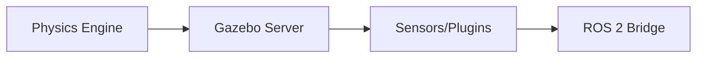

# Gazebo Simulation — The Digital Twin

## 🌍 Real World Scenario

You cannot crash a $150,000 humanoid robot to test if your navigation code works. You cannot flood a real kitchen with your robot's failed grasping attempts. Simulation exists so you can fail safely — a thousand times — before your robot touches the real world.

That sentence is not just philosophy. It is budget protection, safety engineering, and team velocity in one line.

In a real robotics program, every hardware test has a cost: battery cycles, motor wear, damaged grippers, bent joints, technician time, and operational downtime. If your software needs 200 iterations to stabilize object grasping in clutter, doing that directly on hardware is painfully slow and physically risky. In simulation, you can run parallel experiments overnight, inject failures deliberately, and measure behavior across thousands of episodes.

But simulation is not magic. It is a model. And all models are approximations. The goal is not to “replace reality.” The goal is to use simulation as a **digital twin workflow**: build confidence in software behavior, surface integration bugs early, then transfer with disciplined sim-to-real validation.

## What You Will Learn

- Why Gazebo is central to modern ROS 2 simulation workflows.
- The important differences between Gazebo Classic and Gazebo Harmonic.
- What the sim-to-real gap is and why it breaks otherwise “great” simulation results.
- How to choose physics engines (ODE, Bullet, DART) based on task characteristics.
- Key differences between SDF and URDF, and why both matter.
- How to design world files for realistic kitchens and warehouses.
- How to configure simulated RGB, depth, LiDAR, and IMU sensors.
- How ROS 2 integrates with Gazebo via `gz_ros2_control`.
- How to run headless simulation in CI/CD pipelines.
- Practical code examples for world creation, launch orchestration, and runtime object spawning.

## Why this chapter matters now

Most robotics students can launch a robot in a default empty world. The real jump in maturity happens when you ask:

- Does this behavior still work when friction changes?
- Does navigation still pass when camera noise increases?
- Does manipulation still succeed when object pose is slightly off?
- Can this run unattended in CI so regressions are caught before hardware tests?

Simulation is where you answer those questions cheaply and repeatedly. For humanoids especially, where full-body dynamics and complex environment interactions are expensive and risky on hardware, this is non-negotiable.

## Gazebo Classic vs Gazebo Harmonic: what changed and why it matters

Many tutorials online still target Gazebo Classic (`gazebo_ros_pkgs`, `gazebo` command patterns). Newer ROS 2 ecosystems increasingly move to modern Gazebo (formerly Ignition, now Gazebo) distributions such as Harmonic.

The migration matters because APIs, plugin models, tooling names, and long-term support expectations differ. If you follow old guides blindly, you can lose days to package mismatches.

### Gazebo Classic vs Gazebo Harmonic

| Dimension | Gazebo Classic | Gazebo Harmonic (new Gazebo) |
|---|---|---|
| Era | Older generation simulator | Modern actively evolving Gazebo line |
| CLI/tooling style | Classic `gazebo` workflows | `gz` ecosystem tools and services |
| Architecture direction | Legacy stack, many tutorials still reference it | Newer architecture with improved modularity |
| ROS 2 integration patterns | `gazebo_ros_*` plugins common | New bridge/control integrations (e.g., `gz_ros2_control`) |
| Long-term adoption | Still seen in old course material | Increasingly preferred for forward-looking ROS 2 projects |
| Learning risk | Easy to find tutorials, but often outdated | Fewer old blog posts, but better alignment with current stack |
| Best use case today | Maintaining legacy projects | New development targeting modern ROS 2 workflows |

Practical strategy:
1. If your project is greenfield, start with Harmonic-era tooling and docs.
2. If your project is legacy/classic, isolate migration tasks and test interfaces incrementally.
3. Never mix random snippets from Classic and Harmonic tutorials without verifying package compatibility.

## The sim-to-real gap: why perfect simulation still fails on hardware

The **sim-to-real gap** is the mismatch between simulation assumptions and physical reality. It appears in subtle but critical ways:

- Friction in simulation is too clean; real floors vary by patch.
- Motor response in simulation is idealized; real actuators have backlash and delay.
- Sensor models are too clean; real cameras have motion blur, exposure shifts, and rolling shutter artifacts.
- Contact dynamics are simplified; real grasps involve micro-slip and compliance.

Result: an algorithm with 95% success in simulation can collapse to 40% on hardware.

How professionals reduce this gap:

1. **Domain randomization**
   Randomize textures, lighting, friction coefficients, mass, sensor noise, and object placements.
2. **System identification**
   Measure real robot dynamics and tune simulation parameters to match empirical behavior.
3. **Progressive validation gates**
   Sim stress tests → limited hardware sandbox tests → supervised production trials.
4. **Error budgeting**
   Track expected performance drop during transfer; design safety boundaries around it.

Simulation is strongest when treated as a probabilistic confidence-building tool, not as a perfect mirror.

## Physics engines in Gazebo: ODE, Bullet, DART

Physics engine choice affects stability, realism, and compute cost.

### ODE
- Mature and historically common in robotics simulation.
- Good default for many rigid-body scenarios.
- Can be less accurate in complex contact-rich dynamics compared to specialized alternatives.

### Bullet
- Strong rigid-body dynamics and popular in broader simulation/gaming ecosystems.
- Good for collision handling and many manipulation tasks.
- Tuning details can still significantly affect stability.

### DART
- Strong articulated body dynamics, often attractive for humanoids and legged systems.
- Useful where joint-level realism and whole-body kinematics/dynamics fidelity are key.
- Can require careful parameter tuning and may be heavier in certain scenarios.

Rule of thumb for learners:
- Start with engine defaults that match your stack recommendations.
- Benchmark your target task, not generic FPS.
- For humanoid locomotion/manipulation, evaluate DART seriously.
- For simple warehouse navigation prototypes, ODE/Bullet with proper tuning may be sufficient.

## SDF vs URDF: both are essential, but not interchangeable

Students often ask: if I already have URDF, why do I need SDF?

Because they serve overlapping but different purposes.

### URDF
- Robot-centric description format.
- Excellent for links, joints, inertial/visual/collision basics.
- Commonly used with `robot_state_publisher`, TF, and ROS tooling.

### SDF
- Simulation-centric description format.
- Describes worlds, models, sensors, plugins, lights, physics properties, and richer simulation constructs.
- Better suited for complete environment and simulator behavior specification.

In real workflows:
- URDF/xacro defines robot structure.
- SDF defines world and can include models/sensors/plugins at simulation level.
- Bridge them through launch orchestration and simulator plugins.

## Building world files: kitchen and warehouse as digital twins

A realistic world is more than floor + walls. For humanoid tasks, environment design should encode operational constraints:

Kitchen world considerations:
- Counter height and reachability zones.
- Reflective surfaces affecting depth cameras.
- Cabinet handles and graspable geometry.
- Obstacle density in narrow passages.

Warehouse world considerations:
- Aisle widths and turn radius constraints.
- Pallet and rack geometry.
- Dynamic obstacles (forklifts, workers).
- Varying floor friction and lighting zones.

A good world file balances realism and tractability: enough detail to reveal failures, not so heavy that simulation becomes unusably slow.

## Sensor configuration in simulation

You should configure sensors as if you care about downstream failure analysis, not just pretty visuals.

### RGB camera
- Configure image resolution and frame rate realistically.
- Add noise profiles where available.
- Validate topic throughput under expected compute constraints.

### Depth camera
- Watch clipping ranges and quantization artifacts.
- Test under reflective/low-texture conditions.

### LiDAR
- Tune scan rate, horizontal resolution, and range.
- Inject noise and dropouts to approximate real returns.

### IMU
- Include drift/noise models.
- Ensure frame alignment and covariance values are meaningful for filters.

If sensor settings are too clean, your perception stack becomes overconfident and brittle.

## ROS 2 ↔ Gazebo bridge with gz_ros2_control

`gz_ros2_control` connects Gazebo simulation interfaces with ROS 2 control abstractions. In practical terms, it allows controllers in ROS 2 to command simulated joints and read simulated states as if they were hardware interfaces.

Why this matters:
- You can use similar controller architecture in sim and hardware pipelines.
- It reduces divergence between testing and deployment stacks.
- It enables controller tuning before touching expensive actuators.

For humanoids, this is critical because joint-level controller behavior (latency, gains, saturation) must be tested repeatedly under diverse scenarios.

## Headless simulation for CI/CD

Graphical simulation is great for development, but CI needs non-interactive, repeatable execution.

Headless simulation benefits:
- Run regression suites on every commit.
- Validate behavior in standardized worlds.
- Catch integration breakages early (topics, transforms, controllers, startup).
- Generate metrics artifacts (success rates, timing, collisions).

A serious robotics pipeline usually includes:
1. Launch sim headless.
2. Spawn robot and scene objects.
3. Run test scenario scripts.
4. Assert acceptance metrics.
5. Fail pipeline if regression thresholds are violated.

This is how teams stop shipping “works on my laptop” robot code.

## 💻 Code Example 1: Complete SDF world file (room, table, objects)

```xml
<?xml version="1.0" ?>
<sdf version="1.9">
  <world name="humanoid_kitchen_world">
    <gravity>0 0 -9.81</gravity>

    <physics name="default_physics" type="dart">
      <max_step_size>0.001</max_step_size>
      <real_time_factor>1.0</real_time_factor>
      <real_time_update_rate>1000</real_time_update_rate>
    </physics>

    <light name="sun" type="directional">
      <cast_shadows>true</cast_shadows>
      <pose>0 0 10 0 0 0</pose>
      <diffuse>0.8 0.8 0.8 1</diffuse>
      <specular>0.2 0.2 0.2 1</specular>
      <direction>-0.5 0.1 -0.9</direction>
    </light>

    <model name="room_floor">
      <static>true</static>
      <link name="floor_link">
        <collision name="floor_collision">
          <geometry>
            <box>
              <size>8 8 0.1</size>
            </box>
          </geometry>
        </collision>
        <visual name="floor_visual">
          <geometry>
            <box>
              <size>8 8 0.1</size>
            </box>
          </geometry>
          <material>
            <ambient>0.7 0.7 0.7 1</ambient>
          </material>
        </visual>
      </link>
    </model>

    <model name="kitchen_table">
      <static>true</static>
      <pose>1.0 0.0 0.75 0 0 0</pose>
      <link name="table_link">
        <collision name="table_collision">
          <geometry>
            <box>
              <size>1.2 0.8 0.05</size>
            </box>
          </geometry>
        </collision>
        <visual name="table_visual">
          <geometry>
            <box>
              <size>1.2 0.8 0.05</size>
            </box>
          </geometry>
          <material>
            <ambient>0.5 0.3 0.2 1</ambient>
          </material>
        </visual>
      </link>
    </model>

    <model name="cereal_box">
      <pose>1.1 0.1 0.83 0 0 0</pose>
      <link name="box_link">
        <inertial><mass>0.4</mass></inertial>
        <collision name="box_collision">
          <geometry>
            <box><size>0.08 0.05 0.22</size></box>
          </geometry>
        </collision>
        <visual name="box_visual">
          <geometry>
            <box><size>0.08 0.05 0.22</size></box>
          </geometry>
        </visual>
      </link>
    </model>

    <model name="mug">
      <pose>0.9 -0.15 0.82 0 0 0</pose>
      <link name="mug_link">
        <inertial><mass>0.25</mass></inertial>
        <collision name="mug_collision">
          <geometry>
            <cylinder><radius>0.04</radius><length>0.1</length></cylinder>
          </geometry>
        </collision>
        <visual name="mug_visual">
          <geometry>
            <cylinder><radius>0.04</radius><length>0.1</length></cylinder>
          </geometry>
        </visual>
      </link>
    </model>
  </world>
</sdf>
```

## 💻 Code Example 2: ROS 2 launch file to start Gazebo + humanoid

```python
# file: launch/sim_humanoid.launch.py
from launch import LaunchDescription
from launch.actions import DeclareLaunchArgument
from launch.substitutions import LaunchConfiguration, PathJoinSubstitution, Command
from launch_ros.actions import Node
from launch_ros.substitutions import FindPackageShare
from launch_ros.parameter_descriptions import ParameterValue


def generate_launch_description():
    world = LaunchConfiguration('world')
    use_sim_time = LaunchConfiguration('use_sim_time')

    pkg_share = FindPackageShare('humanoid_sim')
    world_default = PathJoinSubstitution([pkg_share, 'worlds', 'humanoid_kitchen.world'])
    xacro_file = PathJoinSubstitution([pkg_share, 'urdf', 'humanoid.urdf.xacro'])

    robot_description = ParameterValue(
        Command(['xacro ', xacro_file, ' use_sim:=true']),
        value_type=str
    )

    gazebo = Node(
        package='ros_gz_sim',
        executable='gz_sim',
        arguments=['-r', world],
        output='screen'
    )

    rsp = Node(
        package='robot_state_publisher',
        executable='robot_state_publisher',
        output='screen',
        parameters=[
            {'robot_description': robot_description},
            {'use_sim_time': use_sim_time}
        ]
    )

    controller_manager = Node(
        package='controller_manager',
        executable='ros2_control_node',
        output='screen',
        parameters=[
            {'robot_description': robot_description},
            {'use_sim_time': use_sim_time}
        ]
    )

    gz_control_bridge = Node(
        package='gz_ros2_control',
        executable='gz_ros2_control',
        output='screen',
        parameters=[{'use_sim_time': use_sim_time}]
    )

    return LaunchDescription([
        DeclareLaunchArgument('world', default_value=world_default),
        DeclareLaunchArgument('use_sim_time', default_value='true'),
        gazebo,
        rsp,
        controller_manager,
        gz_control_bridge,
    ])
```

## 💻 Code Example 3: Python script to spawn objects in running simulation

```python
#!/usr/bin/env python3
# file: scripts/spawn_objects.py

import argparse
import subprocess
import textwrap


def make_box_sdf(name: str, x: float, y: float, z: float) -> str:
    return textwrap.dedent(f"""
    <sdf version='1.9'>
      <model name='{name}'>
        <pose>{x} {y} {z} 0 0 0</pose>
        <link name='link'>
          <inertial><mass>0.3</mass></inertial>
          <collision name='collision'>
            <geometry><box><size>0.06 0.06 0.12</size></box></geometry>
          </collision>
          <visual name='visual'>
            <geometry><box><size>0.06 0.06 0.12</size></box></geometry>
          </visual>
        </link>
      </model>
    </sdf>
    """).strip()


def spawn(name: str, x: float, y: float, z: float):
    sdf = make_box_sdf(name, x, y, z)
    cmd = [
        'gz', 'service', '-s', '/world/humanoid_kitchen_world/create',
        '--reqtype', 'gz.msgs.EntityFactory',
        '--reptype', 'gz.msgs.Boolean',
        '--timeout', '3000',
        '--req', f'sdf: "{sdf}"'
    ]
    result = subprocess.run(cmd, capture_output=True, text=True)
    if result.returncode != 0:
        raise RuntimeError(result.stderr.strip() or 'Failed to spawn object')
    print(f'Spawned {name} at ({x}, {y}, {z})')


def main():
    parser = argparse.ArgumentParser()
    parser.add_argument('--count', type=int, default=3)
    args = parser.parse_args()

    for i in range(args.count):
        spawn(name=f'box_{i}', x=0.8 + i * 0.1, y=0.2, z=0.85)


if __name__ == '__main__':
    main()
```

## Practical debugging mindset for simulation work

When simulation behaves strangely, most teams jump directly into rewriting code. That is usually the slowest path.

Use this order:
1. Confirm world and robot launched with expected files.
2. Confirm sensors publish at expected rates/topics.
3. Confirm TF tree is valid.
4. Confirm controller interfaces are loaded.
5. Confirm bridge topics and command paths are connected.
6. Only then modify algorithms.

A large fraction of “AI behavior bugs” in sim are actually configuration bugs.

## Architecture Diagram



## 💡 Key Concepts Summary

- Gazebo is your digital twin environment for safe, repeated failure before hardware risk.
- Gazebo Harmonic represents modern simulator workflows; many old tutorials target Classic and can mislead.
- Sim-to-real gap is unavoidable; reduce it with randomization, system ID, and staged validation.
- Physics engine choice should match task needs, especially for humanoid articulated dynamics.
- URDF and SDF are complementary: robot model vs simulation/world modeling.
- Sensor realism and controller bridging (`gz_ros2_control`) are essential for transferable results.
- Headless simulation in CI/CD transforms simulation from demo tool to engineering quality gate.

## 🧪 Practice Exercises

### Exercise 1 (Beginner)
Clone the provided SDF world and add one additional obstacle (box or cylinder). Verify your humanoid navigation stack replans around it without collisions.

```bash
# Run simulation and inspect obstacle topic/visual behavior
ros2 launch humanoid_sim sim_humanoid.launch.py
```

### Exercise 2 (Intermediate)
Create two parameter sets for your simulated LiDAR noise (low vs high). Run the same navigation benchmark and compare success rate and path smoothness.

```python
# Hint: keep algorithm unchanged; vary only sensor noise profile.
```

### Exercise 3 (Advanced)
Set up a headless CI job that launches Gazebo, spawns randomized objects, runs a scripted pick-and-place scenario, and fails if success rate drops below your threshold.

```bash
# Example direction: run headless + scripted scenario + parse metrics artifact
```

## ✅ Key Takeaways

- Simulation is not optional for humanoid development; it is the safe failure engine.
- Gazebo Harmonic is the forward-looking path for modern ROS 2 stacks.
- The sim-to-real gap is managed, not eliminated.
- Strong world modeling, sensor realism, and control bridging improve transfer quality.
- CI-driven headless simulation is the difference between fragile demos and reliable robotics engineering.

## 🔗 Next Up

Next chapter: Advanced sensor simulation and domain randomization pipelines—how to systematically prepare perception and control systems for transfer into unpredictable real-world environments.