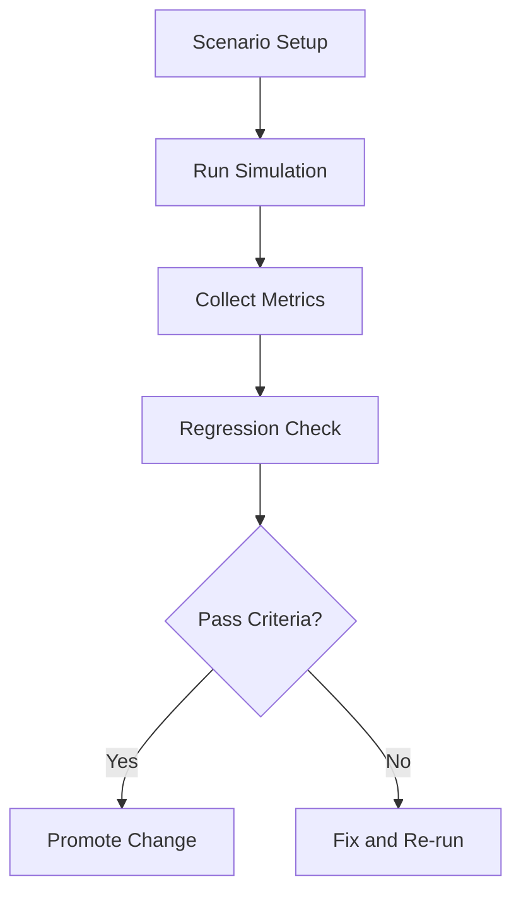

Module 2 focuses on simulation-first development so you can test behavior safely before touching hardware. You will use repeatable simulation scenarios to validate locomotion, navigation constraints, and failure handling. This approach lowers risk and speeds up iteration when model, planner, or controller changes are introduced.

A strong simulation workflow includes world setup, deterministic test runs, metrics capture, and regression checks. Instead of relying on visual success only, we define measurable outcomes such as goal completion, collision count, and time-to-stability. This gives the team objective evidence for improvements across iterations.

```python
def evaluate_episode(success: bool, collisions: int, settle_time_s: float) -> dict[str, float | bool]:
    return {
        "success": success,
        "collisions": collisions,
        "settle_time_s": settle_time_s,
    }
```



## Key Takeaways

- Simulation-first workflows reduce safety and integration risk.
- Deterministic scenarios make robotics testing repeatable.
- Metrics-driven evaluation gives clear pass/fail gates for iteration.
