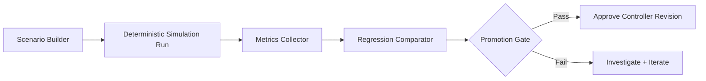

Module 2 is where you convert robotics ideas into measurable evidence. Instead of asking “does it look okay in sim?”, you define objective pass/fail gates for stability, collision risk, and task completion. This module teaches simulation as an engineering system, not only as a visualization tool.

You will build deterministic scenario loops, evaluate policy updates against baseline metrics, and enforce promotion gates before any controller change reaches hardware testing.

```python
from dataclasses import dataclass

@dataclass
class EpisodeMetrics:
    success: bool
    collisions: int
    settle_time_s: float
    energy_score: float


def promote_candidate(m: EpisodeMetrics) -> bool:
    return m.success and m.collisions == 0 and m.settle_time_s < 2.0 and m.energy_score >= 0.7
```



## Lessons in this module

- [Deterministic World and Scenario Design](./deterministic-scenarios)
- [Metrics, Regression, and Release Gates](./metrics-regression-gates)

## Key Takeaways

- Simulation quality comes from deterministic inputs and explicit metrics.
- Regression comparisons are required for safe iteration speed.
- Hardware testing should only start after simulation promotion gates pass.
