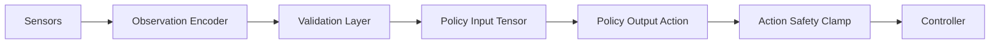

In humanoid control systems, interface ambiguity is expensive. If policy inputs are not clearly versioned and validated, behavior changes become unpredictable. Isaac workflows should define observation schemas and action schemas as strict contracts with bounds, units, and expected update rates.

### Observation contract essentials

- Field naming and order (never implicit)
- Physical units (radians, m/s, N·m)
- Missing-data policy (drop, interpolate, or hold)
- Normalization method and version

```python
from dataclasses import dataclass

@dataclass
class Observation:
    pelvis_tilt_rad: float
    left_knee_rad: float
    right_knee_rad: float
    center_of_mass_height_m: float


def validate_observation(obs: Observation) -> list[str]:
    errors: list[str] = []
    if not (-1.5 <= obs.pelvis_tilt_rad <= 1.5):
        errors.append("pelvis_tilt out of range")
    if not (0.2 <= obs.center_of_mass_height_m <= 1.5):
        errors.append("com height implausible")
    return errors
```



## Key Takeaways

- Observation/action contracts must be explicit and versioned.
- Validation layers prevent impossible states from contaminating policy outputs.
- Safety clamps should be applied after inference, before actuation.
