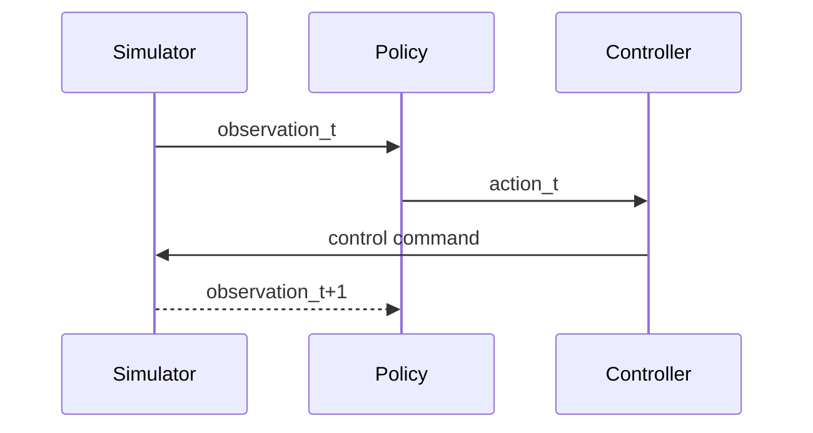

Module 3 introduces NVIDIA Isaac-based pipelines for humanoid simulation and control. You will connect perception and control loops in a way that mirrors production constraints, including timing budgets and asynchronous sensor updates. The emphasis is on stable behavior under realistic physics and noisy observations.

As projects grow, isolated demos are no longer enough. You need a coherent loop that ingests observations, computes actions, and applies controls while logging outcomes for analysis. Isaac tooling helps prototype this loop quickly, but quality still depends on clear interfaces and monitoring.

```python
class ControlLoop:
    def step(self, observation: dict) -> dict:
        # placeholder policy logic
        action = {"hip_pitch": 0.02, "knee_pitch": -0.01}
        return action
```



## Key Takeaways

- Isaac workflows help approximate real control constraints in simulation.
- Stable observation→action loops are central to humanoid control quality.
- Logging and interface discipline are required for reliable policy iteration.
