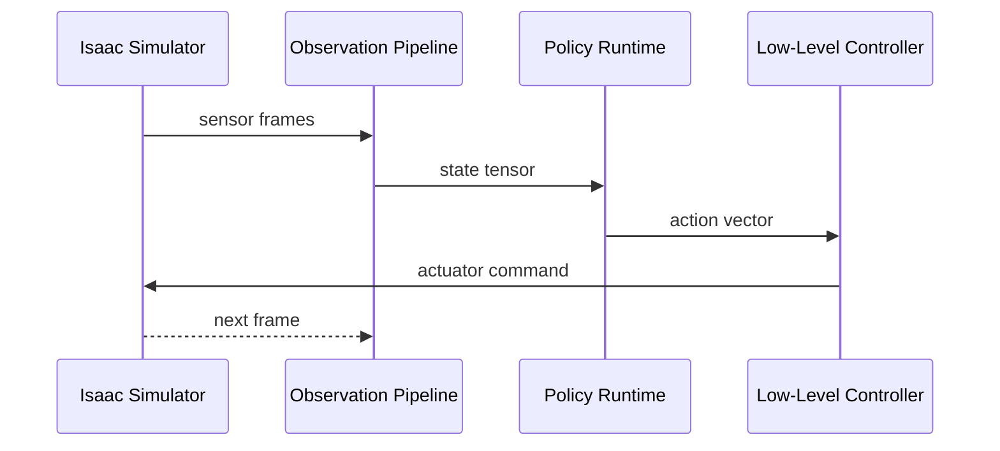

Module 3 moves from generic simulation to Isaac-oriented humanoid pipelines. You will design a loop that keeps observation timing, policy inference, and command execution coherent under realistic physics and noisy sensing. Isaac lets you model complexity quickly, but reliable behavior still depends on disciplined interfaces and runtime observability.

This module emphasizes end-to-end control integrity: every observation should map to a justified action, and every action should be logged with enough context to reproduce mistakes.

```python
from dataclasses import dataclass

@dataclass
class IsaacStep:
    t_ms: int
    observation_ready: bool
    inference_ms: float
    command_sent: bool


def loop_health(step: IsaacStep, max_inference_ms: float = 30.0) -> bool:
    return step.observation_ready and step.command_sent and step.inference_ms <= max_inference_ms
```



## Lessons in this module

- [Isaac Observation and Action Interfaces](./isaac-observation-action-interfaces)
- [Policy Runtime and Failure Diagnostics](./policy-runtime-diagnostics)

## Key Takeaways

- Isaac acceleration does not remove the need for strict interface contracts.
- Control-loop latency budgets must be monitored continuously.
- Reproducible diagnostics are essential for scaling policy iteration.
