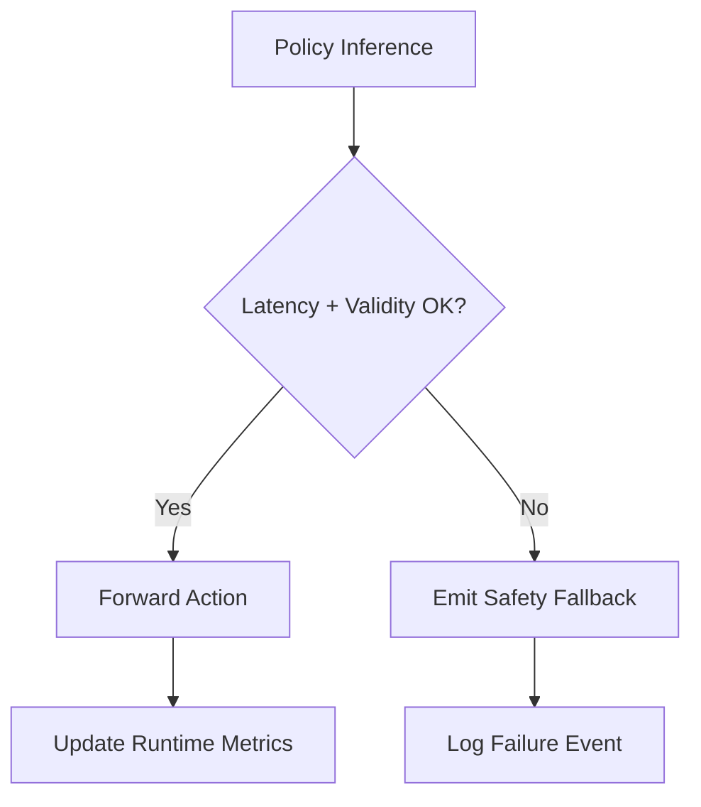

A robust policy runtime is more than a model call. It includes budget enforcement, watchdogs, and structured failure telemetry. If an inference is delayed or malformed, the controller must degrade safely rather than forwarding stale or unsafe actions.

### Runtime safeguards

1. Latency guard per inference step
2. Action validity checks (NaN, joint bounds)
3. Safe fallback command on failure
4. Structured event logging for replay

```python
from dataclasses import dataclass

@dataclass
class InferenceResult:
    ok: bool
    latency_ms: float
    action: dict[str, float]


def safe_action() -> dict[str, float]:
    return {"hip_pitch": 0.0, "knee_pitch": 0.0, "ankle_pitch": 0.0}


def resolve_action(result: InferenceResult, max_latency_ms: float = 35.0) -> dict[str, float]:
    if not result.ok or result.latency_ms > max_latency_ms:
        return safe_action()
    return result.action
```



## Key Takeaways

- Runtime safety requires explicit guards, not just good training.
- Fallback actions should be deterministic and testable.
- Diagnostics logs are key for post-incident root cause analysis.
