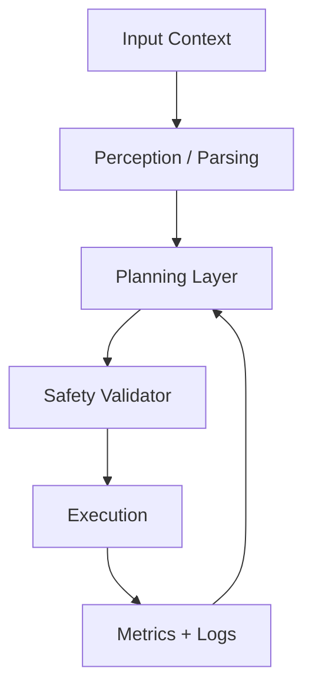

# Policy Runtime Diagnostics and Sim-to-Real

## 🌍 Real World Scenario

Robots trained in synthetic kitchens now perform in real kitchens because data diversity and diagnostics closed the sim-to-real gap. Measurement is the hidden superpower.

---

## What You Will Learn

- Explain why data bottlenecks matters before implementation choices.
- Apply beginner analogies to understand policy runtime diagnostics and sim-to-real.
- Use robotics-specific code patterns with clear comments and safe defaults.
- Read comparison tables to choose architecture and tool tradeoffs correctly.
- Practice with graded exercises from beginner to advanced.
- Prepare chapter knowledge for capstone integration decisions.

---

## Why This Topic Exists

Data bottlenecks, isaac lab rl loops, randomization dimensions, evaluation metrics, and real-world results is a response to real deployment pain, not academic theory. Teams that ignore this layer usually pay later with unstable integration, confusing failures, and costly rework. This chapter opens with why so your implementation decisions stay grounded under pressure.

When you understand why a component exists, you can make better tradeoffs. You will know which defaults are safe, which shortcuts are risky, and which metrics reveal hidden instability. This perspective is especially important for hackathon delivery where speed matters but safety and clarity still decide quality.

## Deep Explanation with Analogies

Complex robotics concepts become easier when anchored in analogy. Nodes are smartphone apps with focused jobs. Topics are TV channels where many listeners can tune in. Services are phone calls that wait for a response. Actions are food-delivery tracking with progress updates. QoS is choosing between guaranteed delivery and low-latency streaming.

These analogies are not substitutes for technical rigor; they are entry ramps. After intuition, we translate directly into contracts, command flows, and error-handling behavior. You should always ask: where can this fail, and how will I know quickly?

## Engineering Patterns and Tradeoffs

For policy runtime diagnostics and sim-to-real, tradeoffs are inevitable. Conservative settings improve safety but may reduce throughput. Aggressive settings increase performance but can amplify instability. Balanced design means selecting policies by subsystem risk profile, then validating with objective evidence rather than preference.

Professional teams document these tradeoffs in tables, diagrams, and runtime metrics so decisions are reviewable. This chapter follows the same discipline to help you build communication habits valued in production environments.

## Common Mistakes and Exact Corrections

A frequent beginner mistake is skipping observability until something fails. Another is treating passing demos as proof of reliability. Reliable robotics requires stress testing, fault injection, and fallback verification. You should expect edge cases and design for them explicitly.

When troubleshooting, inspect boundaries first: input freshness, schema correctness, transform assumptions, and actuator limits. Most incidents are integration mistakes disguised as algorithm failures.

## Practical Workflow for Team Delivery

In collaborative settings, readability and repeatability are strategic advantages. Keep launch/config explicit, code comments purposeful, and error messages actionable. Align your chapter implementations with measurable acceptance criteria so mentors and judges can verify progress quickly.

Your target is not just to make things work once; it is to make behavior explainable every time. That is the hallmark of premium engineering output.

:::tip Beginner Tip
Start with one subsystem and validate it deeply before integrating the next.
:::

:::info Pro Insight
Most integration failures are contract failures; define timing and schema expectations explicitly.
:::

:::warning Common Mistake
Do not optimize performance before proving safety and observability baselines.
:::

| Option | Strength | Limitation | Best use case |
|---|---|---|---|
| Conservative | Strong safety margin | Lower peak throughput | First deployment passes |
| Balanced | Reliable tradeoff | Requires tuning | General project work |
| Aggressive | High performance potential | Higher instability risk | Controlled experiments |
| Tool/Command | What it does | Why it matters |
|---|---|---|
| `ros2 node list` | Lists active compute nodes | Confirms graph health |
| `ros2 topic hz` | Measures stream frequency | Detects timing drift |
| `ros2 topic echo` | Shows live payloads | Catches schema/value issues |
| Safety constraint | Meaning | Real robot example |
|---|---|---|
| Speed cap | Limits motion velocity | Slow approach near humans |
| Force cap | Limits contact force | Prevents over-gripping fragile cup |
| Timeout fallback | Safe behavior on stale data | Stop motion when sensor feed freezes |

```python
# This utility validates command safety before execution in a robotics loop.
from dataclasses import dataclass

@dataclass
class SafetyRule:
    max_speed: float
    max_force: float


def validate(speed: float, force: float, rule: SafetyRule) -> tuple[bool, str]:
    # Reject speed that exceeds configured safety envelope.
    if speed > rule.max_speed:
        return False, "speed limit exceeded"
    # Reject force that could damage hardware or environment.
    if force > rule.max_force:
        return False, "force limit exceeded"
    return True, "ok"
```

```python
# This skeleton demonstrates chapter-level quality gating for robotics experiments.
from dataclasses import dataclass

@dataclass
class GateInput:
    success_rate: float
    safety_events: int
    latency_ms: float


def passed(g: GateInput) -> bool:
    # Require robust success across representative scenarios.
    if g.success_rate < 0.9:
        return False
    # Any safety event blocks promotion.
    if g.safety_events > 0:
        return False
    # Keep control-path latency within practical budget.
    return g.latency_ms < 120.0
```



---

## 💡 Key Concepts Summary

| Concept | What it means | Real robot example |
|---|---|---|
| Contract clarity | Explicit inputs/outputs and assumptions | Controller rejects stale state updates |
| Runtime evidence | Metrics/logs prove behavior | Gate blocks unsafe release candidate |
| Fallback behavior | Safe response during uncertainty | Robot pauses when confidence is low |
| Iterative validation | Improve through repeatable tests | Simulation regression catches drift early |

---

## 🧪 Practice Exercises

### Exercise 1 (Beginner)
Translate one chapter concept into your own analogy and map it to a measurable signal.

```python
# TODO: Replace placeholders with your own mapping.
concept = ""
analogy = ""
metric = ""
print(concept, analogy, metric)
```

### Exercise 2 (Intermediate)
Build a mini validator for one runtime assumption from this chapter.

```python
# TODO: Implement a chapter-specific validation function.
def validate_assumption(value: float, threshold: float) -> bool:
    return value <= threshold

print(validate_assumption(1.0, 1.5))
```

### Exercise 3 (Advanced)
Create a release gate using success, safety, and latency metrics.

```python
# TODO: Tune thresholds and compare baseline vs candidate.
baseline = {"success": 0.91, "safety": 0, "latency": 95}
candidate = {"success": 0.93, "safety": 0, "latency": 104}
print("baseline", baseline)
print("candidate", candidate)
```

---

## Key Takeaways

- Start with why: operational constraints should drive architecture decisions.
- Use beginner analogies, then convert them into technical contracts and metrics.
- Keep code robotics-specific, commented, and validation-oriented.
- Pair every performance change with safety and observability checks.
- Build chapter knowledge toward capstone-level integration confidence.

---

## 🔗 Next Up

Next up: this knowledge feeds directly into the next integration layer so your system remains explainable and safe as complexity grows.

---

## 📚 Resources

- [Isaac Lab](https://isaac-sim.github.io/IsaacLab/)
- [ROS 2 Tutorials](https://docs.ros.org/en/humble/Tutorials.html)
- [Open Robotics](https://www.openrobotics.org/)
