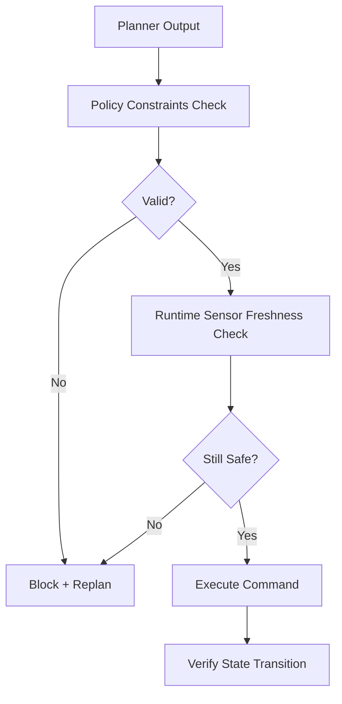

Even a well-grounded plan can fail at execution time due to latency spikes, perception drift, or actuator limits. Runtime verification ensures every command remains within safety policy at the moment it is sent.

### Verification layers

- **Static policy checks**: prohibited zones, joint limits, maximum velocity
- **Runtime checks**: fresh sensor state, command latency, emergency-stop readiness
- **Post-action checks**: expected state transition observed

```python
from dataclasses import dataclass

@dataclass
class ActionCommand:
    joint: str
    target: float
    velocity: float


def verify_action(cmd: ActionCommand) -> bool:
    safe_velocity = 0.0 <= cmd.velocity <= 1.5
    safe_target = -1.5 <= cmd.target <= 1.5
    return safe_velocity and safe_target
```



## Key Takeaways

- Runtime verification is required even when planning quality is high.
- Safety gates should be deterministic and testable.
- Post-action verification closes the loop and catches silent failures.
