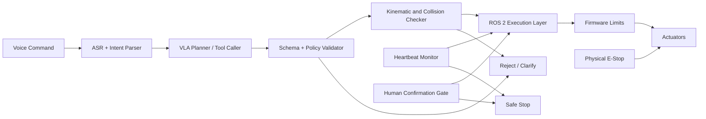

# Action Safety and Runtime Verification

## Real World Scenario

In 2015, a factory robot in Germany killed a worker during a setup operation. The machine did exactly what its control system allowed it to do. It did not understand context, intent, or danger. It only executed motion.

Now consider modern language-conditioned robotics. A user says, "Move that box to the side." A Vision-Language-Action (VLA) stack parses speech, grounds objects, plans an action, and sends commands into motion systems. This looks magical in demos. But a single unsafe output can become a physical hazard in milliseconds.

In software AI, a bad output can be corrected with a retry. In physical AI, a bad output can break hardware, damage property, or injure people. That is why runtime verification is non-negotiable.

This chapter teaches the safety architecture you need before you ever let an LLM-derived action reach real motors.

## What You Will Learn

- Why physical AI requires stronger safeguards than pure software systems.
- A practical 6-layer safety architecture for VLA robots.
- How to combine hardware, firmware, ROS 2 runtime checks, and policy controls.
- How ISO 10218 and ISO/TS 15066 shape real deployment requirements.
- How to design software watchdogs and heartbeat-based failsafes.
- How to validate action commands with schema, kinematic, and policy constraints.
- How to structure human-in-the-loop confirmation for high-risk tasks.
- How to build graceful degradation paths for LLM uncertainty and timeout events.

## Why safety is the core problem in VLA systems

Language models are probabilistic. They can return syntactically perfect but physically unsafe actions. The model might correctly identify an object but generate an unreachable or collision-prone end pose. It might hallucinate a tool capability that does not exist. It might produce stale assumptions after the world changed.

A common misconception is: "If grounding is accurate, execution is safe." That is false.

Even perfect perception can still lead to unsafe behavior if:

1. Action values exceed actuator constraints.
2. Frame references are inconsistent (`map` vs `base_link`).
3. Dynamic obstacles are ignored.
4. Human proximity constraints are violated.
5. Controller latency causes late braking.

So VLA safety is not one filter. It is a layered system with independent checks at multiple points in the action path.

## The 6-layer safety architecture (defense in depth)

You should never rely on one guardrail. Build independent layers so a missed check in one component is caught by another.

### Layer 1: Hardware safety boundary

This layer must work even if Linux crashes.

- Physical E-stop circuit that cuts actuator power.
- Safety relay and power contactor.
- Motor driver current limits.
- Mechanical stops and protected work envelope.

If your software stack becomes unresponsive, this layer still prevents catastrophic motion.

### Layer 2: Firmware and low-level controller limits

This layer enforces hard constraints close to motors.

- Joint position limits.
- Velocity and acceleration limits.
- Torque/force bounds.
- Command timeout auto-stop (if new command not received).

Low-level controllers should reject unsafe values regardless of their source.

### Layer 3: ROS 2 runtime supervision

This layer detects node failures, stale streams, and communication issues.

- Heartbeat topics for critical nodes.
- Watchdog timers with auto-stop behavior.
- Lifecycle-managed nodes for controlled startup/shutdown.
- QoS profiles chosen by risk class (reliability over throughput for safety-critical channels).

This is where many teams fail. They validate logic but ignore runtime liveness.

### Layer 4: Kinematic and geometric verification

This layer validates spatial feasibility before actuation.

- Workspace bounds checks.
- Self-collision checks.
- Obstacle collision prediction.
- Reachability and IK validity checks.
- Trajectory smoothness and jerk constraints.

If an LLM outputs "reach z=-0.2" for a tabletop scene, this layer blocks it.

### Layer 5: Semantic and policy validation

This layer validates intent-level correctness.

- Strict schema validation for tool calls.
- Capability whitelists.
- Unit and frame validation.
- Task policy checks (forbidden zones, speed caps in human proximity, no autonomous hazardous actuation).
- Confidence thresholds and uncertainty escalation.

Treat LLM output as untrusted user input.

### Layer 6: Human-in-the-loop authority

This layer handles ambiguity and irreversible actions.

- Confirmation prompts for risky actions.
- Teleoperation takeover.
- Operator override and stop authority.
- Audit logs for post-incident review.

Human authority must supersede autonomous planning at all times.

## Safety architecture at runtime



The key design principle: **all autonomous commands pass through validators before execution**, and any supervision fault can force a safe stop.

## ISO safety standards overview for robotics deployments

### ISO 10218 (industrial robots)

ISO 10218 defines safety requirements for industrial robot systems and integration. Important implications for software teams:

- Risk assessment is mandatory, not optional.
- Safety-rated monitored stop and emergency stop behavior must be defined.
- Operational modes (automatic, manual reduced speed, maintenance) need distinct controls.
- System integrator responsibility is explicit.

You cannot claim compliance by writing "safe code" alone. Safety is a system property including hardware, software, procedures, and environment controls.

### ISO/TS 15066 (collaborative robots)

ISO/TS 15066 extends safety guidance for human-robot collaboration.

Core concepts include:

- Speed and separation monitoring.
- Power and force limiting.
- Hand-guiding and monitored stop constraints.
- Body-region force/pressure thresholds for contact safety.

For language-driven robots, this means policy constraints must be context-aware. A command that is safe in an empty workspace may be unsafe near humans.

### Practical takeaway for VLA teams

You do not need to become a certification auditor on day one, but you must align architecture with standards language early. Retrofitting safety later is expensive and often incomplete.

## Runtime verification pipeline: what to check before every action

Before execution, each action candidate should pass this checklist:

1. **Syntax validity**: Is output valid JSON/tool schema?
2. **Capability validity**: Is requested skill allowed?
3. **Parameter validity**: Are units, ranges, and frames valid?
4. **State validity**: Is the command compatible with current robot state (gripper occupied, battery low, localization uncertain)?
5. **Spatial validity**: Is target reachable and collision-free?
6. **Temporal validity**: Is data fresh (timestamps and heartbeat healthy)?
7. **Policy validity**: Is this action allowed in current safety mode?
8. **Operator validity**: If risk threshold exceeded, has user confirmed?

If any check fails, do not partially execute. Return a structured rejection reason and trigger clarify/replan/stop workflow.

## Common runtime failure modes and diagnostics

| Failure mode | Typical symptom | Root cause | Runtime mitigation |
|---|---|---|---|
| Stale perception | Robot reaches old object location | Camera/TF lag | Reject if sensor timestamp too old; force re-detect |
| Frame mismatch | Motion in wrong direction | `map` vs `base_link` confusion | Enforce frame whitelist and transform check |
| Unsafe speed | Jerky or dangerous movement | Missing unit/range validation | Clamp and reject out-of-range commands |
| Looping replan | Endless retries without progress | No stop criteria in ReAct loop | Max-iteration cap + escalation |
| Node freeze | Robot keeps last command | Planner crash, no liveness supervision | Watchdog timeout to safe stop |
| Human proximity violation | Robot moves near operator | No proximity-aware policy | Dynamic speed/separation constraints |

## Code Example 1: Action schema + policy gate middleware

```python
#!/usr/bin/env python3
# file: safety/action_policy_gate.py

from pydantic import BaseModel, Field, ValidationError

ALLOWED_SKILLS = {"MOVE_BASE", "REACH", "GRASP", "PLACE", "STOP"}
ALLOWED_FRAMES = {"map", "base_link"}


class ActionCommand(BaseModel):
    skill: str = Field(description="One of MOVE_BASE, REACH, GRASP, PLACE, STOP")
    target_frame: str
    x: float = Field(ge=-2.0, le=2.0)
    y: float = Field(ge=-2.0, le=2.0)
    z: float = Field(ge=0.0, le=2.0)
    yaw: float = Field(ge=-3.2, le=3.2)
    speed_mps: float = Field(ge=0.0, le=0.20)


class PolicyContext(BaseModel):
    human_nearby: bool
    autonomy_mode: str  # e.g. "AUTO", "SUPERVISED"


def validate_and_authorize(raw: dict, ctx: PolicyContext) -> tuple[bool, str, ActionCommand | None]:
    try:
        cmd = ActionCommand(**raw)
    except ValidationError as e:
        return False, f"schema_reject: {e.errors()}", None

    if cmd.skill not in ALLOWED_SKILLS:
        return False, "policy_reject: unsupported_skill", None

    if cmd.target_frame not in ALLOWED_FRAMES:
        return False, "policy_reject: unsupported_frame", None

    # Context-aware policy constraint
    if ctx.human_nearby and cmd.speed_mps > 0.10:
        return False, "policy_reject: speed_too_high_for_human_proximity", None

    # High-risk skills require supervised mode
    if cmd.skill in {"GRASP", "PLACE"} and ctx.autonomy_mode != "SUPERVISED":
        return False, "policy_reject: skill_requires_supervision", None

    return True, "accepted", cmd
```

This gate should run before any ROS 2 action request is emitted.

## Code Example 2: ROS 2 heartbeat watchdog with safe-stop trigger

```python
#!/usr/bin/env python3
# file: safety/heartbeat_watchdog_node.py

import rclpy
from rclpy.node import Node
from std_msgs.msg import Empty, Bool


class HeartbeatWatchdog(Node):
    def __init__(self):
        super().__init__("heartbeat_watchdog")

        self.timeout_sec = 0.5
        self.last_heartbeat_ns = self.get_clock().now().nanoseconds
        self.estop_latched = False

        self.create_subscription(Empty, "/vla/heartbeat", self.on_heartbeat, 10)
        self.estop_pub = self.create_publisher(Bool, "/robot/safe_stop", 10)

        self.timer = self.create_timer(0.1, self.check_timeout)
        self.get_logger().info("watchdog_online")

    def on_heartbeat(self, _msg: Empty) -> None:
        self.last_heartbeat_ns = self.get_clock().now().nanoseconds

    def check_timeout(self) -> None:
        if self.estop_latched:
            return

        now_ns = self.get_clock().now().nanoseconds
        elapsed = (now_ns - self.last_heartbeat_ns) / 1e9

        if elapsed > self.timeout_sec:
            msg = Bool()
            msg.data = True
            self.estop_pub.publish(msg)
            self.estop_latched = True
            self.get_logger().error(f"watchdog_timeout elapsed={elapsed:.3f}s safe_stop=1")


def main(args=None):
    rclpy.init(args=args)
    node = HeartbeatWatchdog()
    rclpy.spin(node)
    node.destroy_node()
    rclpy.shutdown()


if __name__ == "__main__":
    main()
```

The watchdog must be independent of the planner process it monitors.

## Code Example 3: Human confirmation gate for risky actions

```python
#!/usr/bin/env python3
# file: safety/human_confirmation_gate.py

RISKY_SKILLS = {"GRASP", "PLACE"}


def needs_confirmation(skill: str, confidence: float, distance_to_human_m: float) -> bool:
    if skill in RISKY_SKILLS:
        return True
    if confidence < 0.70:
        return True
    if distance_to_human_m < 1.0:
        return True
    return False


def gate_action(action: dict, operator_confirmed: bool) -> tuple[bool, str]:
    skill = action.get("skill", "STOP")
    confidence = float(action.get("confidence", 0.0))
    dist = float(action.get("distance_to_human_m", 999.0))

    if needs_confirmation(skill, confidence, dist) and not operator_confirmed:
        return False, "hold_for_operator_confirmation"

    return True, "approved"
```

This pattern avoids silently executing ambiguous or high-risk steps.

## Prompt engineering for safety-constrained planners

Safety also depends on how you prompt the planner. Good prompts reduce unsafe candidate generation.

Include:

- Allowed skills and forbidden skills.
- Numeric bounds with units.
- Required frame names.
- Explicit fallback behavior (`STOP` + clarification) when uncertain.
- Output format constraints (strict JSON/tool call only).

Example planning rule block:

```text
You are a robot planner. Output strict JSON only.
Rules:
- skill must be one of MOVE_BASE, REACH, GRASP, PLACE, STOP.
- speed_mps must be <= 0.20.
- target_frame must be map or base_link.
- If confidence < 0.70, output STOP and ask clarification in reason field.
- Never invent capabilities.
```

Prompt quality is not just UX quality. It is a safety mechanism.

## Graceful degradation strategy

A robust system does not collapse when one component fails. It degrades safely.

Recommended degradation ladder:

1. **Normal autonomy**: all checks pass.
2. **Constrained autonomy**: speed/skill limits tightened due to uncertainty.
3. **Clarification mode**: planner asks operator for disambiguation.
4. **Safe stop**: watchdog timeout, collision risk, or policy violation.
5. **Manual control mode**: operator takes over.
6. **Emergency power cut**: hardware E-stop.

Define transitions explicitly, and test every transition path.

## Deployment checklist before real hardware tests

- [ ] Physical E-stop validated with power-cut test.
- [ ] Firmware limit values verified against robot datasheet.
- [ ] Heartbeat timeout test performed (planner intentionally killed).
- [ ] Schema rejection tested with malformed and out-of-range actions.
- [ ] Collision checker tested against known obstacle fixtures.
- [ ] Human confirmation gate tested for high-risk actions.
- [ ] Audit logs include command source, validation status, and stop reasons.
- [ ] Recovery procedure documented for operators.

If any box is unchecked, deployment is incomplete.

## Key Concepts Summary

- In robotics, safety failures are physical failures, not just software bugs.
- VLA outputs must be treated as untrusted and continuously validated.
- Use layered defense: hardware, firmware, runtime supervision, geometric checks, policy checks, and human oversight.
- ISO 10218 and ISO/TS 15066 provide practical anchors for deployment-grade safety expectations.
- Watchdogs and heartbeat checks prevent silent failure modes.
- Runtime verification must happen on every action, not just at startup.

## Practice Exercises

### Exercise 1 (Beginner)
Implement schema validation for five sample LLM action payloads. Include at least two invalid cases (speed out of range and invalid frame), and verify they are rejected with structured reasons.

```python
# Goal: prove your semantic gate rejects malformed and unsafe actions.
```

### Exercise 2 (Intermediate)
Build a ROS 2 demo with two nodes: a heartbeat publisher and a watchdog node. Stop the publisher after 5 seconds and confirm the watchdog emits a safe-stop command within timeout.

```python
# Goal: prove runtime liveness monitoring works under planner failure.
```

### Exercise 3 (Advanced)
Integrate schema gate + kinematic checker + human confirmation gate in one pipeline. Run 20 mixed commands and report acceptance/rejection counts by reason category.

```bash
# Goal: generate evidence that your multi-layer safety stack is working as designed.
```

## Key Takeaways

- Smart planning is not enough; safe execution is the real bar for physical AI.
- Runtime verification is a continuous process, not a one-time validation step.
- The correct architecture assumes the planner can be wrong and still keeps humans safe.
- If your stack cannot fail safely, it is not production-ready.

## Next Up

Next chapter: end-to-end embodied AI integration, where grounded planning, safety gates, and ROS 2 execution are combined into a complete deployment workflow.
