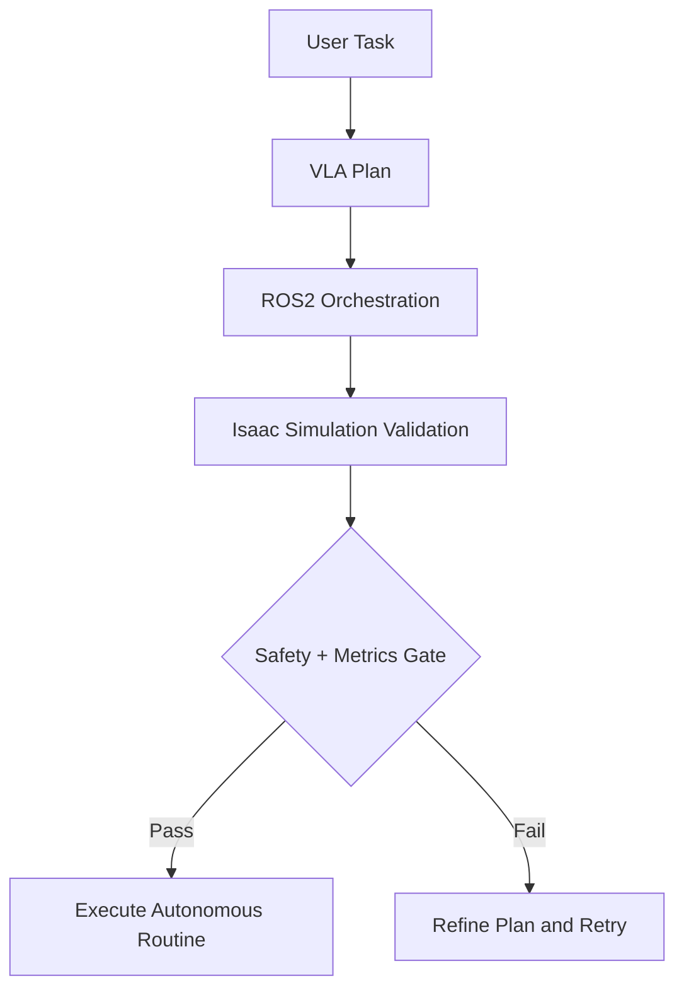

This capstone combines all prior modules into a single autonomous humanoid workflow. You will integrate ROS 2 communication, simulation-first validation, Isaac control loops, and VLA task planning into one evaluable system. The capstone is designed to mimic real deployment pressure: incomplete information, changing goals, and strict safety constraints.

Start by defining a scenario and measurable success criteria, then stage your integration in layers. Verify message contracts first, policy behavior second, and action sequencing last. This staged approach helps isolate defects and ensures each subsystem provides trustworthy outputs before full-stack orchestration.

```python
def capstone_gate(metrics: dict[str, float | int | bool]) -> bool:
    return bool(
        metrics.get("goal_reached")
        and metrics.get("collisions", 1) == 0
        and metrics.get("response_latency_ms", 9999) < 1500
    )
```



## Key Takeaways

- Full-stack humanoid autonomy needs staged integration and validation gates.
- Metrics-based acceptance prevents subjective "looks good" releases.
- Safe autonomy depends on both robust planning and strict execution checks.
