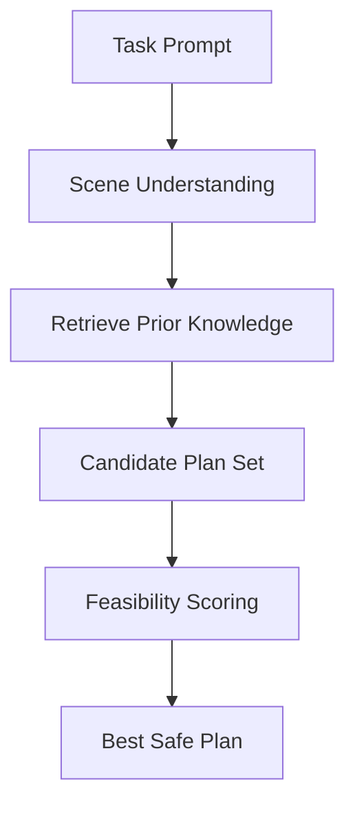

Grounding means the planner reasons over real environment state, not imagined context. In humanoid robotics, weak grounding causes brittle plans: wrong grasp targets, impossible paths, or unsafe assumptions about object location.

### Grounding pipeline

1. Parse task objective and constraints
2. Retrieve relevant environment/context facts
3. Build plan candidates with explicit assumptions
4. Score candidates by feasibility and safety

```python
from dataclasses import dataclass

@dataclass
class GroundedContext:
    object_visible: bool
    reachable: bool
    aisle_clear: bool


def choose_plan(context: GroundedContext) -> str:
    if context.object_visible and context.reachable and context.aisle_clear:
        return "approach_and_pick"
    if context.object_visible and not context.reachable:
        return "reposition_then_pick"
    return "scan_environment"
```



## Key Takeaways

- Grounding quality determines plan realism and task success.
- Explicit assumptions make planning auditable and debuggable.
- Feasibility scoring should include both reachability and risk.
