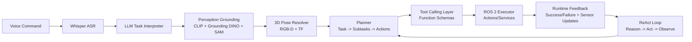

# Grounding, Planning, and LLM Tool Calling for Robots

## 🌍 Real World Scenario

The LLM says "pick up the red cup." But your robot doesn't see "red cups." It sees a 640×480 array of RGB pixels and a pointcloud. Grounding is the bridge between language and perception. Without it, your robot is deaf to meaning.

This is the hardest and most exciting frontier in VLA research. Language models are excellent at symbolic reasoning, but robots live in geometry, uncertainty, and contact dynamics. If your system cannot map words like “red cup on the left shelf” to a precise 3D pose with confidence bounds, planning collapses before execution begins.

Many demos hide this with curated scenes and handpicked prompts. Real robots cannot rely on demo conditions. They need grounding that works when lighting changes, object appearance varies, and human instructions are ambiguous.

## What You Will Learn

- Why semantic grounding is the core bridge between language and robot action.
- How CLIP builds a shared embedding space for image-text alignment.
- How open-vocabulary detection (Grounding DINO + SAM) upgrades robot perception flexibility.
- How to convert 2D detections into 3D robot coordinates using depth and camera intrinsics.
- How cognitive planning decomposes high-level tasks into executable ROS 2 steps.
- How to use LLM tool/function calling to expose robot capabilities safely.
- How the ReAct loop (Reason + Act) improves multi-step task robustness.
- How prompt engineering shapes safer, more reliable robot behavior.

## Why grounding is the central unsolved problem

A command like “pick the red cup near the sink” compresses multiple reasoning layers:

1. Parse language intent.
2. Ground object category and attributes in vision.
3. Resolve relational phrase (“near the sink”).
4. Estimate object 3D pose and graspability.
5. Select action sequence with collision/safety constraints.

Each step can fail independently. If grounding is wrong, planning can be perfectly logical and still physically wrong.

This is why language-grounded robotics is not “just LLM integration.” It is a full perception-reasoning-action alignment problem.

## Semantic grounding with CLIP: contrastive learning in one shared space

CLIP (Contrastive Language-Image Pretraining) learns aligned embeddings for text and images. During training, it pushes matching image-caption pairs close in embedding space and mismatched pairs apart.

Why this matters for robotics:
- You can query visual scenes with text prompts (“red mug”, “screwdriver”, “whiteboard marker”).
- You can rank candidate detections by language similarity without retraining fixed class heads.
- You get open-ended semantic matching beyond closed label sets.

Conceptually:
- Image encoder maps image crops to vectors.
- Text encoder maps phrases to vectors.
- Similarity score (e.g., cosine) estimates semantic match.

In robot stacks, CLIP often provides semantic priors while dedicated detectors provide localization precision.

## Open-vocabulary perception: Grounding DINO + SAM

Closed-set object detectors are limited to predefined classes. Robots in real environments encounter long-tail objects. Open-vocabulary methods address this.

### Grounding DINO
- Takes text queries plus image.
- Returns bounding boxes conditioned on language phrase.
- Useful for commands like “find the green bottle” even if bottle subtype wasn’t in fixed class list.

### SAM (Segment Anything Model)
- Produces high-quality masks from prompts (points/boxes).
- Refines object extent beyond coarse boxes.
- Helpful for grasp planning and clutter separation.

Combined flow:
1. Grounding DINO proposes phrase-conditioned box.
2. SAM refines object mask.
3. Depth projection computes 3D target point.

This combo is powerful because it links language flexibility with geometry-aware manipulation setup.

## 3D grounding: from 2D detection to robot coordinates

A box in image space is not enough for a robot arm. The arm needs target pose in a robot frame.

Standard 3D grounding pipeline:
1. Use detection/mask to select object pixels.
2. Read depth values from aligned depth frame.
3. Back-project pixels to camera-frame 3D points via intrinsics.
4. Transform camera-frame point to robot/world frame using TF.
5. Estimate grasp candidate pose and confidence.

Core math (simplified):
- Given pixel `(u, v)` with depth `z`
- `x = (u - cx) * z / fx`
- `y = (v - cy) * z / fy`
- `z = z`

Then apply extrinsic transform `T_base_camera` to obtain base-frame coordinates.

Common failure points:
- RGB-depth misalignment.
- Wrong camera intrinsics.
- Stale TF transform timestamps.
- Specular/transparent objects causing invalid depth.

Grounding quality should include uncertainty estimates, not just point predictions.

## Cognitive planning architecture: Task → Subtasks → Actions → ROS 2

Grounding provides “what/where.” Planning decides “how.”

A robust cognitive planning stack for language-conditioned robotics often follows hierarchical decomposition:

- **Task**: High-level instruction (e.g., “clean the whiteboard”).
- **Subtasks**: Semantic phases (find marker, approach board, erase region).
- **Actions**: Atomic executable intents (navigate pose, reach, grasp, wipe trajectory).
- **ROS 2 calls**: Concrete action/service/topic calls.

This decomposition makes the system debuggable and enables partial recovery when one subtask fails.



This architecture supports iterative correction instead of one-shot brittle execution.

## LLM tool calling for robotics control

LLM tool (function) calling turns free-form language into structured capability invocations.

Example robot capabilities:
- `detect_object(label: str)`
- `navigate_to(x, y, yaw)`
- `pick_object(object_id)`
- `place_object(target_zone)`
- `speak(message)`

Why tool calling matters:
- It constrains model outputs to known safe interfaces.
- It improves parse reliability.
- It makes auditing and policy enforcement easier.

Design rules for robot tool schemas:
1. Use explicit units (`meters`, `radians`, `m/s`).
2. Include bounds in schema descriptions.
3. Require frame references (`map`, `base_link`, `camera_link`).
4. Add nullable confidence fields for uncertain decisions.

This is where prompt engineering meets systems safety.

## ReAct pattern for multi-step robotic tasks

ReAct = **Reasoning + Acting** in iterative cycles.

Instead of generating one final plan and executing blindly, the model alternates:
1. Reason about current state.
2. Choose action/tool call.
3. Observe result.
4. Revise reasoning.

For robots, this is critical because environment state changes after each action. A grasp may fail, an object may move, a human may intervene.

ReAct benefits:
- Better recovery from execution errors.
- Reduced hallucinated plan continuation.
- Improved transparency in decision traces.

ReAct risks:
- Longer latency if loops are unbounded.
- Potential oscillation without stop criteria.

Mitigations:
- Max iteration count.
- Timeout budgets.
- Explicit failure escalation path to human operator.

## Prompt engineering for grounded robotics

Prompting for robotics differs from chatbot prompting. You need deterministic structure, constraints, and executable outputs.

### 1) Few-shot examples
Provide examples of instruction → grounded action schema mapping.

### 2) Constraint injection
Embed hard rules:
- max speed
- no-go zones
- required confirmation for risky actions

### 3) Output formatting
Force JSON/tool-call responses. No prose during action phase.

### 4) State injection
Provide current robot state summary (battery, localization confidence, gripper occupancy, detected objects).

### 5) Failure instruction
Tell model what to do when uncertain: ask clarification or call `safe_stop`.

Prompt quality directly affects safety, not just convenience.

## 💻 Code Example 1: Complete voice → Whisper → GPT-4 → ROS 2 pipeline

```python
#!/usr/bin/env python3
# file: pipelines/voice_to_ros2_pipeline.py

import json
import queue
import sounddevice as sd
import numpy as np
import whisper
from openai import OpenAI

import rclpy
from rclpy.node import Node
from std_msgs.msg import String


class VoiceToROS2Pipeline(Node):
    def __init__(self):
        super().__init__('voice_to_ros2_pipeline')
        self.pub = self.create_publisher(String, '/robot1/llm_action_json', 10)
        self.client = OpenAI()
        self.whisper_model = whisper.load_model('base')

    def record_audio(self, seconds=4, sr=16000):
        audio = sd.rec(int(seconds * sr), samplerate=sr, channels=1, dtype='float32')
        sd.wait()
        return audio.flatten(), sr

    def transcribe(self, audio_np, sr):
        result = self.whisper_model.transcribe(audio_np, fp16=False, language='en')
        return result['text'].strip()

    def llm_plan(self, text_cmd):
        prompt = (
            "You are a robot task planner. "
            "Return strict JSON with fields: skill,target_frame,x,y,z,yaw,speed,gripper. "
            "Speed must be <= 0.2 and skill must be one of MOVE_BASE,REACH,GRASP,PLACE,STOP. "
            f"Instruction: {text_cmd}"
        )

        response = self.client.responses.create(
            model='gpt-4.1',
            input=prompt,
            text={"format": {"type": "json_object"}},
        )
        return response.output_text

    def run_once(self):
        audio_np, sr = self.record_audio()
        text_cmd = self.transcribe(audio_np, sr)
        self.get_logger().info(f"Whisper: {text_cmd}")

        action_json = self.llm_plan(text_cmd)
        self.get_logger().info(f"LLM action: {action_json}")

        # publish to ROS2 bridge/executor
        msg = String()
        msg.data = action_json
        self.pub.publish(msg)


def main(args=None):
    rclpy.init(args=args)
    node = VoiceToROS2Pipeline()
    node.run_once()
    rclpy.spin_once(node, timeout_sec=0.5)
    node.destroy_node()
    rclpy.shutdown()


if __name__ == '__main__':
    main()
```

This pipeline demonstrates the full command path from voice to structured ROS-action-ready output.

## 💻 Code Example 2: Robot actions as OpenAI function schemas

```python
# file: planning/robot_function_schemas.py

ROBOT_FUNCTIONS = [
    {
        "type": "function",
        "name": "detect_object",
        "description": "Detect object in current scene by natural-language label.",
        "parameters": {
            "type": "object",
            "properties": {
                "label": {"type": "string"},
                "min_confidence": {"type": "number", "minimum": 0.0, "maximum": 1.0}
            },
            "required": ["label"]
        }
    },
    {
        "type": "function",
        "name": "navigate_to",
        "description": "Navigate robot base to target pose in map frame.",
        "parameters": {
            "type": "object",
            "properties": {
                "x_m": {"type": "number"},
                "y_m": {"type": "number"},
                "yaw_rad": {"type": "number"},
                "max_speed_mps": {"type": "number", "minimum": 0.0, "maximum": 0.3}
            },
            "required": ["x_m", "y_m", "yaw_rad"]
        }
    },
    {
        "type": "function",
        "name": "pick_object",
        "description": "Pick object using 3D grasp pose in base_link frame.",
        "parameters": {
            "type": "object",
            "properties": {
                "object_id": {"type": "string"},
                "x_m": {"type": "number"},
                "y_m": {"type": "number"},
                "z_m": {"type": "number"},
                "grasp_width_m": {"type": "number", "minimum": 0.0, "maximum": 0.12}
            },
            "required": ["object_id", "x_m", "y_m", "z_m"]
        }
    },
]
```

These schemas constrain planning outputs to executable, unit-safe interfaces.

## 💻 Code Example 3: Grounding DINO integration with ROS 2

```python
#!/usr/bin/env python3
# file: perception/grounding_dino_ros2_node.py

import cv2
import numpy as np
import rclpy
from rclpy.node import Node
from sensor_msgs.msg import Image, CameraInfo
from geometry_msgs.msg import PointStamped
from cv_bridge import CvBridge

# Placeholder import path; adapt to your install
# from groundingdino.util.inference import load_model, predict


class GroundingDINONode(Node):
    def __init__(self):
        super().__init__('grounding_dino_node')
        self.bridge = CvBridge()

        self.latest_depth = None
        self.camera_info = None

        self.create_subscription(Image, '/robot1/camera/rgb/image_raw', self.on_rgb, 10)
        self.create_subscription(Image, '/robot1/camera/depth/image_raw', self.on_depth, 10)
        self.create_subscription(CameraInfo, '/robot1/camera/depth/camera_info', self.on_info, 10)

        self.point_pub = self.create_publisher(PointStamped, '/robot1/grounded_target_point', 10)

        # self.model = load_model("weights/groundingdino_swint_ogc.pth", "config/GroundingDINO_SwinT_OGC.py")
        self.query_text = "red cup"

    def on_info(self, msg: CameraInfo):
        self.camera_info = msg

    def on_depth(self, msg: Image):
        self.latest_depth = self.bridge.imgmsg_to_cv2(msg, desired_encoding='passthrough')

    def on_rgb(self, msg: Image):
        if self.latest_depth is None or self.camera_info is None:
            return

        rgb = self.bridge.imgmsg_to_cv2(msg, desired_encoding='bgr8')

        # Placeholder detector output (replace with Grounding DINO inference)
        # boxes, scores, labels = predict(self.model, rgb, self.query_text, box_threshold=0.35, text_threshold=0.25)
        h, w, _ = rgb.shape
        box = np.array([0.4*w, 0.4*h, 0.6*w, 0.7*h], dtype=np.int32)  # xmin,ymin,xmax,ymax

        u = int((box[0] + box[2]) / 2)
        v = int((box[1] + box[3]) / 2)

        z = float(self.latest_depth[v, u])
        if z <= 0.0 or np.isnan(z):
            return

        fx = self.camera_info.k[0]
        fy = self.camera_info.k[4]
        cx = self.camera_info.k[2]
        cy = self.camera_info.k[5]

        x = (u - cx) * z / fx
        y = (v - cy) * z / fy

        p = PointStamped()
        p.header = msg.header
        p.header.frame_id = 'camera_link'
        p.point.x = float(x)
        p.point.y = float(y)
        p.point.z = float(z)
        self.point_pub.publish(p)


def main(args=None):
    rclpy.init(args=args)
    node = GroundingDINONode()
    try:
        rclpy.spin(node)
    finally:
        node.destroy_node()
        rclpy.shutdown()


if __name__ == '__main__':
    main()
```

This demonstrates phrase-conditioned detection mapped into actionable 3D geometry.

## Practical deployment guardrails for grounding + planning

1. **Confidence thresholds per stage**
   If perception confidence is low, ask clarification instead of executing.

2. **Spatial sanity checks**
   Reject grounded points outside reachable workspace.

3. **Tool-call policy layer**
   Validate all function arguments before ROS calls.

4. **Stateful task memory**
   Track completed subtasks to prevent loops/repeated actions.

5. **Human-in-the-loop escalation**
   For ambiguous grounding, request disambiguation (“Do you mean the red cup near sink or near laptop?”).

Grounding systems fail gracefully only if uncertainty handling is explicit.

## 💡 Key Concepts Summary

- Grounding is the core bridge from language symbols to physical world coordinates.
- CLIP provides semantic alignment; Grounding DINO + SAM improve open-vocabulary localization quality.
- 3D grounding requires depth projection + frame transforms; 2D boxes alone are insufficient.
- Cognitive planning should decompose tasks hierarchically before ROS execution.
- LLM tool calling turns language plans into structured, auditable robot capability invocations.
- ReAct loops improve robustness for multi-step tasks in dynamic environments.
- Prompt design is a safety and reliability lever, not just a UX detail.

## 🧪 Practice Exercises

### Exercise 1 (Beginner)
Implement a single-object grounding test: command “pick red cup,” detect with open-vocabulary perception, and publish 3D target point. Measure positional repeatability over 20 runs.

```python
# Track mean and std of grounded (x,y,z) for the same static scene.
```

### Exercise 2 (Intermediate)
Build a ReAct loop with three tools (`detect_object`, `navigate_to`, `pick_object`) and test on a two-step command: “go to desk and pick the marker.” Add timeout and max-iteration guards.

```python
# Ensure tool outputs are validated before execution.
```

### Exercise 3 (Advanced)
Add ambiguity resolution prompts to your planner. If two candidate objects match label, ask user follow-up question and continue plan only after confirmation.

```bash
# Goal: reduce wrong-object picks without manual teleoperation.
```

## Key Takeaways

- Language grounding is the hardest and most critical bridge in VLA robotics.
- Robust grounding requires semantics + geometry + uncertainty-aware planning.
- Function-calling and ReAct patterns make LLM-driven robots more reliable and controllable.
- The best robot planners are not just smart—they are structured, constrained, and observable.

## 🔗 Next Up

Next chapter: Safety-aligned autonomous execution—how to combine grounded language planning with runtime policy checks, recovery logic, and operator trust mechanisms.