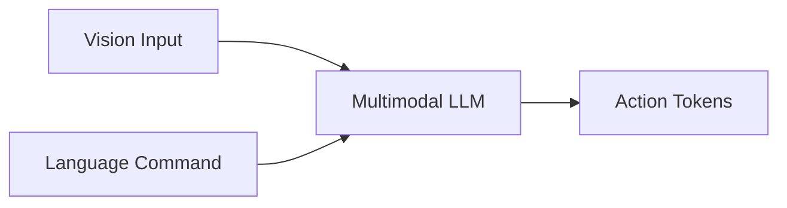

# Vision-Language-Action Models — Where LLMs Meet Robots

## 🌍 Real World Scenario

The most powerful robot control interface ever built is not a joystick, not a GUI, not a Python script. It's "Hey robot, go clean the whiteboard." Natural language is the interface. VLA models are how robots understand it.

That sentence captures a massive shift in robotics. For decades, robot control interfaces were built for engineers: waypoints, behavior trees, finite-state machines, and hardcoded command APIs. They were precise, but brittle and inaccessible to normal users. Vision-Language-Action (VLA) models attempt something radically different: directly map what the robot sees and what the user says into what the robot should do.

If this works reliably, robotics moves from “program robots” to “instruct robots.” That is why VLA is one of the most exciting frontiers in AI and physical systems.

## What You Will Learn

- How VLA models emerged from the convergence of NLP, vision, and robotics.
- What makes a model a VLA model (vision + language + action in one policy).
- How RT-2, OpenVLA, and π0 differ in philosophy and deployment patterns.
- Why action tokenization is the central technical bottleneck.
- VLA limitations: compute cost, safety constraints, and generalization failures.
- Pipeline vs end-to-end VLA architecture tradeoffs.
- How this module’s practical pipeline works: voice → Whisper → LLM → ROS 2 action execution.
- Hands-on code patterns for vision reasoning, structured action output, and ROS 2 integration.

## Intellectual history: from BERT to GPT to multimodal to VLA

VLA did not appear suddenly. It is the product of several research waves converging.

### Phase 1: Language representation (BERT era)
BERT and related transformer models proved that deep contextual language representations can capture semantics at scale. This changed NLP from hand-engineered features to pretrain/fine-tune paradigms.

### Phase 2: Generative language scaling (GPT era)
GPT-style autoregressive models demonstrated that scale plus next-token prediction can produce broad reasoning and instruction-following behavior. This unlocked natural-language interfaces for complex tasks.

### Phase 3: Multimodal grounding
Models started combining text with images (vision-language models). Now language could be grounded in visual context. A prompt like “pick the red mug” became computationally meaningful because the model could see the scene.

### Phase 4: Embodied action grounding (VLA)
The final leap: add robot action as an output modality. Instead of generating only text, the model generates executable control intentions or action tokens conditioned on visual and linguistic context.

So the VLA paradigm is the direct continuation of the transformer story, but anchored to physics.

## What is a VLA model?

A VLA model is a neural policy that jointly reasons over:

1. **Vision**: camera/depth/scene input.
2. **Language**: instructions, dialogue context, constraints.
3. **Action**: robot control outputs (poses, trajectories, skill tokens, or low-level commands).

In classical robotics stacks, these are separate modules:
- Perception system detects objects.
- Planner maps goals to actions.
- Controller executes trajectories.

In VLA systems, more of this stack is learned jointly. The promise is compositional generalization from web-scale multimodal priors plus robot interaction data.

## Key VLA models: RT-2 vs OpenVLA vs π0

The field is evolving quickly, but these names represent important directions.

| Model | Core Idea | Strength | Limitation | Typical Positioning |
|---|---|---|---|---|
| **RT-2 (Google)** | Leverages vision-language pretraining and maps outputs to robot actions | Strong semantic grounding from internet-scale data | Still sensitive to embodiment/task distribution gaps | Demonstrates web knowledge transfer into robotics |
| **OpenVLA (Berkeley ecosystem)** | Open, research-friendly VLA framing for reproducibility and adaptation | Accessible experimentation and community extension | Operational maturity varies by stack/integration | Great for research iteration and transparency |
| **π0 (Physical Intelligence)** | Generalist embodied policy direction with strong emphasis on physical execution quality | Focus on broad manipulation/control transfer | High data/compute demands and deployment complexity | Toward general-purpose embodied intelligence |

These models are not “winner takes all.” They represent different tradeoffs in openness, scale, and deployment readiness.

## How RT-2 works conceptually

RT-2’s key contribution is showing that internet-scale vision-language pretraining can improve robotic behavior when adapted into action generation.

Simplified conceptual flow:
1. Pretrained vision-language backbone captures broad semantic priors.
2. Robotics data aligns model outputs with executable robot actions.
3. Model generates action-like tokens conditioned on image + instruction.

Why this matters:
- The robot may infer affordances from broad world knowledge (“trash goes in bin,” “tool on table is likely graspable”).
- Language understanding becomes richer than narrow task templates.

But there is no magic. Physical grounding still requires embodiment-specific data, calibration, and safety-constrained execution.

## The action tokenization problem (the hard part everyone underestimates)

Language models predict tokens. Robots need continuous control values or structured trajectories. Bridging this is the action tokenization problem.

Example instruction:
> “Move arm 3 cm left.”

A robot controller needs concrete outputs:
- frame reference (base/tool/world)
- target delta pose
- velocity/acceleration limits
- collision constraints
- gripper state

How do we represent this as model-friendly tokens?

Common approaches:
1. **Discrete bins over continuous actions**
   - Quantize action space into token vocabulary.
   - Easier for autoregressive generation, but loses precision.

2. **Structured action schemas**
   - Model outputs JSON-like fields (e.g., `dx`, `dy`, `dz`, `gripper`).
   - More interpretable, easier validation, still requires robust parsing.

3. **Skill token abstraction**
   - Output high-level skills (`REACH`, `GRASP`, `PLACE`) and let downstream controllers handle low-level execution.
   - Safer and modular, but less end-to-end purity.

In production robotics, structured constrained outputs are usually preferred for safety and debuggability.

## Pipeline approach vs end-to-end VLA

There are two dominant integration philosophies.

### Pipeline approach (modular)
Voice ASR → LLM reasoning/planning → structured actions → ROS 2 skill/action layer.

**Pros:**
- Easier debugging and observability.
- Strong safety checks between stages.
- Can swap components independently.

**Cons:**
- More integration complexity.
- Potential error propagation across modules.

### End-to-end VLA approach
One large model maps multimodal inputs directly to actions.

**Pros:**
- Unified optimization objective.
- Potentially better compositional behavior if data is sufficient.

**Cons:**
- Harder to interpret failure causes.
- Harder safety validation.
- Usually heavier compute and data requirements.

For real deployments today, many teams prefer hybrid architectures: VLA-inspired semantic intelligence with modular safety-constrained execution.

## VLA limitations you must respect

1. **Computational cost**
   Large multimodal models are expensive to train and run, especially at low-latency control frequencies.

2. **Safety gaps**
   Natural-language fluency can mask action uncertainty. Policies can produce plausible but unsafe commands.

3. **Generalization failure**
   Distribution shift still breaks embodied policies (lighting, object geometry, clutter).

4. **Action grounding mismatch**
   Semantically correct intent may map to physically invalid motions.

5. **Real-time constraints**
   End-to-end model latency may exceed control loop budgets unless carefully optimized.

Treat VLA as powerful but not self-certifying. Safety wrappers and policy constraints remain mandatory.

## Module build target: voice → Whisper → LLM → ROS 2

This module’s practical architecture is pipeline-based and deployment-friendly:

1. **Voice input** from user.
2. **Whisper ASR** converts speech to text.
3. **LLM/VLM** reasons over instruction + scene image.
4. **Structured JSON actions** emitted by model.
5. **ROS 2 action client** sends validated goals to robot stack.

Why this design:
- Natural language interface for usability.
- Structured outputs for control safety.
- ROS 2 integration for execution reliability.

## 💻 Code Example 1: Vision reasoning with camera image (GPT-4 Vision-style call)

```python
#!/usr/bin/env python3
# file: demos/vla_pick_suggestion.py

import base64
from pathlib import Path
from openai import OpenAI


def encode_image(path: str) -> str:
    return base64.b64encode(Path(path).read_bytes()).decode("utf-8")


def main():
    client = OpenAI()
    img_b64 = encode_image("data/latest_robot_camera.jpg")

    response = client.responses.create(
        model="gpt-4.1",
        input=[
            {
                "role": "user",
                "content": [
                    {"type": "input_text", "text": "You are assisting a robot. Given this image, what single object should the robot pick up first for easiest safe grasp? Reply with short reasoning."},
                    {
                        "type": "input_image",
                        "image_url": f"data:image/jpeg;base64,{img_b64}",
                    },
                ],
            }
        ],
    )

    print(response.output_text)


if __name__ == "__main__":
    main()
```

This is not full control yet. It is semantic scene understanding conditioned on robot intent.

## 💻 Code Example 2: Structured JSON action commands from an LLM

```python
#!/usr/bin/env python3
# file: demos/vla_structured_actions.py

import json
from pydantic import BaseModel, Field
from openai import OpenAI


class RobotAction(BaseModel):
    skill: str = Field(description="One of MOVE_BASE, REACH, GRASP, PLACE, STOP")
    target_frame: str = Field(description="map, base_link, or end_effector")
    x: float
    y: float
    z: float
    yaw: float
    speed: float
    gripper: str = Field(description="open or close")


def main():
    client = OpenAI()

    prompt = (
        "Instruction: 'Pick up the red cup on the right side of the desk.' "
        "Return one next-step action as strict JSON matching schema. "
        "Use conservative speed <= 0.2."
    )

    resp = client.responses.create(
        model="gpt-4.1",
        input=prompt,
        text={
            "format": {
                "type": "json_schema",
                "name": "robot_action",
                "schema": RobotAction.model_json_schema(),
            }
        },
    )

    data = json.loads(resp.output_text)
    action = RobotAction(**data)
    print(action.model_dump_json(indent=2))


if __name__ == "__main__":
    main()
```

Structured outputs are critical. They allow validation before execution.

## 💻 Code Example 3: Connect LLM output to a ROS 2 action client

```python
#!/usr/bin/env python3
# file: nodes/llm_to_ros2_action_client.py

import json
import rclpy
from rclpy.action import ActionClient
from rclpy.node import Node

# Example action type; adapt to your stack
from nav2_msgs.action import NavigateToPose
from geometry_msgs.msg import PoseStamped


class LLMActionBridge(Node):
    def __init__(self):
        super().__init__('llm_action_bridge')
        self.client = ActionClient(self, NavigateToPose, '/navigate_to_pose')

    def send_json_command(self, action_json: str):
        data = json.loads(action_json)

        # Basic safety validation
        speed = float(data.get('speed', 0.1))
        if speed > 0.2:
            self.get_logger().warn('Rejected command: speed too high')
            return

        x = float(data['x'])
        y = float(data['y'])
        yaw = float(data.get('yaw', 0.0))

        goal = NavigateToPose.Goal()
        pose = PoseStamped()
        pose.header.frame_id = data.get('target_frame', 'map')
        pose.pose.position.x = x
        pose.pose.position.y = y
        pose.pose.orientation.z = yaw  # simplified placeholder
        pose.pose.orientation.w = 1.0
        goal.pose = pose

        self.client.wait_for_server()
        future = self.client.send_goal_async(goal)
        future.add_done_callback(self.goal_response_callback)

    def goal_response_callback(self, future):
        goal_handle = future.result()
        if not goal_handle.accepted:
            self.get_logger().warn('Goal rejected')
            return
        self.get_logger().info('Goal accepted')


def main(args=None):
    rclpy.init(args=args)
    node = LLMActionBridge()

    # Example command from LLM structured output
    example_json = json.dumps({
        "skill": "MOVE_BASE",
        "target_frame": "map",
        "x": 1.2,
        "y": 0.4,
        "z": 0.0,
        "yaw": 0.0,
        "speed": 0.15,
        "gripper": "open"
    })

    node.send_json_command(example_json)
    rclpy.spin(node)


if __name__ == '__main__':
    main()
```

This bridge pattern lets you keep language intelligence while enforcing ROS-level execution safety.

## Engineering guardrails for VLA-enabled systems

When adding language-conditioned control, enforce these safeguards:

1. **Schema validation before actuation**
   Reject malformed or out-of-range commands.

2. **Skill whitelist**
   Only allow approved executable skills.

3. **Context-aware constraints**
   Speed/force limits based on environment mode.

4. **Human confirmation for high-risk actions**
   Ask for explicit confirmation before irreversible tasks.

5. **Fallback policy**
   If confidence is low or parse fails, switch to safe behavior (`STOP` or request clarification).

Natural language should improve usability, not bypass safety engineering.

## Where this module is heading

In upcoming module chapters, you will build a practical embodied AI stack that combines:
- voice transcription,
- multimodal understanding,
- structured action planning,
- ROS 2 execution,
- runtime monitoring.

The goal is not a chatbot attached to a robot. The goal is a dependable language interface that stays grounded in perception and constrained by physical safety.

## Architecture Diagram



## 💡 Key Concepts Summary

- VLA models unify vision, language, and action into one control intelligence paradigm.
- The field emerged from transformer progress: BERT → GPT → multimodal → embodied action.
- RT-2, OpenVLA, and π0 represent major design directions, not identical systems.
- Action tokenization is the core technical challenge between language modeling and control execution.
- End-to-end VLA offers elegance; pipeline architectures offer stronger safety/debuggability today.
- Real systems need structured outputs, ROS integration, and hard safety constraints.

## 🧪 Practice Exercises

### Exercise 1 (Beginner)
Capture one camera frame, run vision reasoning, and compare LLM object suggestion with ground truth. Track mismatch categories (occlusion, color confusion, clutter).

```python
# Goal: measure semantic perception reliability before action execution.
```

### Exercise 2 (Intermediate)
Implement JSON schema validation + whitelist gating for five robot skills. Reject commands outside allowed workspace bounds.

```python
# Goal: prove command safety layer blocks invalid model outputs.
```

### Exercise 3 (Advanced)
Integrate voice → Whisper → LLM structured output → ROS 2 action in a closed loop. Add latency profiling and fallback on parse failure.

```bash
# Goal: robust end-to-end command execution with measurable reliability.
```

## Key Takeaways

- Language is becoming a primary human-robot interface, and VLA models are the bridge.
- The biggest challenge is not text generation; it is safe, grounded action representation.
- Modular pipeline designs remain the practical path for many real deployments.
- VLA systems succeed only when intelligence and safety constraints are engineered together.

## 🔗 Next Up

Next chapter: Designing a robust voice-command robotics stack—error handling, dialogue clarification, and safe action grounding in ROS 2.