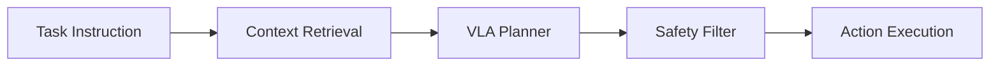

Module 4 covers vision-language-action (VLA) systems that map task instructions and visual context into robot actions. You will study how grounding works, how prompts influence behavior, and how to keep generated plans constrained by safety and task boundaries. This module connects high-level intent with low-level execution.

A practical VLA stack uses retrieval and context filtering to avoid hallucinated actions. It also requires explicit verification before command execution, especially for high-risk actions. The objective is to make autonomy useful while preserving predictability in edge cases.

```python
def build_vla_prompt(task: str, context: str) -> str:
    return f"Task: {task}\nContext: {context}\nReturn only safe executable steps."
```



## Key Takeaways

- VLA systems combine language reasoning with action constraints.
- Grounding and retrieval are essential for reliable task execution.
- Safety filters must gate generated actions before execution.
