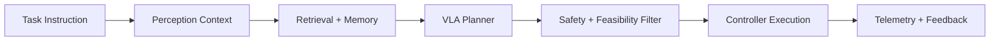

Module 4 teaches vision-language-action (VLA) systems for humanoid autonomy: how to map natural-language intent and visual context into executable, safety-constrained behavior. This is where high-level reasoning meets low-level control boundaries.

A production VLA stack is not just a model prompt. It requires context retrieval, planning constraints, action validation, and execution monitoring. In this module, you will design that complete loop and learn how to prevent hallucinated or unsafe plans from reaching actuators.

```python
from dataclasses import dataclass

@dataclass
class PlanStep:
    step: str
    risk_level: str


def is_executable(step: PlanStep) -> bool:
    return step.risk_level in {"low", "medium"}
```



## Lessons in this module

- [Grounding and Context-Aware Planning](./grounding-and-planning)
- [Action Safety and Runtime Verification](./action-safety-runtime-verification)
- [Capstone: Autonomous Humanoid Workflow](./capstone-autonomous-humanoid)

## Key Takeaways

- VLA reliability depends on grounding quality and constraint enforcement.
- Plans must be verified against robot capability and safety policy before execution.
- Closed-loop telemetry is required to improve VLA behavior over time.
