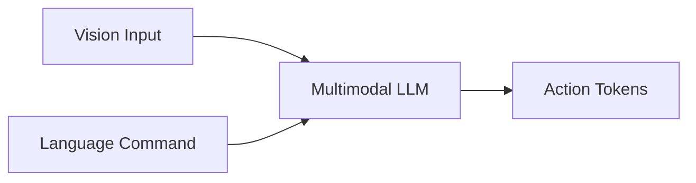

# Vision-Language-Action Models — Where LLMs Meet Robots

## 🌍 Real World Scenario

ہمارے پاس ابھی تک بنائے گئے سب سے طاقتور ربوٹ کنٹرول انٹرفیس نہیں ہے، نہیں ہے یہ جوystick، نہیں ہے یہ GUI، نہیں ہے یہ Python اسکرپٹ۔ یہ ہے "ہی ربوٹ، وہٹ بورڈ کو ساف کر۔" ہماری زبان قدرتی زبان ہے۔ VLA ماڈلز ہیں کہ ربوٹ اسے سمجھتے ہیں۔

وہ بیان ایک بڑے پیمانے پر ربوٹکس میں تبدیلی کو کبھی نہیں دکھاتا ہے۔ دہائیوں سے، ربوٹ کنٹرول انٹرفیس انجینئرز کے لیے بنائے گئے تھے: وے پوائنٹس، بہاوٰر درخت، محدود حالت کی مشینز، اور ہارڈ کوڈڈ کمانڈ ای پی آئی۔ وہ دقت سے بھرپور تھے، لیکن ٹوٹ پھوٹ کے شکار اور عام استعمال کرنے والوں کے لیے غیر رسائی

agar yeh aamal kar sakta hai, robotics se "robots ko program karna" "robots ko hukum dena" mein badal jaata hai. isliye VLA AI aur fiziki systemon mein sabse roshni dene wala ek aisi shakti hai.

## What You Will Learn

- How VLA models emerged from the convergence of NLP, vision, and robotics.
- What makes a model a VLA model (vision + language + action in one policy).
- How RT-2, OpenVLA, and π0 differ in philosophy and deployment patterns.
- Why action tokenization is the central technical bottleneck.
- VLA limitations: compute cost, safety constraints, and generalization failures.
- Pipeline vs end-to-end VLA architecture tradeoffs.
- How this module’s practical pipeline works: voice → Whisper → LLM → ROS 2 action execution.
- Hands-on code patterns for vision reasoning, structured action output, and ROS 2 integration.

## Intellectual history: from BERT to GPT to multimodal to VLA

واہنٹج لارنس ایئرکرفٹ (VLA) نے ایک بار پھر نظر نہیں آئی۔ یہ چند تحقیقی موجوں کے ملاپ کا نتیجہ ہے۔

### Phase 1: Language representation (BERT era)
برٹ اور متعلقہ ٹرانسفارمر ماڈلز نے ثابت کیا کہ گہرے متن کے متن کے پہلوؤں کو کیسے حاصل کیا جا سکتا ہے۔ یہ ایل این پی کو ہاتھ سے تیار کردہ خصوصیات سے پری ٹرین/فائن ٹیون پیمائندوں تک تبدیل کر دیا۔

### Phase 2: Generative language scaling (GPT era)
GPT-style autoregressive models neeyat karne wale models ne dikhaya ki scale plus next-token prediction karne se broad reasoning aur instruction-following behavior produce ho sakta hai. Isne natural-language interfaces ko complex tasks ke liye unlock kiya.

### Phase 3: Multimodal grounding
ماڈلز نے متن کو تصاویر کے ساتھ ملا کر کام کرنا شروع کیا (ویژن-لینگوئج ماڈلز)۔ اب زبان کو بصری متن میں جوڑا جا سکتا تھا۔ ایک ایسا پریسپشن جیسا کہ "ریڈ میگ پک کر" کمپیوٹیشنل طور پر معنی رکھنے لگا کیونکہ ماڈل کو منظر دیکھ سکتا تھا۔

### Phase 4: Embodied action grounding (VLA)
ہمیشہ کا ایک گھٹنہ: ربوٹ کی کارروائی کو ایک آؤٹ پٹ ماڈلیٹی کے طور پر شامل کریں۔ صرف متن کی بجائے، ماڈل وژن اور زبانی متن کے حوالے سے قابل اجرا کنٹرول کیوں یا ایکشن ٹوکنز کی تولید کرتا ہے۔

تویلا پہلو یہ ہے کہ VLA پہلو ٹرانسفارمر کہانی کا مستقبل ہے لیکن اسے فزکس کے ساتھ جوڑا گیا ہے۔

## What is a VLA model?

ایک VLA ماڈل ایک نیورل پالیسی ہے جو مشترکہ طور پر یہ دلیل دیتا ہے:

1. **Vision**: camera/depth/scene input.
2. **زبان**: تعلیمات, گفتگو کا متن, پابندیاں.
3. **Action**: ربات کی کنٹرول آؤٹपٹس (پوزز, ٹریکٹریس, سکیل ٹوکنز, یا لَو-لِیول کمانڈس)۔

کلاسیکی رباتیک سٹیکز میں یہ الگ الگ ماڈیول ہیں:
- Perception system detects objects.
- Planner maps goals to actions.
- Controller executes trajectories.

وائلے سسٹم میں، اس اسٹیک کا زیادہ حصہ مشترکہ طور پر سیکھا جاتا ہے۔ وعدہ ہے کہ وے سکیل میڈیا پرائمری پلیئرز کے ساتھ ساتھ ربوٹ انٹرکشن ڈیٹا کے ساتھ کمپوزیشنل جنریلائزیشن ہے۔

## Key VLA models: RT-2 vs OpenVLA vs π0

زیر زمین تیزی سے ترقی کر رہا ہے، لیکن یہ نام اہم سمتوں کی نمائندگی کرتے ہیں۔

| Model | Core Idea | Strength | Limitation | Typical Positioning |
|---|---|---|---|---|
| **RT-2 (Google)** | Leverages vision-language pretraining and maps outputs to robot actions | Strong semantic grounding from internet-scale data | Still sensitive to embodiment/task distribution gaps | Demonstrates web knowledge transfer into robotics |
| **OpenVLA (Berkeley ecosystem)** | Open, research-friendly VLA framing for reproducibility and adaptation | Accessible experimentation and community extension | Operational maturity varies by stack/integration | Great for research iteration and transparency |
| **π0 (Physical Intelligence)** | Generalist embodied policy direction with strong emphasis on physical execution quality | Focus on broad manipulation/control transfer | High data/compute demands and deployment complexity | Toward general-purpose embodied intelligence |

Ye models nahin "winner takes all" hain. Ve khuliyaan, aakaar, aur deployment taiyaari ke alag-alag tradeoffs ko darshate hain.

## How RT-2 works conceptually

RT-2 کی کلیدی شراکت یہ ہے کہ انٹرنیٹ کی پیمانے پر وژن-لینگوئج پریٹریننگ کو ایکشن جینیسیشن میں تبدیل کرنے پر ہو سکتا ہے کہ وہ ربوٹک پہلو کو بہتر بناتا ہے۔

پہلے مرحلہ: ROS2 میں Node کی تشکیل
---------------------------

1. ROS2 میں Node کی تشکیل کے لئے، آپ کو ROS2 ڈاکٹر کو اپنے ڈیپلوما میں شامل کرنا ہوگا۔
2. Node کی تشکیل کے بعد، آپ کو Node کو SLAM کے لئے تربیت دینا ہوگا۔
3. SLAM کے لئے تربیت کے بعد، آپ کو Node کو LiDAR کے ساتھ مربوط کرنا ہوگا۔

دوسرا مرحلہ: Node کے درمیان Topic کا تبادلہ
-----------------------------------------

1. Node کے درمیان Topic کا تبادلہ ک
1. Pretrained vision-language backbone captures broad semantic priors.
دوسرا: رباتیکل ڈیٹا ایکشن کرنے والے ربات کے Outputs کو ایک ساتھ لگاتار کرتا ہے۔
3. Model (model) action jaisi tokens banati hai, image + instruction par condition kiya gaya.

یہ کیوں اہم ہے:
- The robot may infer affordances from broad world knowledge (“trash goes in bin,” “tool on table is likely graspable”).
- Language understanding becomes richer than narrow task templates.

لیکن وہ جادو نہیں ہے۔ جسمانی بنیادوں کو ابھی بھی جسم کے مخصوص ڈیٹا، کالیبریشن، اور سلامتی سے منسلک عمل کی ضرورت ہے۔

## The action tokenization problem (the hard part everyone underestimates)

زبان کی ماڈل ٹوکنز کی پیش گوئی کرتے ہیں۔ ربوٹس کو مستقل کنٹرول Values یا ساختہ ٹریکٹریس کی ضرورت ہوتی ہے۔ اس کے درمیان ایکشن ٹوکنائزیشن کا مسئلہ ہے۔

Aik example instruction hai jo hamein ROS2 ka istemaal karke ek LiDAR sensor ko SLAM (Simultaneous Localization and Mapping) ke liye configure karna hai. 

1. ROS2 ka istemaal karke ek LiDAR sensor ko SLAM ke liye configure karna hai.
2. SLAM ke liye ek Node banayein jo LiDAR sensor se data uthata hai.
3. SLAM Node ko ek Topic se data uthne ke liye configure karein.
4. QoS (Quality of Service) settings ko configure karein taaki data ki quality acchi ho.
5. Gazebo simulator ka istemaal karke SLAM Node ko test karein.
6. Isaac SDK ka istemaal karke ek VLA (Visual Localization Algorithm) banayein jo SLAM Node se data uthata hai.
7. Python aur C++ programming languages ka ist
> “Move arm 3 cm left.”

ایک ربات کنٹرولر کو Concrete Outputs کی ضرورت ہوتی ہے۔
- frame reference (base/tool/world)
- target delta pose
- velocity/acceleration limits
- collision constraints
- gripper state

ہم اسے ماڈل دوست ٹوکنز کی صورت میں کیسے ظاہر کرتے ہیں؟

امور عامہ:
1. **Discrete bins over continuous actions**
   - Quantize action space into token vocabulary.
   - Easier for autoregressive generation, but loses precision.

2. **Tasveerbandi Karyakramon ki Tareekhbandi**
   - Model outputs JSON-like fields (e.g., `dx`, `dy`, `dz`, `gripper`).
   - More interpretable, easier validation, still requires robust parsing.

3. **Sikl Tukn Abstrakshn**
   - Output high-level skills (`REACH`, `GRASP`, `PLACE`) and let downstream controllers handle low-level execution.
   - Safer and modular, but less end-to-end purity.

پیداواری رباتیک میں، منظم محدود نتائج عام طور پر سلامتی اور ڈیبگ کی وجہ سے ترجیح دیے جاتے ہیں۔

## Pipeline approach vs end-to-end VLA

ہنر مند انٹیگریشن کی دو بڑی فلسفے ہیں۔

### Pipeline approach (modular)
زبانِ صوتی ASR → منطقی تفکر LLM → ساختہ کارروائیوں → ROS 2 کی صلاحیت/عمل کی لہر.

**Pros:**
- Easier debugging and observability.
- Strong safety checks between stages.
- Can swap components independently.

**Cons:**
- More integration complexity.
- Potential error propagation across modules.

### End-to-end VLA approach
ایک بڑا ماڈل منفرد مداخلہ کو ہموار طور پر کارروائیوں کی طرف لے جاتا ہے۔

**Pros:**
- Unified optimization objective.
- Potentially better compositional behavior if data is sufficient.

**Cons:**
- Harder to interpret failure causes.
- Harder safety validation.
- Usually heavier compute and data requirements.

کئی ٹیموں کے لیے آج کے حقیقی تعیناتوں کے لیے ہائی برڈج آرکٹیکچر ہی مفید ہیں: VLA کی پریرتہ Semantic Intelligence کے ساتھ ماڈیولر Safety-Constrained Execution.

## VLA limitations you must respect

1. **Computational cost**
بڑے میڈیا کی ماڈلز کو تربیت دینا اور چلانے میں بہت سارے پیسے لگتے ہیں، خاص طور پر کم ٹائم ڈیلیٹ کنٹرول فرائض کے لیے۔

2. **Bachon ki khuliyan**
زبان کی طبیعی آواز کی صلاحیت عمل کی عدم یقین کو چھپا سکتی ہے۔ پالیسیاں قابل اعتماد لیکن غیر محفوظ کمانڈز پیدا کر سکتی ہیں۔

3. عامہ بنانے کی ناکامی
توزیع تبدیلی ابھی بھی جسموں کی پالیسیوں کو توڑتی ہے (ライトنگ، اشیا کی جارجی، کلب).

چار۔ **اکشن گراؤنڈنگ میچ میچ**
Semanticly sahi niat kisi bhi tarah ki gati se juda ho sakta hai.

5. **واقعی وقت کی پابندیاں**
End-to-end model latency may exceed control loop budgets unless carefully optimized.

VLA ko zyada taakat walaa maana jata hai lekin apne aap ko valid nahi mana jata hai. Safety wrappers aur policy constraints zaroori rehte hain.

## Module build target: voice → Whisper → LLM → ROS 2

یہ ماڈیول کی عملی آرکٹیکچر پائپ لائن-ベースڈ ہے اور ڈپلومنٹ-فریندلی:

1. **Voice input** from user.
دو۔ **Whisper ASR** بولنے والے کے الفاظ کو ٹیکسٹ میں تبدیل کرتا ہے۔
3. **LLM/VLM** کی وجوہات انسٹرکشن + سائن سے تصویر پر غور کرتی ہیں۔
چار **Structured JSON actions** emitted by model.
5. ROS 2 action client khatir karta hai robot stack tak valid goals bhejta hai.

کیوں یہ ڈیزائن ہے:
- Natural language interface for usability.
- Structured outputs for control safety.
- ROS 2 integration for execution reliability.

## 💻 Code Example 1: Vision reasoning with camera image (GPT-4 Vision-style call)

```python
#!/usr/bin/env python3
# file: demos/vla_pick_suggestion.py

import base64
from pathlib import Path
from openai import OpenAI


def encode_image(path: str) -> str:
    return base64.b64encode(Path(path).read_bytes()).decode("utf-8")


def main():
    client = OpenAI()
    img_b64 = encode_image("data/latest_robot_camera.jpg")

    response = client.responses.create(
        model="gpt-4.1",
        input=[
            {
                "role": "user",
                "content": [
                    {"type": "input_text", "text": "You are assisting a robot. Given this image, what single object should the robot pick up first for easiest safe grasp? Reply with short reasoning."},
                    {
                        "type": "input_image",
                        "image_url": f"data:image/jpeg;base64,{img_b64}",
                    },
                ],
            }
        ],
    )

    print(response.output_text)


if __name__ == "__main__":
    main()
```

یہ ابھی مکمل کنٹرول نہیں ہے۔ یہ صرف ربات کی نیت پر مبنی Semantic scene understanding ہے۔

## 💻 Code Example 2: Structured JSON action commands from an LLM

```python
#!/usr/bin/env python3
# file: demos/vla_structured_actions.py

import json
from pydantic import BaseModel, Field
from openai import OpenAI


class RobotAction(BaseModel):
    skill: str = Field(description="One of MOVE_BASE, REACH, GRASP, PLACE, STOP")
    target_frame: str = Field(description="map, base_link, or end_effector")
    x: float
    y: float
    z: float
    yaw: float
    speed: float
    gripper: str = Field(description="open or close")


def main():
    client = OpenAI()

    prompt = (
        "Instruction: 'Pick up the red cup on the right side of the desk.' "
        "Return one next-step action as strict JSON matching schema. "
        "Use conservative speed <= 0.2."
    )

    resp = client.responses.create(
        model="gpt-4.1",
        input=prompt,
        text={
            "format": {
                "type": "json_schema",
                "name": "robot_action",
                "schema": RobotAction.model_json_schema(),
            }
        },
    )

    data = json.loads(resp.output_text)
    action = RobotAction(**data)
    print(action.model_dump_json(indent=2))


if __name__ == "__main__":
    main()
```

Structurd outpouts hain kritikal. Ve aazmaan karnay ke befoor amal hain.

## 💻 Code Example 3: Connect LLM output to a ROS 2 action client

```python
#!/usr/bin/env python3
# file: nodes/llm_to_ros2_action_client.py

import json
import rclpy
from rclpy.action import ActionClient
from rclpy.node import Node

# Example action type; adapt to your stack
from nav2_msgs.action import NavigateToPose
from geometry_msgs.msg import PoseStamped


class LLMActionBridge(Node):
    def __init__(self):
        super().__init__('llm_action_bridge')
        self.client = ActionClient(self, NavigateToPose, '/navigate_to_pose')

    def send_json_command(self, action_json: str):
        data = json.loads(action_json)

        # Basic safety validation
        speed = float(data.get('speed', 0.1))
        if speed > 0.2:
            self.get_logger().warn('Rejected command: speed too high')
            return

        x = float(data['x'])
        y = float(data['y'])
        yaw = float(data.get('yaw', 0.0))

        goal = NavigateToPose.Goal()
        pose = PoseStamped()
        pose.header.frame_id = data.get('target_frame', 'map')
        pose.pose.position.x = x
        pose.pose.position.y = y
        pose.pose.orientation.z = yaw  # simplified placeholder
        pose.pose.orientation.w = 1.0
        goal.pose = pose

        self.client.wait_for_server()
        future = self.client.send_goal_async(goal)
        future.add_done_callback(self.goal_response_callback)

    def goal_response_callback(self, future):
        goal_handle = future.result()
        if not goal_handle.accepted:
            self.get_logger().warn('Goal rejected')
            return
        self.get_logger().info('Goal accepted')


def main(args=None):
    rclpy.init(args=args)
    node = LLMActionBridge()

    # Example command from LLM structured output
    example_json = json.dumps({
        "skill": "MOVE_BASE",
        "target_frame": "map",
        "x": 1.2,
        "y": 0.4,
        "z": 0.0,
        "yaw": 0.0,
        "speed": 0.15,
        "gripper": "open"
    })

    node.send_json_command(example_json)
    rclpy.spin(node)


if __name__ == '__main__':
    main()
```

یہ پل کا پैटرن آپ کو زبان کی ذہانت رکھنے کی اجازت دیتا ہے جبکہ ROS سطح کی ایکشن سافٹی کی پابندی کرتا ہے۔

## Engineering guardrails for VLA-enabled systems

جب زبان پر مبنی کنٹرول ڈالنے کے دوران، یہ حفاظتی تدابیر کو نافذ کریں:

1. **Schema validation before actuation**
مضر یا غیر معیار کمانڈوں کو مسترد کریں۔

2. **Kamyaabi Whitelist**
اِنہیں منظور شدہ قابل عمل صلاحیتوں کو صرف اجازت دیں۔

3. **ماحول پر مبنی پابندیاں**
سرعت/قوت کی حد بندی ماحول کی حالت کے مطابق ہے۔

چار۔ **مہلک کارروائیوں کے لئے انسانی تصدیق**
پہلے غیر reversible ہونے والے کھاتوں کے لیے صریح تصدیق طلب کریں۔

پالیسی فال بک
agar yakinat kam hai ya parse fail ho jata hai, to safe behavior (`STOP` ya clarification ki request karein).

زبانِ طبیعی کا مقصد استعمال کو آسان بنانا ہے، نہ کہ محفوظہ سازی کے نظام کو بے اثر کرنا۔

## Where this module is heading

آئی ایم سی میں آنے والے مڈیول چپٹرز میں، آپ ایک عملی جسمانی ای آئی اسٹیک بنائیں گے جو یہ کام کرتا ہے:
- voice transcription,
- multimodal understanding,
- structured action planning,
- ROS 2 execution,
- runtime monitoring.

آپ کا مقصد ایک ربات سے منسلک چیٹ بیٹ نہیں ہے بلکہ ایک قابل اعتماد زبان کا رابطہ ہے جو محسوسات پر مبنی اور فزیکل سافٹی کے ذریعے محدود ہے۔

## Architecture Diagram



## 💡 Key Concepts Summary

- VLA models unify vision, language, and action into one control intelligence paradigm.
- The field emerged from transformer progress: BERT → GPT → multimodal → embodied action.
- RT-2, OpenVLA, and π0 represent major design directions, not identical systems.
- Action tokenization is the core technical challenge between language modeling and control execution.
- End-to-end VLA offers elegance; pipeline architectures offer stronger safety/debuggability today.
- Real systems need structured outputs, ROS integration, and hard safety constraints.

## 🧪 Practice Exercises

### Exercise 1 (Beginner)
Kisi camera frame ko capture karein, vision reasoning chalein, aur LLM object suggestion ko ground truth se compare karein. Occlusion, color confusion, aur clutter jaise mismatch categories ko track karein.

```python
# Goal: measure semantic perception reliability before action execution.
```

### Exercise 2 (Intermediate)
**JSON Schema Validation + Whitelist Gating for Robot Skills**

### Whitelist Gating

```python
import jsonschema
from typing import Dict

# Define the allowed workspace bounds
workspace_bounds = {
    "min_x": 0,
    "max_x": 10,
    "min_y": 0,
    "max_y": 10
}

# Define the whitelist for each robot skill
whitelist = {
    "move": ["x", "y", "theta"],
    "rotate": ["theta"],
    "pick": ["x", "y", "theta"],
    "place": ["x", "y", "theta"],
    "scan": []
}

# Define the JSON schema for each robot skill
schema = {
    "type": "object",
    "properties": {
        "x": {"type": "number"},
        "y": {"type": "number"},
        "theta": {"type": "number"}
    },
    "required

```python
# Goal: prove command safety layer blocks invalid model outputs.
```

### Exercise 3 (Advanced)
ایک بند پھیلے میں آواز → چپچپا → LLM کی ساختہ_OUTPUT → ROS 2 ایکشن کو شامل کریں۔  لٹنسی پروفائلنگ اور پارس فیلچر پر فال بیک شامل کریں۔

```bash
# Goal: robust end-to-end command execution with measurable reliability.
```

## Key Takeaways

- Language is becoming a primary human-robot interface, and VLA models are the bridge.
- The biggest challenge is not text generation; it is safe, grounded action representation.
- Modular pipeline designs remain the practical path for many real deployments.
- VLA systems succeed only when intelligence and safety constraints are engineered together.

## 🔗 Next Up

اگلے باب: ایک مضبوط آواز کمانڈ ربوٹکس اسٹیک کی ڈیزائن—ROS 2 میں خطاء کی نمائندگی، گفتگو کی وضاحت، اور محفوظ کارروائی کی بنیاد.